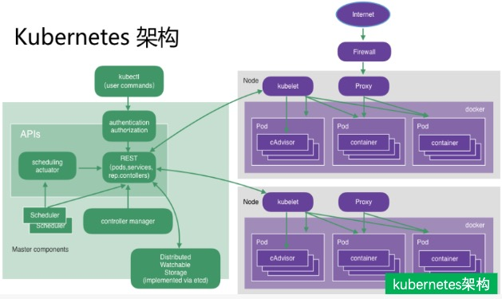
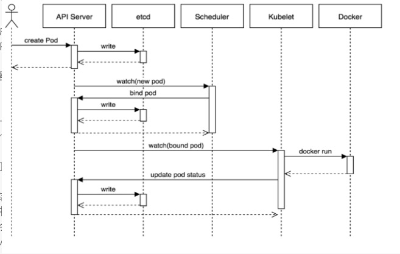

# Kubernetes容器技术解密

# 1. kubernetes架构解密

## 1. kubernetes架构设计

首先我们要了解Kubernetes的架构， 我们先来看看它的按架构图吧

其实Kubernetes他就是一个分布式的王者解决方案， 那他本身也是一个分布式系统的， 是由master和多台node节点组成， master并不处理消息， 主要负责转发消息到node节点上， node才是我们真正处理业务能力的主要节点， 这个我们可以借鉴nginx的master进程与process进程之间的关系， 还有jenkins的主从也是主并不处理消息， 分发给从来处理的。

master接收各种api， 把请求接收进来， 不关你是通过kubectl还是通过http的api接口， 都由master接收， 并把各种消息全部存储到etcd中， 然后把任务分发出去， 让node小弟开始干活。一贯的地主作风。嘿嘿

## 2. kubernetes创建pod的时序图

我们再来看看kubernetes创建pod的时序图

kubernetes所有的交互过程， 其实都是把所有的数据都存储在etcd中。

api server在处理请求的时候， 都把所有的数据记录在etcd中， 他的流程就结束了。

定时任务Scheduler， 也是出发api接口， 把数据写入到etcd中， 他的使命也完成了。

kubelet， 这个是他的客户端命令行， 也是通过api接口， 把数据写入到etcd

最终pod的调用过程， 也是要更docker容器进行挂钩的。