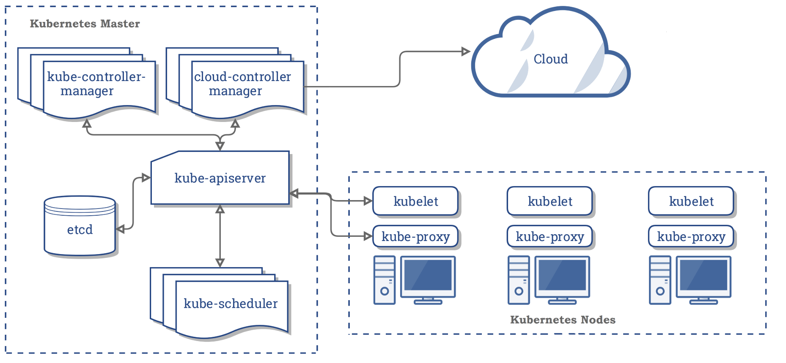

# Kubernetes容器技术解密

# 1. kubernetes架构解密

## 1. kubernetes架构设计

首先我们要了解Kubernetes的架构， 我们先来看看它的按架构图吧


其实Kubernetes他就是一个分布式的王者解决方案， 那他本身也是一个分布式系统的， 是由master和多台node节点组成， master并不处理消息， 主要负责转发消息到node节点上， node才是我们真正处理业务能力的主要节点， 这个我们可以借鉴nginx的master进程与process进程之间的关系， 还有jenkins的主从也是主并不处理消息， 分发给从来处理的。


master接收各种api， 把请求接收进来， 不关你是通过kubectl还是通过http的api接口， 都由master接收， 并把各种消息全部存储到etcd中， 然后把任务分发出去， 让node小弟开始干活。一贯的地主作风。嘿嘿


## 2. kubernetes创建pod的时序图

我们再来看看kubernetes创建pod的时序图


kubernetes所有的交互过程， 其实都是把所有的数据都存储在etcd中。

api server在处理请求的时候， 都把所有的数据记录在etcd中， 他的流程就结束了。

定时任务Scheduler， 也是出发api接口， 把数据写入到etcd中， 他的使命也完成了。

kubelet， 这个是他的客户端命令行， 也是通过api接口， 把数据写入到etcd

最终pod的调用过程， 也是要更docker容器进行挂钩的。


# 2. kubernetes的核心概念

kubernetes的核心概念， 我自己以前是写过的， 但是没有深刻的理解， 早早就忘记了， 所以我在系统的梳理一遍， 让我们更加清晰

## 1. master

kubernetes集群中有一个节点， 就是master节点， master节点包含`kube-controller-manager`, `kube-apiserver`, `kube-scheduler`, `cloud-controller-manager`五个组成部分

主要是用来派发任务的， 他自己并不干活， 地主老财， 核心机密都掌握在他手中。

## 2. Node

kubernetes集群中， 除了master节点， 就是node节点， node节点就是那些干活的， 最底层的奴隶


## 3. kube-apiserver

Kubernetes API Server: Kubernetes API，集群的统一入口，各组件协调者，以HTTP API提供接口服 务，所有对象资源的增删改查和监听操作都 交给APIServer处理后再提交给Etcd存储.

所有对于kubernetes操作的所有命令， 都是从他这里发出去的， 他这里就是中央首长的办公室， 只有他了话， kubernetes内部才会干活， 正常运作起来。


## 4. kube-scheduler

从scheduler这个单词的意思， 其实我们应该也是可以猜出来大概其意思， 但是我们前面也说了， 如果要创建一个pod， 人家接收到请求以后， 直接写入到etcd中了，因为是分布式的， 所有人家的事情就完成了。

但是真正创建pod的事情还没有做， 比如， 入哪个node上创建pod， 根据不同服务的负载情况， 使用情况， 负载均衡的算法， 包括后续的一些工作， 都听从scheduler的调度， 他就是统一指挥。进行资源安排。


## 5. kube-controller-manager

controller-manager主要是用来做什么的呢？ 从controller这个我们可以知道， 他这个是提供接口的， 但是他还有一个manager， 那种重点其实就是在这个manager上面。

我们都知道我们使用docker， 肯定是希望对docker容器进行动态的扩缩容， 那我想问一下，是不是就需要我们需要一个接口来接收， 我们需要给一个容器， 比如nginx容器， 需要几个备份的副本， 需要对容器有一个统一manager入口， 那controller-manager就是干这个用的

但是controller-manager并不仅仅包含副本个数的的manager，他还包括其他很多controller

contoller Manager包含的controller包含以下：

```
Replication Controller
Node Controller
Namespace Controller
Service Controller
EndPoints Controller
Service Account Controller
Persistent Volume Controller
Daemon Set Controller
Deployment Controller
Job Controller
Pod Autoscaler Controller
```

包含的计较多， 但是主要的作用呢， 还是进行副本的控制。只不过我们把副本拆分出来了很多的模块， 对各种副本的控制。


## 6. etcd

这个不用说了， 就是一个KV的nosql数据库， 用来存储所有kubernetes中的所有数据。


## 7. kubelet

我们在学习kubelet之前， 我们先来看一张图



kubelet主要是干什么的呢？ 其他说白了他就是一个kubernetes封装的一个客户端， 类似于redis的redis-client, zookeeper的zookeeper-cli， 可以在服务器上直接运行一些命令， 操作kubernetes， 其实kubelet最终也是把命令交给中央首长帮公司apiserver畸形处理。


## 8. kube-proxy

kube-proxy只是存在于node节点上， 主要维护网络规则和四层负载均衡的工作， kube-proxy本质上， 类似一个反向代理， 我们可以把每个节点上运行的kube-proxy 看作service的透明代理兼LB。

kube-proxy 监听 apiserver 中service 与Endpoint 的信息, 配置iptables 规则,请求通过iptables 直接转 发给 pod


## 9. pod

Pod是最小部署单元，一个Pod有一个或多个容器组成，Pod中容器共享存储和网络，在同一台Docker主机上运行

为什么要设计这个pod的， 直接用docker不香吗？ 我觉得这个应该是kubernetes比较睿智的有点， docker目前是最火的容器虚拟化技术， 如果过来年不火了呢， 或者是换成了其他呢？ 我这个kubernetes是不是就跪了， 这个就是设计pod的巧妙之处，可以快速的根据不同虚拟化容器技术， 进行切换， 减少我们的开发的成本。


## 

# 3. kubernetes核心组件原理

## 1. RC[控制器]

ReplicationController

用来确保容器应用的副本数始终保持在用户定义的副本数， 即如果有容器异常退出， 会自动创建新的pod来替代， 而如果异常多出来的容器也会自动回收。

在新版本的kubernetes中建议使用ReplicaSet来取代ReplicationController

## 2. RS[控制器]

ReplicaSet

ReplicaSet跟RepliationControler没有本质的不同， 只是名字不一样， 并且ReplicaSet支持集合式的selector， 虽然ReplicaSet可以独立使用， 但一般还是建议使用Deployment来自动管理ReplicaSet, 这样就无需担心跟其他机制的不兼容问题（比如ReplicaSet不支持rolling-update 但Deployment支持）

Rolling-update滚动更新： 先创建新版本的pod容器， 在删除老版本的pod容器


## 3. Deployment

Deployment为pod和ReplicaSet提供了一个声明式定义方法， 用来替代以前的ReplicationController来方便的管理应用

deployment不仅仅可以滚动更新， 而且可以进行回滚， 如果发现升级到的新版本后服务不可用， 可以回滚到上一个版本。


## 4. HAP

HPA(HorizontalPodAutoScale)

Horizontal Pod Autoscaling 仅适用于 Deployment 和 ReplicaSet,在V1版本中仅支持根据Pod的CPU利 用率扩容，在vlalpha版本中，支持根据内存和用户自定义的metric扩缩容


## 5. statefullSet

StatefullSet 是为了解决有状态服务的问题(对应Deployments 和 ReplicaSets 是为无状态服务而设

计)，其应用场景包括:
 (1) 稳定的持久化存储，即Pod重新调度后还是能访问的相同持久化数据，基于PVC来实现

(2)稳定的网络标志，及Pod重新调度后其 PodName 和 HostName 不变，基于Headlesss Service(即没有 Cluster IP 的 Service)来实现。

(3)有序部署，有序扩展，即Pod是有顺序的，在部署或者扩展的时候要依据定义的顺序依次进行 (即从 0 到 N-1,在下一个Pod运行之前所有之前的Pod必须都是Running 和 Ready 状态)，基于 init containers 来实现。

(4)有序收缩，有序删除(即从N-1 到 0)


## 6. DaemonSet

DaemonSet确保全部(或者一些 [ node打上污点(可以想象成一个标签),pod如果不定义容忍这个

污点，那么pod就不会被调度器分配到这个node ])

Node上运行一个Pod的副本。当有Node加入集群时，也会为他们新增一个Pod。当有Node从集群移 除时，这些Pod也会被回收。删除DaemonSet将会删除他创建的所有Pod,使用DaemonSet 的一些典型 用法:

(1) 运行集群存储daemon,例如在每个Node上运行glustered,ceph 

(2)在每个Node上运行日志收集Daemon,例如:fluentd、logstash. 

(3)在每个Node上运行监控Daemon,例如:Prometheus Node Exporter
 Job 负责批处理任务，即仅执行一次的任务，它保证批处理任务的一个或多个Pod成功结束 Cron Job管理基于时间Job,即:

  在给定时间点只运行一次
  周期性地在给定时间点运行


## 7. Volume

数据卷， 共享pod中容器使用的数据


## 8. Label

标签用于区分对象(比如Pod、Service)，键/值对存在;每个对象可以有多个标签，通过标签关联对 象。

Kubernetes中任意API对象都是通过Label进行标识，Label的实质是一系列的Key/Value键值对，其 中key于value由用户自己指定。

Label可以附加在各种资源对象上，如Node、Pod、Service、RC等，一个资源对象可以定义任意数 量的Label，同一个Label也可以被添加到任意数量的资源对象上去。

Label是Replication Controller和Service运行的基础，二者通过Label来进行关联Node上运行的 Pod。

我们可以通过给指定的资源对象捆绑一个或者多个不同的Label来实现多维度的资源分组管理功能，以 便于灵活、方便的进行资源分配、调度、配置等管理工作。
 一些常用的Label如下:

版本标签:"release":"stable","release":"canary"...... 

环境标签:"environment":"dev","environment":"qa","environment":"production" 

架构标签:"tier":"frontend","tier":"backend","tier":"middleware" 

分区标签:"partition":"customerA","partition":"customerB"

质量管控标签:"track":"daily","track":"weekly"

Label相当于我们熟悉的标签，给某个资源对象定义一个Label就相当于给它大了一个标签，随后可以通 过Label Selector(标签选择器)查询和筛选拥有某些Label的资源对象，Kubernetes通过这种方式实 现了类似SQL的简单又通用的对象查询机制。

Label Selector在Kubernetes中重要使用场景如下:
 **->** kube-Controller进程通过资源对象RC上定义Label Selector来筛选要监控的Pod副本的数量，从而实 现副本数量始终符合预期设定的全自动控制流程;
 **->** kube-proxy进程通过Service的Label Selector来选择对应的Pod，自动建立起每个Service岛对应Pod 的请求转发路由表，从而实现Service的智能负载均衡;
 **->** 通过对某些Node定义特定的Label，并且在Pod定义文件中使用Nodeselector这种标签调度策略， kuber-scheduler进程可以实现Pod”定向调度“的特性;


## 9. service

Service是一个抽象的概念。它通过一个虚拟的IP的形式(VIPs)，映射出来指定的端口，通过代理客户

端发来的请求转发到后端一组Pods中的一台(也就是endpoint)


Service定义了Pod逻辑集合和访问该集合的策略，是真实服务的抽象。Service提供了统一的服务访 问入口以及服务代理和发现机制，关联多个相同Label的Pod，用户不需要了解后台Pod是如何运行。 外部系统访问Service的问题:

首先需要弄明白Kubernetes的三种IP这个问题 

1. Node IP:Node节点的IP地址
2. Pod IP: Pod的IP地址
3. Cluster IP:Service的IP地址

首先,Node IP是Kubernetes集群中节点的物理网卡IP地址，所有属于这个网络的服务器之间都能通 过这个网络直接通信。这也表明Kubernetes集群之外的节点访问Kubernetes集群之内的某个节点或者 TCP/IP服务的时候，必须通过Node IP进行通信

**->** 其次，Pod IP是每个Pod的IP地址，他是Docker Engine根据docker0网桥的IP地址段进行分配的，通 常是一个虚拟的二层网络。

最后Cluster IP是一个虚拟的IP，但更像是一个伪造的IP网络，原因有以下几点:
 **->** Cluster IP仅仅作用于Kubernetes Service这个对象，并由Kubernetes管理和分配P地址
 **->** Cluster IP无法被ping，他没有一个“实体网络对象”来响应
 **->** Cluster IP只能结合Service Port组成一个具体的通信端口，单独的Cluster IP不具备通信的基础，并 且他们属于Kubernetes集群这样一个封闭的空间。
 **->** Kubernetes集群之内，Node IP网、Pod IP网于Cluster IP网之间的通信，采用的是Kubernetes自己 设计的一种编程方式的特殊路由规则。