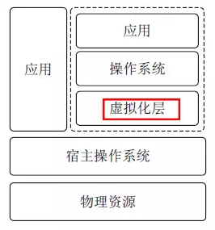
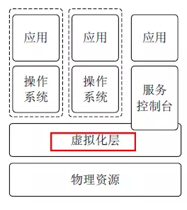
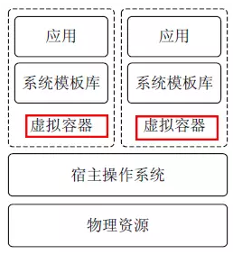

# Kubernetes认知篇

说起kubernetes， 很早以前就简单看过别人高过， 主要是通过动态伸缩容来解决容器扩容的问题， 看了以后也没有什么感觉， 自己也没有真正搞清楚内部逻辑， 使用背景， 对业内的影响， 自己的知识范围也是非常的有限， 在加上后来在自己的工作中也没有使用的机会， 也就慢慢忘记了。

但是随着技术的不断发展， 微服务对互联网架构的不断影响， 微服务对运维行业的压力也造成了非常大的影响， kubernetes已经在devops领域， 占据了一个非常重要的地位， 或者毫不夸张的说， 已经可以成为一个行业的标准了。

为了重新学习kubernetes， 自己最近看了《kubernetes权威指南》第三版， 自己又购买了第四版， 咨询了搞kubernetes的一些同事，看了一些大佬的讲解， 只能算对kubernetes有了一个大概的了解， 一直也是迟迟没有动笔， 担心总结不好， 最后还是希望通过费曼学习法的方式， 跟大家分享自己的进步。


kubernetes是一个分布式架构的王者， 解决了微服务的很多技术难题和运维烦恼， 但是它并不是一下就进化而来， ta到底是要解决什么样的问题， 解决什么样的社会现象呢？ 适合哪些的应用场景呢？ 现在的kubernetes又有哪些缺陷？ 未来的技术发展方向是哪里呢？ 我们更加应该关注这些， 才能让我们更好的把握好趋势， 体会到技术的魅力。

 

# 1. 虚拟化

在熟悉kubernets之前， 我们应该先了解一下虚拟化， kubernetes本身就是一个虚拟化的产品， 理解虚拟化， 可以帮助我们更好的理解kubernetes是如何帮助我们解决行业痛点， 为何如此的被大众如此热衷的。


## 1. 什么是虚拟化？

在计算机中，虚拟化（英语： Virtualization）是⼀种资源管理技术，是将计算机的各种实体资源，如服务器、⽹络、内存及存储等，予以抽象、转换后呈现出来，打破实体结构间的不可切割的障碍，使⽤户可以⽐原本的组态更好的⽅式来应⽤这些资源。这些资源的新虚拟部份是不受现有资源的架设⽅式，地域或物理组态所限制。⼀般所指的虚拟化资源包括计算能⼒和资料存储。  


## 2. 虚拟化的分类

根据在整个系统中的位置不同，虚拟化架构分为以下几种：

- 寄居虚拟化架构
- 裸金属虚拟化架构
- 操作系统虚拟化架构
- 混合虚拟化架构

### 1. 寄居虚拟化架构

寄居虚拟化架构指在宿主操作系统之上安装和运行虚拟化程序，依赖于宿主操作系统对设备的支持和物理资源的管理。（类似 Vmware Workstation 的程序）



### 2. 裸金属虚拟化架构

裸金属虚拟化架构指直接在硬件上面安装虚拟化软件，再在其上安装操作系统和应用，依赖虚拟层内核和服务器控制台进行管理。



### 3. 操作系统虚拟化架构

操作系统虚拟化架构在操作系统层面增加虚拟服务器功能。操作系统虚拟化架构把单个的操作系统划分为多个容器，使用容器管理器来进行管理。

宿主操作系统负责在多个虚拟服务器（即容器）之间分配硬件资源，并且让这些服务器彼此独立。



### 4. 混合虚拟化架构

混合虚拟化架构将一个内核级驱动器插入到宿主操作系统内核。这个驱动器作为虚拟硬件管理器来协调虚拟机和宿主操作系统之间的硬件访问。


## 3. 虚拟化的特点：

虚拟化具有以下特点：

- 分区：对物理机分区，可实现在单一物理机上同时运行多个虚拟机。
- 隔离：同一物理机上多个虚拟机相互隔离。
- 封装：整个虚拟机执行环境封装在独立文件中。
- 独立：虚拟机无须修改，可运行在任何物理机上。


# 2. 常用的虚拟化技术

## 1. openstack

OpenStack：开源管理项⽬ OpenStack是⼀个旨在为公共及私有云的建设与管理提供软件的开源项⽬。它不是⼀个软件，⽽是由⼏个主要的组件组合起来完成⼀些具体的⼯作。 OpenStack由以下五个相对独⽴的组件构成：

- OpenStack Compute(Nova)是⼀套控制器，⽤于虚拟机计算或使⽤群组启动虚拟机实例;
- OpenStack镜像服务(Glance)是⼀套虚拟机镜像查找及检索系统，实现虚拟机镜像管理;
- OpenStack对象存储(Swift)是⼀套⽤于在⼤规模可扩展系统中通过内置冗余及容错机制，以对象为单位的存储系统，类似于Amazon S3;
- OpenStack Keystone，⽤于⽤户身份服务与资源管理以及
- OpenStack Horizon，基于Django的仪表板接⼝，是个图形化管理前端。 这个起初由美国国家航空航天局和Rackspace在2010年末合作研发的开源项⽬，在打造易于部署、功能丰富且易于扩展的云计算平台。 OpenStack项⽬的⾸要任务是简化云的部署过程并为其带来良好的可扩展性，企图成为数据中⼼的操作系统，即云操作系统。  

## 2. KVM

KVM(Kernel-based Virtual Machine)基于内核的虚拟机 KVM是集成到Linux内核的Hypervisor，是X86架构且硬件⽀持虚拟化技术（Intel VT或AMD-V）的Linux的全虚拟化解决⽅案。它是Linux的⼀个很⼩的模块，利⽤Linux做⼤量的事，如任务调度、内存管理与硬件设备交互等。 KVM最⼤的好处就在于它是与Linux内核集成的，所以速度很快  

## 3. VMWare

VMWare (Virtual Machine ware)是⼀个“虚拟PC”虚拟机管理管理软件。它的产品可以使你在⼀台机器上同时运⾏⼆个或更多Windows、 DOS、 LINUX系统。
与“多启动”系统相⽐， VMWare采⽤了完全不同的概念。多启动系统在⼀个时刻只能运⾏⼀个系统，在系统切换时需要重新启动机器。 VMWare是真正“同时”运⾏，多个操作系统在主系统的平台上，就象标准Windows应⽤程序那样切换。⽽且每个操作系统你都可以进⾏虚拟的分区、配置⽽不影响真实硬盘的数据，你甚⾄可以通过⽹卡将⼏台虚拟机⽤⽹卡连接为⼀个局域⽹，极其⽅便。安装在VMware操作系统性能上⽐直接安装在硬盘上的系统低不少，因此，⽐较适合学习和测试。  


# 3. 容器和云计算

## 1. 容器发展史

### 1. Chroot

容器技术的概念可以追溯到1979年的UNIX Chroot。这项功能将Root⽬录及其它⼦⽬录变更⾄⽂件系统内的新位置，且只接受特定进程的访问，其设计⽬的在于为每个进程提供⼀套隔离化磁盘空间。 1982年其被添加⾄BSD。

chroot只是提供了对进程⽂件⽬录虚拟化的功能，不能够防⽌进程恶意访问系统。这个问题在FreeBSDGails容器技术中得以解决    

### 2. FreeBSD Jails

FreeBSD Jails与Chroot的定位类似，不过其中包含有进程沙箱机制以对⽂件系统、⽤户及⽹络等资源进⾏隔离。通过这种⽅式，它能够为每个Jail、定制化软件安装包乃⾄配置⽅案等提供⼀个对应的IP地址。Jails技术为FreeBSD系统提供了⼀种简单的安全隔离机制。它的不⾜在于这种简单性的隔离也同时会影响Jails中应⽤访问系统资源的灵活性。

### 3. Solaris Zones

Solaris Zone技术为应⽤程序创建了虚拟的⼀层，让应⽤在隔离的Zone中运⾏，并实现有效的资源管理。每⼀个Zone 拥有⾃⼰的⽂件系统，进程空间，防⽕墙，⽹络配置等等。  

Solaris Zone技术真正的引⼊了容器资源管理的概念。在应⽤部署的时候为Zone配置⼀定的资源，在运⾏中可以根据Zone的负载动态修改这个资源限制并且是时⽣效的，在其他Zone不需要资源的时候，资源会⾃动切换给需要的资源的Zone，这种切换是即时的不需要⼈⼯⼲预的，最⼤化资源的利⽤率，在
必要的情况下，也可以为单个Zone隔离⼀定的资源。 

### 4. LXC

LXC指代的是Linux Containers，其功能通过Cgroups以及Linux Namespaces实现。也是第⼀套完整的Linux容器管理实现⽅案。在LXC出现之前， Linux上已经有了类似 Linux-Vserver、 OpenVZ 和FreeVPS。虽然这些技术都已经成熟，但是这些解决⽅案还没有将它们的容器⽀持集成到主流 Linux 内核。相较于其它容器技术， LXC能够在⽆需任何额外补丁的前提下运⾏在原版Linux内核之上。⽬前LXC项⽬由Canonical有限公司负责赞助及托管  

### 5. Docker

Docker项⽬最初是由⼀家名为DotCloud的平台即服务⼚商所打造，其后该公司更名为Docker。
Docker在起步阶段使⽤LXC，⽽后利⽤⾃⼰的Libcontainer库将其替换下来。与其它容器平台不同，Docker引⼊了⼀整套与容器管理相关的⽣态系统。其中包括套⾼效的分层式容器镜像模型、⼀套全局及本地容器注册表、⼀个精简化REST API以及⼀套命令⾏界⾯等等。

与Docker具有同样⽬标功能的另外⼀种容器技术就CoreOS公司开发的Rocket. Rocket基于AppContainer规范并使其成为⼀项更为开放的标准  

## 2. Docker容器

Docker简单高效的思想， 快速的被广大的用户所接受。

### 1. Docker历史

2010年，⼏个搞IT的年轻⼈，在美国旧⾦⼭成⽴了⼀家名叫“dotCloud”的公司。  

这家公司主要提供基于PaaS的云计算技术服务。具体来说，是和LXC有关的容器技术。 LXC，就是Linux容器虚拟技术（Linux container）、后来， dotCloud公司将⾃⼰的容器技术进⾏了简化和标准化，并命名为——Docker。

Docker技术诞⽣之后，并没有引起⾏业的关注。⽽dotCloud公司，作为⼀家⼩型创业企业，在激烈的竞争之下，也步履维艰。正当他们快要坚持不下去的时候，脑⼦⾥蹦出了“开源”的想法。

什么是“开源”？开源，就是开放源代码。也就是将原来内部保密的程序源代码开放给所有⼈，然后让⼤家⼀起参与进来，贡献代码和意⻅。

Open Source，开源
有的软件是⼀开始就开源的。也有的软件，是混不下去，创造者⼜不想放弃，所以选择开源。⾃⼰养不活，就吃“百家饭”嘛。

2013年3⽉， dotCloud公司的创始⼈之⼀， Docker之⽗， 28岁的Solomon Hykes正式决定，将Docker项⽬开源。

不开则已，⼀开惊⼈。

越来越多的IT⼯程师发现了Docker的优点，然后蜂拥⽽⾄，加⼊Docker开源社区。

Docker的⼈⽓迅速攀升，速度之快，令⼈瞠⽬结⾆。

开源当⽉， Docker 0.1版本发布。此后的每⼀个⽉， Docker都会发布⼀个版本。到2014年6⽉ 9⽇，

Docker 1.0版本正式发布。

此时的Docker，已经成为⾏业⾥⼈⽓最⽕爆的开源技术，没有之⼀。甚⾄像Google、微软、

Amazon、 VMware这样的巨头，都对它⻘睐有加，表示将全⼒⽀持。

Docker⽕了之后， dotCloud公司⼲脆把公司名字也改成了Docker Inc.。

Docker和容器技术为什么会这么⽕爆？说⽩了，就是因为它“轻”。  简单， 快速

### 2. Docker的原理

容器是⼀种轻量级的虚拟化技术，因为它跟虚拟机⽐起来，它少了⼀层 hypervisor 层。

```
注: hypervisor：⼀种运⾏在物理服务器和操作系统之间的中间层软件，可以允许多个操作系统和应⽤共享⼀套基础物理硬件。可以将hypervisor看做是虚拟环境中的“元”操作系统，可以协调访问服务器上的所有物理设备和虚拟机，所以⼜称为虚拟机监视器（virtual machine monitor）。

hypervisor是所有虚拟化技术的核⼼，⾮中断的⽀持多⼯作负载迁移是hypervisor的基本功能。当服务器启动并执⾏hypervisor时，会给每⼀台虚拟机分配适量的内存， cpu，⽹络和磁盘资源，并且加载所有虚拟机的客户操作系统。
```

对于容器来说，最重要的是怎么保证这个进程所⽤到的资源是被隔离和被限制住的，在 Linux 内核上⾯是由 cgroup 和 namespace 这两个技术来保证的  

### 3. NameSpace

namespace 是⽤来做资源隔离的，在 Linux 内核上有七种 namespace， docker 中⽤到了前六种。第七种 cgroup namespace 在 docker 本身并没有⽤到，但是在 runC 实现中实现了 cgroup namespace。  


# 4. 容器编排技术

随着微服务技术的发展， 容器也给我们代来了一些新的挑战

怎么去管理那么多的容器

怎么横向扩展

容器down了， 怎么恢复

跟新容器后如何灰度发布

如何监控容器

新创建的容器如何加入服务

数据安全问题


## 1. 常用的docker编排工具

### 1. docker-compose

Docker-Compose项目是Docker官方的开源项目，负责实现对Docker容器集群的快速编排。

### 2. swarm

⽬前三⼤主流的容器平台Swarm, Mesos和Kubernetes具有不同的容器调度系统 ；Swarm的特点是直接调度Docker容器，并且提供和标准Docker API⼀致的API。

每台服务器上都装有Docker并且开启了基于HTTP的DockerAPI。这个集群中有⼀个SwarmManager的管理者，⽤来管理集群中的容器资源。管理者的管理对象不是服务器层⾯⽽是集群层⾯的，也就是说通过Manager，我们只能笼统地向集群发出指令⽽不能具体到某台具体的服务器上要⼲什么（这也是Swarm的根本所在）。⾄于具体的管理实现⽅式， Manager向外暴露了⼀个HTTP接⼝，外部⽤户通过这个HTTP接⼝来实现对集群的管理  

### 3. Mesos

Mesos针对不同的运⾏框架采⽤相对独⽴的调度系统，其框架提供了Docker容器的原⽣⽀持。 Mesos并不负责调度⽽是负责委派授权，毕竟很多框架都已经实现了复杂的调度  

### 4. Kubernetes

Kubernetes则采⽤了Pod和Label这样的概念把容器组合成⼀个个的互相存在依赖关系的逻辑单元。Pod中可以部署容器， 目前集成的是docker容器， 如果docker哪一天不流行了， pod的存在可以轻松切换。

相关容器被组合成Pod后被共同部署和调度，形成服务（Service）。这个是Kubernetes和Swarm，Mesos的主要区别。

Kubernetes（k8s）是⾃动化容器操作的开源平台，这些操作包括部署，调度和节点集群间扩展。如果你曾经⽤过Docker容器技术部署容器，那么可以将Docker看成Kubernetes内部使⽤的低级别组件。

Kubernetes不仅仅⽀持Docker，还⽀持Rocket，这是另⼀种容器技术。  


使⽤Kubernetes可以：

- ⾃动化容器的部署和复制
- 随时扩展或收缩容器规模
- 将容器组织成组，并且提供容器间的负载均衡
- 很容易地升级应⽤程序容器的新版本
- 提供容器弹性，如果容器失效就替换它，等等.  


说说我自己的理解： docker只是提供了单个服务器的进行容器的构建， 但是如果机器多了呢？ 我们可以使用在不同的机器上通过接口调用docker接口来完成， s首先会想到这个思路吧， 但是如果有多个服务， 我们会把这些服务注册是一些service， 这些service如何进行动态的扩缩容， 如果进行负载均衡的转发， 如何进行注册服务，同服务之间， 或者不同服务之间， 不同docker容器之间， 应该如何高效的通信， Kubernetes其实就是帮助我们解决这些问题的。认知到位， 下篇接着干。