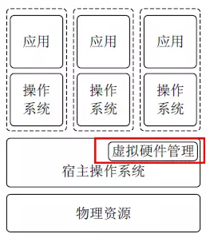

# Kubernetes认知篇

说起kubernetes， 很早以前就简单看过别人高过， 主要是通过动态伸缩容来解决容器扩容的问题， 看了以后也没有什么感觉， 自己也没有真正搞清楚内部逻辑， 使用背景， 对业内的影响， 自己的知识范围也是非常的有限， 在加上后来在自己的工作中也没有使用的机会， 也就慢慢忘记了。

但是随着技术的不断发展， 微服务对互联网架构的不断影响， 微服务对运维行业的压力也造成了非常大的影响， kubernetes已经在devops领域， 占据了一个非常重要的地位， 或者毫不夸张的说， 已经可以成为一个行业的标准了。

为了重新学习kubernetes， 自己最近看了《kubernetes权威指南》第三版， 自己又购买了第四版， 咨询了搞kubernetes的一些同事，看了一些大佬的讲解， 只能算对kubernetes有了一个大概的了解， 一直也是迟迟没有动笔， 担心总结不好， 最后还是希望通过费曼学习法的方式， 跟大家分享自己的进步。

kubernetes是一个分布式架构的王者， 解决了微服务的很多技术难题和运维烦恼， 但是它并不是一下就进化而来， ta到底是要解决什么样的问题， 解决什么样的社会现象呢？ 适合哪些的应用场景呢？ 现在的kubernetes又有哪些缺陷？ 未来的技术发展方向是哪里呢？ 我们更加应该关注这些， 才能让我们更好的把握好趋势， 体会到技术的魅力。

 

# 1. 虚拟化

在熟悉kubernets之前， 我们应该先了解一下虚拟化， kubernetes本身就是一个虚拟化的产品， 理解虚拟化， 可以帮助我们更好的理解kubernetes是如何帮助我们解决行业痛点， 为何如此的被大众如此热衷的。

## 1. 什么是虚拟化？

在计算机中，虚拟化（英语： Virtualization）是⼀种资源管理技术，是将计算机的各种实体资源，如服务器、⽹络、内存及存储等，予以抽象、转换后呈现出来，打破实体结构间的不可切割的障碍，使⽤户可以⽐原本的组态更好的⽅式来应⽤这些资源。这些资源的新虚拟部份是不受现有资源的架设⽅式，地域或物理组态所限制。⼀般所指的虚拟化资源包括计算能⼒和资料存储。  

## 2. 虚拟化的分类

根据在整个系统中的位置不同，虚拟化架构分为以下几种：

- 寄居虚拟化架构
- 裸金属虚拟化架构
- 操作系统虚拟化架构
- 混合虚拟化架构

### 1. 寄居虚拟化架构

寄居虚拟化架构指在宿主操作系统之上安装和运行虚拟化程序，依赖于宿主操作系统对设备的支持和物理资源的管理。（类似 Vmware Workstation 的程序）

### 2. 裸金属虚拟化架构

裸金属虚拟化架构指直接在硬件上面安装虚拟化软件，再在其上安装操作系统和应用，依赖虚拟层内核和服务器控制台进行管理。

### 3. 操作系统虚拟化架构

操作系统虚拟化架构在操作系统层面增加虚拟服务器功能。操作系统虚拟化架构把单个的操作系统划分为多个容器，使用容器管理器来进行管理。

宿主操作系统负责在多个虚拟服务器（即容器）之间分配硬件资源，并且让这些服务器彼此独立。

### 4. 混合虚拟化架构

混合虚拟化架构将一个内核级驱动器插入到宿主操作系统内核。这个驱动器作为虚拟硬件管理器来协调虚拟机和宿主操作系统之间的硬件访问。

## 3. 虚拟化的特点：

虚拟化具有以下特点：

- 分区：对物理机分区，可实现在单一物理机上同时运行多个虚拟机。
- 隔离：同一物理机上多个虚拟机相互隔离。
- 封装：整个虚拟机执行环境封装在独立文件中。
- 独立：虚拟机无须修改，可运行在任何物理机上。