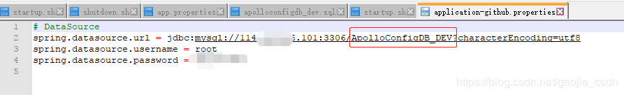

# 1. apollo简介

apollo（阿波罗）是携程框架部门研发的分配式配置中心， 能够集中化管理应用不同环境， 不同集群的配置，配置修改后能够实时推送到应用端，并且具备规范的权限、流程治理等特性，适用于微服务配置管理场景。

服务端基于Spring Boot和Spring Cloud开发，打包后可以直接运行，不需要额外安装Tomcat等应用容器。

Java客户端不依赖任何框架，能够运行于所有Java运行时环境，同时对Spring/Spring Boot环境也有较好的支持。

.Net客户端不依赖任何框架，能够运行于所有.Net运行时环境。

详细介绍，请前往：https://github.com/ctripcorp/apollo

# 2. apollo安装搭建

## 1. 环境准备

- java： JDK 1.8.x
- maven：3.2.2
- mysql：5.7.18
- idea: 2019.1.3
- git : 2.10.0
- apollo: 1.4.0

以及各个组件对应的版本，其中 除了 idea 、git 外，其他都是必须的，请查缺补漏的部署环境。

## 2. 安装包下载

从url中下载所需要的链接地址https://github.com/ctripcorp/apollo/releases

下载三个包： 

- [apollo-adminservice-1.6.1-github.zip](https://github.com/ctripcorp/apollo/releases/download/v1.6.1/apollo-adminservice-1.6.1-github.zip)
- [apollo-configservice-1.6.1-github.zip](https://github.com/ctripcorp/apollo/releases/download/v1.6.1/apollo-configservice-1.6.1-github.zip)
- [apollo-portal-1.6.1-github.zip](https://github.com/ctripcorp/apollo/releases/download/v1.6.1/apollo-portal-1.6.1-github.zip)

## 3. 创建数据库

数据库要求5.6+， 安装的5.7的数据库

```
mysql> SHOW VARIABLES WHERE Variable_name = 'version';
+---------------+--------+
| Variable_name | Value  |
+---------------+--------+
| version       | 5.7.30 |
+---------------+--------+
1 row in set (0.01 sec)
```

创建两个数据库

```
mysql> create database ApolloConfigDB default CHARACTER SET = utf8mb4;
Query OK, 1 row affected (0.00 sec)

mysql> create database ApolloPortalDB default CHARACTER SET = utf8mb4;
Query OK, 1 row affected (0.00 sec)

```

## 4. 配置数据库

### 1. portal

scripts\startup.sh 修改端口号（默认是端口容易冲突，所以自己修改未使用的端口号，也便于管理），日志目录也可以根据自己习惯改动


config/apollo-env.properties 配置需要管理的环境的config端口


config/application-github.properties 配置portal的数据库连接


### 2. config

scripts\startup.sh 修改端口号（原理与Portal修改一样，防止冲突，便于管理），日志目录也可以根据自己习惯改动


config/application-github.properties 配置apollo-config的数据库连接（此处是连接的dev环境的配置，因为我有多套环境的配置，若是pro环境的配置，则连pro的数据库就好）


config/application-github.properties 配置apollo-config的数据库连接（此处是连接的dev环境的配置，因为我有多套环境的配置，若是pro环境的配置，则连pro的数据库就好）



### 3. admin

scripts\startup.sh 修改端口号（原理与Portal修改一样，防止冲突，便于管理），日志目录也可以根据自己习惯改动


config/application-github.properties 配置apollo-config的数据库连接（此处是连接的dev环境的配置，因为我有多套环境的配置）


## 5. 部署应用

将自己修改好配置的安装包上传到服务器（我是放在/opt/apollo文件夹下，位置自己定，关系不大）


然后修改script文件夹的权限，因为默认是读写权限，没有执行权限 ：chmod -R 755 scripts，这样启动和停止脚本就有了执行权限，每个script文件夹都需要执行权限

然后再执行每个startup.sh文件（可能会失败，失败就需要看启动日志了，日志路径启动脚本里面有配置），全部启动成功之后，就可以去页面访问我们的apollo的portal了


账号密码默认为 apollo / admin

进来后就能看到自己配置的多套环境了

