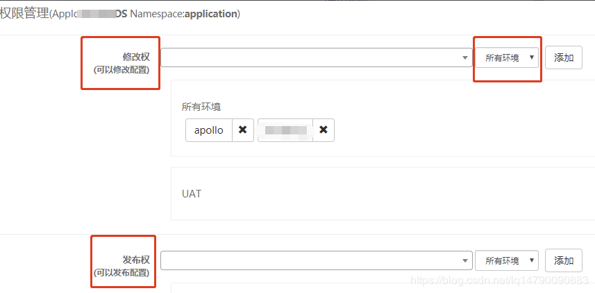

# 1. apollo简介

apollo（阿波罗）是携程框架部门研发的分配式配置中心， 能够集中化管理应用不同环境， 不同集群的配置，配置修改后能够实时推送到应用端，并且具备规范的权限、流程治理等特性，适用于微服务配置管理场景。

服务端基于Spring Boot和Spring Cloud开发，打包后可以直接运行，不需要额外安装Tomcat等应用容器。

Java客户端不依赖任何框架，能够运行于所有Java运行时环境，同时对Spring/Spring Boot环境也有较好的支持。

.Net客户端不依赖任何框架，能够运行于所有.Net运行时环境。

详细介绍，请前往：https://github.com/ctripcorp/apollo

# 2. apollo安装搭建

## 1. 环境准备

- java： JDK 1.8.x
- maven：3.2.2
- mysql：5.7.18
- idea: 2019.1.3
- git : 2.10.0
- apollo: 1.4.0

以及各个组件对应的版本，其中 除了 idea 、git 外，其他都是必须的，请查缺补漏的部署环境。

## 2. 安装包下载

从url中下载所需要的链接地址https://github.com/ctripcorp/apollo/releases

下载三个包： 

- [apollo-adminservice-1.6.1-github.zip](https://github.com/ctripcorp/apollo/releases/download/v1.6.1/apollo-adminservice-1.6.1-github.zip)
- [apollo-configservice-1.6.1-github.zip](https://github.com/ctripcorp/apollo/releases/download/v1.6.1/apollo-configservice-1.6.1-github.zip)
- [apollo-portal-1.6.1-github.zip](https://github.com/ctripcorp/apollo/releases/download/v1.6.1/apollo-portal-1.6.1-github.zip)

## 3. 创建数据库

数据库要求5.6+， 安装的5.7的数据库

```
mysql> SHOW VARIABLES WHERE Variable_name = 'version';
+---------------+--------+
| Variable_name | Value  |
+---------------+--------+
| version       | 5.7.30 |
+---------------+--------+
1 row in set (0.01 sec)
```

创建两个数据库

```
mysql> create database ApolloConfigDB default CHARACTER SET = utf8mb4;
Query OK, 1 row affected (0.00 sec)

mysql> create database ApolloPortalDB default CHARACTER SET = utf8mb4;
Query OK, 1 row affected (0.00 sec)

```

## 4. 配置数据库

### 1. portal

scripts\startup.sh 修改端口号（默认是端口容易冲突，所以自己修改未使用的端口号，也便于管理），日志目录也可以根据自己习惯改动


config/apollo-env.properties 配置需要管理的环境的config端口


config/application-github.properties 配置portal的数据库连接


### 2. config

scripts\startup.sh 修改端口号（原理与Portal修改一样，防止冲突，便于管理），日志目录也可以根据自己习惯改动


config/application-github.properties 配置apollo-config的数据库连接（此处是连接的dev环境的配置，因为我有多套环境的配置，若是pro环境的配置，则连pro的数据库就好）


### 3. admin

scripts\startup.sh 修改端口号（原理与Portal修改一样，防止冲突，便于管理），日志目录也可以根据自己习惯改动


config/application-github.properties 配置apollo-config的数据库连接（此处是连接的dev环境的配置，因为我有多套环境的配置）


## 5. 部署应用

将自己修改好配置的安装包上传到服务器（我是放在/opt/apollo文件夹下，位置自己定，关系不大）


然后修改script文件夹的权限，因为默认是读写权限，没有执行权限 ：chmod -R 755 scripts，这样启动和停止脚本就有了执行权限，每个script文件夹都需要执行权限

然后再执行每个startup.sh文件（可能会失败，失败就需要看启动日志了，日志路径启动脚本里面有配置），全部启动成功之后，就可以去页面访问我们的apollo的portal了


账号密码默认为 apollo / admin

进来后就能看到自己配置的多套环境了


# 3. apollo中配置名词的对应关系

首先是有不同的环境

环境下面有不同的集群

集群下面有不同的namespace

如下图所示:


# 4. springboot项目接入apollo

## 1. maven依赖

```
<dependency>
  <groupId>com.ctrip.framework.apollo</groupId>
  <artifactId>apollo-client</artifactId>
  <version>1.2.0</version>
</dependency>

```

## 2. 在apollo中创建项目

在应用正式接入之前需在配置中心创建项目，应用Id为应用获取指定配置的唯一标识，创建后不可修改


## 3. 添加配置项并发布

如果你只使用到application.property, 那你只需要使用下图中的示例就可以了.


## 4. 添加Namespace

如果application无法满足你的条件, 你可以创建namespace, 你可以简单理解成和application同一个数量级别的文件.你在启动的时候, 默认是指定application的, 也可以指定增加其他的namespace.

- Namespace是配置项的集合，类似于一个配置文件的概念;
- Namespace的获取权限分为两种：private和public，public权限的Namespace，能被任何应用获取；
- 创建项目的时候，会默认创建一个application的private权限的Namespace;
- 公共类型的Namespace相当于游离于应用之外的配置，且通过Namespace的名称去标识公共Namespace，所以公共的Namespace的名称必须全局唯一

在项目配置页面点击添加Namespace，进入添加页面


如果已有公共的Namespace则直接关联即可，没有则点击`创建Namespace`，填写名称并选择类型，填好备注点击提交即可完成创建，属性添加同默认Namespace一致。


关联的Namespace可以在项目中选择使用自定义的属性值覆盖公共配置项。


## 5. 配置参数

注意, app.id可以直接写在applicatioin.properties中

在`META-INF\app.properties`文件增加配置项`app.id=xxxx`，app.id是用来标识应用身份的唯一id;


在`application-env.properties`文件增加如下配置，namespaces默认为application，meta为配置中心服务端地址.

```
apollo.bootstrap.enabled=true
apollo.bootstrap.eagerLoad.enabled=true       #将配置中心加载时机提前，可以管理logback日志配置
apollo.bootstrap.namespaces=application,IT.LOGGER      #多个namespace用英文逗号分隔
apollo.meta=http://10.253.128.21:8080,http://10.253.128.20:8080  
```

**我们目前使用统一是application.properties, apollo的测试环境和正式环境是区分开来的, 我们通过启动参数来替换appo.meta的参数来分别区分uat环境和生产环境**

# 5. 服务端项目管理

## 1. 项目管理员管理

在项目配置页面点击项目管理进入管理页面，管理员具有权限(创建Namespace、创建集群、管理项目、Namespace权限)


## 2. Namespace权限管理

在项目配置页面的Namespace上点击`授权`，区分修改权和发布权，区分环境




## 3. 查看发布历史

在项目配置页面的Namespace上点击`发布历史`


## 4. 项目配置回滚

在项目配置页面的Namespace上点击`回滚`，回滚后变为修改状态，将错误配置修改后可重新进行发布操作


## 5. 灰度发布

在项目配置页面的Namespace上点击`灰度`，创建灰度版本，


在灰度版本上增加或修改配置，然后点击`灰度规则`标签


新增规则，选择要灰度测试的客户端，完成后选择`灰度发布`完成发布，或者`放弃灰度`


灰度测试完成后选择`全量发布`进行主版本合并，并删除灰度版本。

