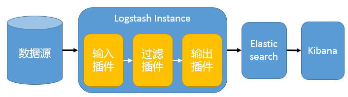

# EKL架构和Filebeat工作原理详解

# 1. ELK简介

ELK 不是一款软件，而是 Elasticsearch、Logstash 和 Kibana 三种软件产品的首字母缩写。这三者都是开源软件，通常配合使用，而且又先后归于 Elastic.co 公司名下，所以被简称为 ELK Stack。根据 Google Trend 的信息显示，ELK Stack 已经成为目前最流行的集中式日志解决方案。

- Elasticsearch：分布式搜索和分析引擎，具有高可伸缩、高可靠和易管理等特点。基于 Apache Lucene 构建，能对大容量的数据进行接近实时的存储、搜索和分析操作。通常被用作某些应用的基础搜索引擎，使其具有复杂的搜索功能；
- Logstash：数据收集引擎。它支持动态的从各种数据源搜集数据，并对数据进行过滤、分析、丰富、统一格式等操作，然后存储到用户指定的位置；
- Kibana：数据分析和可视化平台。通常与 Elasticsearch 配合使用，对其中数据进行搜索、分析和以统计图表的方式展示；
- Filebeat：ELK 协议栈的新成员，一个轻量级开源日志文件数据搜集器，基于 Logstash-Forwarder 源代码开发，是对它的替代。在需要采集日志数据的 server 上安装 Filebeat，并指定日志目录或日志文件后，Filebeat 就能读取数据，迅速发送到 Logstash 进行解析，亦或直接发送到 Elasticsearch 进行集中式存储和分析。

# 2. EKL常用架构和使用场景

## 1. 最简单的架构

在这种架构中，只有一个 Logstash、Elasticsearch 和 Kibana 实例。Logstash 通过输入插件从多种数据源（比如日志文件、标准输入 Stdin 等）获取数据，再经过滤插件加工数据，然后经 Elasticsearch 输出插件输出到 Elasticsearch，通过 Kibana 展示。详见图 1。

**图 1. 最简单架构**



## 2. logstash作为日志搜集器

这种架构是对上面架构的扩展，把一个 Logstash 数据搜集节点扩展到多个，分布于多台机器，将解析好的数据发送到 Elasticsearch server 进行存储，最后在 Kibana 查询、生成日志报表等。详见图 2。

**图 2. Logstash 作为日志搜索器**


这种结构因为需要在各个服务器上部署 Logstash，而logstash比较消耗 CPU 和内存资源，所以比较适合计算资源丰富的服务器，否则容易造成服务器性能下降，甚至可能导致无法正常工作。

## 3. Beats作为日志搜集器

这种架构引入 Beats 作为日志搜集器。目前 Beats 包括四种：

- Packetbeat（搜集网络流量数据）；
- Topbeat（搜集系统、进程和文件系统级别的 CPU 和内存使用情况等数据）；
- Filebeat（搜集文件数据）；
- Winlogbeat（搜集 Windows 事件日志数据）。

Beats 将搜集到的数据发送到 Logstash，经 Logstash 解析、过滤后，将其发送到 Elasticsearch 存储，并由 Kibana 呈现给用户。详见图 3。

**图 3. Beats 作为日志搜集器**


这种架构解决了 Logstash 在各服务器节点上占用系统资源高的问题。相比 Logstash，Beats 所占系统的 CPU 和内存几乎可以忽略不计。另外，Beats 和 Logstash 之间支持 SSL/TLS 加密传输，客户端和服务器双向认证，保证了通信安全。

因此这种架构适合对数据安全性要求较高，同时各服务器性能比较敏感的场景。

## 4. 基于FileBeat架构的配置部署详解


# 3. 使用filebeat

filebeat主要用于收集和转发日志。filebeat监视指定的日志文件和位置，收集日志事件，并将它们转发到es或logstash进行索引。

## 安装

官网：https://www.elastic.co/guide/en/beats/filebeat/current/filebeat-installation.html

```
# curl -L -O https://artifacts.elastic.co/downloads/beats/filebeat/filebeat-6.5.2-x86_64.rpm
# sudo rpm -vi filebeat-6.5.2-x86_64.rpm
```

Filebeat的工作原理：启动Filebeat时，它会启动一个或多个inputs，这些inputs将查找指定的log的路径。对于查找到的每个日志，Filebeat将启动一个harvester。每个harvester读取单个日志的新内容，并将新日志数据发送到libbeat，libbeat聚合事件并将聚合数据发送到配置的output。

我们采用的是 filebeat -> kafka ->logstash -> es。

**配置文件**

filebeat 配置文件比较简单, 只需要配置一个filebeat.yml

## input

```
#============== Filebeat prospectors ===========
filebeat.inputs:   # 6.3以前是 filebeat.prospectors:
- type: log        # input类型,默认为log，6.0以前配置是 - input_type: log
  paths:
    - /var/log/java/test-java.log
    - /var/log/java/*.log
    - /var/log/*/*.log
  fields:          
    log_topic: java_log     # 附加的可选字段,以向output添加额外的信息。output里面可以使用这个变量
  multiline.pattern: '^\['   #多行合并 同logstash的multiline用法相似
  multiline.negate: true
  multiline.match: after
 
- type: log     # 一个配置文件里面可以同时收集多个日志
  enabled: true
  paths:
    - /var/log/nginx/*.log
  fields:
    my_log_topic: nginx_log
```

**常用配置**

**type:**  指定input类型，有log、stdin、redis、tcp、syslog等

**fields：** 可以自定义添加字段，到output中去，后续可以使用这些字段，例如：

```
  fields:
    log_topic: mysql_slow  
    idc: szjf 
```

 **tail_files:** 默认为false。配置为true时，filebeat将从新文件的最后位置开始读取,而不是从开头读取新文件， 注意：如果配合日志轮循使用，新文件的第一行将被跳过。

   此选项适用于Filebeat尚未处理的文件。如果先前运行了Filebeat并且文件的状态已经保留，`tail_files`则不会应用。

   第一次运行Filebeat时，可以使用 tail_files: true 来避免索引旧的日志行。第一次运行后，建议禁用此选项。

**registry file**
  filebeat会将自己处理日志文件的进度信息写入到registry文件中，以保证filebeat在重启之后能够接着处理未处理过的数据，而无需从头开始。 

如果要让filebeat从头开始读文件，需要停止filebeat，然后删除registry file:

  systemctl stop filebeat ;rm -fr /var/lib/filebeat/registry/* ; systemctl start filebaet

  registry文件里字段的解释：

- source： 日志文件的路径
- offset：已经采集的日志的字节数;已经采集到日志的哪个字节位置
- inode： 日志文件的inode号
- device： 日志所在的磁盘编号
- timestamp： 日志最后一次发生变化的时间戳
- ttl： 采集失效时间，-1表示只要日志存在，就一直采集该日志

 **multiline:**  https://www.elastic.co/guide/en/beats/filebeat/current/multiline-examples.html#multiline 处理多行合并

##  output

   配置输出的位置，比如kafka，logstash，es，redis，file 等

```
#================================ Outputs =====================================
#-------------------------Kafka output ------------------------------
output.kafka:
  hosts: ["kafka01:9092","kafka02:9092","kafka03:9092]
  topic: '%{[fields.my_log_topic]}'
  partition.round_robin:
    reachable_only: false
  version: 0.10.0.0
  required_acks: 1
  compression: none
  max_message_bytes: 1000000
#output.logstash:
#  hosts: ["localhost:5044"]
```

还可以有一些其他配置，比如**processor**处理器配置（不是必需的）

```
#====================Preocessors=====================
processors:
  - drop_fields:    #删除字段，不再kibana里面展示，默认情况kibana里面会自动展示这些beat字段
      fields: ["beat.hostname","beat.version","beat.name","prospector.type","input.type"]


#也可以在logstash里面通过remove_field 删除字段
#mutate{
#        remove_field => ["[beat][hostname]","[beat][version]","input","prospector"]
#    }
```

配置完filebeat.yml，启动filebeat 即可。# /etc/init.d/filebeat start


# 4. es的分词器

es的分词器是es的主要核心功能， 在elasticsearch的plugins的目录下：可能设置自己的分词器，也可以自定义分词器。

分词器使用的两个情形： 

1. Index time analysis. 创建或者更新文档时，会对文档进行分词
2. Search time analysis. 查询时，对查询语句分词

## 1. 指定查询时使用哪个分词器的方式有：

- 查询时通过analyzer指定分词器

```
GET test_index/_search
{
  "query": {
    "match": {
      "name": {
        "query": "lin",
        "analyzer": "standard"
      }
    }
  }
}
```

- 创建index mapping时指定search_analyzer

```
PUT test_index
{
  "mappings": {
    "doc": {
      "properties": {
        "title":{
          "type": "text",
          "analyzer": "whitespace",
          "search_analyzer": "standard"
        }
      }
    }
  }
}
```

索引时分词是通过配置 Index mapping中的每个字段的参数analyzer指定的

```
# 不指定分词时，会使用默认的standard
PUT test_index
{
  "mappings": {
    "doc": {
      "properties": {
        "title":{
          "type": "text",
          "analyzer": "whitespace"     #指定分词器，es内置有多种analyzer
        }
      }
    }}}
```

**注意：**

-  明确字段是否需要分词，不需要分词的字段将type设置为keyword，可以节省空间和提高写性能。

## 2. 查看和设置分词器

### 1.查看

```
GET _analyze
{
  "analyzer": "standard",
  "text": "this is a test"
}
# 可以查看text的内容使用standard分词后的结果
```

```
{
  "tokens": [
    {
      "token": "this",
      "start_offset": 0,
      "end_offset": 4,
      "type": "<ALPHANUM>",
      "position": 0
    },
    {
      "token": "is",
      "start_offset": 5,
      "end_offset": 7,
      "type": "<ALPHANUM>",
      "position": 1
    },
    {
      "token": "a",
      "start_offset": 8,
      "end_offset": 9,
      "type": "<ALPHANUM>",
      "position": 2
    },
    {
      "token": "test",
      "start_offset": 10,
      "end_offset": 14,
      "type": "<ALPHANUM>",
      "position": 3
    }
  ]
}
```

### 2. 设置分词器

```
PUT test
{
  "settings": {
    "analysis": {    #自定义分词器
      "analyzer": {      # 关键字
        "my_analyzer":{   # 自定义的分词器
          "type":"standard",    #分词器类型standard
          "stopwords":"_english_"   #standard分词器的参数，默认的stopwords是\_none_
        }
      }
    }
  },
  "mappings": {
    "doc":{
      "properties": {
        "my_text":{
          "type": "text",
          "analyzer": "standard",  # my_text字段使用standard分词器
          "fields": {
            "english":{            # my_text.english字段使用上面自定义得my_analyzer分词器
              "type": "text", 
              "analyzer": "my_analyzer"
            }}}}}}}
POST test/_analyze
{
  "field": "my_text",    # my_text字段使用的是standard分词器
  "text": ["The test message."]
}
-------------->[the,test,message]

POST test/_analyze
{
  "field": "my_text.english",     #my_text.english使用的是my_analyzer分词器
  "text": ["The test message."]
}
------------>[test,message]
```

## 3. es内置了多种analyzer

- standard  由以下组成
  - tokenizer：Standard Tokenizer
  - token filter：Standard Token Filter，Lower Case Token Filter，Stop Token Filter 

```
analyzer API测试 ：
POST _analyze
{
  "analyzer": "standard",
  "text": "The 2 QUICK Brown-Foxes jumped over the lazy dog's bone."
}
```

得到结果：

```
{
  "tokens": [
    {
      "token": "the",
      "start_offset": 0,
      "end_offset": 3,
      "type": "<ALPHANUM>",
      "position": 0
    },
    {
      "token": "2",
      "start_offset": 4,
      "end_offset": 5,
      "type": "<NUM>",
      "position": 1
    },
    {
      "token": "quick",
      "start_offset": 6,
      "end_offset": 11,
      "type": "<ALPHANUM>",
      "position": 2
    },
    {
      "token": "brown",
      "start_offset": 12,
      "end_offset": 17,
      "type": "<ALPHANUM>",
      "position": 3
    },
    {
      "token": "foxes",
      "start_offset": 18,
      "end_offset": 23,
      "type": "<ALPHANUM>",
      "position": 4
    },
    {
      "token": "jumped",
      "start_offset": 24,
      "end_offset": 30,
      "type": "<ALPHANUM>",
      "position": 5
    },
    {
      "token": "over",
      "start_offset": 31,
      "end_offset": 35,
      "type": "<ALPHANUM>",
      "position": 6
    },
    {
      "token": "the",
      "start_offset": 36,
      "end_offset": 39,
      "type": "<ALPHANUM>",
      "position": 7
    },
    {
      "token": "lazy",
      "start_offset": 40,
      "end_offset": 44,
      "type": "<ALPHANUM>",
      "position": 8
    },
    {
      "token": "dog's",
      "start_offset": 45,
      "end_offset": 50,
      "type": "<ALPHANUM>",
      "position": 9
    },
    {
      "token": "bone",
      "start_offset": 51,
      "end_offset": 55,
      "type": "<ALPHANUM>",
      "position": 10
    }
  ]
}
```

- whitespace  空格为分隔符

```
POST _analyze
{
  "analyzer": "whitespace",
  "text": "The 2 QUICK Brown-Foxes jumped over the lazy dog's bone."
}
-->  [ The,2,QUICK,Brown-Foxes,jumped,over,the,lazy,dog's,bone. ]
```

- simple

```
POST _analyze
{
  "analyzer": "simple",
  "text": "The 2 QUICK Brown-Foxes jumped over the lazy dog's bone."
}
---> [ the, quick, brown, foxes, jumped, over, the, lazy, dog, s, bone ]
```

- stop  默认stopwords用_english_

```
POST _analyze
{
  "analyzer": "stop",
  "text": "The 2 QUICK Brown-Foxes jumped over the lazy dog's bone."
}
-->[ quick, brown, foxes, jumped, over, lazy, dog, s, bone ]
可选参数：
# stopwords
# stopwords_path
```

- keyword  不分词的

```
POST _analyze
{
  "analyzer": "keyword",
  "text": ["The 2 QUICK Brown-Foxes jumped over the lazy dog's bone."]
}
得到  "token": "The 2 QUICK Brown-Foxes jumped over the lazy dog's bone." 一条完整的语句
```

- ### 第三方analyzer插件---中文分词（ik分词器）

es内置很多分词器，但是对中文分词并不友好，例如使用standard分词器对一句中文话进行分词，会分成一个字一个字的。这时可以使用第三方的Analyzer插件，比如 ik、pinyin等。这里以ik为例

1，首先安装插件，重启es：

```
# bin/elasticsearch-plugin install https://github.com/medcl/elasticsearch-analysis-ik/releases/download/v6.3.0/elasticsearch-analysis-ik-6.3.0.zip
# /etc/init.d/elasticsearch restart
```

2. 使用示例：

```
GET _analyze
{
  "analyzer": "ik_max_word",
  "text": "你好吗?我有一句话要对你说呀。"
}
```

分词结果

```
{
  "tokens": [
    {
      "token": "你好",
      "start_offset": 0,
      "end_offset": 2,
      "type": "CN_WORD",
      "position": 0
    },
    {
      "token": "好吗",
      "start_offset": 1,
      "end_offset": 3,
      "type": "CN_WORD",
      "position": 1
    },
    {
      "token": "我",
      "start_offset": 4,
      "end_offset": 5,
      "type": "CN_CHAR",
      "position": 2
    },
    {
      "token": "有",
      "start_offset": 5,
      "end_offset": 6,
      "type": "CN_CHAR",
      "position": 3
    },
    {
      "token": "一句话",
      "start_offset": 6,
      "end_offset": 9,
      "type": "CN_WORD",
      "position": 4
    },
    {
      "token": "一句",
      "start_offset": 6,
      "end_offset": 8,
      "type": "CN_WORD",
      "position": 5
    },
    {
      "token": "一",
      "start_offset": 6,
      "end_offset": 7,
      "type": "TYPE_CNUM",
      "position": 6
    },
    {
      "token": "句话",
      "start_offset": 7,
      "end_offset": 9,
      "type": "CN_WORD",
      "position": 7
    },
    {
      "token": "句",
      "start_offset": 7,
      "end_offset": 8,
      "type": "COUNT",
      "position": 8
    },
    {
      "token": "话",
      "start_offset": 8,
      "end_offset": 9,
      "type": "CN_CHAR",
      "position": 9
    },
    {
      "token": "要对",
      "start_offset": 9,
      "end_offset": 11,
      "type": "CN_WORD",
      "position": 10
    },
    {
      "token": "你",
      "start_offset": 11,
      "end_offset": 12,
      "type": "CN_CHAR",
      "position": 11
    },
    {
      "token": "说呀",
      "start_offset": 12,
      "end_offset": 14,
      "type": "CN_WORD",
      "position": 12
    }
  ]
}
```

- 还可以用内置的 character filter, tokenizer, token filter 组装一个analyzer(custom analyzer)

custom  

定制analyzer，由以下几部分组成

- 0个或多个e character filters
- 1个tokenizer
- 0个或多个 token filters

```
PUT t_index
{
  "settings": {
    "analysis": {
      "analyzer": {
        "my_analyzer":{
          "type":"custom",
          "tokenizer":"standard",
          "char_filter":["html_strip"],
          "filter":["lowercase"]
        }
      }
    }
  }
}
POST t_index/_analyze
{
  "analyzer": "my_analyzer",
  "text": ["The 2 QUICK Brown-Foxes jumped over the lazy dog's <b> bone.</b>"]
}
得到：[the,2,quick,brown,foxes,jumped,over,the,lazy,dog's,bone]
```

### 自定义分词器

自定义分词需要在索引的配置中设定，如下所示：

```
PUT test_index
{
  "settings": {
    "analysis": {    # 分词设置，可以自定义
      "char_filter": {},   #char_filter  关键字
      "tokenizer": {},    #tokenizer 关键字
      "filter": {},     #filter  关键字
      "analyzer": {}    #analyzer 关键字
    }
  }
}
```

#### character filter  在tokenizer之前对原始文本进行处理，比如增加，删除，替换字符等

会影响后续tokenizer解析的position和offset信息

- html strip  除去html标签和转换html实体
  - 参数：escaped_tags不删除的标签

```
POST _analyze
{
  "tokenizer": "keyword",
  "char_filter": ["html_strip"],
  "text": ["<p>I&apos;m so <b>happy</b>!</p>"]
}
得到：
      "token": """

I'm so happy!

"""
#配置示例
PUT t_index
{
  "settings": {
    "analysis": {
      "analyzer": {  #关键字
        "my_analyzer":{   #自定义analyzer
          "tokenizer":"keyword",
          "char_filter":["my_char_filter"]
        }
      },
      "char_filter": {  #关键字
        "my_char_filter":{   #自定义char_filter
          "type":"html_strip",
          "escaped_tags":["b"]  #不从文本中删除的HTML标记数组
        }
      }}}}
POST t_index/_analyze
{
  "analyzer": "my_analyzer",
  "text": ["<p>I&apos;m so <b>happy</b>!</p>"]
}
得到：
      "token": """

I'm so <b>happy</b>!

""",
```

mapping   映射类型，以下参数必须二选一

- mappings 指定一组映射，每个映射格式为 key=>value
- mappings_path 绝对路径或者相对于config路径  key=>value

```
PUT t_index
{
  "settings": {
    "analysis": {
      "analyzer": {     #关键字
        "my_analyzer":{   #自定义分词器
          "tokenizer":"standard",
          "char_filter":"my_char_filter"  
        }
      },
      "char_filter": {    #关键字
        "my_char_filter":{  #自定义char_filter
          "type":"mapping", 
          "mappings":[       #指明映射关系
            ":)=>happy",
            ":(=>sad"
          ]
        }}}}}
POST t_index/_analyze
{
  "analyzer": "my_analyzer",
  "text": ["i am so :)"]
}
得到 [i,am,so,happy]
```

pattern replace

- pattern参数  正则
- replacement 替换字符串 可以使用$1..$9
- flags  正则标志

#### tokenizer  将原始文档按照一定规则切分为单词

- standard
  - 参数：max_token_length，最大token长度，默认是255

```
PUT t_index
{
  "settings": {
    "analysis": {
      "analyzer": {
        "my_analyzer":{
          "tokenizer":"my_tokenizer"
        }
      },
      "tokenizer": { 
        "my_tokenizer":{
          "type":"standard",
          "max_token_length":5      
        }}}}}
POST t_index/_analyze
{
  "analyzer": "my_analyzer",
  "text": ["The 2 QUICK Brown-Foxes jumped over the lazy dog's bone."]
}
得到   [ The, 2, QUICK, Brown, Foxes, jumpe, d, over, the, lazy, dog's, bone ]
# jumped 长度为6  在5这个位置被分割
```

- letter   非字母时分成多个terms

```
POST _analyze
{
  "tokenizer": "letter",
  "text": ["The 2 QUICK Brown-Foxes jumped over the lazy dog's bone."]
}
得到 [ The, QUICK, Brown, Foxes, jumped, over, the, lazy, dog, s, bone ]
```

- lowcase  跟letter tokenizer一样 ，同时将字母转化成小写

```
POST _analyze
{
  "tokenizer": "lowercase",
  "text": "The 2 QUICK Brown-Foxes jumped over the lazy dog's bone."
}
得到  [ the, quick, brown, foxes, jumped, over, the, lazy, dog, s, bone ]
```

- whitespace  按照空白字符分成多个terms
  - 参数：max_token_length

```
POST _analyze
{
  "tokenizer": "whitespace",
  "text": "The 2 QUICK Brown-Foxes jumped over the lazy dog's bone."
}
得到 [ The, 2, QUICK, Brown-Foxes, jumped, over, the, lazy, dog's, bone. ]
```

- keyword  空操作，输出完全相同的文本
  - 参数：buffer_size，单词一个term读入缓冲区的长度，默认256

```
POST _analyze
{
  "tokenizer": "keyword",
  "text": ["The 2 QUICK Brown-Foxes jumped over the lazy dog's bone."]
}
得到"token": "The 2 QUICK Brown-Foxes jumped over the lazy dog's bone." 一个完整的文本
```

#### token filter  针对tokenizer 输出的单词进行增删改等操作

- lowercase  将输出的单词转化成小写

```
POST _analyze
{
  "filter": ["lowercase"],
  "text": ["The 2 QUICK Brown-Foxes jumped over the lazy dog's  bone"]
}
--->
"token": "the 2 quick brown-foxes jumped over the lazy dog's  bone"

PUT t_index
{
  "settings": {
    "analysis": {
      "analyzer": {
        "my_analyzer":{
          "type":"custom", 
          "tokenizer":"standard", 
          "filter":"lowercase"
        }
      }
    }
  }
}
POST t_index/_analyze
{
　　"analyzer": "my_analyzer",
    "text": ["The 2 QUICK Brown-Foxes jumped over the lazy dog's  bone"]
}
```

- stop  从token流中删除stop words 。

```
参数有：
# stopwords   要使用的stopwords， 默认_english_
# stopwords_path
# ignore_case   设置为true则为小写，默认false# remove_trailing
PUT t_index
{
  "settings": {
    "analysis": {
      "analyzer": {
        "my_analyzer":{
          "type":"custom",
          "tokenizer":"standard",
          "filter":"my_filter"
        }
      },
      "filter": {
        "my_filter":{
          "type":"stop",
          "stopwords":["and","or","not"]
        }
      }
    }
  }
}
POST t_index/_analyze
{
  "analyzer": "my_analyzer",
  "text": ["lucky and happy not sad"]
}-------------->[lucky,happy,sad]
```

