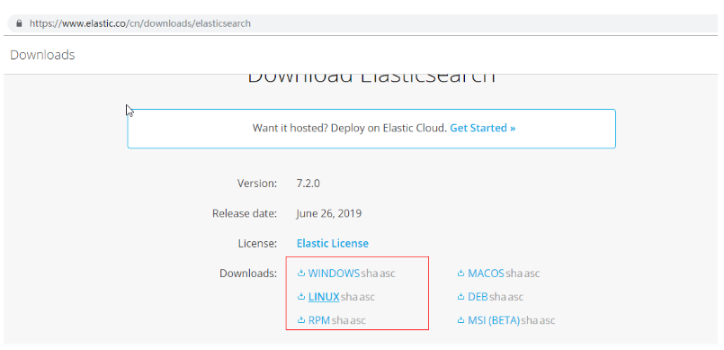
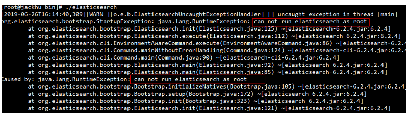
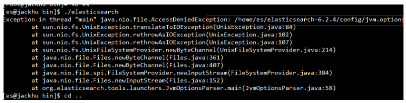
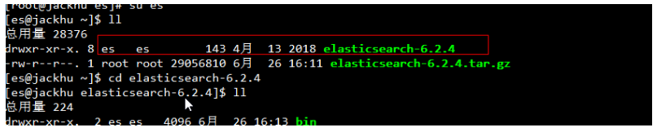
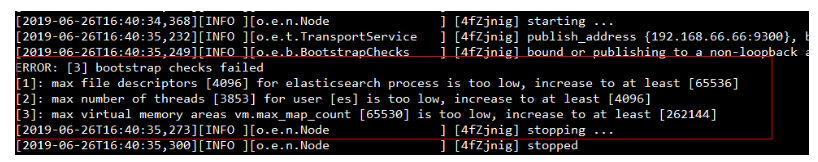
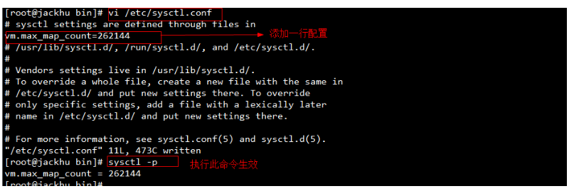
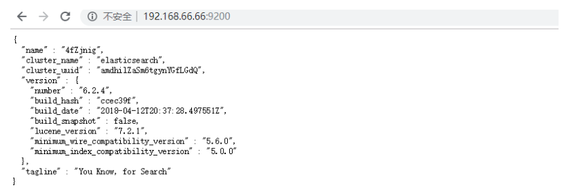
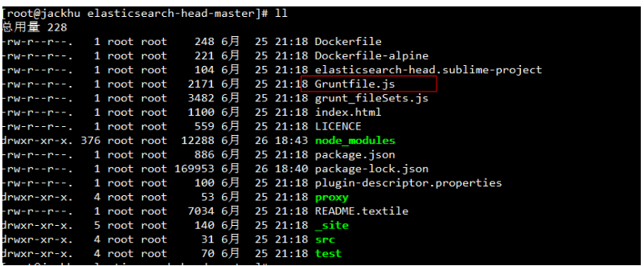
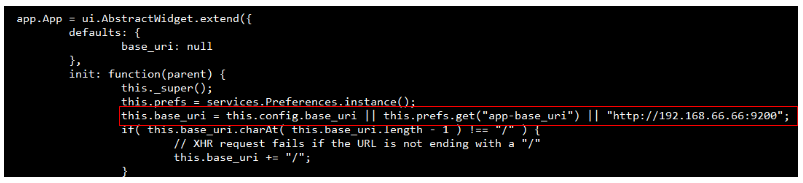

# ES基础入门

# 1. ES的基本概念

## 1. ES简介

ES=elaticsearch简写， Elasticsearch是一个开源的高扩展的分布式全文检索引擎，它可以近乎实时的存储、检索数据；本身扩展性很好，可以扩展到上百台服务器，处理PB级别的数据。 

   Elasticsearch也使用Java开发并使用Lucene作为其核心来实现所有索引和搜索的功能，但是它的目的是通过简单的RESTful API来隐藏Lucene的复杂性，从而让全文搜索变得简单

Elasticsearch 是一个分布式可扩展的实时搜索和分析引擎,一个建立在全文搜索引擎 Apache Lucene(TM) 基础上的搜索引擎.当然 Elasticsearch 并不仅仅是 Lucene 那么简单，它不仅包括了全文搜索功能，还可以进行以下工作:

- 分布式实时文件存储，并将每一个字段都编入索引，使其可以被搜索。
- 实时分析的分布式搜索引擎。
- 可以扩展到上百台服务器，处理PB级别的结构化或非结构化数据。

Elasticsearch是面向文档型数据库，一条数据在这里就是一个文档，用JSON作为文档序列化的格式，比如下面这条用户数据：

```json
 {
    "name" :     "John",
    "sex" :     "Male",
    "age" :     25,
    "birthDate": "1990/05/01",
    "about" :   "I love to go rock climbing",
    "interests": [ "sports", "music" ]
 }

```

实际项目开发实战中，几乎每个系统都会有一个搜索的功能，当数据达到很大且搜索要做到一定程度时，维护和扩展难度就会越来越高，并且在全文检索的速度上、结果内容的推荐、分析以及统计聚合方面也很难达到我们预期效果。

   这时候Elasticsearch就出现了。Elasticsearch能建立全文索引（把文本中的内容拆分成若干关键词，然后根据关键词创建索引。查询时根据关键词查询索引，最终找到包含关键词的文章），它将数据和索引分离，把索引分片，分布式的保存到不同节点，节点可以扩展到上百个，能实时检索、处理PB级别的结构化或非结构化数据。同时分片可以进行副本备份保证数据的可靠性，各分片副本协同工作也大大提高检索性能，且通过简单的RESTful API让全文搜索变得高效简单。

   近年ElasticSearch发展迅猛，已经超越了其最初的纯搜索引擎的角色，现在已经增加了数据聚合分析（aggregation）和可视化的特性，如果你有数百万的文档需要通过关键词进行定位、分析统计时，ElasticSearch肯定是最佳选择。

## 2. Lucene和ES的关系

1）Lucene只是一个API库。想要使用它，你必须使用Java来作为开发语言并将其直接集成到你的应用中，更糟糕的是，Lucene非常复杂，你需要深入了解检索的相关知识来理解它是如何工作的。

2）Elasticsearch也使用Java开发并使用Lucene作为其核心来实现所有索引和搜索的功能，但是它的目的是通过简单的RESTful API来隐藏Lucene的复杂性，从而让全文搜索变得简单。

## 3. ES的核心概念

### 1. 接近实时（NRT--Near Reatime）

近实时，从写入数据到可以被搜索到会有一些延时，大概1秒左右，基于es执行搜索和分析可以达到秒级

### 2. Cluster集群

一个集群就是由一个或多个节点组织在一起，他们，它们共同持有你整个的数据，并一起提供索引和搜索功能。一个集群有一个唯一的名字标识，这个名字默认是“elasticsearch”。
 这个名字是重要的，因为一个节点只能通过指定某个集群的名字，来加入这个集群。在产品环境中显示地设定这个名字是一个好习惯，但是使用默认值来进行测试/开发也是不错的。

### 3. Node节点

一个节点是你的集群中的一个服务器，作为集群的一部分，它存储你的数据，参与集群索引和搜索功能。和集群类似，一个节点也是有一个名字来标识的，默认情况下，这个名字是一个随机的漫威漫画角色的名字，这个名字会在启动的时候赋予节点。这个名字对于管理工作来说听重要的，因为在这个管理过程中，你会去确定网络中的哪些服务器对应于Elasticsearch集群中的哪些节点。一个节点可以通过配置集群名称的方式来加入一个指定的集群。默认情况下，每个节点都会被安排加入到一个叫做“elasticsearch”的集群中，这意味着，如果你在你的网络中启动了若干节点，并假定他们能够相互发现彼此，它们将会自动地形成并加入到一个叫做“elasticsearch”的集群中。

在一个集群里，只要你想，可以拥有任一多个节点。而且，如果当前你的网络中没有运行任何Elasticsearch节点，这时会启动一个节点，默认创建并加入到一个叫做“elasticsearch”的集群。

### 4. 分片(shards)

一个索引可以存储超出单个节点硬件限制的大量数据。比如，一个具有10亿文档的索引占据1TB烦人磁盘空间，而任一节点都没有这样大的磁盘空间；或者单个节点处理搜索请求，响应太慢。为了解决这个问题，Elasticsearch提供了将索引划分成多份的能力，这些份叫做分片。当你创建一个索引的时候，你可以指定你想要的分片数量。每个分片本身也是一个功能完善并且独立的“索引”，这个 “索引”可以被放置到集群中的任何节点上。

分片之所以重要，主要由两方面的原因：
 1）允许你水平分割/扩展你的内容容量
 2） 允许你在分片（潜在地，位于多个节点上）之上进行分布式的、并行的操作，进而提高性能/吞吐量

### 5. 复制（replicas）

- 在一个网络/云的环境里，失败随时都可能发生，在某个分片/节点不知怎么的就处于离线状态，或者由于任何原因消失了，这种情况下，有一个故障转移机制是非常有用并且是强烈推荐的。为此目的，Elasticsearch允许你创建分片的一份或多份拷贝，这些拷贝叫做复制分片，或者直接叫复制。
- 复制之所以重要，有两个原因：
   1） 在分片/节点失败的情况下，提供了高可用性。因为这个原因，注意到复制分片从不与原/主（original/primary）分片置于同一接待上是非常重要的。
   2）扩展你的搜索量/吞吐量，因为搜素可以在所有的复制上并行运行。

### 6. 索引

一个索引就是一个拥有几分相似特征的文档的集合。比如说，你可以有一个客户数据的索引，另一个产品目录的索引，还有一个订单数据的索引。一个索引有一个名字来标识（必须全部是小写字母的），并且当我们要对一个对应于这个索引的文档进行索引、搜索、更新和删除的时候，都要使用到这个名字。

索引可以类比于我们mysql中的表， 索引，存放有相似结构的文档数据。一个index中包含了很多类似或者相同的document

### 7. 类型

在一个索引中，你可以定义一种或多种类型。一个类型是你的索引的一个逻辑上的分类/分区，齐语义完全由你来定。通常，会为具有一组共同字段的文档定义一个类型。比如说，我们假设你运营一个博客平台并且将你所有的数据存储道一个索引中。在这个索引中，你可以为用户 数据定义一个类型，为博客数据定义一个类型，当然，也可以为评论数据定义另一个类型。

### 8. 文档

一个文档是一个可被索引的基础信息单元。比如，你可以拥有某一个客户的文档，某一个产品的一个文档，当然，也可以拥有某个订单的一个文档。文档以JSON（JavaScript Object Notation）格式来表示，而JSON是一个到处存在的互联网数据交互格式。

文档，es中最小的数据单元，通常用JSON数据结构表示。一个document就是一条数据

### 9. Fieldid

字段，一个document中有多个field，每个field就是一个字段。


# 2. Elasticsearch安装

## 1. 下载ES

下载网址： https://www.elastic.co/cn/downloads/elasticsearch



## 2. 安装

解压：

```
tar -xzvf elasticsearch-6.2.4.tar.gz
```

注意：把elasticsearch软件必须放入/home/es（es是新建用户）的目录下，并把elasticsearch设置为es用户所属

**创建日志、数据存储目录：（留作备用，初次先创建）**

```
 mkdir -p /data/logs/es
 mkdir -p /data/es/{data,work,plugins,scripts}
```

**创建用户**

```
 useradd es -s /bin/bash #es不能在root用户下启动，必须创建新的用户，用来启动es
```

**启动：**`./elasticsearch`



注意：es不能在root用户下启动，必须创建新的用户，用来启动es

**切换用户：** **su es**

再次启动，发现还是报错，原因：当前用户没有执行权限 



**授权：**chown -R es:es elasticsearch-6.2.4



授权成功，发现elasticsearch已经在es用户下面了，可以启动了，但是启动成功，浏览器不能访问，因此还需要做如下配置：

配置修改：


再次启动：报如下错误



1）max file descriptors [4096] for elasticsearch process is too low, increase to at least [65536]

每个进程最大同时打开文件数太小，可通过下面2个命令查看当前数量

```
 ulimit -Hn
 ulimit -Sn
```


修改/etc/security/limits.conf文件，增加配置，用户退出后重新登录生效

```
 *               soft   nofile         65536
 *               hard   nofile         65536
```


2）max number of threads [3818] for user [es] is too low, increase to at least [4096]

可通过命令查看

```
 ulimit -Hu
 ulimit -Su
```


问题同上，最大线程个数太低。修改配置文件/etc/security/limits.conf，增加配置

```
 *               soft   nproc           4096
 *               hard   nproc           4096
```

3）、max virtual memory areas vm.max_map_count [65530] is too low, increase to at least [262144]

　　修改/etc/sysctl.conf文件

```
 vi /etc/sysctl.conf
 sysctl -p #执行命令sysctl -p生效
 #增加配置vm.max_map_count=262144
```



错误解决完毕：重新启动



后台启动：

```
 ./elasticsearch -d
```


# 3. head插件安装

## 1. 插件的只要用途

elasticsearch-head是一个用来浏览、与Elastic Search簇进行交互的web前端展示插件。 elasticsearch-head是一个用来监控Elastic Search状态的客户端插件。

elasticsearch主要有以下三个主要操作—— 

1. 簇浏览，显示簇的拓扑并允许你执行索引（index)和节点层面的操作。
2. 查询接口，允许你查询簇并以原始json格式或表格的形式显示检索结果。
3. 显示簇状态，有许多快速访问的tabs用来显示簇的状态。
4. 支持Restful API接口，包含了许多选项产生感兴趣的结果，包括：
   1. 请求方式:get,put,post,delete; json请求数据，节点node， 路径path。 
   2. JSON验证器。 
   3. 定时请求的能力。 
   4. 用javascript表达式传输结果的能力。 
   5. 统计一段时间的结果或该段时间结果比对的能力。
   6. 以简单图标的形式绘制传输结果

## 2. 安装

安装步骤

```
#下载nodejs,head插件运行依赖node
 wget https://nodejs.org/dist/v9.9.0/node-v9.9.0-linux-x64.tar.xz
 #解压
 tar -xf node-v9.9.0-linux-x64.tar.xz
 #重命名
 mv node-v9.9.0-linux-x64 nodeJs
 #配置文件
 vim /etc/profile
 #刷新配置
 source /etc/profile
 #查询node版本，同时查看是否安装成功
 node -v
 #下载head插件
 wget https://github.com/mobz/elasticsearch-head/archive/master.zip
 #解压
 unzip master.zip
 #使用淘宝的镜像库进行下载，速度很快
 npm install -g cnpm --registry=https://registry.npm.taobao.org
 #进入head插件解压目录，执行安装命令
 cnpm install 
```

## 3. 运行

```
npm start #启动head插件
```

启动运行端口为：9100


访问：


此时未连接，需要配置才能连接：

**修改** **Gruntfile.js**文件：



修改如下：


**修改**_site/app.js

修改IP地址，连接elasticsearch



**启用****CORS**:

当head插件访问es时，您必须在elasticsearch中启用CORS，否则您的浏览器将拒绝跨域。

在elasticsearch配置中：

```
 http.cors.enabled: true
```

   您还必须设置，http.cors.allow-origin因为默认情况下不允许跨域。http.cors.allow-origin: "*" 是允许配置的，但由于这样配置的任何地方都可以访问，所以有安全风险。 我在集群安装的时候已经配好了、如果你刚配置、需要重启ElasticSearch服务

```
 http.cors.enabled: true  
 http.cors.allow-origin: "*"
```

访问head**插件**

