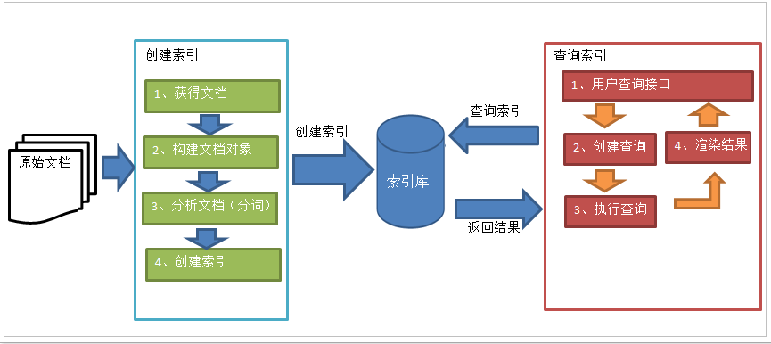

# ElasticSearch分布式搜索原理解析

# 1. 什么是ElasticSearch?

我们先来看一下百度百科的解释：

Elasticsearch是一个基于[Lucene](https://baike.baidu.com/item/Lucene/6753302)的搜索服务器。它提供了一个分布式多用户能力的全文搜索引擎，基于RESTful web接口。Elasticsearch是用Java语言开发的，并作为Apache许可条款下的开放源码发布，是一种流行的企业级搜索引擎。

我们来总结一下：

Elasticsearch是一个建立在全文搜索引擎Apache Lucene（TM）基础上的分布式可扩展的实时搜索和分析引擎，ta不仅包含全文搜索功能， 还可以进行如下的工作：

1. 分布式实时文件存储，并将每一个字段都编入索引， 使其可以被搜索
2. 实时分析的分布式搜索引擎
3. 可以扩展到上百台服务器， 处理PB级别的结构化和非结构化数据。


# 2. ElasticSearch能解决什么问题？

1. 检索数据：对于海量的应用数据， 关系型数据库检索问题一直是噩梦， ES可以说就是为了解决它而生， 有了它快速搜索不再是开发者头痛的难题
2. 分布式存储：相对于传统的存储方案， ES提供了分片， 持久化方案， 既比关系型数据库速度快， 又比缓存数据库（nosql）存储的多， 持久化更好
3. 数据分析：ES结合logstash， kibana构成大名鼎鼎的ELK， 实时大规模的日志收集， 分析和展示， 让用户可以多维度对日志实现分析， 查询和管理。

# 3. 全文检索到底是什么东西？

## 1. 什么是全文检索？

全文检索顾名思义， 就是在文档中找单词， 类似于我们通过字典查字的过程。

那既然全文文本那么多， 如何快速的找到我们想检索的单词， 或者关键字， 就是难点。

总的思想就是， 计算机程序通过扫描文章中的每个词， 对必要的词建议一个索引， 指明该次在文章中出现的次数和位置。当用户查询的时候根据建立的索引进行查找。

## 2. 全文检索场景

1. 搜索引擎
2. 站内搜索
3. 系统文件搜索

## 3. 全文检索相关技术

1. Lucene：如果使用该技术实现，需要对Lucene的API和底层原理非常了解，而且需要编写大量的Java代码。
2. Solr：使用java实现的一个web应用，可以使用rest方式的http请求，进行远程API的调用.
3. ElasticSearch(ES)：可以使用rest方式的http请求，进行远程API的调用。

## 4. Solr和ES的比较

- 当单纯的对**已有数据**进行搜索时，Solr更快。


- **当实时建立索引时**, Solr会产生io阻塞，查询性能较差, Elasticsearch具有明显的优势。‘


- **随着数据量的增加**，**Solr**的搜索效率会变得更低，而**Elasticsearch**却没有明显的变化。


- **随着数据量的增加**，**Solr**的搜索效率会变得更低，而**Elasticsearch**却没有明显的变化**。


- 大型互联网公司，实际生产环境测试，将搜索引擎从**Solr**转到**Elasticsearch**以后的平均查询速度有了**50**倍的提升。


- Elasticsearch 与Solr的比较

Solr 利用 Zookeeper 进行分布式管理，而 Elasticsearch 自身带有分布式协调管理功能;
Solr 支持更多格式的数据，而 Elasticsearch 仅支持json文件格式；
Solr 官方提供的功能更多，而 Elasticsearch 本身更注重于核心功能，高级功能多有第三方插件提供；
Solr 在传统的搜索应用中表现好于 Elasticsearch，但在处理实时搜索应用时效率明显低于 Elasticsearch。

# 4. 全文检索流程分析

## 1. 什么是索引

有人可能会说，对非结构化数据顺序扫描很慢，对结构化数据的搜索却相对较快（由于结构化数据有一定的结构可以采取一定的搜索算法加快速度），那么把我们的非结构化数据想办法弄得有一定结构不就行了吗？

这种想法很天然，却构成了全文检索的基本思路，也即将非结构化数据中的一部分信息提取出来，重新组织，使其变得有一定结构，然后对此有一定结构的数据进行搜索，从而达到搜索相对较快的目的。

这部分从非结构化数据中提取出的然后重新组织的信息，我们称之**索引**

这种说法比较抽象，举几个例子就很容易明白，比如字典，字典的拼音表和部首检字表就相当于字典的索引，对每一个字的解释是非结构化的，如果字典没有音节表和 部首检字表，在茫茫辞海中找一个字只能顺序扫描。然而字的某些信息可以提取出来进行结构化处理，比如读音，就比较结构化，分声母和韵母，分别只有几种可以 一一列举，于是将读音拿出来按一定的顺序排列，每一项读音都指向此字的详细解释的页数。我们搜索时按结构化的拼音搜到读音，然后按其指向的页数，便可找到 我们的非结构化数据——也即对字的解释


## 2. 流程总览

搜索基本的流程实现：


**全文检索的流程分为两大流程：索引创建、搜索索引**

- 索引创建：将现实世界中所有的结构化和非结构化数据提取信息，创建索引的过程。
- 搜索索引：就是得到用户的查询请求，搜索创建的索引，然后返回结果的过程。



**想搞清楚全文检索，必须要搞清楚下面三个问题：**

**1.** **索引库里面究竟存些什么？(Index)**

**2.** **如何创建索引？(Indexing)**

**3.** **如何对索引进行搜索？(Search)**

## 3. 原始内容

**原始内容是指要索引和搜索的内容**。

原始内容包括互联网上的网页、数据库中的数据、磁盘上的文件等。

## 4. 获得文档

也就是采集数据，从互联网上、数据库、文件系统中等获取需要搜索的原始信息，这个过程就是**信息采集。**

**采集数据的目的是为了将原始内容存储到****Document****对象中**。

**如何采集数据？**

1. 对于互联网上网页，可以使用工具将网页抓取到本地生成html文件。

2. 数据库中的数据，可以直接连接数据库读取表中的数据。

3. 文件系统中的某个文件，可以通过I/O操作读取文件的内容。

在Internet上采集信息的软件通常称为爬虫或蜘蛛，也称为网络机器人，爬虫访问互联网上的每一个网页，将获取到的网页内容存储起来。

## 5. 创建文档

**创建文档的目的是统一数据格式（**Document**），方便文档分析。**


   **说明：**

1. 一个Document文档中包括多个域（Field），域（Field）中存储内容。

2. 这里我们可以将数据库中一条记录当成一个Document，一列当成一个Field

## 6. 分析文档（重点）

   **分析文档主要是对**Field**域进行分析，分析文档的目的是为了索引。**


   **说明：**分析文档主要通过**分词组件（**Tokenizer**）**和**语言处理组件（**Linguistic Processor**）**完成

### 1. 分词组件

**分词组件工作流程（此过程称之为**Tokenize**）**

1. 将Field域中的内容进行分词（不同语言有不同的分词规则）

2. 去除标点符号。

3. 去除停用词（stop word）。

**经过分词（**Tokenize）之后得到的结果成为`词元（Token）`。

所谓停词(Stop word)就是一种语言中最普通的一些单词，由于没有特别的意义，因而大多数情况下不能成为搜索的关键词，因而创建索引时，这种词会被去掉而减少索引的大小。
英语中停词(Stop word)如：“the”,“a”，“this”等。
对于每一种语言的分词组件(Tokenizer)，都有一个停词(stop word)集合。
示例(Document1的Field域和Document2的Field域是同名的)： 

- Document1的Field域： 

```
 Students should be allowed to go out with their   friends, but not allowed to drink beer.   
```

- Document2的Field域：

```
 My friend Jerry went to school to see his students but   found them drunk which is not allowed. 
```

- 在我们的例子中，便得到以下**词元**(Token)：

```
 “Students”，“allowed”，“go”，“their”，“friends”，“allowed”，“drink”，“beer”，“My”，“friend”，“Jerry”，“went”，“school”，“see”，“his”，“students”，“found”，“them”，“drunk”，“allowed”。 
```

将得到的词元(Token)传给语言处理组件(Linguistic Processor)

### 2. 语言处理组件

将得到的词元(Token)传给语言处理组件(Linguistic Processor)

对于英语，语言处理组件(Linguistic Processor)一般做以下几点：
1.	变为小写(Lowercase)。
2.	将单词缩减为词根形式，如“cars”到“car”等。这种操作称为：stemming。
3.	将单词转变为词根形式，如“drove”到“drive”等。这种操作称为：lemmatization。
语言处理组件(linguistic processor)的结果称为词(Term)。Term是索引库的最小单位。

- 在我们的例子中，经过语言处理，得到的词**(Term)**如下：

```
 “student”，“allow”，“go”，“their”，“friend”，“allow”，“drink”，“beer”，“my”，“friend”，“jerry”，“go”，“school”，“see”，“his”，“student”，“find”，“them”，“drink”，“allow”。
```

也正是因为有语言处理的步骤，才能使搜索drove，而drive也能被搜索出来。 

## 7. 索引文档

### 1. 索引库创建

**索引的目的是为了搜索**。


说明：将得到的词(Term)传给索引组件(Indexer)，索引组件(Indexer)主要做以下几件事情：

### 2. 创建Term字典

在我们的例子中字典如下：

| **Term** | **Document ID** |
| -------- | --------------- |
| Student  | 1               |
| Allow    | 1               |
| Go       | 1               |
| Their    | 1               |
| Friend   | 1               |
| Allow    | 1               |
| Drink    | 1               |
| Beer     | 1               |
| My       | 2               |
| Friend   | 2               |
| Jerry    | 2               |
| Go       | 2               |
| School   | 2               |
| See      | 2               |
| His      | 2               |
| Student  | 2               |
| Find     | 2               |
| Them     | 2               |
| Drink    | 2               |
| Allow    | 2               |

### 3. 排序Term字典

对字典按字母顺序进行排序

| **Term** | **Document ID** |
| -------- | --------------- |
| Allow    | 1               |
| Allow    | 1               |
| Allow    | 2               |
| Beer     | 1               |
| Drink    | 1               |
| Drink    | 2               |
| Find     | 2               |
| Friend   | 1               |
| Friend   | 2               |
| Go       | 1               |
| Go       | 2               |
| His      | 2               |
| Jerry    | 2               |
| My       | 2               |
| School   | 2               |
| See      | 2               |
| Student  | 1               |
| Student  | 2               |
| Their    | 1               |
| Them     | 2               |

### 4. 合并Term字典

合并相同的词(Term)成为文档倒排(Posting List)链表


在此表中，有几个定义：

- **Document Frequency** 即文档频次，表示总共有多少文件包含此词(Term)。

- **Frequency** 即词频率，表示此文件中包含了几个此词(Term)。

到此为止，索引已经创建好了。
最终的索引结构是一种倒排索引结构也叫反向索引结构，包括索引和文档两部分，索引即词汇表，它的规模较小，而文档集合较大。
倒排索引结构是根据内容（词汇）找文档，如下图： 


## 8. 创建索引流程

分词及检索的详细的流程：


   **一次索引，多次使用。**

## 9. 查询索引流程

### 1. 查询语句


### 2. 执行搜索

第一步：对查询语句进行词法分析、语法分析及语言处理。
1、词法分析
如上述例子中，经过词法分析，得到单词有lucene，learned，hadoop, 关键字有AND, NOT。
注意：关键字必须大写，否则就作为普通单词处理。


2、语法分析
如果发现查询语句不满足语法规则，则会报错。如lucene NOT AND learned，则会出错。
如上述例子，lucene AND learned NOT hadoop形成的语法树如下：


3、语言处理
如learned变成learn等。
经过第二步，我们得到一棵经过语言处理的语法树。


**第二步：搜索索引，得到符号语法树的文档。**

1、 首先，在反向索引表中，分别找出包含lucene，learn，hadoop的文档链表。 

2、 其次，对包含lucene，learn的链表进行合并操作，得到既包含lucene又包含learn的文档链表。


3、 然后，将此链表与hadoop的文档链表进行差操作，去除包含hadoop的文档，从而得到既包含lucene又包含learn而且不包含hadoop的文档链表。


4、 此文档链表就是我们要找的文档。


**第三步：根据得到的文档和查询语句的相关性，对结果进行排序。**

   相关度自然打分（权重越高分越高）：

​      tf越高、权重越高

​      df越高、权重越低

   人为影响分数：

​      设置Boost值（**加权值**）


## 10. Lucene相关度排序

### 1. 什么是相关度排序

相关度排序是查询结果按照与查询关键字的相关性进行排序，越相关的越靠前。比如搜索“Lucene”关键字，与该关键字最相关的文章应该排在前边。


### 2. 相关度打分

Lucene对查询关键字和索引文档的相关度进行打分，得分高的就排在前边。
如何打分呢？Lucene是在用户进行检索时实时根据搜索的关键字计算出来的，分两步：
1.	计算出词（Term）的权重
2.	根据词的权重值，计算文档相关度得分。
什么是词的权重？
通过索引部分的学习，明确索引的最小单位是一个Term(索引词典中的一个词)。搜索也是从索引域中查询Term，再根据Term找到文档。Term对文档的重要性称为权重，影响Term权重有两个因素：
- Term Frequency (tf)：
  指此Term在此文档中出现了多少次。tf 越大说明越重要。 
  词(Term)在文档中出现的次数越多，说明此词(Term)对该文档越重要，如“Lucene”这个词，在文档中出现的次数很多，说明该文档主要就是讲Lucene技术的。
- Document Frequency (df)：
  指有多少文档包含此Term。df 越大说明越不重要。 
  比如，在一篇英语文档中，this出现的次数更多，就说明越重要吗？不是的，有越多的文档包含此词(Term), 说明此词(Term)太普通，不足以区分这些文档，因而重要性越低。

## 11. Lucene的Field域

### 1. Field属性

Field是文档中的域，包括Field名和Field值两部分，一个文档可以包括多个Field，Document只是Field的一个承载体，Field值即为要索引的内容，也是要搜索的内容。

- 是否分词(tokenized)
  - 是：作分词处理，即将Field值进行分词，分词的目的是为了索引。
    比如：商品名称、商品描述等，这些内容用户要输入关键字搜索，由于搜索的内容格式大、内容多需要分词后将语汇单元建立索引

  - 否：不作分词处理
    比如：商品id、订单号、身份证号等 

    

- 是否索引(indexed)

  - 是：进行索引。将Field分词后的词或整个Field值进行索引，存储到索引域，索引的目的是为了搜索。
    比如：商品名称、商品描述分析后进行索引，订单号、身份证号不用分词但也要索引，这些将来都要作为查询条件。
  - 否：不索引。
    比如：图片路径、文件路径等，不用作为查询条件的不用索引

- 是否存储(stored)

  - 是：将Field值存储在文档域中，存储在文档域中的Field才可以从Document中获取。
    比如：商品名称、订单号，凡是将来要从Document中获取的Field都要存储。
  - 否：不存储Field值
    比如：商品描述，内容较大不用存储。如果要向用户展示商品描述可以从系统的关系数据库中获取。

### 2. Field常用类型

下边列出了开发中常用 的Filed类型，注意Field的属性，根据需求选择：

| **Field**类                                                  | **数据类型**           | **Analyzed** **是否分词** | **Indexed** **是否索引** | **Stored** **是否存储** | **说明**                                                     |
| ------------------------------------------------------------ | ---------------------- | ------------------------- | ------------------------ | ----------------------- | ------------------------------------------------------------ |
| StringField(FieldName,  FieldValue,Store.YES))               | 字符串                 | N                         | Y                        | Y或N                    | 这个Field用来构建一个字符串Field，但是不会进行分词，会将整个串存储在索引中，比如(订单号,身份证号等) 是否存储在文档中用Store.YES或Store.NO决定 |
| LongField(FieldName,  FieldValue,Store.YES)                  | Long型                 | Y                         | Y                        | Y或N                    | 这个Field用来构建一个Long数字型Field，进行分词和索引，比如(价格) 是否存储在文档中用Store.YES或Store.NO决定 |
| StoredField(FieldName,  FieldValue)                          | 重载方法，支持多种类型 | N                         | N                        | Y                       | 这个Field用来构建不同类型Field 不分析，不索引，但要Field存储在文档中 |
| TextField(FieldName,  FieldValue, Store.NO) 或 TextField(FieldName, reader) | 字符串 或 流           | Y                         | Y                        | Y或N                    | 如果是一个Reader, lucene猜测内容比较多,会采用Unstored的策略. |

### 3. Field设计

**Field****域如何设计，取决于需求，比如搜索条件有哪些？显示结果有哪些？**

- 商品id：

是否分词：不用分词，因为不会根据商品id来搜索商品

是否索引：不索引，因为不需要根据商品ID进行搜索

是否存储：要存储，因为查询结果页面需要使用id这个值。

- 商品名称：

是否分词：要分词，因为要根据商品名称的关键词搜索。

是否索引：要索引。

是否存储：要存储。

- 商品价格：

是否分词：要分词，lucene对数字型的值只要有搜索需求的都要分词和索引，因为lucene对数字型的内容要特殊分词处理，需要分词和索引。

是否索引：要索引

是否存储：要存储

- 商品图片地址：

是否分词：不分词

是否索引：不索引

是否存储：要存储

- 商品描述：

是否分词：要分词

是否索引：要索引

是否存储：因为商品描述内容量大，不在查询结果页面直接显示，不存储。

**常见问题：**

   不存储是指不在lucene的索引域中记录，目的是为了节省lucene的索引文件空间。

**如果要在详情页面显示描述，解决方案：**

从lucene中取出商品的id，根据商品的id查询关系数据库（MySQL）中item表得到描述信息。