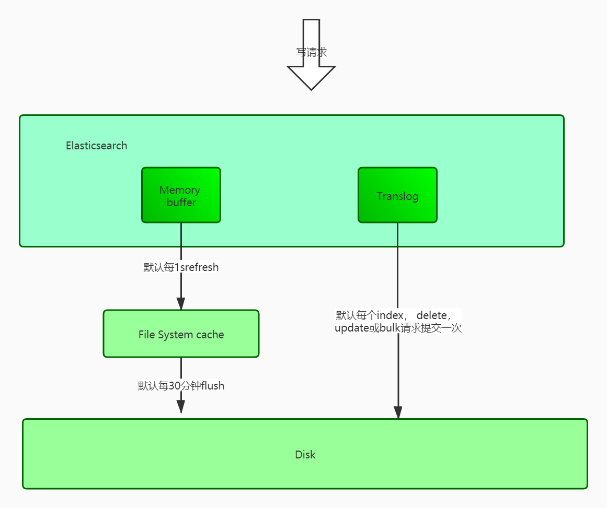
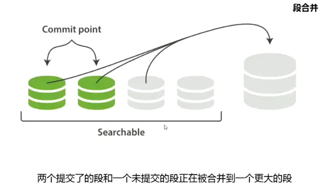

# EleasticSearch核心原理

# 1. ES集群核心原理

## 1. 索引分片

### 1. 分片存储

ES集群中有多个节点（node），其中有一个为主节点，这个主节点是可以通过选举产生的，主从节点是对于集群内部来说的。

ES的一个概念就是去中心化，字面上理解就是无中心节点，这是对于集群外部来说的，因为从外部来看， ES集群，在逻辑上是个整体，你与任何一个节点的通信和与整个ES集群通信是等价的。

ES集群是一个或多个节点的集合，它们共同存储了整个数据集，并提供了联合索引以及可跨所有节点的搜索能力。多节点组成的集群拥有冗余能力，它可以在一个或几个节点出现故障时保证服务的整体可用性。

集群靠其独有的名称进行标识，默认名称为“elasticsearch”。节点靠其集群名称来决定加入哪个ES集群，一个节点只能属一个集群。


### 2. 分片复制

一个索引可以存储超出单个结点硬件限制的大量数据。比如，一个具有10亿文档的索引占据1TB的磁盘空间，而任一节点可能没有这样大的磁盘空间来存储或者单个节点处理搜索请求，响应会太慢。为了解决这个问题，Elasticsearch提供了将索引划分成多片的能力，这些片叫做分片。

ES的“分片(shard)”机制可将一个索引内部的数据分布地存储于多个节点，它通过将一个索引切分为多个底层物理的Lucene索引完成索引数据的分割存储功能，这每一个物理的Lucene索引称为一个分片(shard)。分片分布到不同的节点上。构成分布式搜索。

每个分片其内部都是一个全功能且独立的索引，因此可由集群中的任何主机存储。

创建索引时，用户可指定其分片的数量，默认数量为5个。分片的数量只能在索引创建前指定，并且索
引创建后不能更改。Shard有两种类型：primary和replica，即主shard及副本shard。

#### 1）primary shard

用于文档存储，每个新的索引会自动创建5个Primary shard，当然此数量可在索引创建之前通过配置自
行定义，不过，一旦创建完成，其Primary shard的数量将不可更改。

#### 2）Replica shard

是Primary Shard的副本，用于冗余数据及提高搜索性能。 每个Primary shard默认配置了一个Replica
shard，但也可以配置多个，且其数量可动态更改。ES会根据需要自动增加或减少这些Replica shard的
数量。副本的作用一是提高系统的容错性，当个某个节点某个分片损坏或丢失时可以从副本中恢复。二
是提高es的查询效率，es会自动对搜索请求进行负载均衡

## 2. 负载均衡

ES的负载均衡是如何实现的

1. 每个索引被分成了5个分片
2. 每个分片有一个副本
3. 5个分片基本均匀分布在datanode节点上

如果其中一个datanode节点故障， 剩余的分片将会重新进行均衡分配

## 3. 索引存储

### 1. 存储原理

#### 1. 不可以变性

倒排索引被写入磁盘后是 不可改变 的:它永远不会修改。 不变性有重要的价值：
一旦索引被读入内核的文件系统缓存，便会留在哪里，由于其不变性。只要文件系统缓存中还有足够的空间，那么大部分读请求会直接请求内存，而不会命中磁盘。这提供了很大的性能提升。

其它缓存(像filter缓存)，在索引的生命周期内始终有效。它们不需要在每次数据改变时被重建，因为数据不会变化。

当然，一个不变的索引也有不好的地方。因为倒排索引被写入磁盘后是不可变的，而后会在使用时读入文件系统缓存，加快查询速度。如果你想修改一个Doc，那就必须重建整个待排索引。这要么对一个索引所能包含的数据量造成了很大的限制，要么对索引可被更新的频率造成了很大的限制。

解决方案：
ES解决不变形和更新索引的方式是使用多个索引，利用新增的索引来反映修改，在查询时从旧的到新的
依次查询，最后来一个结果合并。这就是段产生的由来

#### 2. 存储结构

ES底层是基于Lucene，最核心的概念就是Segment(段)，每个段本身就是一个倒排索引。 ES中的Index
由多个段的集合和 commit point (提交点)文件组成。

提交点文件中有一个列表存放着所有已知的段


### 2. 存储流程

当一个写请求发送到 es 后，es 将数据写入 memory buffer 中，并添加事务日志（ translog ）。如果每次一条数据写入内存后立即写到硬盘文件上，由于写入的数据肯定是离散的，因此写入硬盘的操作也就是随机写入了。硬盘随机写入的效率相当低，会严重降低es的性能。

因此 es 在设计时在 memory buffer 和硬盘间加入了 Linux 的页面高速缓存（ File system cache ）来提高 es 的写效率。当写请求发送到 es 后，es 将数据暂时写入 memory buffer 中，此时写入的数据还不能被查询到。默认设置下，es 每1秒钟将 memory buffer 中的数据 refresh 到 Linux 的 File system cache ，并清
空 memory buffer ，此时写入的数据就可以被查询到了。





但 File system cache 依然是内存数据，一旦断电，则 File system cache 中的数据全部丢失。默认设置下，es 每30分钟调用 fsync 将 File system cache 中的数据 flush 到硬盘。因此需要通过translog 来保证即使因为断电 File system cache 数据丢失，es 重启后也能通过日志回放找回丢失的数据。

translog 默认设置下，每一个 index 、 delete 、 update 或 bulk 请求都会直接 fsync 写入硬盘。为了保证 translog 不丢失数据，在每一次请求之后执行 fsync 确实会带来一些性能问题。对于一些允许丢失几秒钟数据的场景下，可以通过设置 index.translog.durability 和index.translog.sync_interval 参数让 translog 每隔一段时间才调用 fsync 将事务日志数据写入硬盘。


### 3. DOC操作

#### 1. doc新增

Doc会先被搜集到内存中的Buffer内，这个时候还无法被搜索到，每隔一段时间，会将buffer提交，在flush磁盘后打开新段使得搜索可见，详细过程如下：  


```
1）创建一个新段（segment），作为一个追加的倒排索引，写入到磁盘（文件系统缓存）
2）将新的包含新段的Commit Point(提交点)写入磁盘（文件系统缓存）
3）磁盘进行fsync，主要是将文件系统缓存中等待的写入操作全部物理写入到磁盘，保证数据不会在发生错误时丢失
4）这个新的段被开启， 使得段内文档对搜索可见
5）将内存中buffer清除，又可以把新的Doc写入buffer了
```

通过这种方式，可以使得新文档从被索引到可被搜索间的时间间隔在数分钟，但是还不够快。因为磁盘需要 fsync ，这个就成为性能瓶颈。我们前面提到过Doc会先被从buffer刷入段写入文件系统缓存（很快），那么就自然想到在这个阶段就让文档对搜索可见，随后再被刷入磁盘（较慢）  


#### 2. refresh

Lucene支持对新段写入和打开-可以使文档在没有完全刷入硬盘的状态下就能对搜索可见，而且是一个开销较小的操作，可以频繁进行。
这种对新段的巧妙操作过程被称为refresh，默认执行的时间间隔是1秒，这就是ES被称为近实时搜索的原因。

可以使用refreshAPI进行手动操作，但一般不建议这么做。还可以通过合理设置refresh_interval在近实时搜索和索引速度间做权衡

#### 3. doc删除（修改）

删除一个ES文档不会立即从磁盘上移除，它只是被标记成已删除。因为段是不可变的，所以文档既不能从旧的段中移除，旧的段也不能更新以反映文档最新的版本。 ES的做法是，每一个提交点包括一个.del文件（还包括新段），包含了段上已经被标记为删除状态的文档。所以，当一个文档被做删除操作，实际上只在.del文件中将该文档标记为删除，依然会在查询时被匹配到，只不过在最终返回结果之前会被从结果中删除。ES将会在用户之后添加更多索引的时候，在后台进行要删除内容的清理。

而且每秒自动刷新创建新的段，用不了多久段的数量就爆炸了，每个段消费大量文件句柄，内存，cpu资源。更重要的是，每次搜索请求都需要依次检查每个段。段越多，查询越慢。

ES通过后台合并段解决这个问题。ES利用段合并的时机来真正从文件系统删除那些version较老或者是被标记为删除的文档。被删除的文档（或者是version较老的）不会再被合并到新的更大的段中。

ES对一个不断有数据写入的索引处理流程如下：
索引过程中，refresh会不断创建新的段，并打开它们。 合并过程会在后台选择一些小的段合并成大的段，这个过程不会中断索引和搜索。



段合并之前，旧有的Commit和没Commit的小段皆可被搜索。
段合并后的操作:
新的段flush到硬盘
编写一个包含新段的新提交点，并排除旧的较小段。
新的段打开供搜索
旧的段被删除
合并完成后新的段可被搜索，旧的段被删除


## 4. 集群选举

### 1. 涉及配置参数

1. 如果同时启动， 按照nodeId进行排序， 取出最小的做为master节点

2. 如果不是同时启动， 则先启动的候选master节点， 会竞选为master节点

```
# 如果`node.master`设置为了false，则该节点没资格参与`master`选举。
node.master = true
# 默认3秒，最好增加这个参数值，避免网络慢或者拥塞，确保集群启动稳定性
discovery.zen.ping_timeout: 3s
# 用于控制选举行为发生的集群最小master节点数量，防止脑裂现象
discovery.zen.minimum_master_nodes : 2
# 新节点加入集群的等待时间
discovery.zen.join_timeout : 10s
```

### 2. 新节点加入

节点完成选举后， 新节点加入， 会发送join request 到master节点。默认会重试20次。

### 3. 宏机再次选举

如果宏机， 集群node会再次进行ping过程， 并选择一个新的master。

一旦一个节点被明确设为一个客户端节点（node.client设置为true）， 则不能在成为主节点（node.master会自动设为false）。


## 5. 节点类型

```
#配置文件中给出了三种配置高性能集群拓扑结构的模式,如下：
#1. 如果你想让节点从不选举为主节点,只用来存储数据,可作为负载器
node.master: false
node.data: true
#2. 如果想让节点成为主节点,且不存储任何数据,并保有空闲资源,可作为协调器
node.master: true
node.data: false
#3. 如果想让节点既不称为主节点,又不成为数据节点,那么可将他作为搜索器,从节点中获取数据,生
成搜索结果等
node.master: false
node.data: false
```

1. master主节点
   Master : 主节点
   Node.master : true (才可以参与主节点竞选，作为主节点候选节点)
2. 数据节点
   Datanode:数据节点
   Node.data : true 默认就是true,默认就是数据节点
3. 协调节点
   Coordingnate node : 协调节点
   如果节点仅仅只作为协调节点，必须将上面2个配置全部设置为false.

**注意：**
一个节点可以充当一个或多个角色。默认 3个角色都有。
协调节点：负责接受请求，转发请求（把请求路由到各个分片节点）  

## 6. 数据恢复

数据恢复的基本概念：  

```
- 代表数据恢复或叫数据重新分布，es在有节点加入或退出时会根据机器的负载对索引分片进行重新分
配，挂掉的节点重新启动时也会进行数据恢复。
- GET /_cat/health?v #可以看到集群状态
```

分片之所以重要，主要有两方面的原因：

- 允许你水平分割/扩展你的内容容量
- 允许你在分片（位于多个节点上）之上进行分布式的、并行的操作，进而提高性能/吞吐量 至于一
  个分片怎样分布，它的文档怎样聚合回搜索请求，是完全由Elasticsearch管理的，对于作为用户的
  你来说，这些都是透明的  

```
在一个网络/云的环境里，失败随时都可能发生。在某个分片/节点因为某些原因处于离线状态或者消失的
情况下，故障转移机制是非常有用且强烈推荐的。为此， Elasticsearch允许你创建分片的一份或多
份拷贝，这些拷贝叫做复制分片，或者直接叫复制
```

复制之所以重要，有两个主要原因：

- 在分片/节点失败的情况下，复制提供了高可用性。复制分片不与原/主要分片置于同一节点上是非常重要的。因为搜索可以在所有的复制上并行运行，复制可以扩展你的搜索量/吞吐量
- 总之，每个索引可以被分成多个分片。一个索引也可以被复制0次（即没有复制） 或多次。一旦复制了，每个索引就有了主分片（作为复制源的分片）和复制分片（主分片的拷贝）。
- 分片和复制的数量可以在索引创建的时候指定。在索引创建之后，你可以在任何时候动态地改变复制的数量，但是你不能再改变分片的数量。
- 5.X默认5:1 5个主分片，1个复制分片  

```
默认情况下，Elasticsearch中的每个索引分配5个主分片和1个复制。这意味着，如果你的集群中至少有两个节点，你的索引将会有5个主分片和另外5个复制分片（1个完全拷贝），这样每个索引总共就有10个分片。
```

总结：

```
ES集群可由多个节点组成，各Shard分布式地存储于这些节点上。
ES可自动在节点间按需要移动shard，例如增加节点或节点故障时。简而言之，分片实现了集群的分布式存储，而副本实现了其分布式处理及冗余功能。
```


## 7. 故障探查

ES有两种集群故障探查机制：

1. 通过master进行的，master会ping集群中所有的其他node，确保它们是否是存活着的。
2. 每个node都会去ping master来确保master是存活的，否则会发起一个选举过程。 

有下面三个参数用来配置集群故障的探查过程：  

```
ping_interval : 每隔多长时间会ping一次node，默认是1s
ping_timeout : 每次ping的timeout等待时长是多长时间，默认是30s
ping_retries : 如果一个node被ping多少次都失败了，就会认为node故障，默认是3次
```


# 2. 脑裂问题

## 1. 什么是脑裂？

由于部分节点网络断开，集群分成两部分，且这两部分都有master选举权。就成形成一个与原集群一样名字的集群，这种情况称为集群脑裂（split-brain）现象。这个问题非常危险，因为两个新形成的集群会同时索引和修改集群的数据。  

## 2. 解决方案

```
# 决定选举一个master最少需要多少master候选节点。默认是1。
# 这个参数必须大于等于为集群中master候选节点的quorum数量，也就是大多数。
# quorum算法：master候选节点数量 / 2 + 1
# 例如一个有3个节点的集群，minimum_master_nodes 应该被设置成 3/2 + 1 = 2（向下取整）
discovery.zen.minimum_master_nodes:2
# 等待ping响应的超时时间,默认值是3秒。如果网络缓慢或拥塞，会造成集群重新选举，建议略微调
大这个值。
# 这个参数不仅仅适应更高的网络延迟，也适用于在一个由于超负荷而响应缓慢的节点的情况。
discovery.zen.ping.timeout:10s
# 当集群中没有活动的Master节点后，该设置指定了哪些操作（read、write）需要被拒绝（即阻塞
执行）。有两个设置值：all和write，默认为wirte。
discovery.zen.no_master_block : write
```

### 3. 场景分析

一个生产环境的es集群，至少要有3个节点，同时将discovery.zen.minimum_master_nodes设置为2，那么这个是参数是如何避免脑裂问题的产生的呢？  

比如我们有3个节点，quorum是2。现在网络故障，1个节点在一个网络区域，另外2个节点在另外一个网络区域，不同的网络区域内无法通信。这个时候有两种情况情况：

> （1）如果master是单独的那个节点，另外2个节点是master候选节点，那么此时那个单独的master节点因为没有指定数量的候选master node在自己当前所在的集群内，因此就会取消当前master的角色，尝试重新选举，但是无法选举成功。然后另外一个网络区域内的node因为无法连接到master，就会发起重新选举，因为有两个master候选节点，满足了quorum，因此可以成功选举出一个master。此时集群中就会还是只有一个master。
> （2）如果master和另外一个node在一个网络区域内，然后一个node单独在一个网络区域内。那么此时那个单独的node因为连接不上master，会尝试发起选举，但是因为master候选节点数量不到quorum，因此无法选举出master。而另外一个网络区域内，原先的那个master还会继续工作。这也可以保证集群内只有一个master节点。  

综上所述， 通过elasticsearch.yml中配置discovery.zen.minimum_master_nodes: 2 就可以避免脑裂问题的发生。

但是因为ES集群是可以动态增加和下线节点的，所以可能随时会改变 quorum 。所以这个参数也是可以通过api随时修改的，特别是在节点上线和下线的时候，需要作出对应的修改。而且一旦修改过后，这个配置就会持久化保存下来

```
PUT /_cluster/settings { "persistent" : {
"discovery.zen.minimum_master_nodes" : 2 } }
```


# 3. 集群路由

## 1. 文档路由

1. document路由到shard分片上，就叫做文档路由 ,如何路由？
2. 路由算法
   算法公式：shard = hash(routing)%number_of_primary_shards
   例子：
   一个索引index ,有3个primary shard : p0,p1,p2
   增删改查 一个document文档时候，都会传递一个参数 routing number, 默认就是document文档 _id,(也可以手动指定)
   Routing = _id，假设： _id = 1
   算法：
   Hash(1) = 21 % 3 = 0 表示 请求被 路由到 p0分片上面。
3. 自定义路由
   请求：
   PUT /index/item/id?routing = _id （默认）
   PUT /index/item/id?routing = user_id（自定义路由）---- 指定把某些值固定路由到某个分片上面。
4. primary shard不可变原因
   即使加服务器也不能改变主分片的数量  

## 2. 增删改原理

（1）客户端选择一个node发送请求过去，这个node就是coordinating node（协调节点）
（2）coordinating node，对document进行路由，将请求转发给对应的node（有primary shard）
（3）实际的node上的primary shard处理请求，然后将数据同步到replica node
（4）coordinating node，如果发现primary node和所有replica node都搞定之后，就返回响应结果给客户端  


# 4. 实战几个问题

## 1. 我们需要多大规模的集群网络？

考虑因素：
1、当前数据量多少？
2、后期数据增量如何？
3、服务器配置如何？ CPU,内存，多大硬盘？
推算：
你的公司
服务器： 内存：32 G
ES JVM head 最大可以设置： 32 G
数据处理规模：
32G head ： 10T ms
结论：
一个服务器有一个分片，占用内存 30G ,处理数据量 10T
例如：
服务器内存： 128 G ----- 可以运行多个es 分片
场景：
数据量几千万级，数十亿级 ： 2 – 4 台服务器。  

## 2. 索引应该设置多少个分片？

注意：分片数量一旦设置，就不可更改 （primary shard）
思考：
分片对应的存储实体是什么？
存储实体是索引
分片是不是越多越好？
不是
分片多有什么影响？
分片多了，浪费存储空间，占用资源，影响性能
1、多个分片竞争 服务器资源 （CPU,IO，内存），性能逐渐下降。
2、极限分片： 每一个服务器一个分片
分片规则：
ES 推荐 JVM最大设置： 32 G Head
分片最大容量：30G
例如：
如果你的数据达到 200G, 设置 7 – 8 个分片
得出分片设置公式：
Node*（1.5~3）== 分片数量
3 * 3 = 9 (最多设置9个分片[primary shard])  


## 3. 分片应该设置多少个副本？

注意：节点主分片数量一旦设置不可更改，但是副本分片可以随时更改。
思考：
副本分片用途：
备份，让数据库达到高可用，不至于数据丢失。
一般情况：
1-2个即可。
集群规模没有变化，副本分片过多？
浪费资源，占用资源，影响性能。
副本分片设置原则：
一般情况系，设置2个副本分片即可。  