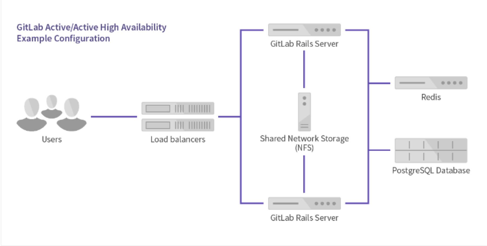

# gitlab迁移文档

说明： 原来使用的gitlab使用的是单机的版本， 现在要迁移到阿里云， 并使用高可用的gitlab集群配置， gitlab集群目前支持redis的主从模式或者redis的setinel模式，数据库使用外置的postgresql

## 1. 服务器申请

服务器1： ip1 BJPVGITLAB-1

服务器2： ip2 BJPVGITLAB-3

服务器3： ip3 BJPVGITLAB-2

服务器4： ip4 BJPVPGSQL-1

redis sentinel服务器：

​	sentinel:10.231.1.1:6452,10.231.1.2:6451,10.231.1.3:6451

​	master_name：sentinel-10.231.12.208-6388

​	密码： 请咨询凌晶同学

申请阿里云服务nfs服务：

## 2. 使用docker 部署gitlab

### 1. 配置docker所需要的环境部署：

```shell
#yum 安装所需要的包
yum install -y policycoreutils-python
#下载安装docker所需要的中间件
wget http://mirror.centos.org/centos/7/extras/x86_64/Packages/container-selinux-2.107-3.el7.noarch.rpm
rpm -ivh container-selinux-2.107-3.el7.noarch.rpm
#下载docker
curl -sSL https://get.daocloud.io/docker | sh
```

### 2. 启动docker服务

```shell
systemctl start docker
chkconfig docker on
有加速器的同学，记得配置docker的加速器
```

### 3. 拉取gilab镜像

```shell
docker pull docker.io/gitlab/gitlab-ce
#查看本机镜像
docker images
```

### 4. 挂在nfs服务

```shell
#安装所需的依赖， 否则挂载磁盘的时候报错
yum install -y nfs-utils
# 挂载阿里云nfs到/mnt
sudo mount -t nfs -o vers=4,minorversion=0,noresvport xxxx-xxxx.nas.aliyuncs.com:/ /mnt
```

### 5. 构建容器

```shell
#首先创建所需要的目录
mkdir -p /mnt/gitlab/config17
mkdir -p /mnt/gitlab/data
mkdir -p /mnt/gitlab/logs17
# 构建容器， --volume 第一个参数是宿主机的位置，  第二个参数是虚拟主机的参数，Z是selinux的要求，不加会报错
docker run --detach \
  --hostname ip2 \
  --publish 443:443 --publish 80:80 --publish 2222:22 \
  --name gitlab \
  --restart always \
  --volume /mnt/gitlab/config17:/etc/gitlab:Z \
  --volume /mnt/gitlab/logs17:/var/log/gitlab:Z \
  --volume /mnt/gitlab/data:/var/opt/gitlab:Z \
  gitlab/gitlab-ce:latest
```

## 3. 修改gitlab的配置文件

```shell
vim /etc/gitlab/gitlab.rc
#指定访问的url
external_url 'http://ip2'
# Prevent GitLab from starting if NFS data mounts are not available
high_availability['mountpoint'] = '/var/opt/gitlab'
#使用外置的postgresql数据库
gitlab_rails['db_adapter'] = "postgresql"
gitlab_rails['db_encoding'] = "utf8"
gitlab_rails['db_database'] = "gitlabhq_production"
gitlab_rails['db_pool'] = 30
gitlab_rails['db_username'] = "gitlab"
gitlab_rails['db_password'] = "xxxxxx"
gitlab_rails['db_host'] = "ip4"
gitlab_rails['db_port'] = 5432
# 使用外置的redis sentinel
gitlab_rails['redis_sentinels'] = [
	{'host' => '10.231.1.1', 'port' => 6452},
	{'host' => '10.231.1.2', 'port' => 6451},
	{'host' => '10.231.1.3', 'port' => 6451},
]
# 注意这里master_name 一定要配置， 否和报错
redis['master_name'] = 'sentinel-10.231.12.208-6388'
redis['master_password'] = 'xxxxxxx'
gitlab_rails['redis_database'] = 0
postgresql['enable'] = false
redis['enable'] = false
logrotate['enable'] = true
redis_exporter['enable'] = false
postgres_exporter['enable'] = false
prometheus_monitoring['enable'] = false
```

## 4. 安装postgresql数据库

yum安装postgresql96， 参考官网的连接https://www.postgresql.org/download/linux/redhat/

```shell
yum install https://download.postgresql.org/pub/repos/yum/reporpms/EL-7-x86_64/pgdg-redhat-repo-latest.noarch.rpm
yum install -y postgresql96
yum install postgresql96-server
yum install postgresql96-contrib
# 如果初始化报错，先删除/var/lib/pgsql/9.6/下的所有
/usr/pgsql-9.6/bin/postgresql96-setup initdb
systemctl enable postgresql-9.6
systemctl start postgresql-9.6
```

## 5. 创建用户和授权

```shell
sudo -i -u postgres
psql #回车
create user gitlab with password '123$%^789' superuser;
create database gitlabhq_production OWNER gitlab;
GRANT ALL PRIVILEGES ON DATABASE gitlabhq_production TO gitlab;
CREATE EXTENSION pg_trgm;
\q
```

## 6. gialab初始化postgresql数据库

```shell
docker ps
#找到gitlab正在运行的容器id
docker exec -it 5f3350b2c32e /bin/bash
#初始化gitlab, 构建表结构什么的，可能需要配合DISABLE_DATABASE_ENVIRONMENT_CHECK=1参数
gitlab-rake gitlab:setup
# 查看配置是否ok，如果数据库ok了 可以直接执行gitlab-rake gitlab:setup，来创建数据库的表。
gitlab-rake gitlab:check 
```

如果初始化成功， 会出现下面root的提示： 

## 7. 重启服务

```shell
#####后面几个gitlab-ctl 常用命令,这次配置用不到
#配置服务
gitlab-ctl reconfigure;

#重启服务
gitlab-ctl restart;

#查看启动情况
gitlab-ctl tail 
```

## 8. 更改root密码

直接登陆http://ip2 在页面就直接提示更改root的密码了，

如果忘记了root的密码， 可以通过下面的方法进行更改密码：

```shell
# 进入容器中
docker exec -it 5f3350b2c32e /bin/bash
# 在容器中执行
gitlab-rails console production


在irb(main):001:0> 后面通过 u=User.where(id:1).first 来查找与切换账号（User.all 可以查看所有用户）
通过u.password='12345678'设置密码为12345678(这里的密码看自己喜欢)
通过u.password_confirmation='12345678' 再次确认密码
通过 u.save!进行保存（切记切记 后面的 !）
如果看到上面截图中的true ，恭喜你已经成功了，执行 exit 退出当前设置流程即可。
```

## 9. gitlab application 备机配置

### 启动命令变更

登录ip1，重复上面的第 2,3两个步骤，其中2.5处的命令改为

```shell
#首先创建所需要的目录
mkdir -p /mnt/gitlab/config16
mkdir -p /mnt/gitlab/data
mkdir -p /mnt/gitlab/logs16
# 构建容器， --volume 第一个参数是宿主机的位置，  第二个参数是虚拟主机的参数
docker run --detach \
  --hostname ip1 \
  --publish 443:443 --publish 80:80 --publish 2222:22 \
  --name gitlab \
  --restart always \
  --volume /mnt/gitlab/config16:/etc/gitlab:Z \
  --volume /mnt/gitlab/logs16:/var/log/gitlab:Z \
  --volume /mnt/gitlab/data:/var/opt/gitlab:Z \
  gitlab/gitlab-ce:latest
```

### 配置文件变更

配置文件/etc/gitlab/gitlab.rb中需要修改

```
external_url 'http://ip1'
# Disable components that will not be on the GitLab application server
roles ['application_role']
nginx['enable'] = true
```

### 增加额外的配置

在执行第 7 步，gitlab-ctl reconfigure 之前，必须进行如下的操作 在ip2 的/etc/gitlab/gitlab-secrets.json 找到gitlab_shell['secret_token']，gitlab_rails['otp_key_base'] gitlab_rails['secret_key_base']，gitlab_rails['db_key_base'] 四个值，复制到ip1的/etc/gitlab/gitlab-secrets.json 文件中，然后再执行 gitlab-ctl reconfigure 在 ip1执行 touch /etc/gitlab/skip-auto-reconfigure 这样，只能在ip2上才能做migration的操作 最后，执行 gitlab-ctl reconfigure

## 10. 高可用模式

企业版



社区版


什么是DRBD

它是分布式复制块设备，软件实现的无需共享可以在服务器之间镜像块设备的存储复制解决方案。


左侧为A节点，右侧为B节点

DRBD运行在内核里，它是一个内核模块。Linux2.6.33开始已经整合进内核。上图A为活动节点，B为被动节点。A收到数据发往内核的数据通路，DRBD在数据通路中注册钩子检查数据，当发现接收到的数据是发往自己管理的存储位置时，就复制一份，一份存储到本地的DRBD存储设备上，一份就发给TCP/IP协议栈，通过网卡传输到B节点的TCP/IP协议栈，B节点运行的DRBD模块同样在数据通路上坚持，发现有数据过来就存储到DRBD对应的位置上。如果A节点宕机，B节点上线，B节点接收到数据存储到本地，当A节点恢复以后在把变动数据同步到A节点上。

流程如下：

- *SERVICE将数据写入 FIEL SYSEM->BUFFER CACHE->DRDB*
- *DRDB兵分两路一路通过磁盘DISK DRIVER写入磁盘*
- *另外一路通过TCP/IP将数据通过网卡发送到对端DRBD节点*

工作模式：

- 同步模式：当写入A服务器和B服务器成功后才返回。这是DRBD协议的C模式。生产环境中该模式最常用。
- 异步模式：写入A服务器后返回，还有可能是写入本地服务器和远端服务器的缓存成功后返回，这属于DRBD的A、B级别。

*DRBD建立在底层设备之上，对于用户来说一个DRBD设备就像一块物理磁盘。它支持磁盘、软RAID、LVM等其他块设备。*