# gravitee服务网关的探索之路

# 1. gravitee网关对比

在水平分层架构中， 最长用到的就是网关服务， 技术选型有很多

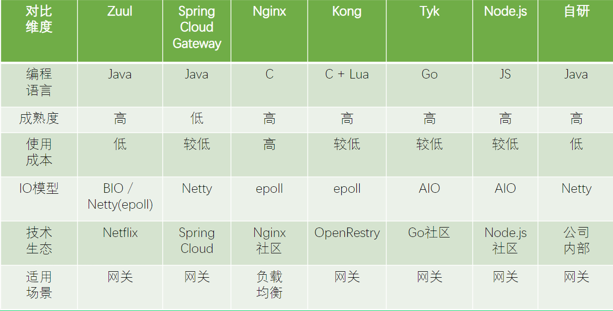

一看kong是基于nginx和lua开发的，心里一喜，效率必定牛逼，再看git的star数量也ok，就知道kong肯定不错，为啥我没选，现在的应用都非常讲究可视化，可视化操作非常重要，但是kong的可视化还是差点事，而且我们公司也不要求极致效率，也不是为了对外卖我们的api，再加上对lua的心虚，好吧我最后还是暴露了。

再说zuul，springcloud家族的东西好不好，好，易用性，文档都不错，可是您那些组件之间绑定的也太死了，我得引入euraka，还有hystrics，关键团队没有熟悉这个的，我倒是研究过，可是没人跟我一起玩啊。

 再然后就看到了gravitee，技术纯java，这个我喜欢，页面逼格一流，纯鼠标操作，正适合我们，终于tm啰嗦完了，可以进入技术的天地，oh my love。

目前公司使用的网关就是gravitee, 所以自己也直接研究一下， 方便大家扫盲。

# 2. 安装gravitee

## 1. 下载zip包

首先去官网下载zip包，当然也可以git下载，用ide打包，链接： https://gravitee.io/

 下载下来之后解压完了共有三个文件夹

​       1.服务网关本身

​       2.服务网关管理web

​       3.服务网关ui，跟2前后端分离

​       还需要准备什么？当然是数据库了，一个是Mongo，一个是elasticsearch。Mongo用来存储，elasticsearch用来分析，数据库的好处不再多说，去网上查查就可以。

## 2. 安装elasticsearch

一定要保证你有jdk1.8+

### 1. 修改系统参数

 言归正传，首先是调整最大句柄数，

​     vi /etc/security/limits.conf，

​     在文件末尾添加

```
     * soft nofile 65536
     * hard nofile 65536
```

修改软件打开文件数目 vi /etc/security/limits.d/90-nproc.conf ，把里面的1024改成32768

```
echo never > /sys/kernel/mm/transparent_hugepage/enabled
echo never > /sys/kernel/mm/transparent_hugepage/defrag
```

### 2. 安装elasticsearch

vi /etc/yum.repos.d /elasticsearch.repo ，添加如下文字

```
 [elasticsearch-5.x]
     name=Elasticsearch repository for 5.x packages
     baseurl=https://artifacts.elastic.co/packages/5.x/yum
     gpgcheck=1
     gpgkey=https://artifacts.elastic.co/GPG-KEY-elasticsearch
     enabled=1
     autorefresh=1

     type=rpm-md
```

​     这个是yum源，gravitee.io推荐5+,其实最新的已经的6+版本了，但是我还是用了5，为啥，稳稳的。

​     然后yum install -y elasticsearch , 

​     看到了好多箭头，有点头晕

​     然后vi /etc/elasticsearch/elasticsearch.yml 加入以下内容

```
bootstrap.memory_lock: false
bootstrap.system_call_filter: false
network.bind_host: 0.0.0.0  #很重要，外部能访问就靠它了
network.publish_host: 你自己的ip
http.port: 你自己的端口 #修改了安全系数高一点
```

​     在启动文件中加入你的JAVA_HOME="/usr/local/jdk1.8"

​     vi /etc/init.d/elasticsearch

​     service elasticsearch start

​     tail -100f /var/log/elasticsearch/elasticsearch.log 看着点就行了


# 3. 安装gravitee

## 1. 安装gateway

   去官网上下载最新的zip包，然后放到自己的linux上熟悉的目录，我放在了/usr/local下，然后

​    unzip 包名

​    出来三个文件夹。

​    我们先配置gateway，进入config文件夹，首先映入眼帘的是三个文件，ehcache，gravitee.yml，和logback，我们只需要关注gravitee.yml，

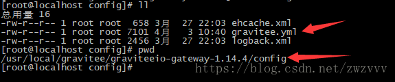

 vi gravitee.yml

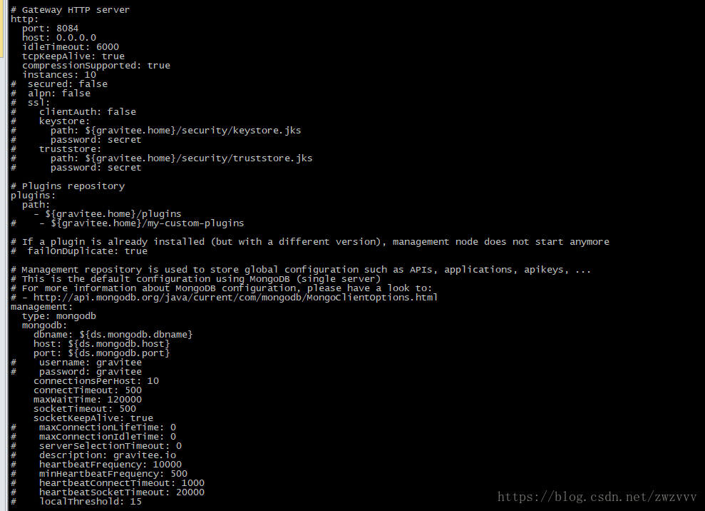

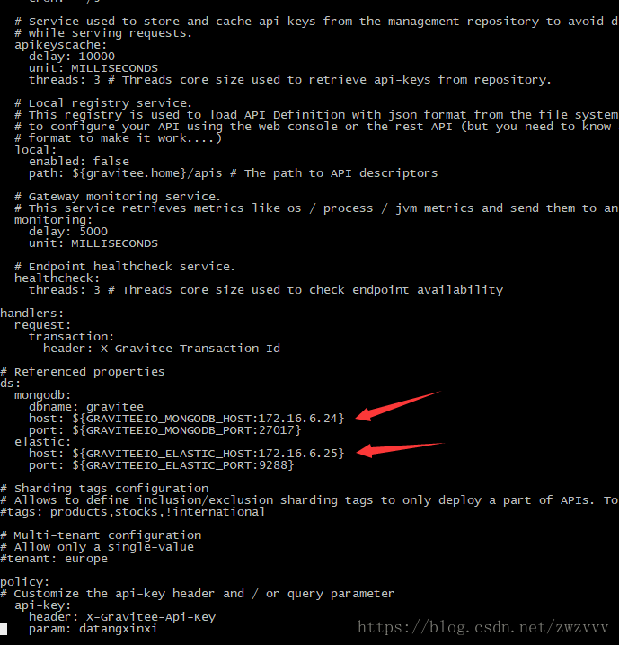

关键就是两个红色箭头的位置，把mongo和elasticsearch配置好，其它的都是调优和加额外的功能。

 http部分是配置apiway的server，也比较常见，他们用的是vertx，tm国外人就是跟国内不一样，确实敢用。

 改完了之后进入bin目录 cd ../bin

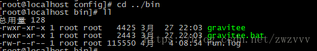


 ```
nohup sh gravitee> run.log &
 ```

看着日志就行了，然后ctr+z切出去就好了

 jps发现多了一个Bootstrap

 好了，gateway搞定 


## 2. 安装graviteeio-management-api

直接配置yml文件

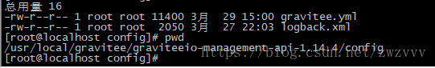

vi gravitee.yml

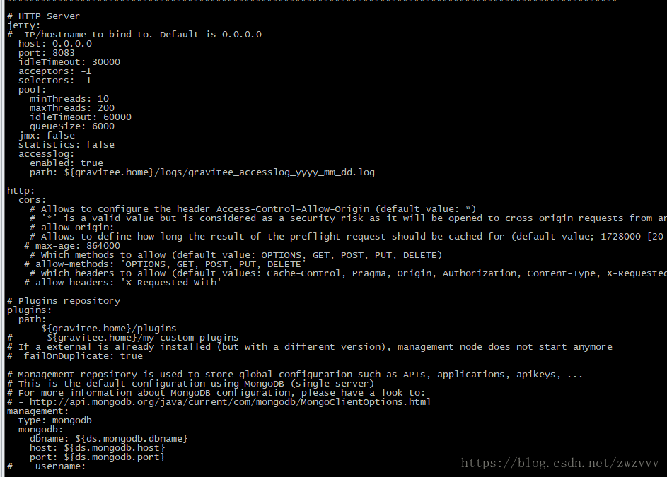

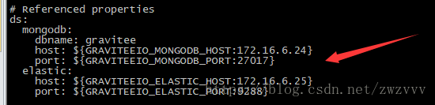

基本都不用动，把host改成自己的主机ip，一共有两个server，一个jetty的0.0.0.0；一个是services的localhost，都要改。

 把server和数据库配置好

 老规矩，说到这句话我突然想到了韩顺平老师，进入bin目录，nohup sh gravitee > run.log &启动起来

 jps又多了一个Bootstrap


# 4. 配置服务

## 1. 配置gravitee-ui

  官网上有三种，用apache，Nginx还有Python，第一感觉就是Nginx，性能没得说，而且我也用python试了，在虚拟机那叫一个慢。

​    yum install nginx，就安装好了

​    然后cd /etc/nginx/

​    别的都不用配置，直接去修改conf.d文件夹下的default文件

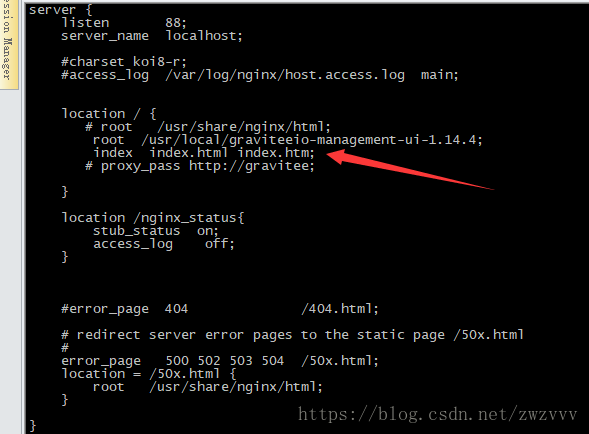

把root根目录配置成自己的ui目录，然后

​      service nginx start

​      进入ui目录

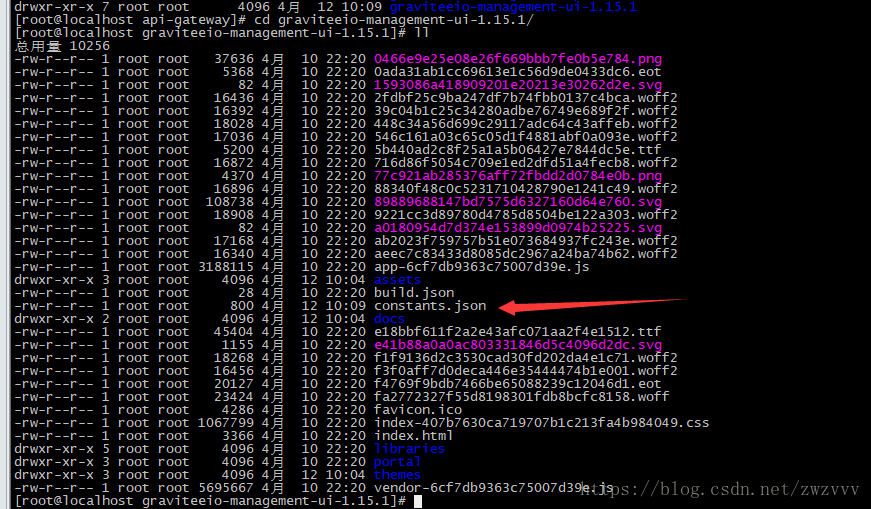

修改里面的constants.json文件

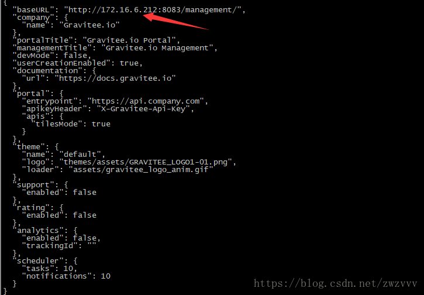

把里面的localhost改成自己的主机ip

访问自己的nginx，就可以看到如下页面了

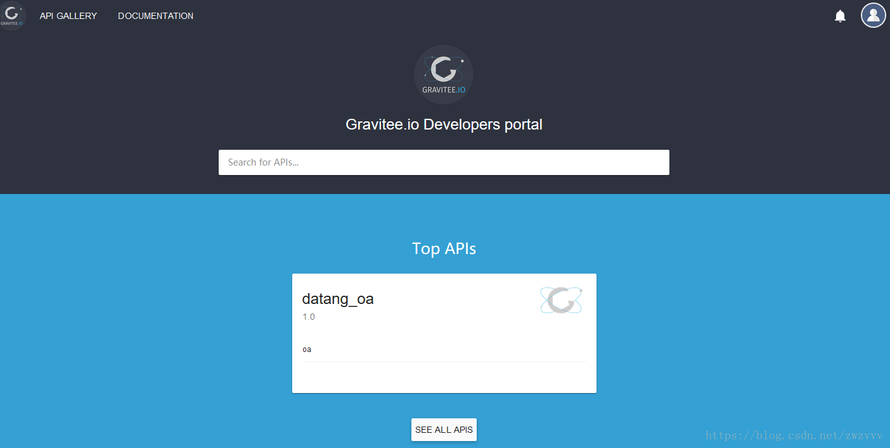


## 2. 配置服务网关

终于到了鼠标流了，要说这东西做的真不赖，考虑的都很全面，适合现代企业，一旦搭起来后面就点点点就行了。

​    首先我们先用admin和admin登陆，进入Administration

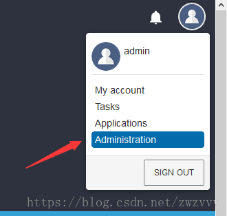

   然后开始设置自己的第一个api

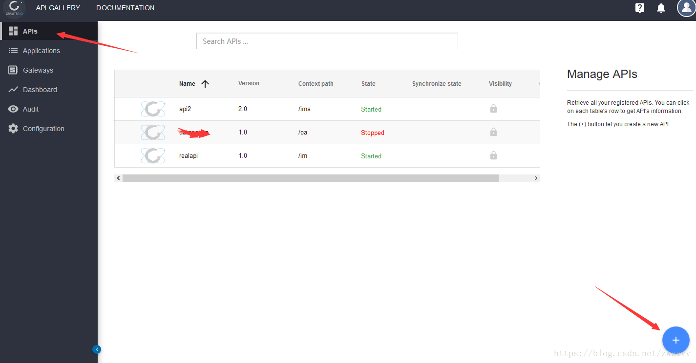

看见了没，还支持swagger，你妹的，多贴心啊。

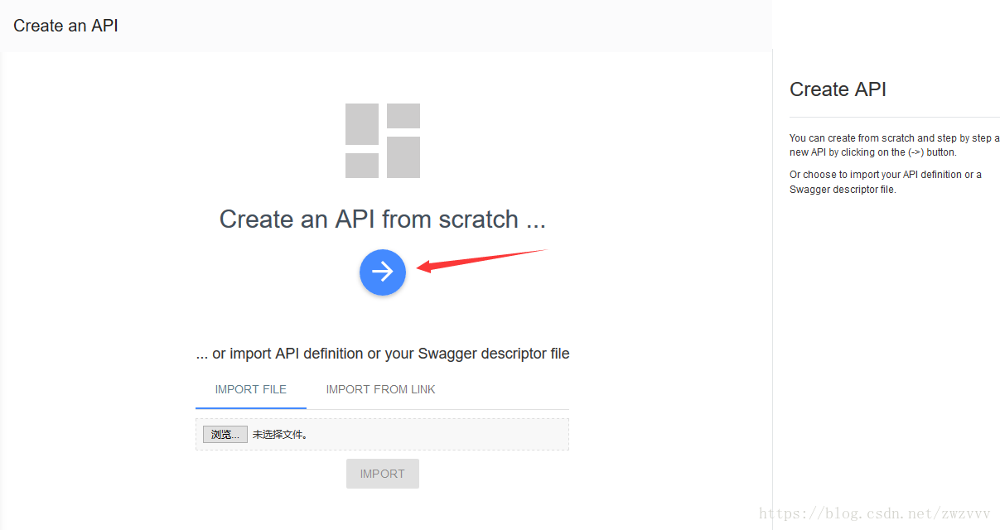

直接下一步，

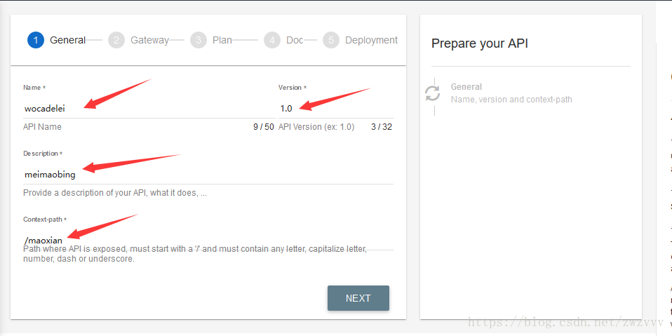

主要是Context-path，就是你的api对外的根路径，然后配置后端，我用我们的oa配置了一下。

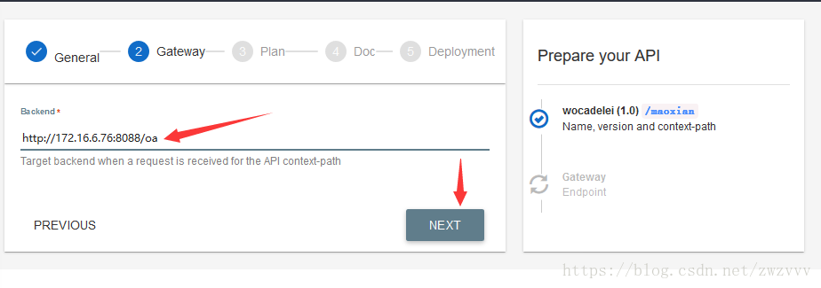

把加密方式选成apikey，然后下面可以配置限速，根据你服务器的压测结果来呗

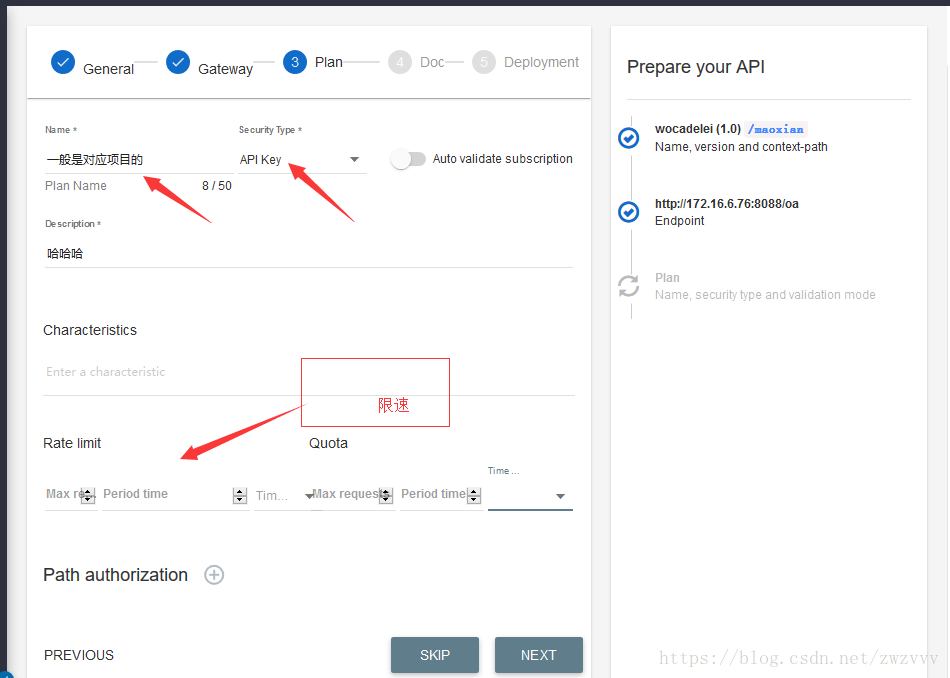

这里可以上传相关的文档，我直接skip了

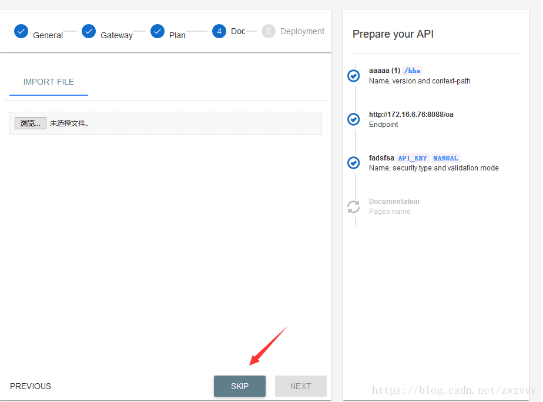

下一步就是发布plan了，其实plan的概念就相当于你自己api的载体，它包装了api的访问和发布，直接创建加发布

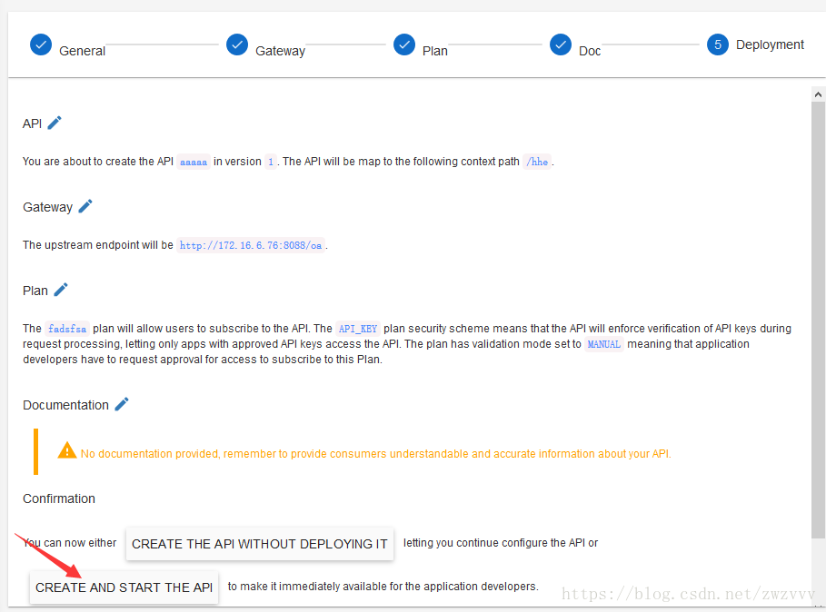

点击自己的api

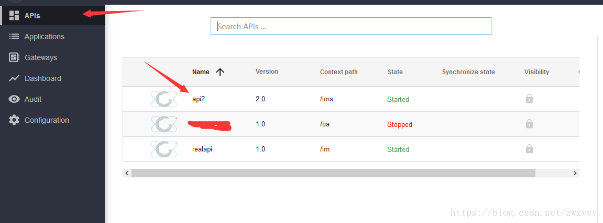

就可以看到各种东西了，从现在开始，就可以自由的玩耍了

 哦，还忘了说application的概念，其实就是一个调用方，谁使用api，也就是我们的客户，默认有一个default的api，你可以创建自己的，就当管理客户。用application消费一下api，就给一个apikey，这个东西就是钥匙，给客户，让客户加到http请求的header里面，才能访问我们的api。

点击自己的api然后点击一下钥匙一样的按钮，开始创建消费端

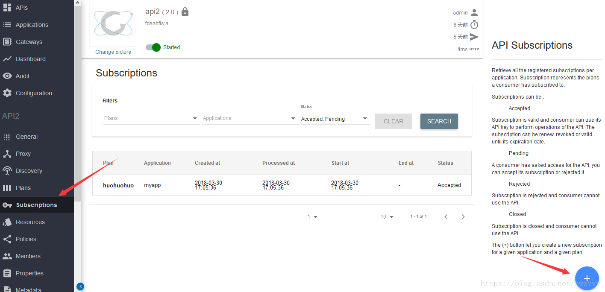

然后选择application，和plan，创建

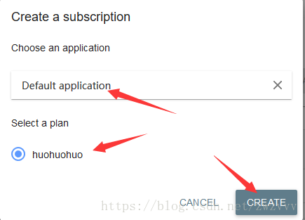

然后就看到了自己的apikey，拿着那个key就能访问了

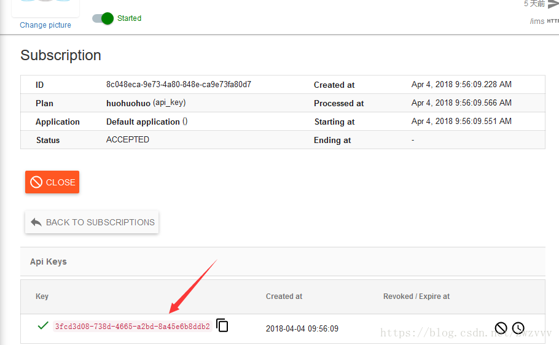

curl -H "X-Gravitee-Api-Key: 063b3863-88bf-4119-8f15-ac89c5ae1b7c" http://172.16.6.212:8082/ims

给一个栗子，后面的路径就是apigateway的路径，端口我们配置的是8082，也就是代理端的路径