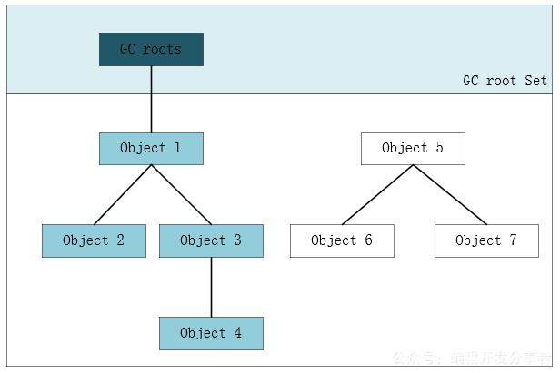

# GC垃圾回收

# 1. GC回收哪些内存区域呢？

- 堆内存
  - 对象
  - 数组
- 方法区
  - 垃圾回收性价比比较低， 一般不回收
  - 废弃常量
  - 无用的类（需要同时满足以下三个条件）
    - 该类所有的额实例都已经被回收， 也就是java堆中不存在该类的任何实例
    - 加载该类的ClassLoader已经被回收
    - 该类对应的java.lang.Class对象在任何地方没有被引用， 也无法通过反射访问该类方法。

# 2. GC是如何判断垃圾对象的？

## 1. 引用计数法

给对象的对象头中添加一个counter引用计数器，当该对象被引用时，counter+1，当不被引用时， counter-1

当对象的counter为0时，则说明该对象不可用，也就是垃圾对象。

缺点:容易引起对象之间的互相循环引用，造成死锁状态。

## 2. 可发性分析算法

通过GC Roots的对象为起点，向下搜索，能到达的对象为不可回收对象，不能到达的对象为需要回收的对象。Java中就是通过可达性分析算法来判定对象是否存活的。

## 3. 对象引用

 无论是通过引用计数算法判断对象的引用数量，还是通过根搜索算法判断对象的引用链是否可达，判定对象是否存活都与“引用”有关。

​    在JDK1.2之前，Java中的引用的定义很传统：**如果reference类型的数据中存储的数值代表的是另外一块内存的起始地址，就称这块内存代表着一个引用。**这种定义很纯粹，但是太过狭隘，一个对象在这种定义下只有被引用或者没有被引用两种状态。我们希望能描述这样一类对象：当内存空间还足够时，则能保留在内存之中；如果

   在JDK1.2之后，Java对引用的概念进行了扩充，将引用分为强引用（Strong Reference）、软引用（Soft Reference）、弱引用（Weak Reference）、虚引用（Phantom Reference）,这四种引用强度依次逐渐减弱。

- ***\*强引用\****就是指在程序代码之中普遍存在，类似“Object obj = new Object()”这类的引用，***\*只要强引用还存在，垃圾收集器永远不会回收掉被引用的对象。\****
- ***\*软引用\****用来描述一些还有用，但并非必需的对象。**对于软引用关联着的对象，在系统将要发生内存溢出异常之前，将会把这些对象列进回收范围之中并进行第二次回收。如果这次回收还是没有足够的内存，才会抛出内存溢出异常。**在JDK1.2之后提供了SoftReference类来实现软引用。
- **弱引用**也是用来描述非必需对象的，但是它的强度比软引用更弱一些，***\*被弱引用关联的对象只能生存到下一次垃圾收集发生之前。当垃圾收集器工作时，无论当前内存是否足够，都会回收掉只被弱引用关联的的对象。\****在JDK1.2之后提供了WeakReference类来实现弱引用。
- **虚引用（幽灵引用、幻影引用）**，他是最弱的一种引用关系。***\*一个对象是否有虚引用的存在，完全不会对其生存时间构成影响，也无法通过虚引用来取得一个对象实例。\****为一个对象***\*设置虚引用关联的唯一目的就是希望能\**\**在这个对象被收集器回收时收到一个系统通知\****。在JDK1.2之后，提供了PhantomReference类来实现虚引用。

## 4. 回收过程

第一次标记:使用可达性分析算法分析之后，判断对象不可达。

 第二次标记:finalize()方法(上诉或者对象自我救赎的唯一方式)。该方法会被垃圾回收器去调 用，并且只会被调用一次。所以可以在finalize方法中，重新建立可达性关联，那么就完成了自我 救赎。否则被第二次标记。

# 3. 垃圾对象时怎么被回收的呢？

## 1. 复制回收算法

使用复制算法的垃圾回收步骤:

1. 当Eden区发生垃圾回收之后，会将Eden区和Survivor其中的一块区域中的对象，复制到另一块 Survivor区域

2. 然后将将Eden区和Survivor其中的一块区域中的对象完全清理掉。

缺点:内存分配时会浪费新生代的10%的空间。

## 2. 标记清除算法

最基本的算法，主要分为标记和清除2个阶段。首先标记出所有需要回收的对象，在标记完成后统一回收掉所有被标记的对象

缺点:

1. 效率不高。
2. 产生空间碎片。会产生大量不连续的内存碎片，会导致大对象可能无法分配，提前触发GC 

## 3. 标记整理算法

老年代没有人担保，不能用复制回收算法。可以用标记-整理算法，标记过程仍然与“标记-清除”算法一样，然后让所有存活的对象都向一端移动，然后直接清理掉端边界以外的内存

## 4. 分代回收算法

当前商业虚拟机都是采用这种算法。根据对象的存活周期的不同将内存划分为几块。

- 新生代，每次垃圾回收都有大量对象失去，选择复制算法。
- 老年代，对象存活率高，无人进行分配担保，就必须采用标记清除或者标记整理算法

## 5. 内存分配担保

在JVM的内存分配时，也有这样的**内存分配担保机制**。就是当在新生代无法分配内存的时候，把新生代的对象转移到老生代，然后把新对象放入腾空的新生代。

# 4. GC方式有哪些？

minorGC

新生代的垃圾回收，很快就回收了，新生代回收的频率高

MajorGC

老年代的垃圾回收 比minorGC慢10倍

fullGC

整个JVM的垃圾回收。 整个堆(minorGC和majorGC)和方法区的垃圾回收。

- system.gc()

- 老年代不够用

- 方法区不够用

- 当新生代的对象无法被老年代担保成功时

