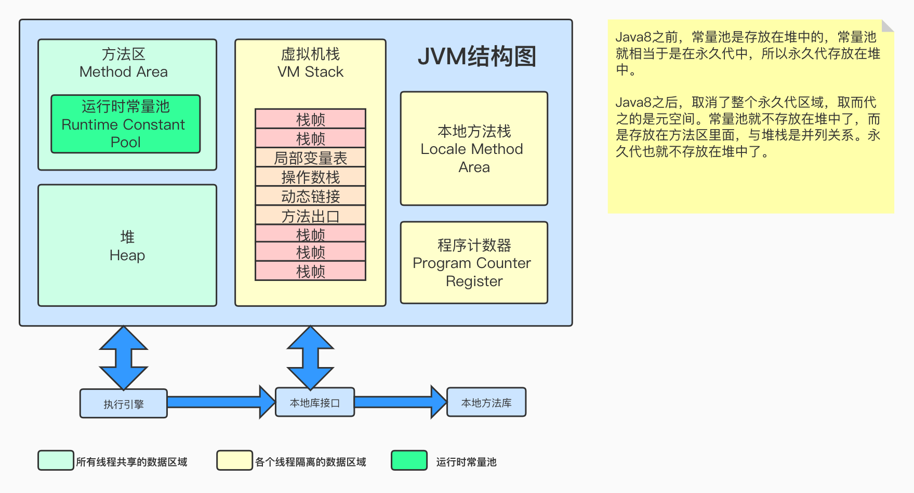

# 1. 类加载机制

## 1. 类加载器

不同类加载器对象，如果对同一个类进行加载，会形成不同的Class对象。


- 启动类加载器（Bootstrap ClassLoader）:
  - 负责加载JAVA_HOME/lib/目录中的
  - 或通过-Xbootclasspath参数指定路劲中
  - 且被虚拟机认可（按文件名识别， 如rt.jar）的类
  - 由C++实现， 不是ClassLoader子类
- 扩展类加载器（Extension ClassLoader)：
  - 负责加载JAVA_HOME/lib目录中的
  - 或通过java.ext.dirs系统变量指定路劲中的类库
- 应用程序类加载器（Application ClassLoader）:
  - 负责加载用户路劲（classpath）上的类库

JVM的类加载是通过ClassLoader及其子类来完成的， 类的层次关系和加载顺序可以由下图来描述

1. 按照顺序检查类是否已经加载
   1. Custom ClassLoader
   2. App ClassLoader
   3. Extension ClassLoader
   4. Bootstrap ClassLoader
2. 按照顺序尝试加载类
   1. load JRE/lib/rt.jar或者-Xbootclasspath选项指定的jar包
   2. load JRE/lib/ext\*.jar或-Djava.ext.dirs指定目录下的jar包
   3. load CLASSPATH或-Djava.class.path所指定的目录下的类的jar包
   4. 通过java.lang.ClassLoader的子类自定义加载class

加载过程中会先检查类是否被已加载，检查顺序是自底向上，从Custom ClassLoader到BootStrap ClassLoader逐层检查，只要某个classloader已加载就视为已加载此类，保证此类只所有ClassLoader 加载一次。而加载的顺序是自顶向下，也就是由上层来逐层尝试加载此类。


## 2. 自定义类加载器

**自定义类加载器步骤**

(1)继承ClassLoader

(2)重写findClass()方法 

(3)调用defineClass()方法


实践

下面写一个自定义类加载器:指定类加载路径在D盘下的lib文件夹下。

 (1)在本地磁盘新建一个 Test.java 类，代码如下:

```java
package jvm.classloader;
public class Test {
    public void say(){
        System.out.println("Hello MyClassLoader");
} }
```

(2) 使用 `javac -d . Test.java` 命令，将生成的 Test.class文件放到 D:/lib/jvm/classloader文件夹下。

(3) 在Eclipse中自定义类加载器，代码如下:

```java
package jvm.classloader;
import java.io.ByteArrayOutputStream;
import java.io.File;
import java.io.FileInputStream;
import java.io.FileNotFoundException;
import java.io.IOException;
import java.io.InputStream;
public class MyClassLoader extends ClassLoader{
    private String classpath;
    public MyClassLoader(String classpath) {
        this.classpath = classpath;
    }
		@Override
    protected Class<?> findClass(String name) throws ClassNotFoundException{
        try {
            byte [] classDate=getData(name);
            if(classDate==null){}
            else{
								//defineClass方法将字节码转化为类
								return defineClass(name，classDate，0，classDate.length); }
        } catch (IOException e) {
            e.printStackTrace();
				}
        return super.findClass(name);
    }
  	//返回类的字节码
		private byte[] getData(String className) throws IOException{
        InputStream in = null;
        ByteArrayOutputStream out = null;
        String path=classpath + File.separatorChar + className.replace('.'，File.separatorChar)+".class";
        try {
            in=new FileInputStream(path);
            out=new ByteArrayOutputStream();
            byte[] buffer=new byte[2048];
            int len=0;
            while((len=in.read(buffer))!=-1){
								out.write(buffer，0，len); 
            }
            return out.toByteArray();
        }
        catch (FileNotFoundException e) {
            e.printStackTrace();
        } finally{
						in.close();
            out.close();
        }
        return null;
    }
}
 
```

测试代码如下:

```java
package jvm.classloader;
import java.lang.reflect.Method;
public class TestMyClassLoader {
		public static void main(String []args) throws Exception{ 
    	//自定义类加载器的加载路径
			MyClassLoader myClassLoader=new MyClassLoader("D:\\lib"); 
      //包名+类名
      Class c=myClassLoader.loadClass("jvm.classloader.Test");
			if(c!=null){
				Object obj=c.newInstance();
				Method method=c.getMethod("say"， null); method.invoke(obj， null);
      	System.out.println(c.getClassLoader().toString());
			} 
    }
}
```

输出结果：

```
Hello MyClassLoader
jvm.classloader.MyClassLoader@4e254f
```


**自定义类加载器的作用:**

> JVM自带的三个加载器只能加载指定路径下的类字节码。
>
> 如果某个情况下，我们需要加载应用程序之外的类文件呢?比如本地D盘下的，或者去加载网络上的某个 类文件，这种情况就可以使用自定义加载器了


## 3. 双亲委派模型

JVM通过双亲委派模型进行类的加载， 当然我们也可以通过继承java.lang.ClassLoader实现自定义的类加载器

- 当一个类加载器收到类加载任务， 会先给其父类加载器去完成， 因此最终加载任务都会传递到顶层的启动类加载器
- 只有当父类加载器无法完成加载任务时， 才会尝试执行加载任务

采用双亲委派的一个好处是：

- 比如加载位于rt.jar包中的类java.lang.Object， 不管是哪个加载器加载这个类， 最终都是委托给顶层的启动类加载器进行加载， 这样就保证了使用不同的类加载器最终得到的都是同样一个Ojbect对象

### 什么要使用双亲委托这种模型呢？

因为这样可以避免重复加载， 当父类已经加载了该类的时候， 就没有必要子ClassLoader再加载一次。

JVM在判定两个class是否相同时， 不仅要判断两个类名是否相同， 而且要判断是否由同一个类加载器实例加载的。


## 4. 破坏双亲委派模型

### 什么需要破坏双亲委派？

JDK1.2以后才提出双亲委派模型， 但是有些JDK的api（类）早在JDK1.1就写好了。

双亲委派模型存在的问题

JDK1.1写好的一些API没有按照双亲委派模型的特点去设计， 所以在【不修改JDK1.1代码】的情况下， 也【必须要按照双亲委派这种模型去执行类加载】的话， 会导致类加载时加载不到类的情况。


# 2. 运行时数据区

## 1. 概述

### 1. JVM运行时数据区规范




线程共享区域：JVM启动的时候， 这块区域就开始分配空间

线程私有区域： 没有线程的时候， 这块区域是不存在的， 这块空间的生命周期特别短暂， 不存在垃圾回收的问题

运行时数据区的使用书序：

方法区（类信息， 常量池信息）===> 堆（对象或者数据） ===> 虚拟机栈， 程序计数器， 本地方法栈（不是必须的）


### 2. Hotspot运行时数据区


### 3. 分配JVM内存空间

#### 1. 分配堆的大小

```
-Xms    （堆的初始容量）默认为物理内存的1/64
-Xmx		（堆的最大容量）默认为物理内存的1/4
-Xmn		 堆内新生代的大小。通过这个值也可以得到老生代的大小：-Xmx减去-Xmn
```


#### 2. 分配方法区的大小

```
-XX:PermSize 				永久代的初始容量
-XX:MaxPermSize			永久代的最大容量
-XX:MetaspaceSize		元空间的初始大小， 达到该值就会触发垃圾收集进行类型卸载， 同时GC会最该值进行调整。如果释放了大量的空间， 就适当降低该值； 如果释放了很少的空间， 那么在不超过MaxMetaspaceSize时， 适当提高该值
-XX:MaxMetaspaceSize	最大空间， 默认是没有限制的
```

除了上面两个指定大小的选项以外， 还有两个与GC相关的属性：

```
-XX:MinMetaspaceFreeRatio			在GC之后， 最小的Metaspace剩余空间容量的百分比， 减少为分配空间所导致的垃圾收集
-XX:MaxMetaspaceFreeRatio			在GC之后， 最大的Metaspace剩余空间容量的百分比， 减少为释放空间所导致的垃圾收集
```

#### 3. 分配线程空间的大小

```
-Xss:				为JVM启动的每个线程分配的内存大小， 默认JDK1.4中是256k， JDK1.5+中是1M
```


## 2. 方法区

### 1. 存储内容

Method Area(方法区)， 虚拟机已加载的类信息

| Class1                 | Class2                 | Class3...n |
| ---------------------- | ---------------------- | ---------- |
| 1. 类型信息            | 1. 类型信息            |            |
| 2. 类型的常量池        | 2. 类型的常量池        |            |
| 3. 字段的信息          | 3. 字段的信息          |            |
| 4. 方法信息            | 4. 方法信息            |            |
| 5. 类变量              | 5. 类变量              |            |
| 6. 指向类加载器的引用  | 6. 指向类加载器的引用  |            |
| 7. 指向Class实例的引用 | 7. 指向Class实例的引用 |            |
| 8. 方法表              | 8. 方法表              |            |

#### 1. 类型信息

- 类型的全限定名
- 超类的全限定名
- 直接超接口的全限定名
- 类型标志（该类是类类型还是接口类型）
- 类的访问描述符（public, private, default, abstract, final, static）

#### 2. 类型的常量池

存放该类型所用到的常量的有序集合，包括**直接常量(如字符串、整数、浮点数的常量)和对其他类 型、字段、方法的符号引用**。常量池中每一个保存的常量都有一个索引，就像数组中的字段一样。因为 常量池中保存着所有类型使用到的类型、字段、方法的字符引用，所以它也是动态连接的主要对象(在 动态链接中起到核心作用)

#### 3. 字段信息（该类声明的所有字段）

- 字段修饰符（public, protect, private, default）
- 字段的类型
- 字段名称

#### 4. 方法信息

方法信息中包含类的所有方法， 每个方法包含以下信息：

- 方法修饰符
- 方法返回类型
- 方法名
- 方法参数个数， 类型，顺序等
- 方法字节码
- 操作数栈的该方法在栈帧中的局部变量区大小
- 异常表

#### 5. 类变量（静态变量）

指该类所有对象共享的变量， 及时没有任何实例对象时， 也可以访问的类常量， 他们与类进行绑定

#### 6. 指向类加载器的引用

每一个被JVM加载的类型， 都保存这个类加载器的引用， 类加载器动态链接时会用到。

#### 7. 指向Class实例的引用

类加载的时候， 虚拟机会创建该类型的Class类型， 方法区中必须保存对该对象的引用。 通过Class.forName(String className)来查找获得该实例的引用， 然后创建该类的对象。

#### 8. 方法表

为了提高访问效率， JVM可能会对每个装载的非抽象类， 都创建一个数组， 数组的每个元素是实例可能调用的方法的直接引用， 包括父亲中继承过来的方法。这个表在抽象类或者接口中是没有的。

#### 9. 运行时常量池（Runtime ConstantPool）

Class文件中除了有类的版本、字段、方法、接口等描述信息外，还有一项信息是常量池，用于存放编译器生成的各种字面常量和符号引用，这部分内容被类加载后进入方法区的运行时常量池中存放。 

运行时常量池相对于Class文件常量池的另外一个特征具有动态性，可以在运行期间将新的常量放入池中(典型的如String类的intern()方法)

### 2. 永久代和元空间的区别

永久代和元空间存储位置和存储内容的区别：

- 存储位置不同，永久代物理是是堆的一部分，和新生代，老年代地址是连续的，而元空间属于本地内存; 
  - 由于永久代它的大小是比较小的，而元空间的大小是决定于内地内存的。 
  - 所以说永久代使用不当，比较容易出现OOM异常。而元空间一般不会。

- 存储内容不同，元空间存储类的元信息，[静态变量]和[常量池]等并入堆中。相当于永久代的数据被分到了堆和元空间中。

为什么要把永久代替换为元空间？

1. 原来Java是属于Sun公司的，后来Java被Oracle收购了。Sun公司实现的Java中的JVM是 Hotspot。当时Oracle堆Java的JVM也有一个实现，叫JRockit。后来Oracle收购了Java之后，也同 时想把Hotspot和JRockit合二为一。他们俩很大的不同，就是方法区的实现。
2. 字符串存在永久代中，容易出现性能问题和永久代内存溢出。
3. 类及方法的信息等比较难确定其大小，因此对于永久代的大小指定比较困难，太小容易出现永久代溢 出，太大则容易导致老年代溢出。
4. 永久代会为 GC 带来不必要的复杂度，并且回收效率偏低。

### 3. 方法区异常演示

#### 1. 类加载到之后OOM异常

案例代码：

我们通过动态生成类来模拟方法区的内存溢出

需要被类加载器的测试类：

```java
package com.ajing.test.memory;
public class Test {}
```

测试代码（使用不同的类加载器对象对UI上的类进行加载）：

```java
package com.ajing.test.memory;
import java.io.File;
import java.net.URL;
import java.net.URLClassLoader;
import java.util.ArrayList;
import java.util.List;
public class PermGenOomMock {
  public static void main(String[] args) {
    	URL url = null;
    	List<ClassLoader> classLoaderList = new ArrayList<ClassLoader>();
    	
    	try {
        url = new File("/tmp").toURI().toURL();
        URL[] urls = {url};
        while (true) {
          ClassLoader loader = new URLClassLoader(urls);
          classLoaderList.add(loader);
          // 每个ClassLoader对象， 对同一个类进行加载， 会产生不同的class对象
          loader.loadClass("com.ajing.test.memory.Test");
        }
      } catch (Exception e) {
        e.printStackTrace();
      }
  }
}
```


JDK1.7分析

指定PermGen区的大小为8M。

```
java -XX:PermSize=8m -XX:MaxPermSize=8m com.ajing.test.memory.PermGenOomMock

java.lang.OutOfMemoryError: PermGen space
```

绝大部分java程序员应该都见过`java.lang.OutOfMemoryError: PermGen space`这个异常， 这里的PermGen space， 其实指的就是方法区， 犹豫方法区主要存储类的相关信息， 所以对动态生成类的情况比较容易出现永久代的内存溢出。

最典型的场景就是， 在jsp页面比较多的情况， 容易出现永久代内存溢出。

jsp页面， 需要动态生成Servlet类class文件


JDK1.8+

现在我们的在JDK8下重新运行一下案例代码， 不过这次不再指定PermSize和MaxPermSize.而是指定MetaSpaceSize和MaxMetaSpaceSize的大小。 输出结果如下：

```
java -XX:PermSize=8m -XX:MaxPermSize=8m com.ajing.test.memory.PermGenOomMock

java.lang.OutOfMemoryError: Metaspace
```

从输出结果， 我们可以看出， 这次不再出现永久代溢出， 而是出现了元空间的溢出。

### 

#### 2. 字符串OOM异常

以下这段程序以2的指数级不断的生成新的字符串， 这样可以比较快速的消耗内存：

```java
package com.ajing.test.memory;
import java.util.ArrayList;
import java.util.List;
public class StringOomMock {
  static String base = "string";
  public static void main(String[] args) {
    List<String> list = new ArrayList<String>();
    for(int i=0; i<Integer.MAX_VALUE; i++) {
      String str = base + base;
      base = str;
      list.add(str.intern());
    }
  }
}
```


JDK1.6的运行结果：

```
java -XX:PermSize=8m -XX:MaxPermSize=8m -Xmx16m com.ajing.test.memory.StringOomMock
	java.lang.OutOfMemoryError: PermGen space
```

jdk1.6下， 会出现永久代的内存溢出


jdk1.7的运行结果

```
java -XX:PermSize=8m -XX:MaxPermSize=8m -Xmx16m com.ajing.test.memory.StringOomMock
	java.lang.OutOfMemoryError: java heap space
```

在jdk1.7中， 会出现堆内存溢出。 结论是jdk1.7已经将字符串常量由永久代转移到堆中。


jdk1.8的运行结果：

```java
java -XX:PermSize=8m -XX:MaxPermSize=8m -Xmx16m com.ajing.test.memory.StringOomMock
  VM warning: ignoring option permSize=8m; support was removed in 8.0
  VM warning: ignoring option MaxPermSize=8m; support was removed in 8.0
	java.lang.OutOfMemoryError: java heap space
```

在jdk1.8中， 也会出现堆内存溢出， 并且显示jkd1.8中PermSize和MaxPermGen已经无效， 因此可以验证JDK1.8中已经不存在永久代的结论


## 3. 运行时常量池和字符串常量池

### 1. 三大常量池

#### 1. 字符串常量池

jdk7.0以后（包括现在最新的jdk8），字符串常量池存在于jvm堆中（这与运行时常量池不同）。

既然是在堆中，字符串常量池里存放的自然是“对象”。每次字符串常量池返回给用户的都是这个对象的引用地址。

在java中字符串的创建一直有两种方式，一种是new出来，这种就是创建一个新的字符串对象。

第二种是直接引号赋值，这种会先在常量池里寻找是否有对应的字符串对象，如果有，就返回该对象的引用地址，如果没有则会先在字符串常量池中创建该对象然后再返回引用地址。

#### 2. class常量池

每一个class文件中都有class常量池，既然是文件中的，那么自然此时的常量池是“静态的”（虽然还是叫池会给人一种在内存中的感觉，可实际上所谓的class常量池，就是class文件里面的具体字节码）。

 

在class文件中，常量池字节码顺序仅次于魔数和版本号之后。

整个常量池字节码由两部分组成：常量池数量、常量池数组。

 

常量池数量从1开始计数，其代表了常量池中常量元素的个数。所以假设常量池数量换算成十进制是51，那么实际上就有50个常量元素。

 

常量数组中只能存11种常量元素，每种常量元素在常量数组中的具体字节码结构都不尽相同。

这11种元素里面，除了整数、字符串等字面量常量元素外，还有包括类的方法信息、接口信息、类中属性信息等各种符号引用。

常量数组中的每一项元素都由两部分组成：tag标识位，和具体元素内容。每一种元素都有它独有的标识位。

#### 3. 运行时常量池

上面讲的class文件里的常量池字节码，在类加载过程的第一个阶段“加载”阶段中，class文件中的常量池字节码会被加载到内存里，也就是加载到运行时常量池中。

所以，所有的class常量池，最后都会被加载到运行时常量池中。

运行时常量池在jdk1.6时放在方法区中，jdk1.7放在堆内存中，jdk1.8放在元空间中。

这个元空间类似于以前的“永久代”，但区别是元空间不在虚拟机中，而使用的是“本地内存”。


### 2. 字符串常量池如何存储数据的

字符串常量池中存储的是字符串的值对象， 还是引用？

众所周知，JDK1.8版本中，**String常量池**已经从**方法区**中的**运行时常量池**分离到堆中了，那么在堆中的**String常量池**里存的是String对象还是引用呢？直接查看API：

翻译：String类的intern()方法：一个初始为空的字符串池，它由类String独自维护。当调用 intern方法时，如果池已经包含一个等于此String对象的字符串（用equals(oject)方法确定），则返回池中的字符串。否则，将此String对象添加到池中，并返回此String对象的引用。 对于任意两个字符串s和t，当且仅当s.equals(t)为true时，s.intern() == t.intern()才为true。所有字面值字符串和字符串赋值常量表达式都使用 intern方法进行操作。

总结:

**JDK1.8版本的字符串常量池中存的是字符串对象，以及字符串常量值。**


这篇文章写得应该是比较清楚的， 感兴趣的同学可以看一下：https://tech.meituan.com/2014/03/06/in-depth-understanding-string-intern.html