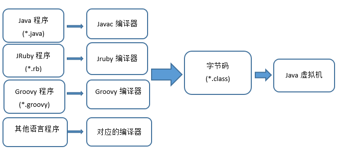
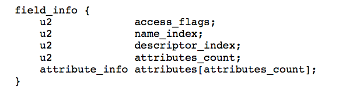
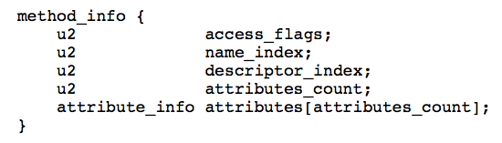
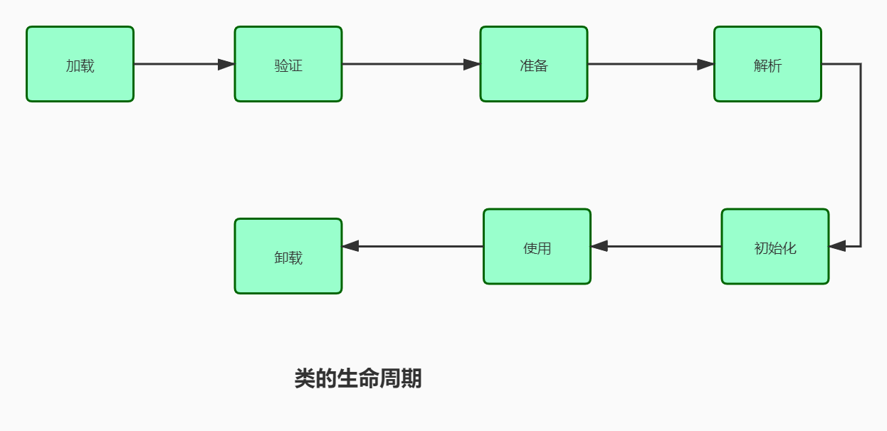

# JVM二

# 1.概述

在 Java 中，JVM 可以理解的代码就叫做字节码（即扩展名为 .class 的文件），它不面向任何特定的处理器，只面向虚拟机。Java 语言通过字节码的方式，在一定程度上解决了传统解释型语言执行效率低的问题，同时又保留了解释型语言可移植的特点。所以 Java 程序运行时比较高效，而且，由于字节码并不针对一种特定的机器，因此，Java 程序无须重新编译便可在多种不同操作系统的计算机上运行。
Clojure（Lisp 语言的一种方言）、Groovy、Scala 等语言都是运行在 Java 虚拟机之上。下图展示了不同的语言被不同的编译器编译成`.class`文件最终运行在 Java 虚拟机之上。`.class`文件的二进制格式可以使用 [WinHex](https://www.x-ways.net/winhex/) 查看。



**可以说.class文件是不同的语言在 Java 虚拟机之间的重要桥梁，同时也是支持 Java 跨平台很重要的一个原因。**


我们都知道，Java程序最终是转换成class文件执行在虚拟机上的，那么class文件是个怎样的结构，虚拟机又是如何处理去执行class文件里面的内容呢，这篇文章带你深入理解Java字节码中的结构。

# 2. 一个思考

## 1.Demo源码

首先，编写一个简单的Java源码：

```
package com.april.test;

public class Demo {
    private int num = 1;

    public int add() {
        num = num + 2;
        return num;
    }
}

```

这段代码很简单，只有一个成员变量`num`和一个方法`add()`。

## 2. 字节码

要运行一段Java源码，必须先将源码转换为class文件，class文件就是编译器编译之后供虚拟机解释执行的二进制字节码文件，可以通过`IDE工具`或者`命令行`去将源码编译成class文件。这里我们使用命令行去操作，运行下面命令:

```
javac Demo.java
```

就会生成一个`Demo.class`文件。

我们打开这个Demo.class文件看下。这里用到的是`Notepad++`,需要安装一个`HEX-Editor`插件。


## 3. class文件反编译java文件

下载jad.exe软件进行反编译

```
jad.exe E:\ -sjava Demo.class
```

> -d < dir >- 指定输出文件的文件目录
>
> -s -输出文件扩展名(默认:.jad)

反编译的结果如下

```
// Decompiled by Jad v1.5.8g. Copyright 2001 Pavel Kouznetsov.
// Jad home page: http://www.kpdus.com/jad.html
// Decompiler options: packimports(3) 
// Source File Name:   Demo.java

package com.april.test;


public class Demo
{

    public Demo()
    {
        num = 1;
    }

    public int add()
    {
        num = num + 2;
        return num;
    }

    private int num;
}
```

可以看到，回编译的源码比编写的代码多了一个`空的构造函数`, 先放下这个疑问，看完这篇分析，相信你就知道答案了。


# 3. class文件总体结构

根据 Java 虚拟机规范，类文件由单个 ClassFile 结构组成：

```
ClassFile {
    u4             magic; //Class 文件的标志
    u2             minor_version;//Class 的小版本号
    u2             major_version;//Class 的大版本号
    u2             constant_pool_count;//常量池的数量
    cp_info        constant_pool[constant_pool_count-1];//常量池
    u2             access_flags;//Class 的访问标记
    u2             this_class;//当前类
    u2             super_class;//父类
    u2             interfaces_count;//接口
    u2             interfaces[interfaces_count];//一个类可以实现多个接口
    u2             fields_count;//Class 文件的字段属性
    field_info     fields[fields_count];//一个类会可以有个字段
    u2             methods_count;//Class 文件的方法数量
    method_info    methods[methods_count];//一个类可以有个多个方法
    u2             attributes_count;//此类的属性表中的属性数
    attribute_info attributes[attributes_count];//属性表集合
}

```

下面详细介绍一下 Class 文件结构涉及到的一些组件。

**Class文件字节码结构组织示意图** （之前在网上保存的，非常不错，原出处不明）：


## 1. 魔数

```
    u4             magic; //Class 文件的标志
```

每个 Class 文件的头四个字节称为魔数（Magic Number）,它的唯一作用是**确定这个文件是否为一个能被虚拟机接收的 Class 文件**。

所有的由Java编译器编译而成的class文件的前4个字节都是“0xCAFEBABE”。  

它的作用在于：当JVM在尝试加载某个文件到内存中来的时候，会首先判断此class文件有没有JVM认为可以接受的“签名”，即JVM会首先读取文件的前4个字节，判断该4个字节是否是“0xCAFEBABE”，如果是，则JVM会认为可以将此文件当作class文件来加载并使用  

## 2. Class文件版本

```
    u2             minor_version;//Class 的小版本号
    u2             major_version;//Class 的大版本号
```

紧接着魔数的四个字节存储的是 Class 文件的版本号：第五和第六是**次版本号**，第七和第八是**主版本号**。

JDK1.0的主版本号为45，以后的每个新主版本都会在原先版本的基础上加1。若现在使用的是JDK1.7编译出来的class文件，则相应的主版本号应该是51，对应的7，8个字节的十六进制的值应该是 0x33  

**JDK版本信息对照表**

| JDK版本 | 16进制版本号 | 十进制版本号 |
| ------- | ------------ | ------------ |
| JDK8    | 00 00 00 34  | 52           |
| JDK7    | 00 00 00 33  | 51           |
| JDK6    | 00 00 00 32  | 50           |
| JDK5    | 00 00 00 31  | 49           |
| JDK1.4  | 00 00 00 30  | 48           |
| JDK1.3  | 00 00 00 2F  | 47           |
| JDK1.2  | 00 00 00 2E  | 46           |
| JDK1.1  | 00 00 00 2D  | 45           |

高版本的 Java 虚拟机可以执行低版本编译器生成的 Class 文件，但是低版本的 Java 虚拟机不能执行高版本编译器生成的 Class 文件。所以，我们在实际开发的时候要确保开发的的 JDK 版本和生产环境的 JDK 版本保持一致。

当然快捷的方式使用JDK自带的javap工具，如当前有Math.class 文件，进入此文件所在的目录，然后执行 ”javap -v Math“，结果会类似如下所示  


## 3.常量池

```
    u2             constant_pool_count;//常量池的数量
    cp_info        constant_pool[constant_pool_count-1];//常量池
```

常量池是class文件中非常重要的结构，它描述着整个class文件的字面量信息。常量池是由一组constant_pool结构体数组组成的，而数组的大小则由常量池计数器指定。常量池计数器constant_pool_count 的值 =constant_pool表中的成员数+ 1。constant_pool表的索引值只有在大于 0且小于constant_pool_count时才会被认为是有效的。  

注意事项：
常量池计数器默认从1开始而不是从0开始：  

当constant_pool_count = 1时，常量池中的cp_info个数为0；当constant_pool_count为n时，常量池中的cp_info个数为n-1  

原因：

**常量池计数器是从1开始计数的，将第0项常量空出来是有特殊考虑的，索引值为0代表“不引用任何一个常量池项”**


常量池主要存放两大常量：字面量和符号引用。

字面量比较接近于 Java 语言层面的的常量概念，如文本字符串、声明为 final 的常量值等。而符号引用则属于编译原理方面的概念。包括下面三类常量：

- 类和接口的全限定名
- 字段的名称和描述符
- 方法的名称和描述符

常量池中每一项常量都是一个表，这14种表有一个共同的特点：**开始的第一位是一个 u1 类型的标志位 -tag 来标识常量的类型，代表当前这个常量属于哪种常量类型．**

| 类型                             | 标志（tag） | 描述                   |
| -------------------------------- | ----------- | ---------------------- |
| CONSTANT_utf8_info               | 1           | UTF-8编码的字符串      |
| CONSTANT_Integer_info            | 3           | 整形字面量             |
| CONSTANT_Float_info              | 4           | 浮点型字面量           |
| CONSTANT_Long_info               | 5           | 长整型字面量           |
| CONSTANT_Double_info             | 6           | 双精度浮点型字面量     |
| CONSTANT_Class_info              | 7           | 类或接口的符号引用     |
| CONSTANT_String_info             | 8           | 字符串类型字面量       |
| CONSTANT_Fieldref_info           | 9           | 字段的符号引用         |
| CONSTANT_Methodref_info          | 10          | 类中方法的符号引用     |
| CONSTANT_InterfaceMethodref_info | 11          | 接口中方法的符号引用   |
| CONSTANT_NameAndType_info        | 12          | 字段或方法的符号引用   |
| CONSTANT_MothodType_info         | 16          | 标志方法类型           |
| CONSTANT_MethodHandle_info       | 15          | 表示方法句柄           |
| CONSTANT_InvokeDynamic_info      | 18          | 表示一个动态方法调用点 |

`.class` 文件可以通过`javap -v class类名` 指令来看一下其常量池中的信息(`javap -v class类名-> temp.txt` ：将结果输出到 temp.txt 文件)。

## 4. 访问标志

在常量池结束之后，紧接着的两个字节代表访问标志，这个标志用于识别一些类或者接口层次的访问信息，包括：这个 Class 是类还是接口，是否为 public 或者 abstract 类型，如果是类的话是否声明为 final 等等。

类访问和属性修饰符:


我们定义了一个 Employee 类

```
package top.snailclimb.bean;
public class Employee {
   ...
}

```

通过`javap -v class类名` 指令来看一下类的访问标志。


## 5. 当前类索引,父类索引与接口索引集合

```
    u2             this_class;//当前类
    u2             super_class;//父类
    u2             interfaces_count;//接口
    u2             interfaces[interfaces_count];//一个类可以实现多个接口
```

类索引用于确定这个类的全限定名，父类索引用于确定这个类的父类的全限定名，由于 Java 语言的单继承，所以父类索引只有一个，除了 java.lang.Object 之外，所有的 java 类都有父类，因此除了 java.lang.Object 外，所有 Java 类的父类索引都不为 0。

接口索引集合用来描述这个类实现了那些接口，这些被实现的接口将按implents(如果这个类本身是接口的话则是extends) 后的接口顺序从左到右排列在接口索引集合中。


## 6. 表字段

```
    u2             fields_count;//Class 文件的字段的个数
    field_info     fields[fields_count];//一个类会可以有个字段
```

字段表（field info）用于描述接口或类中声明的变量。字段包括类级变量以及实例变量，但不包括在方法内部声明的局部变量。

**field info(字段表) 的结构:**



- access_flags: 字段的作用域（public ,private,protected修饰符），是实例变量还是类变量（static修饰符）,可否被序列化（transient 修饰符）,可变性（final）,可见性（volatile 修饰符，是否强制从主内存读写）。
- name_index: 对常量池的引用，表示的字段的名称；
- descriptor_index: 对常量池的引用，表示字段和方法的描述符；
- attributes_count: 一个字段还会拥有一些额外的属性，attributes_count 存放属性的个数；
- attributes[attributes_count]: 存放具体属性具体内容。

上述这些信息中，各个修饰符都是布尔值，要么有某个修饰符，要么没有，很适合使用标志位来表示。而字段叫什么名字、字段被定义为什么数据类型这些都是无法固定的，只能引用常量池中常量来描述。

**字段的 access_flags 的取值:**


## 7. 方法表集合

```
    u2             methods_count;//Class 文件的方法的数量
    method_info    methods[methods_count];//一个类可以有个多个方法
```

methods_count 表示方法的数量，而 method_info 表示的方法表。

Class 文件存储格式中对方法的描述与对字段的描述几乎采用了完全一致的方式。方法表的结构如同字段表一样，依次包括了访问标志、名称索引、描述符索引、属性表集合几项。

method_info(方法表的) 结构:


**方法表的 access_flag 取值：**


注意：因为`volatile`修饰符和`transient`修饰符不可以修饰方法，所以方法表的访问标志中没有这两个对应的标志，但是增加了`synchronized`、`native`、`abstract`等关键字修饰方法，所以也就多了这些关键字对应的标志。

## 8. 属性集合

```
   u2             attributes_count;//此类的属性表中的属性数
   attribute_info attributes[attributes_count];//属性表集合
```

在 Class 文件，字段表，方法表中都可以携带自己的属性表集合，以用于描述某些场景专有的信息。与 Class 文件中其它的数据项目要求的顺序、长度和内容不同，属性表集合的限制稍微宽松一些，不再要求各个属性表具有严格的顺序，并且只要不与已有的属性名重复，任何人实现的编译器都可以向属性表中写 入自己定义的属性信息，Java 虚拟机运行时会忽略掉它不认识的属性。


# 4. class文件中的引用和特殊字符串

## 1. 符号引用

在Class文件中它以CONSTANT_Class_info、CONSTANT_Fieldref_info、CONSTANT_Methodref_info等类型的常量出现。  

特点：

```
符号引用与虚拟机的内存布局无关，引用的目标并不一定加载到内存中。
符号引用指向了类的名称或者方法的名称或者字段的名称等，不是内存中的表示方式。
```

例子：

```
public class People{
	private Language language;
}
```

比如 org.simple.People类 引用了 org.simple.Language类 ，在编译时People类并不知道Language类的实际内存地址，因此只能使用符号 org.simple.Language （假设是这个，当然实际中是由类似于CONSTANT_Class_info的常量来表示的）来表示Language类的地址。  

## 2. 直接引用

直接引用可以是：
1. 直接指向目标的指针（比如，指向“类型”【Class对象】、类变量、类方法的直接引用可能是指向
方法区的指针）
2. 相对偏移量（比如，指向实例变量、实例方法的直接引用都是偏移量）
3. 一个能间接定位到目标的句柄

总结：

直接引用就是指向了内存中的数据

## 3. 引用替换的时机

符号引用替换为直接引用的操作发生在【类加载过程】(加载 -> 连接(验证、准备、解析) -> 初始化)中的
解析阶段，会将【符号引用】转换(替换)为对应的【直接引用】，放入运行时常量池中。


## 4. 特殊字符串字面量

特殊字符串包括三种： 类的全限定名， 字段和方法的描述符， 特殊方法的方法名。 下面我们就分别介绍这三种特殊字符串。  

### 1. 类的全限定名

Object类，在源文件中的全限定名是 java.lang.Object 。
而class文件中的全限定名是将点号替换成“/” 。 也就是 java/lang/Object 。
源文件中一个类的名字， 在class文件中是用全限定名表述的。

### 2. 描述符

各类型的描述符
对于字段的数据类型，其描述符主要有以下几种  

- 基本数据类型（byte、char、double、float、int、long、short、boolean）：除 long 和
  boolean，其他基本数据类型的描述符用对应单词的大写首字母表示。long 用 J 表示，boolean用Z表示
- void：描述符是 V。
- 对象类型：描述符用字符 L 加上对象的全限定名表示，如 String 类型的描述符为Ljava/lang/String 。 
- 数组类型：每增加一个维度则在对应的字段描述符前增加一个 [ ，如一维数组 int[] 的描述符为 [I ，二维数组 String[][] 的描述符为 [[Ljava/lang/String 。  

| 数据类 型     | 描述符                                                       |
| ------------- | ------------------------------------------------------------ |
| byte          | B                                                            |
| char          | C                                                            |
| double        | D                                                            |
| float         | F                                                            |
| int           | I                                                            |
| long          | J                                                            |
| short         | S                                                            |
| boolean       | Z                                                            |
| 特殊类 型void | V                                                            |
| 对象类型      | “L” + 类型的全限定名 + “;”。如 Ljava/lang/String; 表示 String 类型 |
| 数组类型      | 若干个 “[” + 数组中元素类型的对应字符串，如一维数组 int[] 的描述符为 [I ， 二维数组 String[][] 的描述符为 [[java/lang/String; |

#### 字段描述符

字段的描述符就是字段的类型所对应的字符或字符串。  

如：

```
int i 中， 字段i的描述符就是 I
Object o中， 字段o的描述符就是 Ljava/lang/Object;
double[][] d中， 字段d的描述符就是 [[D
```

#### 方法描述符

方法的描述符比较复杂， 包括所有参数的类型列表和方法返回值。 它的格式是这样的  

```
(参数1类型 参数2类型 参数3类型 ...)返回值类型
```

注意事项

> 不管是参数的类型还是返回值类型， 都是使用对应字符和对应字符串来表示的， 并且参数列表使
> 用小括号括起来， 并且各个参数类型之间没有空格， 参数列表和返回值类型之间也没有空格。  

方法描述符举例说明如下：

| 方法描述符                | 方法声明                                                     |
| ------------------------- | ------------------------------------------------------------ |
| ()I                       | int getSize()                                                |
| ()Ljava/lang/String;      | String toString()                                            |
| ([Ljava/lang/String;)V    | void main(String[] args)                                     |
| ()V                       | void wait()                                                  |
| (JI)V                     | void wait(long timeout, int nanos)                           |
| (ZILjava/lang/String;II)Z | boolean regionMatches(boolean ignoreCase, int toOffset, String other, int ooffset, int len) |
| ([BII)I                   | int read(byte[] b, int off, int len )                        |
| ()[[Ljava/lang/Object;    | Object[][] getObjectArray()                                  |

### 3. 特殊描述符

首先要明确一下， 这里的特殊方法是指的类的构造方法和类型初始化方法。
构造方法就不用多说了， 至于类型的初始化方法， 对应到源码中就是静态初始化块。 也就是说， 静态初始化块， 在class文件中是以一个方法表述的， 这个方法同样有方法描述符和方法名，具体如下：

- 类的构造方法的方法名使用字符串 表示
- 静态初始化方法的方法名使用字符串 表示。
- 除了这两种特殊的方法外， 其他普通方法的方法名， 和源文件中的方法名相  


总结

1. 方法和字段的描述符中， 不包括字段名和方法名， 字段描述符中只包括字段类型， 方法描述符中
   只包括参数列表和返回值类型。
2. 无论method()是静态方法还是实例方法，它的方法描述符都是相同的。尽管实例方法除了传递自
   身定义的参数，还需要额外传递参数this，但是这一点不是由方法描述符来表达的。参数this的传
   递，是由Java虚拟机实现在调用实例方法所使用的指令中实现的隐式传递  


# 5. 案例分析

class文件内容  


# 6. 类加载详解

## 1. 类加载的时机

1. 遇到 new 、 getstatic 、 putstatic 和 invokestatic 这四条字节码指令时，如果对应的类没有初始化，则要对对应的类先进行初始化。
   这四个指令对应到我们java代码中的场景分别是：
   - new关键字实例化对象的时候；
   - 读取或设置一个类的静态字段（读取被final修饰，已在编译器把结果放入常量池的静态字段除外） ；
   - 调用类的静态方法时。
2. 使用 java.lang.reflect 包方法时对类进行反射调用的时候。
3. 初始化一个类的时候发现其父类还没初始化，要先初始化其父类。
4. 当虚拟机开始启动时，用户需要指定一个主类，虚拟机会先执行这个主类的初始化。  

## 2. 类加载的过程



主要分为三大阶段：加载阶段、链接阶段、初始化阶段  。

其中链接阶段又分为：验证、准备、解析  

类的卸载，当一个类对应的对象都已经回收的时候，会触发卸载  


## 3. 加载

“加载”是“类加载”(Class Loading)过程的第一步。这个加载过程主要就是靠类加载器实现的，主要目标就是将不同来源的class文件，都加载到JVM内存（方法区）中。到了方法区，需要将加载的信息，封装到java.lang.Class对象中。  