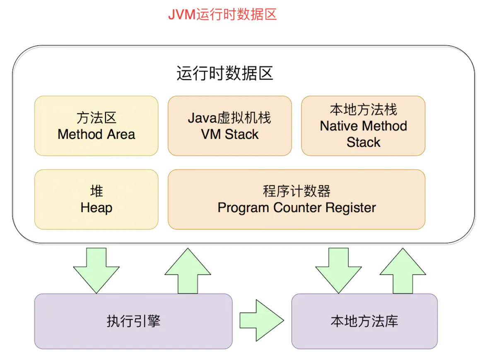

# 1. jvm的内存模型还记得吗？

运行时数据区：



线程共享数据区：方法区、堆
线程隔离数据区：虚拟机栈、本地方法栈、堆、程序计数器


# 2. 运行时数据区之——程序计数器(Program Counter Register)

## 1. 是什么？

1）程序计数器是一块**较小的内存空间**，它可以看作是**当前线程所执行的字节码的行号指示器**
2）线程是一个独立的执行单元，是由CPU控制执行的
3）字节码解释器工作时就是通过改变这个计数器的值来选取下一条需要执行的字节码指令，分支、循环、跳转、异常处理、线程恢复等基础功能都需要依赖这个计数器来完成

## 2. 有什么用？

为了线程切换后能恢复到正确的执行位置，**每条线程都需要有一个独立的程序计数器**，各条线程之间计数器**互不影响**，独立存储，我们称这类内存区域为**“线程私有”**的内存

## 3. 特点：

**内存区域中唯一一 个没有规定任何 OutOfMemoryError 情况的区域**


# 3. 运行时数据区之——JAVA虚拟机栈(VM Stack)

## 1. 是什么？

用于作用于方法执行的一块Java内存区域

## 2. 为什么?

每个方法在执行的同时都会创建一个**栈帧（Stack Framel）**用于**存储局部变量表、操作数栈、动态链接、方法出口**等信息。每一个方法从调用直至执行完成的过程，就对应着**一个栈帧在虚拟机栈中入栈到出栈的过程**

## 3. 特点：

1）局部变量表存放了编译期可知的各种基本数据类型（boolean、byte、char、short、int、float、long、double）以及对象引用（reference 类型）
 2）如果线程请求的栈深度大于虚拟机所允许的深度，将抛出 StackOverflowError 异常


```csharp
import java.util.concurrent.atomic.AtomicInteger;

public class A {

    public native static void c();
    public static void a(){
        System.out.println("enter method a");
    }
    //进行了递归调用，会出现StackOverflowError 异常
    public static void b(){
        b();
        System.out.println("enter method b");
    }

    public static void main(String[] args) {
        b();
        System.out.println("enter method main");
        AtomicInteger atomicInteger = new AtomicInteger(1);
        atomicInteger.compareAndSet(1,2);
    }
}
```


# 4. 运行时数据区之——本地方法栈(Native Method Stack)

## 1. 是什么？

用于作用域本地方法执行的一块Java内存区域


## 2. 为什么？

与Java虚拟机栈相同，每个方法在执行的同时都会创建一个栈帧（Stack Framel）用于存储局部变量表、操作数栈、动态链接、方法出口等信息。每一个方法从调用直至执行完成的过程，就对应着一个栈帧在虚拟机栈中入栈到出栈的过程


## 3. 特点

Hotshot将Java虚拟机栈和本地方法栈合二为一（编译时分开，运行时结合）


# 5. 运行时数据区之——堆(Heap)

## 1. 是什么？

是Java内存区域中一块用来存放对象实例的区域，**几乎所有的对象实例都在这里分配内存**


## 2. 为什么？

1）此内存区域的唯一目的就是存放对象实例
2）Java 堆（Java Heap）是 Java 虚拟机所管理的内存中最大的一块， Java 堆是被**所有线程共享的一块内存区域**


## 3. 特点：

1）Java 堆是垃圾收集器管理的主要区域，因此很多时候也被称做“GC 堆”（Garbage）
 2）-Xmx（运行时最大堆内存） -Xms（启动时最小堆内存） 可以通过这2个参数设置使用堆的大小
 3）Java堆可以分成新生代和老年代   新生代可分为To Space、From Space、Eden


# 6. 运行时数据区之——方法区(Method Area)

## 1. 是什么？

是各个线程共享的内存区域，它用于存储已被虚拟机加载的类信息（类版本号、方法、接口）、常量、静态变量、即时编译器编译后的代码等数据


## 2. 为什么?

1）内存中存放类信息、静态变量等数据，属于线程共享的一块区域
2）Hotspot使用永久代来实现方法区 JRockit、IBM J9VM Java堆一样管理这部分内存


## 3. 特点

1）并非数据进入了方法区就如永久代的名字一样“永久”存在了。这区域的内存回收目标主要是针对常量池的回收和对类型的卸载
 2）当它无法满足内存分配需求时 ，方法区也会抛出OutofMemoryError异常


# 7. 方法区的常量池

## 1. 是什么？

运行时常量池是方法区的一部分，Class文件除了有类的版本、字段、方法、接口等描述信息外，还有一项信息是常量池，用于存放编译器生成的各种字面量和符号引用，这部分内容将在类加载后进入方法区的运行时常量池中存放。


## 2. 特点

运行时常量池是方法区的一部分，受到方法区内存的限制，当常量池再申请到内存时会抛出OutOfMemoryError异常


作者：vincent浩哥
链接：https://www.jianshu.com/p/7cff3143dc14
来源：简书
著作权归作者所有。商业转载请联系作者获得授权，非商业转载请注明出处。

