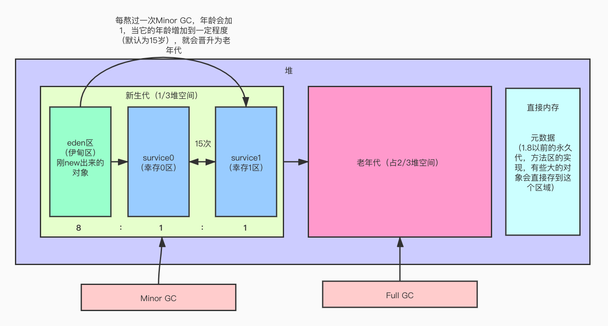
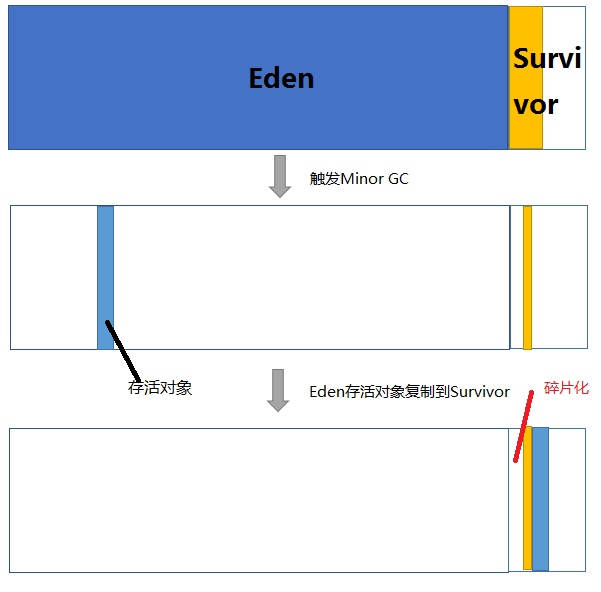
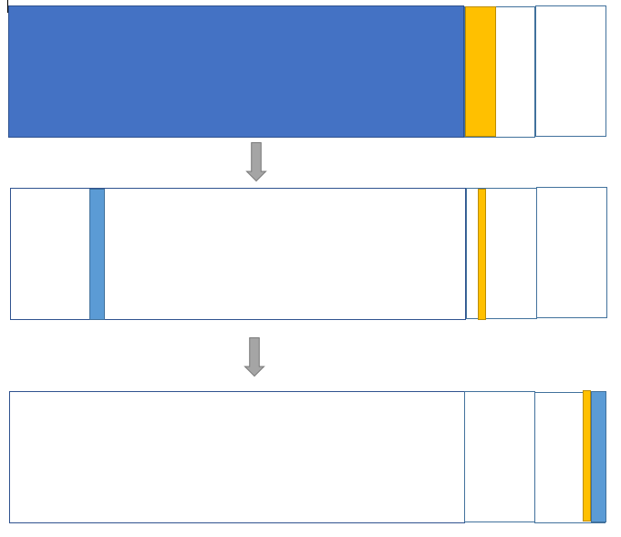
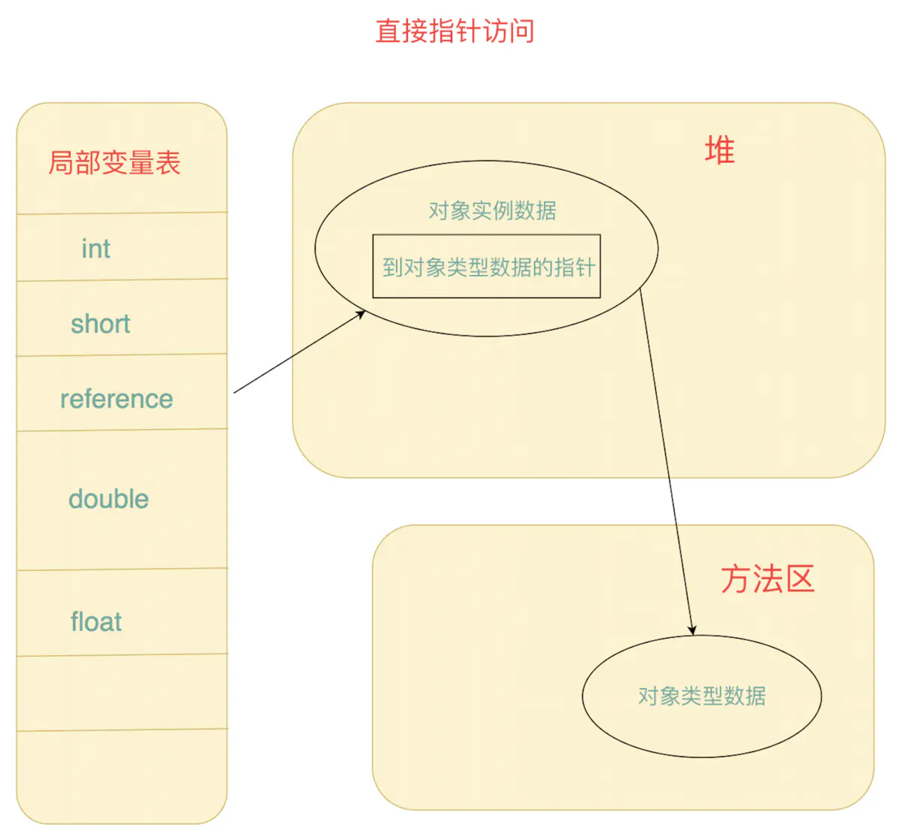
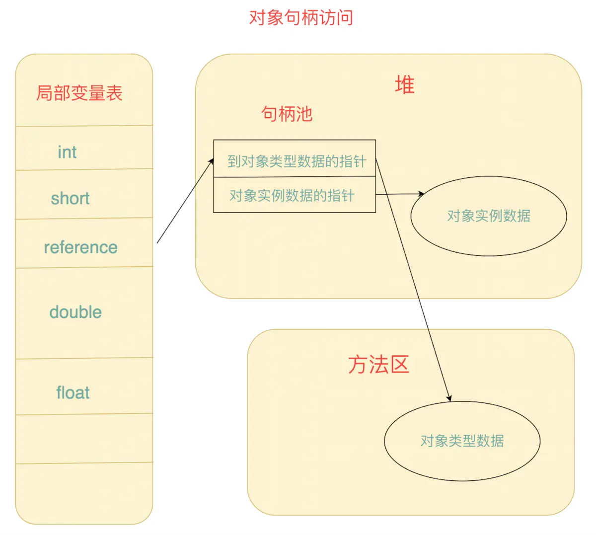

# JVM的堆

## 1. JVM中的堆和栈有什么不同？

栈解决的程序运行问题，即程序如何执行，或者说如何处理数据；

堆解决的是数据存储问题，即就是数据如何放、放哪儿

## 2. 什么要把堆和栈分开， 这样设计有什么好处呢？

1. 从设计角度， 堆存数据， 栈处理逻辑， 这样设计区分， 可以隔离和模块化， 分而治之的思想
2. 共享内存（多线程访问一个对象），节省内存
3. 栈的地址， 只能连续增加， 堆可以动态增加， 相互拆分， 栈关联堆的一个地址即可， 提高内存利用率
4. 对象就是对债完美结合， 对象属性存储数据， 就是堆， 栈就是对象的方法

## 3. 堆中内存是如何划分的

### 1. 怎么区分老年代和年轻代

年轻代中的对象， 生命周期很短， 基本很快就死了， 也就是被GC了。

老年代中的对象， 都是一些老顽固， 经过15次回收的对象或者大对象才存到老年代中

从年轻代进入老年代

第一种的情况就是将躲过15次MinorGC的对象移动到老年代.

第二种就是动态年龄对象判断,既Survivor区的经历过两次GC的对象大小大于Survivor区容量的一半的时候,如Survivor区是100m,里面的对象之和大于50m.就将这些2次GC还存活的对象移入到老年代中去.

第三种就是大对象,还没有进入到新生代的时候就被移动到老年代,这里有个参数,为-XX:PretenureSizeThreshold,可以设置值,比如1m,那么再进入堆内存的时候,就会检查这个实例对象的大小,如果大于这个阈值,就直接进入到老年代.

### 

### 2. 什么是Stop the World?

Full GC的时候， 就是Stop the World.

系统在进行垃圾回收的时候会暂停java程序的执行.直到垃圾回收完成.所谓jvm的迭代演进其实就是基本上就是在解决减少垃圾回收,和垃圾回收的时间尽可能的短.一起都取决于垃圾回收算法.

### 3. 堆内存中内存划分比例

老年代： 年轻代 =  2：1

年轻代中： eden(伊甸区) ： service0(幸存区0) ： service1(幸存区1) = 8：1：1

### 4. 老年代和年轻代为什么是2：1

**默认的，新生代 ( Young ) 与老年代 ( Old ) 的比例的值为 1:2 **

**( 该值可以通过参数 –XX:NewRatio 来指定 )**

### 5. 为什么会有survivorto?

如果没有Survivor，Eden区每进行一次Minor GC，存活的对象就会被送到老年代。老年代很快被填满，触发Major GC（因为Major GC一般伴随着Minor GC，也可以看做触发了Full GC）。老年代的内存空间远大于新生代，进行一次Full GC消耗的时间比Minor GC长得多。你也许会问，执行时间长有什么坏处？频发的Full GC消耗的时间是非常可观的，这一点会影响大型程序的执行和响应速度，更不要说某些连接会因为超时发生连接错误了。
好，那我们来想想在没有Survivor的情况下，有没有什么解决办法，可以避免上述情况：

| 方案           | 优点                                        | 缺点                                                      |
| -------------- | ------------------------------------------- | --------------------------------------------------------- |
| 增加老年代空间 | 更多存活对象才能填满老年代。降低Full GC频率 | 随着老年代空间加大，一旦发生Full GC，执行所需要的时间更长 |
| 减少老年代空间 | Full GC所需时间减少                         | 老年代很快被存活对象填满，Full GC频率增加                 |

显而易见，没有Survivor的话，上述两种解决方案都不能从根本上解决问题。

我们可以得到第一条结论：Survivor的存在意义，就是减少被送到老年代的对象，进而减少Full GC的发生，Survivor的预筛选保证，只有经历16次Minor GC还能在新生代中存活的对象，才会被送到老年代。

### 6. 为什么要设置两个Servivor区

**设置两个Survivor区最大的好处就是解决了碎片化**

eden:survivorfrom:survivorto = 8:1:1

Java堆内存分为年轻代和老年代，其中， 年轻代分为Eden区和survival区，survival又分为fromSurvival和toSurvival。

为什么一个Survivor区不行？第一部分中，我们知道了必须设置Survivor区。假设现在只有一个survivor区，我们来模拟一下流程：
刚刚新建的对象在Eden中，一旦Eden满了，触发一次Minor GC，Eden中的存活对象就会被移动到Survivor区。这样继续循环下去，下一次Eden满了的时候，问题来了，此时进行Minor GC，Eden和Survivor各有一些存活对象，如果此时把Eden区的存活对象硬放到Survivor区，很明显这两部分对象所占有的内存是不连续的，也就导致了内存碎片化。
我绘制了一幅图来表明这个过程。其中色块代表对象，白色框分别代表Eden区（大）和Survivor区（小）。Eden区理所当然大一些，否则新建对象很快就导致Eden区满，进而触发Minor GC，有悖于初衷。

碎片化带来的风险是极大的，严重影响JAVA程序的性能。堆空间被散布的对象占据不连续的内存，最直接的结果就是，堆中没有足够大的连续内存空间，接下去如果程序需要给一个内存需求很大的对象分配内存。。。画面太美不敢看。。。这就好比我们爬山的时候，背包里所有东西紧挨着放，最后就可能省出一块完整的空间放相机。如果每件行李之间隔一点空隙乱放，很可能最后就要一路把相机挂在脖子上了。
那么，顺理成章的，应该建立两块Survivor区，刚刚新建的对象在Eden中，经历一次Minor GC，Eden中的存活对象就会被移动到第一块survivor space S0，Eden被清空；等Eden区再满了，就再触发一次Minor GC，Eden和S0中的存活对象又会被复制送入第二块survivor space S1（这个过程非常重要，因为这种复制算法保证了S1中来自S0和Eden两部分的存活对象占用连续的内存空间，避免了碎片化的发生）。S0和Eden被清空，然后下一轮S0与S1交换角色，如此循环往复。如果对象的复制次数达到16次，该对象就会被送到老年代中。下图中每部分的意义和上一张图一样，就不加注释了。

上述机制最大的好处就是，整个过程中，永远有一个survivor space是空的，另一个非空的survivor space无碎片。

那么，Survivor为什么不分更多块呢？比方说分成三个、四个、五个?显然，如果Survivor区再细分下去，每一块的空间就会比较小，很容易导致Survivor区满，因此，我认为两块Survivor区是经过权衡之后的最佳方案。

### 7. 堆内存分配方法：

| 分配方法 | 说明               | 收集器                      |
| -------- | ------------------ | --------------------------- |
| 指针碰撞 | 内存地址是连续的   | Serial和ParNew收集器        |
| 空闲列表 | 内存地址是不连续的 | CMS收集器和Mark-Sweep收集器 |

### 8. 内存分配安全问题

在分配内存的同时， 存在线性安全问题， 即虚拟机给A线程分配内存过程中， 指针未修改， B线程可能同时使用了同样一块内存。

JVM中有两种解决办法：

1. CAS， 比较和交换， CAS是乐观锁的一种实现， 所谓乐观锁就是， 每次不加锁而是假设没有冲突而去完成某项操作， 如果因为冲突失败就重试， 知道成功为止， 虚拟机采用cas配上失败重试的方式保证更新操作的原子性。
2. TLAB， 本地线程分配缓冲： 为每一个线程预分配一块内存， JVM在给线程中的对象分配内存时， 首先在TLAB分配， 当对象大于TLAB中的剩余内存或者TLAB内存耗尽时， 在采用上述的CAS进行内存分配

方案1在每次分配时都需要进行同步控制，这种是比较低效的。

方案2是HotSpot虚拟机中采用的，这种方案被称之为TLAB分配，即Thread Local Allocation Buffer。这部分Buffer是从堆中划分出来的，但是是本地线程独享的。

### 9. 对象的内存布局

对象在内存中存储的布局可以分为三个区域， 对象头（Header）， 实例数据（Instance data）和对齐填充（padding）.

#### 1. 对象头

对象头包括两部分信息:
一部分是用于存储对象自身的运行数据，如haashCode, GC分代年龄， 锁状态标志， 线性持有的锁， 偏向线程ID， 偏向时间戳等。

另一部分是类型指针，即对象指向它的类元数据的指针，虚拟机通过这个指针来确定这个对象是哪一个类的实例。当对象是一个java数组的时候，那么对象头还必须有一块用于记录数组长度的数据，因此虚 拟机可以通过普通java对象的元数据信息确定java对象的大小，但是从数组的元数据中无法确定数组的 大小。

#### 2. 实例数据

存储对象真正有效的信息

#### 3. 对齐填充

这部分并不是必须要存在的， 没有特别的含义， 在jvm中对象的大小必须是8字节的整数倍， 而对象头也是8字节的倍数， 当对象实例数据部分没有对齐时， 就需要通过对齐填充来补全

### 10. 对象访问的方式

| 方式     | 优点                                  |
| -------- | ------------------------------------- |
| 句柄     | 稳定， 对象被移动只要修改句柄中的地址 |
| 直接指针 | 访问速度快， 节省了一次指针定位的开销 |

