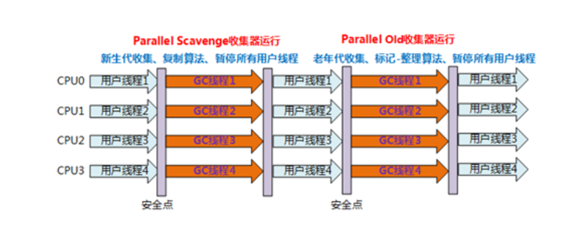

# 1. 垃圾回收器

## 1. 什么叫垃圾收集器？

垃圾收集器是垃圾回收算法（标记清除， 复制算法， 标记-整理算法， 火车算法）的具体实现， 不同种类JVM所提供的垃圾收集器可能会有很大差别， HotSpot虚拟机中的7种垃圾收集器：Serial, ParNew, Parallel Scavenge, Serial Old, Parallel Old, CMS, G1, ZGC


## 2. 垃圾收集器的分代

年轻代：Serial, ParNew, Parallel Scavenge

老年代：CMS, Serial Old, Parallel Old

通杀：G1


## 3. Serial收集器

垃圾收集器最基本，发展历史最悠久的收集器。jdk1.3之前是HotSpot新生代收集器唯一的选择。

### 1. 特点

采用复制算法

单线程收集

stop the world 进行垃圾收集时， 必须暂停所有工作线程， 直到完成。


### 2. 应用场景

依然是HotSpot在Client模式下默认的新生代收集器

优点：

- 简单高效（与其他收集器的单线程相比）；
- 对单个cpu环境， Serial收集器没有线程切换开销， 可获得最高的单线程收集效率。
- 在用户的桌面应用场景中， 可用内存一般不大（几十M至一两百M）， 可以在较短时间内完成垃圾收集（十几MS至一百多MS）， 只要不频繁发生， 这是可以接受的。


## 4. Serial Old收集器

serial Old是Serial收集器的老年代版本

### 1. 特点：

针对老年代的收集器

采用的是标记整理算法， （还有压缩， mark-sweep-compact）

单线程收集


### 2. 应用场景

主要用于client模式

在jdk1.5之前， 与Parallel Scavenge收集器搭配使用（JDK1.6有Parallel Old收集器可搭配）


## 5. ParNew收集器

### 1. 特点：

除了多线程外， 其余的行为， 特点和Serial收集器一样

和Serial收集器公用了不少的代码


### 2. 应用场景

在Server模式下， ParNew收集器是一个非常重要的收集器， 因为除Serial外， 目前只有它能与CMS收集器配合工作

但在单个cpu环境中， 不会比Serail收集器有更好的效果， 因为存在线程交互开销


### 3. 为什么只有ParNew能与CMS收集器配合

CMS是HotSpot在jdk1.5第一款并发收集器， 让垃圾收集线程与用户线程（基本上）同时工作；

CMS作为老年代收集器， 单无法与JDK1.4新生代收集器Parallel Scavenge配合工作；

因为Parallel Scavenge(以及G1) 都没有使用传统的GC收集器代码框架， 而是另外独立实现；而其余几种收集器则公用了部分的框架代码。


## 6. Parallel Scavenge收集器

因为与吞吐量关系密切， 也称为吞吐量收集器

### 1. 特点：

a. 和ParNew收集器相似

​	新生代收集器

​	采用复制算法

​	多线程收集

b. TA的关注点与其他收集器不同

CMS等收集器的关注点是缩短垃圾收集器时用户线程的停顿时间

而Parallel Scavenge 收集器的目标是达到一个可控制的吞吐量


### 2. 应用场景

提高吞吐量为目标， 即减少垃圾收集时间，让用户代码获得更长的运行时间

适用于多CPU， 对停顿时间没有特别要求的后台统计等运算任务


## 7. Parallel Old收集器

Parallel Old垃圾收集器是Parallel Scavenge收集器的老年代版本；

JDK1.6中才开始提供

### 1. 特点：

针对老年代

采用标记整理算法

多线程收集；

Parallel Scavenge/Parallel Old 收集器运行示意图：



### 2. 应用场景

jdk1.6及之后用来代替老年代Serial Old收集器

特别是多Server模式， 多cpu的情况下；

在注重吞吐量以及CPU资源敏感场景， 就有Parallel Scavenge加Parallel Old 收集器给力组合


## 8. CMS收集器

并发标记清理收集器也称为并发低停顿收集器或低延迟垃圾收集器

### 1. 特点：

针对老年代

基于标记清除算法

以获取最短回收停顿时间为目标；

并发收集， 低停顿

需要更多的内存， 是HotSpot在JDK1.5推出的第一款真正意义上的并发收集器

第一次实现了让垃圾收集线程与用户线程（基本上）同时工作。

### 2.应用场景

与用户交互较多的场景； 希望系统停顿的时间最短， 注重服务的响应速度；

以给用户带来较好的体验； 如常见web， B/S系统的服务器上的应用；


# 2. GC日志查看

## 1. 启动GC日志

```
-verbose:gc
-XX:+PrintGC
-Xloggc:/opt/logs/gc.log
```

在JDK8中， `-verbose:gc`是`-XX:+PrintGC`一个别称， 日志格式等价于：`-XX:+PrintGC`

不过在JDK9中， `-XX:PrintGC`被标记为deprecated.

```
-verbose:gc    是一个标准的选项
-XX:+PrintGC：	是一个实验的选项， 建议使用 -verbose:gc 替代-XX:+PrintGC
```


## 2. 参数详解

设置JVM GC格式日志的主要参数包括如下8个

```
-XX:+PrintGC 输出简要GC日志 
-XX:+PrintGCDetails 输出详细GC日志 
-Xloggc:gc.log  输出GC日志到文件
-XX:+PrintGCTimeStamps 输出GC的时间戳（以JVM启动到当期的总时长的时间戳形式） 
-XX:+PrintGCDateStamps 输出GC的时间戳（以日期的形式，如 2013-05-04T21:53:59.234+0800） 
-XX:+PrintHeapAtGC 在进行GC的前后打印出堆的信息
-verbose:gc
-XX:+PrintReferenceGC 打印年轻代各个引用的数量以及时长

```


- -XX:+PrintGC

参数：-XX:+PrintGC（或者-verbose:gc） 开始简单GC日志模式， 为每一次新生代（young genneration）的GC和每一次的Full GC打印一行信息。 下面举例说明：

```
[GC 246656K->243120K(376320K)， 0.0929090 secs]

[Full GC 243120K->241951K(629760K)， 1.5589690 secs]
```

- -XX:+PrintGCDetails

开启了详细GC日志模式。 在这种模式下， 日志格式和所使用的的GC算法有关。

- -XX:+PrintGCCTimeStamps和-XX:+PrintGCDeteStamps

使用--XX:+PrintGCCTimeStamps可以将时间和日期也加到GC日志中。表示自JVM启动至今的时间戳会被添加到每一行中。例子如下：  

```
0.185: [GC 66048K->53077K(251392K)， 0.0977580 secs]

0.323: [GC 119125K->114661K(317440K)， 0.1448850 secs]

0.603: [GC 246757K->243133K(375296K)， 0.2860800 secs]
```

如果指定了 -XX:+PrintGCDateStamps ，每一行就添加上了绝对的日期和时间。  

```
2014-01-03T12:08:38.102-0100: [GC 66048K->53077K(251392K)， 0.0959470
secs]

2014-01-03T12:08:38.239-0100: [GC 119125K->114661K(317440K)， 0.1421720
secs]

2014-01-03T12:08:38.513-0100: [GC 246757K->243133K(375296K)， 0.2761000
secs]
```

如果需要也可以同时使用两个参数。推荐同时使用这两个参数，因为这样在关联不同来源的GC日志时很有帮助。  

- -Xloggc

缺省的GC日志时输出到终端的，使用-Xloggc:也可以输出到指定的文件。需要注意这个参数隐式的设置了参数 -XX:+PrintGC 和 -XX:+PrintGCTimeStamps ，但为了以防在新版本的JVM中有任何变化，我仍建议显示的设置这些参数  


## 3. GC日志

摘录GC日志一部分

Young GC回收日志:

```
2016-07-05T10:43:18.093+0800: 25.395: [GC [PSYoungGen: 274931K->10738K(274944K)] 371093K->147186K(450048K), 0.0668480 secs] [Times: user=0.17 sys=0.08, real=0.07 secs]
```

Full GC回收日志:

```
2016-07-05T10:43:18.160+0800: 25.462: [Full GC [PSYoungGen: 10738K->0K(274944K)] [ParOldGen: 136447K->140379K(302592K)] 147186K->140379K(577536K) [PSPermGen: 85411K->85376K(171008K)], 0.6763541 secs] [Times: user=1.75 sys=0.02, real=0.68 secs]
```

通过上面日志分析得出，PSYoungGen、ParOldGen、PSPermGen属于Parallel收集器。其中PSYoungGen表示gc回收前后年轻代的内存变化；ParOldGen表示gc回收前后老年代的内存变化；PSPermGen表示gc回收前后永久区的内存变化。young gc 主要是针对年轻代进行内存回收比较频繁，耗时短；full gc 会对整个堆内存进行回城，耗时长，因此一般尽量减少full gc的次数

通过两张图非常明显看出gc日志构成：

Young GC日志:


Full GC日志:


# 3. GC分析工具

