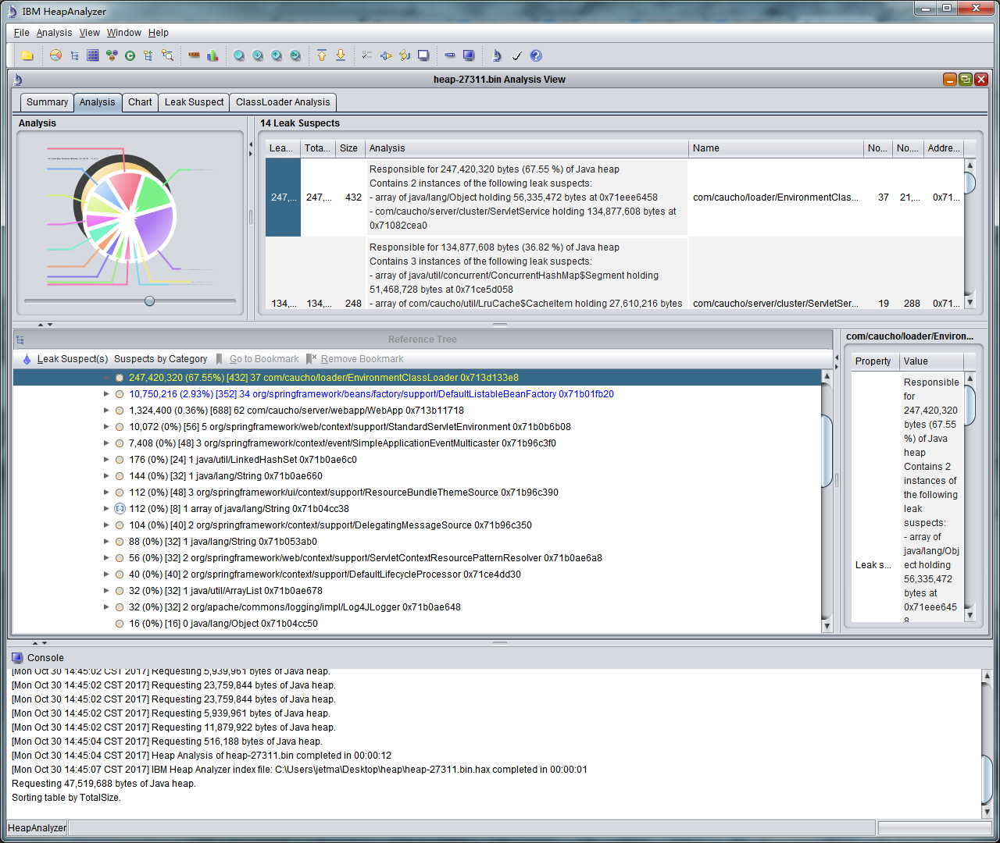
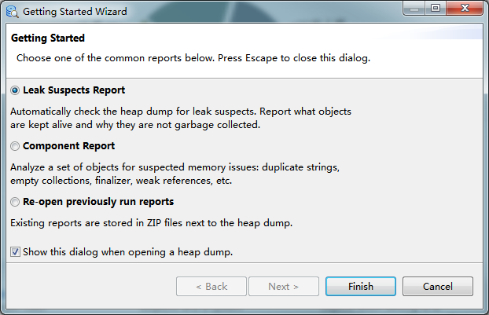
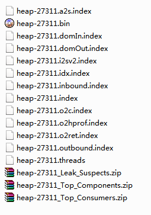
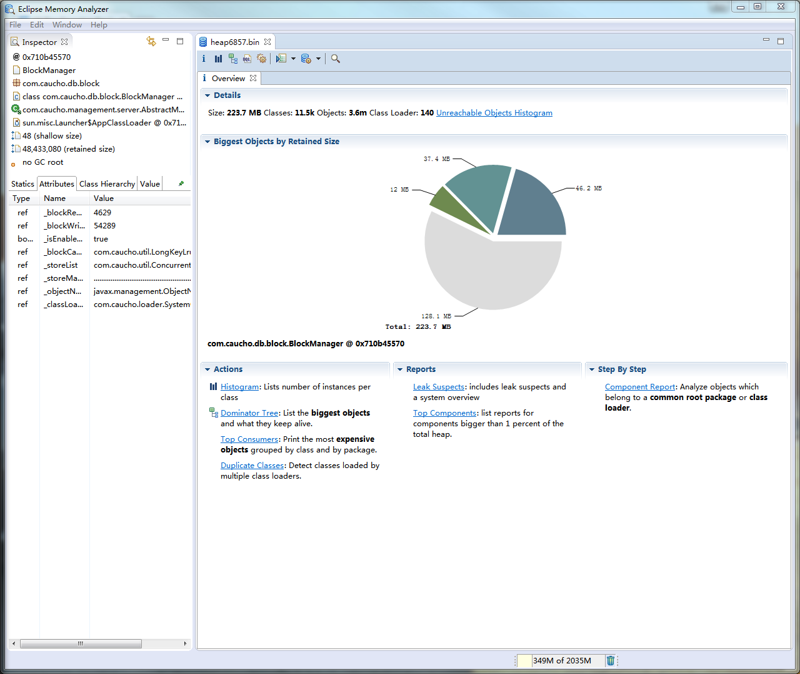

# 内存泄露分析

想要成为架构师, 要是连内存泄露都不会, 那你还不够格, 回家再练练吧.

java的内存泄露, 基本大家在工作中基本都会用到, 作为一个运维开发出生的人, 还记得以前总是给我们的架构师抓取内存文件heap.bin, 而自己其实是真的没有好好研究过真么查看或者分析这个文件的, 我觉得有些人也是懵逼的, 并不知道具体如何来查看具体哪里内存泄漏了, 今天正好也是解决了一个线上的问题, 所以总结出来, 希望和大家一起进步.

# 1. Jvm heap dump(堆转储文件)的生成

我们往往在发生内存溢出的时候, 我相信我们的日志信息是可以看到报错信息, 我相信大家的英文水平也是可以看出来是内存泄漏了(嘿嘿), 但是如果你的项目文件是200w行的代码, 我想问你, 你怎么定位你具体哪里的内存文件溢出了呢? -- 懵逼的状态, 无从下手

首先, 我们需要通过jdk自带的命令, 把我们此刻, 内存中的信息抓取出来, 就是你内存中现在是什么样子的, 比如你内存是2G, 你抓取出来的文件大小, 应该大概也是有2G左右的, , 使用jmap命令生成.

```
jmap -dump:live,format=b,file=heap-dump.bin <pid>
```

其中, pid是JVM进程的id, heap-dump.bin是生成文件的名称.

## 在JVM中增加参数生成

在JVM的配置参数中可以添加 `-XX:+HeapDumpOnOutOfMemoryError` 参数，当应用抛出 OutOfMemoryError 时自动生成dump文件；
在JVM的配置参数中添加 `-Xrunhprof:head=site` 参数，会生成java.hprof.txt 文件，不过这样会影响JVM的运行效率，不建议在生产环境中使用.

# 2. 常用的Heap Dump文件分析工具

JVM Heap Dump文件可以使用常用的分析工具如下：

## 1. jhat

[jhat](https://docs.oracle.com/javase/8/docs/technotes/tools/unix/jhat.html) 是JDK自带的用于分析JVM Heap Dump文件的工具，使用下面的命令可以将堆文件的分析结果以HTML网页的形式进行展示：

```
jhat <heap-dump-file>
```

其中 heap-dump-file 是文件的路径和文件名，可以使用 `-J-Xmx512m` 参数设置命令的内存大小。执行成功之后显示如下结果：

> Snapshot resolved.
> Started HTTP server on port 7000
> Server is ready.

这个时候访问 http://localhost:7000/ 就可以看到结果了。


**分析: 我今天试了试, 你打开本地的网页接口以后, 分析的好吗, 分析的是真的好, 但是, 菜逼的我让我来定位到问题, 我是一脸的懵逼, 除非你有时间, 有信心把所有的class文件你都研究一遍, 200w行的代码, 搞死你吧. 所以这个就不推荐了.**


## 2. IBM Heap Analyzer

IBM Heap Analyzer 是IBM公司推出的一款用于分析Heap Dump信息的工具，下载之后是一个jar文件，执行结果如下：

### 摘要

IBM HeapAnalyzer是用于发现可能的Java堆泄漏的图形工具。

### 步骤

1. 下载：[https](https://public.dhe.ibm.com/software/websphere/appserv/support/tools/HeapAnalyzer/ha457.jar) : [//public.dhe.ibm.com/software/websphere/appserv/support/tools/HeapAnalyzer/ha457.jar](https://public.dhe.ibm.com/software/websphere/appserv/support/tools/HeapAnalyzer/ha457.jar)
2. 打开终端或命令提示符，然后将目录更改为您下载JAR文件的目录。
3. 确保Java在您的PATH上以运行该工具。
4. 启动工具（根据您的可用RAM增加-Xmx）：
   java -Xmx2g -jar ha * .jar

**注**：IBM HeapAnalyzer没有新开发，因此，通常，我们建议将[Eclipse Memory Analyzer Tool（MAT）](https://www.eclipse.org/mat/)与[IBM DTFJ Extension一起](https://publib.boulder.ibm.com/httpserv/cookbook/Major_Tools-IBM_Memory_Analyzer_Tool.html#Major_Tools-IBM_Memory_Analyzer_Tool_MAT-Standalone_Installation)使用，它是开源的并且具有活跃的开发功能，并且具有类似的功能集（查找大型控制者，可疑泄漏对象）等等），以及带有特定于产品的分析引擎的IBM Extensions for Memory Analyzer。


### 附加信息

HeapAnalyzer允许通过其启发式搜索引擎并分析Java应用程序中的Java堆转储来查找可能的Java™堆泄漏区域。

Java堆区域定义对象，数组和类。当垃圾收集器在堆中分配存储区域时，对象的活动将继续，而对它的引用则处于JVM处于活动状态的某个位置。因此该对象是可到达的。当停止从活动状态引用对象时，该对象将成为垃圾，可以回收以进行重用。发生此回收时，垃圾收集器必须处理可能的终结器，并且还必须确保与该对象关联的所有内部JVM资源都返回到此类资源的池中。Java堆转储是特定时间的Java堆快照。




**分析: 今天自己也是安装了一下IBM Heap Analyzer , 通过图中的信息, 发现是有一个内存使用的一个柱状图, 我们当时定位到的一个问题, 就是一个字符串占用了内存的59.12%, 但是具体是哪个类的哪个方法导致的, 根本没法分析, 让我自己吐槽, 真的是垃圾, 但是其实官网也给出了提示信息, 不推荐大家使用这个**


## 3. Memory Analyzer

Eclipse Memory Analyzer（简称MAT）是一个功能丰富且操作简单的JVM Heap Dump分析工具，可以用来辅助发现内存泄漏减少内存占用。
使用 Memory Analyzer 来分析生产环境的 Java 堆转储文件，可以从数以百万计的对象中快速计算出对象的 Retained Size，查看是谁在阻止垃圾回收，并自动生成一个 Leak Suspect（内存泄露可疑点）报表。

### 下载与安装

Eclipse Memory Analyzer（MAT）支持两种安装方式，一是Eclipse插件的方式，另外一个就是独立运行的方式，建议使用独立运行的方式。
在 http://www.eclipse.org/mat/downloads.php 下载安装MAT，启动之后打开 File - Open Heap Dump... 菜单，然后选择生成的Heap DUmp文件，选择 "Leak Suspects Report"，然后点击 "Finish" 按钮。



### 主界面

第一次打开因为需要分析dump文件，所以需要等待一段时间进行分析，分析完成之后dump文件目录下面的文件信息如下：



上图中 heap-27311.bin 文件是原始的Heap Dump文件，zip文件是生成的html形式的报告文件。

打开之后，主界面如下所示：



接下来介绍界面中常用到的功能：


### Overview

Overview视图，即概要界面，显示了概要的信息，并展示了MAT常用的一些功能。

- Details 显示了一些统计信息，包括整个堆内存的大小、类（Class）的数量、对象（Object）的数量、类加载器（Class Loader)的数量。
- Biggest Objects by Retained Size 使用饼图的方式直观地显示了在JVM堆内存中最大的几个对象，当光标移到饼图上的时候会在左边Inspector和Attributes窗口中显示详细的信息。
- Actions 这里显示了几种常用到的操作，算是功能的快捷方式，包括 Histogram、Dominator Tree、Top Consumers、Duplicate Classes，具体的含义和用法见下面；
- Reports 列出了常用的报告信息，包括 Leak Suspects和Top Components，具体的含义和内容见下；
- Step By Step 以向导的方式引导使用功能。

### Histogram

直方图，可以查看每个类的实例（即对象）的数量和大小。

### Dominator Tree

支配树，列出Heap Dump中处于活跃状态中的最大的几个对象，默认按 retained size进行排序，因此很容易找到占用内存最多的对象。

### OQL

MAT提供了一个对象查询语言（OQL），跟SQL语言类似，将类当作表、对象当作记录行、成员变量当作表中的字段。通过OQL可以方便快捷的查询一些需要的信息，是一个非常有用的工具。

### Thread Overview

此工具可以查看生成Heap Dump文件的时候线程的运行情况，用于线程的分析。

### Run Expert System Test

可以查看分析完成的HTML形式的报告，也可以打开已经产生的分析报告文件，


**常用的主要有Leak Suspects和Top Components两种报告：**

- **Leak Suspects 可以说是非常常用的报告了，该报告分析了 Heap Dump并尝试找出内存泄漏点，最后在生成的报告中对检测到的可疑点做了详细的说明；**
- **Top Components 列出占用总堆内存超过1%的对象。**


选他就多了, 今天就是通过这个神奇的工具, 分析出来具体哪个代码, 哪个类出现了问题, 然后根据我们自己的代码逻辑, 判断出来, 判断出来了具体是哪里的问题.大概是有了定位的方向