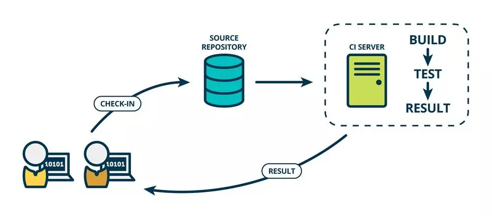
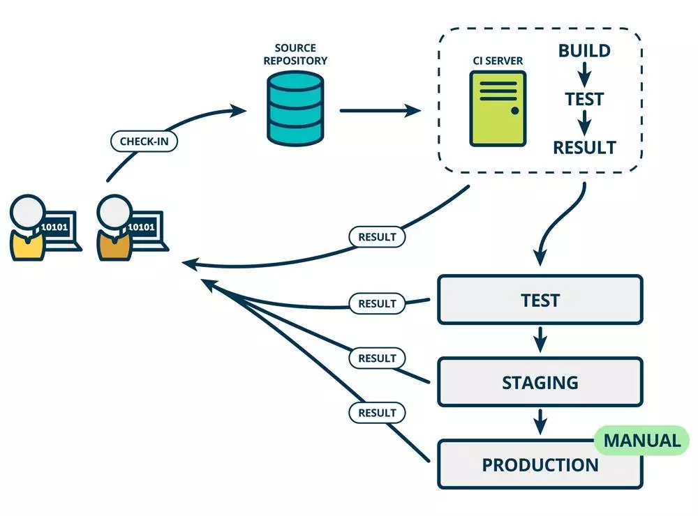
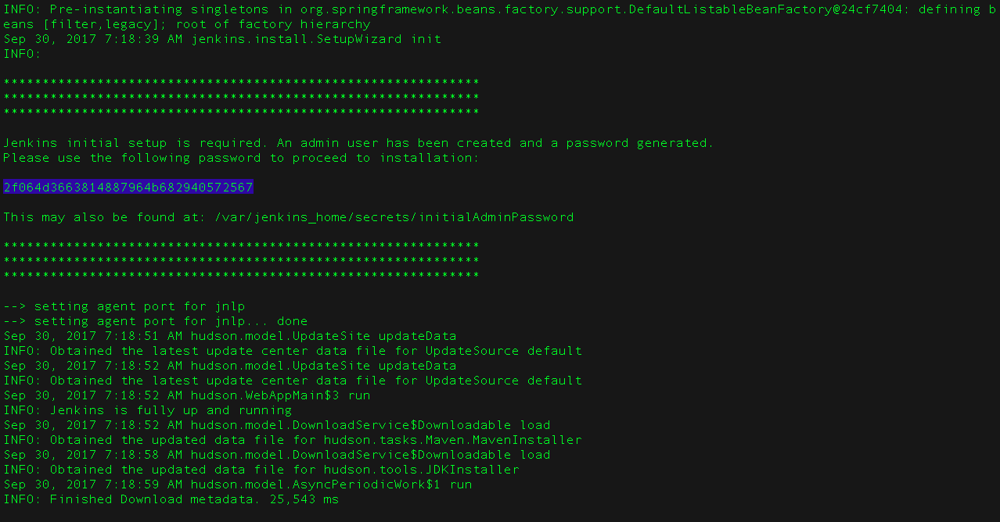
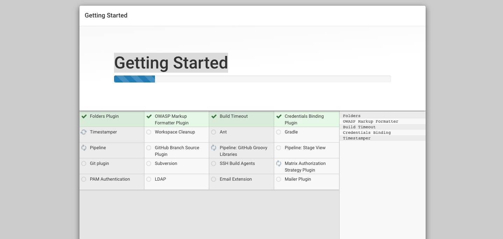

# Jenkins学习教程

# 1. Jenkins是什么?

Jenkins是一个开源的、提供友好操作界面的持续集成(CI)工具，起源于Hudson（Hudson是商用的），主要用于持续、自动的构建/测试软件项目。Jenkins用Java语言编写，可在Tomcat等流行的servlet容器中运行，也可独立运行。通常与版本管理工具(SCM)、构建工具结合使用。常用的版本控制工具有SVN、GIT，构建工具有Maven、Ant、Gradle。

# 2. CI/CD是什么?

CI(Continuous integration，中文意思是持续集成)是一种软件开发时间。持续集成强调开发人员提交了新代码之后，立刻进行构建、（单元）测试。根据测试结果，我们可以确定新代码和原有代码能否正确地集成在一起。借用网络图片对CI加以理解。




 CD(Continuous Delivery， 中文意思持续交付)是在持续集成的基础上，将集成后的代码部署到更贴近真实运行环境(类生产环境)中。比如，我们完成单元测试后，可以把代码部署到连接数据库的Staging环境中更多的测试。如果代码没有问题，可以继续手动部署到生产环境。下图反应的是CI/CD 的大概工作模式。



# 3. Jenkins自动化部署实现原理


程序员通过在gitlab提交代码, 每次push成功以后, 配置了gitlab的webhook, 调用webhook, 尽心jenkins的自动构建, 自动构建完成以后, 调用maven插件进行打包, 编译, 测试, 发布sonar, 最后通过ansible进行自动部署到每一台服务器上

# 4. 安装Jenkins

参考Jenkins中文网站https://www.jenkins.io/zh/

## 1. 系统要求

最低推荐配置:

- 256MB可用内存
- 1GB可用磁盘空间(作为一个[Docker](https://www.jenkins.io/zh/doc/book/installing/#docker)容器运行jenkins的话推荐10GB)

为小团队推荐的硬件配置:

- 1GB+可用内存
- 50 GB+ 可用磁盘空间

软件配置:

- Java 8—无论是Java运行时环境（JRE）还是Java开发工具包（JDK）都可以。

**注意:** 如果将Jenkins作为Docker 容器运行，这不是必需的

## 2. Docker安装

建议使用的Docker映像是[`jenkinsci/blueocean` image](https://hub.docker.com/r/jenkinsci/blueocean/)(来自 the [Docker Hub repository](https://hub.docker.com/))

```shell
docker pull jenkinsci/blueocean
```

```
docker run \
  -u root \
  --rm \  (1)
  -d \ (2)
  -p 8080:8080 \ (3)
  -p 50000:50000 \ (4)
  -v jenkins-data:/var/jenkins_home \ (5)
  -v /var/run/docker.sock:/var/run/docker.sock \ (6)
```

| **1** | （可选） `jenkinsci/blueocean` 关闭时自动删除Docker容器（下图为实例）。如果您需要退出Jenkins，这可以保持整洁。 |
| ----- | ------------------------------------------------------------ |
| **2** | （可选）`jenkinsci/blueocean` 在后台运行容器（即“分离”模式）并输出容器ID。如果您不指定此选项， 则在终端窗口中输出正在运行的此容器的Docker日志。 |
| **3** | 映射（例如“发布”）`jenkinsci/blueocean` 容器的端口8080到主机上的端口8080。 第一个数字代表主机上的端口，而最后一个代表容器的端口。因此，如果您为此选项指定 `-p 49000:8080` ，您将通过端口49000访问主机上的Jenkins。 |
| **4** | （可选）将 `jenkinsci/blueocean` 容器的端口50000 映射到主机上的端口50000。 如果您在其他机器上设置了一个或多个基于JNLP的Jenkins代理程序，而这些代理程序又与 `jenkinsci/blueocean` 容器交互（充当“主”Jenkins服务器，或者简称为“Jenkins主”）， 则这是必需的。默认情况下，基于JNLP的Jenkins代理通过TCP端口50000与Jenkins主站进行通信。 您可以通过“ 配置全局安全性” 页面更改Jenkins主服务器上的端口号。如果您要将您的Jenkins主机的JNLP代理端口的TCP端口 值更改为51000（例如），那么您需要重新运行Jenkins（通过此 docker run …命令）并指定此“发布”选项 -p 52000:51000，其中最后一个值与Jenkins master上的这个更改值相匹配，第一个值是Jenkins主机的主机上的端口号， 通过它，基于JNLP的Jenkins代理与Jenkins主机进行通信 - 例如52000。 |
| **5** | （可选，但强烈建议）映射在容器中的`/var/jenkins_home` 目录到具有名字 `jenkins-data` 的[volume](https://docs.docker.com/engine/admin/volumes/volumes/)。 如果这个卷不存在，那么这个 `docker run` 命令会自动为你创建卷。 如果您希望每次重新启动Jenkins（通过此 `docker run ...` 命令）时保持Jenkins状态，则此选项是必需的 。 如果你没有指定这个选项，那么在每次重新启动后，Jenkins将有效地重置为新的实例。 **注意:** 所述的 `jenkins-data` 卷也可以 [`docker volume create`](https://docs.docker.com/engine/reference/commandline/volume_create/)命令创建： `docker volume create jenkins-data` 代替映射 `/var/jenkins_home` 目录转换为Docker卷，还 可以将此目录映射到计算机本地文件系统上的目录。 例如，指定该选项 `-v $HOME/jenkins:/var/jenkins_home` 会将容器的 `/var/jenkins_home` 目录映射 到 本地计算机上目录中的 `jenkins` 子目录， 该$HOME目录通常是 `/Users//jenkins` 或`/home/<your-username>/jenkins` 。 |
| **6** | （可选 `/var/run/docker.sock` 表示Docker守护程序通过其监听的基于Unix的套接字。 该映射允许 `jenkinsci/blueocean` 容器与Docker守护进程通信， 如果 `jenkinsci/blueocean` 容器需要实例化其他Docker容器，则该守护进程是必需的。 如果运行声明式管道，其语法包含[`agent`](https://www.jenkins.io/zh/doc/book/installing/#pipeline/syntax#agent)部分用 `docker`例如， `agent { docker { ... } }` 此选项是必需的。 在[Pipeline Syntax](https://www.jenkins.io/zh/doc/book/installing/#pipeline/syntax#) 页面上阅读更多关于这个的信息 。 |
| **7** | `jenkinsci/blueocean` Docker镜像本身。如果此镜像尚未下载，则此 `docker run` 命令 将自动为您下载镜像。此外，如果自上次运行此命令后发布了此镜像的任何更新， 则再次运行此命令将自动为您下载这些已发布的镜像更新。 注意：这个Docker镜像也可以使用以下 [`docker pull`](https://docs.docker.com/engine/reference/commandline/pull/)命令独立下载（或更新） ： `docker pull jenkinsci/blueocean` **注意:** 如果复制并粘贴上面的命令片段不起作用，请尝试在此处复制并粘贴此无注释版本：`docker run \  -u root \  --rm \  -d \  -p 8080:8080 \  -p 50000:50000 \  -v jenkins-data:/var/jenkins_home \  -v /var/run/docker.sock:/var/run/docker.sock \  jenkinsci/blueocean` |

## 3. WAR文件

Jenkins的Web应用程序ARchive（WAR）文件版本可以安装在任何支持Java的操作系统或平台上。

**要下载并运行Jenkins的WAR文件版本，请执行以下操作:**

1. 将[最新的稳定Jenkins WAR包](http://mirrors.jenkins.io/war-stable/latest/jenkins.war) 下载到您计算机上的相应目录。
2. 在下载的目录内打开一个终端/命令提示符窗口到。
3. 运行命令java -jar jenkins.war
4. 浏览http://localhost:8080并等到*Unlock Jenkins*页面出现。
5. 继续使用[Post-installation setup wizard](https://www.jenkins.io/zh/doc/book/installing/#setup-wizard)后面步骤设置向导。

将[最新的稳定Jenkins WAR包](http://mirrors.jenkins.io/war-stable/latest/jenkins.war)下载到您计算机上的相应目录。

**Notes:**

- 不像在Docker中下载和运行有Blue Ocean的Jenkins，这个过程不会自动安装Blue Ocean功能， 这将分别需要在jenkins上通过 [**Manage Jenkins**](https://www.jenkins.io/zh/doc/book/managing) > [**Manage Plugins**](https://www.jenkins.io/zh/doc/book/managing/plugins/)安装。 在[Getting started with Blue Ocean](https://www.jenkins.io/zh/doc/book/blueocean/getting-started/)有关于安装Blue Ocean的详细信息 。.
- 您可以通过`--httpPort`在运行`java -jar jenkins.war`命令时指定选项来更改端口。例如，要通过端口9090访问Jenkins，请使用以下命令运行Jenkins： `java -jar jenkins.war --httpPort=9090`

## 4. mac上安装

从网站安装的话使用这个包:

- [Download the latest package](http://mirrors.jenkins.io/osx/latest)
- 打开包装并按照说明操作

Jenkins 也可以使用`brew`以下方式安装：

- 安装最新版本

```
brew install jenkins
```

- 安装 LTS 版本

```
brew install jenkins-lts
```

## 5. linux上安装

在基于Debian的发行版（如Ubuntu）上，您可通过`apt`安装Jenkins

在[an apt repository](https://pkg.jenkins.io/debian/)可获得最新版本，较老但稳定的LTS版本在[this apt repository](https://pkg.jenkins.io/debian-stable/)这里可获得

```
wget -q -O - https://pkg.jenkins.io/debian/jenkins.io.key | sudo apt-key add -
sudo sh -c 'echo deb http://pkg.jenkins.io/debian-stable binary/ > /etc/apt/sources.list.d/jenkins.list'
sudo apt-get update
sudo apt-get install jenkins
```

安装这个软件包将会：

- 将Jenkins设置为启动时启动的守护进程。查看`/etc/init.d/jenkins`获取更多细节
- 创建一个'`jenkins`'用户来运行此服务
- 直接将控制台日志输出到文件`/var/log/jenkins/jenkins.log`。如果您正在解决Jenkins问题，请检查此文件
- /etc/default/jenkins`为启动填充配置参数，例如JENKINS_HOME
- 将Jenkins设置为在端口8080上进行监听。使用浏览器访问此端口以开始配置

如果你的`/etc/init.d/jenkins`文件无法启动Jenkins，编辑`/etc/default/jenkins`， 修改 `----HTTP_PORT=8080----`为`----HTTP_PORT=8081----` 在这里，“8081”也可被换为其他可用端口。

## 6. 安装后设置向导

### 解锁 Jenkins

当您第一次访问新的Jenkins实例时，系统会要求您使用自动生成的密码对其进行解锁。

1. 浏览到 `http://localhost:8080`（或安装时为Jenkins配置的任何端口），并等待 **解锁 Jenkins** 页面出现。


从Jenkins控制台日志输出中，复制自动生成的字母数字密码（在两组星号之间）。



### 自定义jenkins插件

[解锁 Jenkins](https://www.jenkins.io/zh/doc/book/installing/#unlocking-jenkins)之后，在 **Customize Jenkins** 页面内， 您可以安装任何数量的有用插件作为您初始步骤的一部分。

两个选项可以设置:

- **安装建议的插件** - 安装推荐的一组插件，这些插件基于最常见的用例.
- **选择要安装的插件** - 选择安装的插件集。当你第一次访问插件选择页面时，默认选择建议的插件。

  如果您不确定需要哪些插件，请选择 **安装建议的插件** 。 您可以通过Jenkins中的[**Manage Jenkins**](https://www.jenkins.io/zh/doc/book/managing) > [**Manage Plugins**](https://www.jenkins.io/zh/doc/book/managing/plugins/) 页面在稍后的时间点安装（或删除）其他Jenkins插件 。

设置向导显示正在配置的Jenkins的进程以及您正在安装的所选Jenkins插件集。这个过程可能需要几分钟的时间

### 创建第一个管理员用户

最后，在[customizing Jenkins with plugins](https://www.jenkins.io/zh/doc/book/installing/#customizing-jenkins-with-plugins)之后，Jenkins要求您创建第一个管理员用户。 . 出现“ **创建第一个管理员用户** ”页面时， 请在各个字段中指定管理员用户的详细信息，然后单击 **保存完成** 。 . 当 **Jenkins准备好了** 出现时，单击*开始使用 Jenkins*。

**Notes:** * 这个页面可能显示 **Jenkins几乎准备好了!** 相反，如果是这样，请单击 **重启** 。 * 如果该页面在一分钟后不会自动刷新，请使用Web浏览器手动刷新页面。如果需要，请使用您刚刚创建的用户的凭据登录到Jenkins，并准备好开始使用Jenkins！

从这时起，Jenkins用户界面只能通过提供有效的用户名和密码凭证来访问。



