# jenkins的pipeline

# 1. 新建一个item

首先, 新建一个item, 

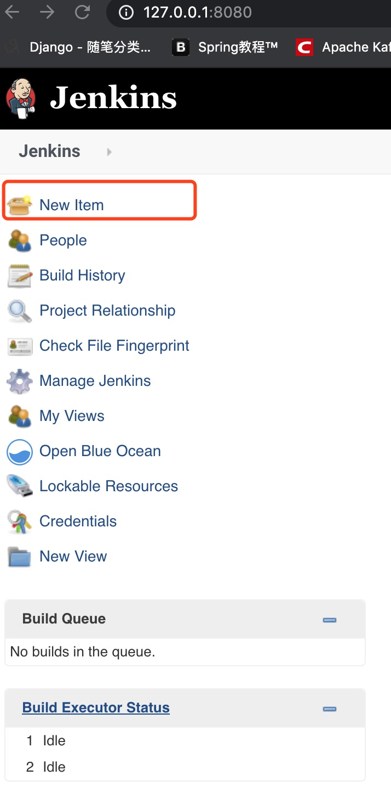

2. 我们先创建一个自由风格的项目来练练手吧

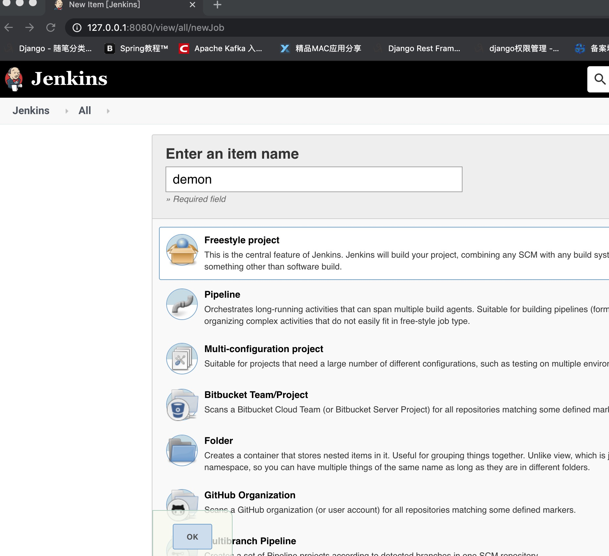

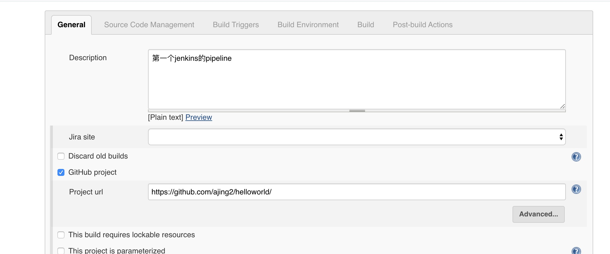

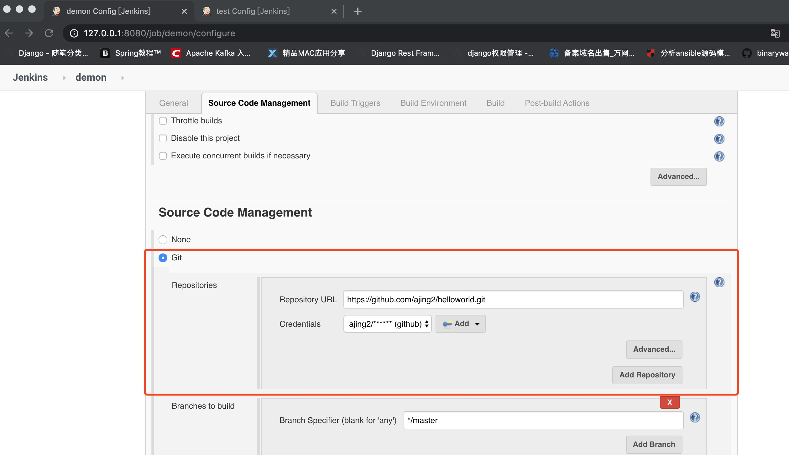

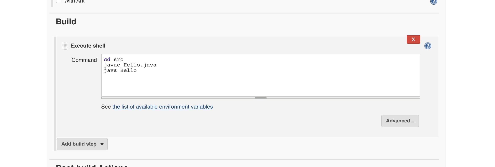

3. 配置github地址, 编译命令行操作, 最后进行保存
4. 查看日志

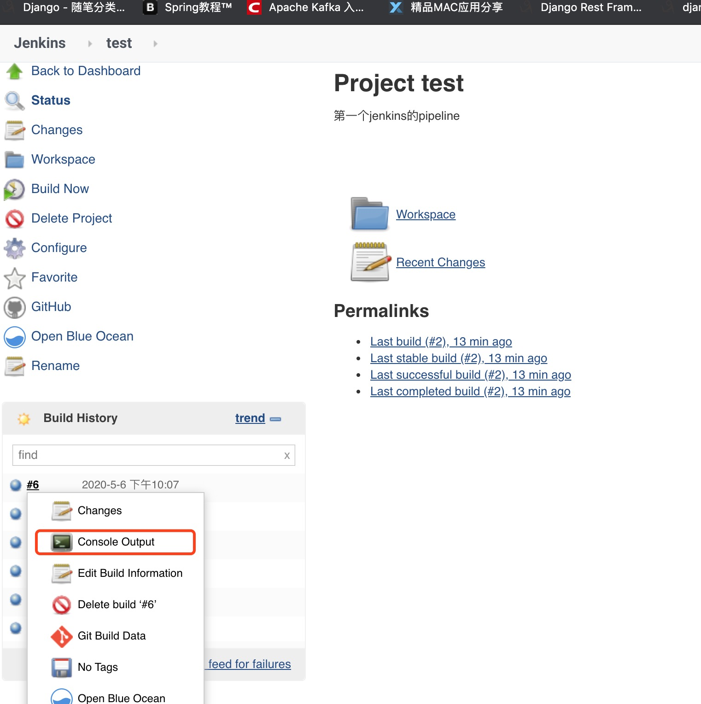

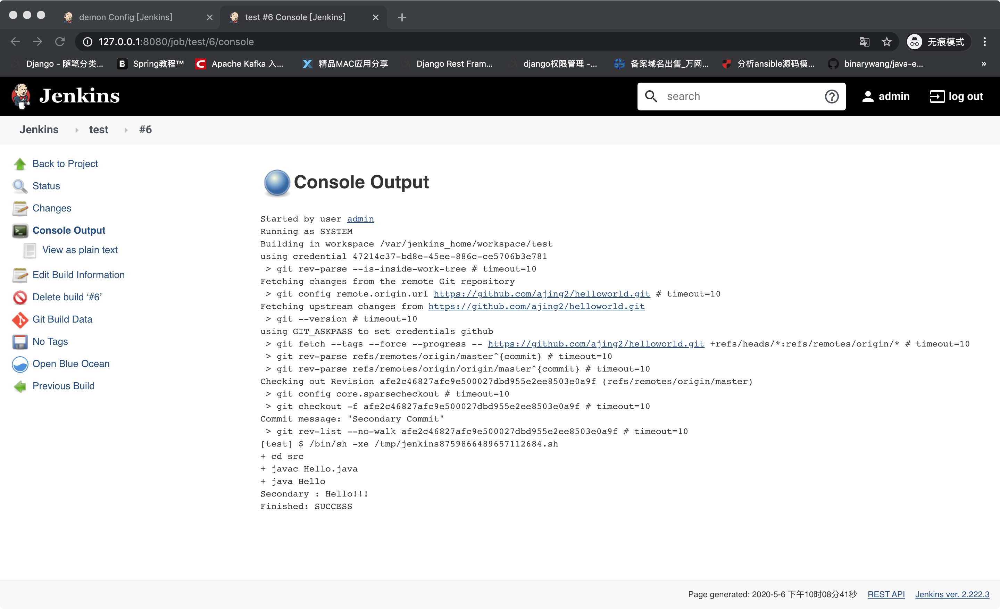

根据上面的步骤, 我们就完成一个简单的项目构建了.

以上是一个很简单的例子, 但是我们在平时工作中, 或者在devops平台上, 我们基本都不是这样用的, 如果每次都这么配置的话, 应该是会搞死我们的, 每天devops项目需要接入到很多项目中, 为了让我们从更多的配置工作中解脱出来, 我们可以使用pipeline进行构建, 并提取出公共参数, 我们可以通过jenkins接口的方式来实现自动化构建, 可以大大释放我们的生产力.

# 2. 常用插件

## 1. Extended Choice Parameter

该插件可以进行参数化构建, 

下面我们来看一下常用的文本参数构建

1. 字符串参数
2. 文本参数

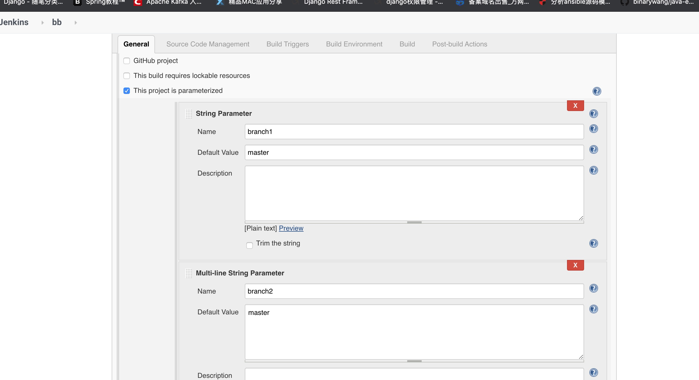

打印参数

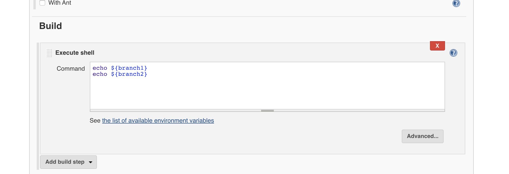

参数化构建

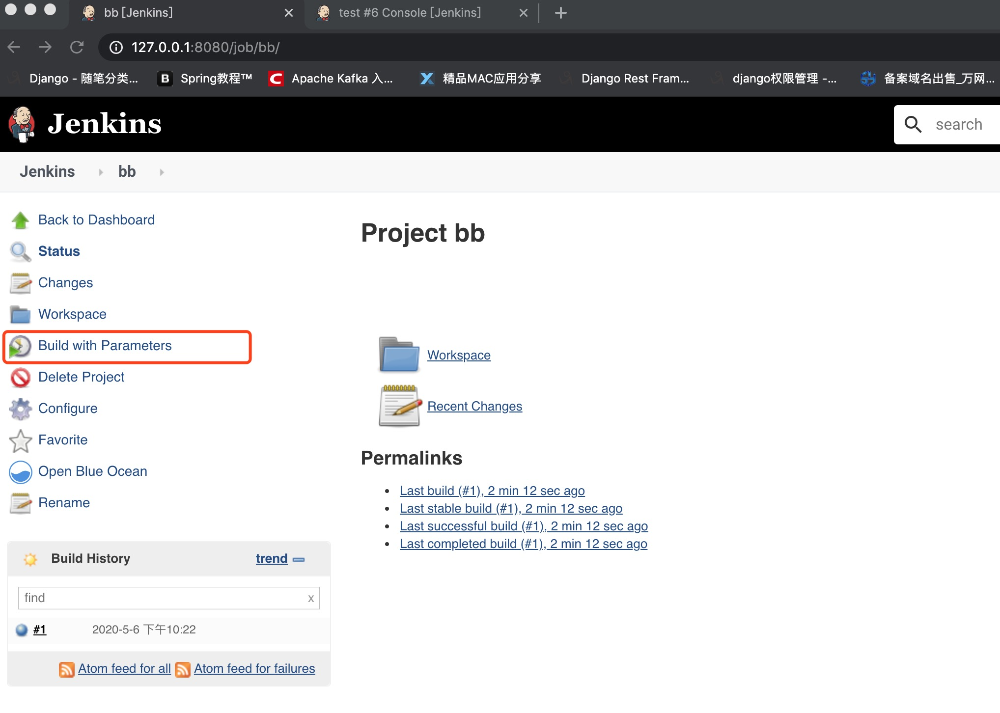

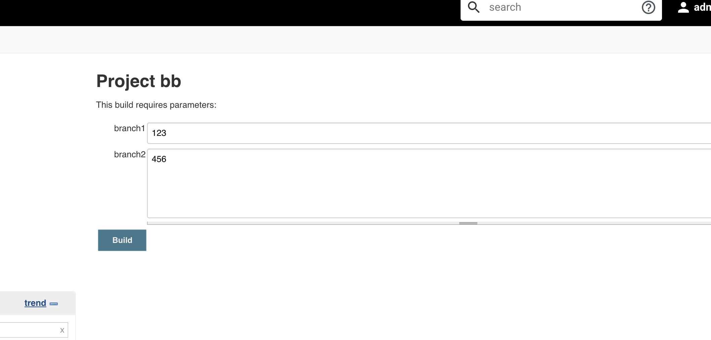

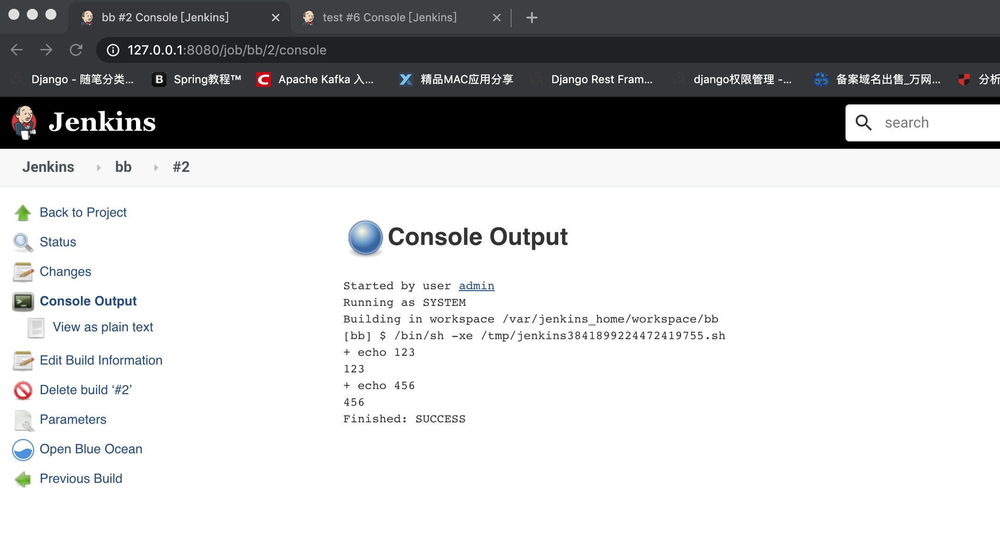

## 2. Git Parameter

该插件可以查看到git的branch, tag, 等诸多关于git的相关信息

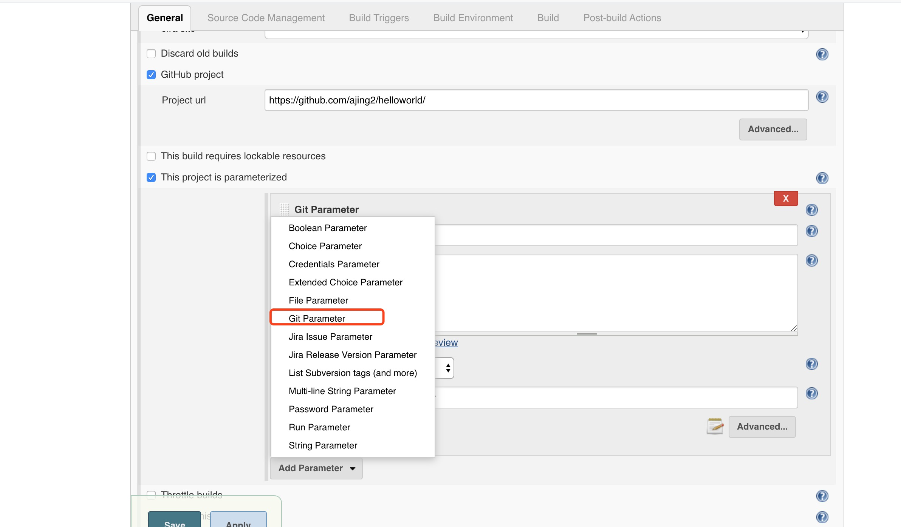

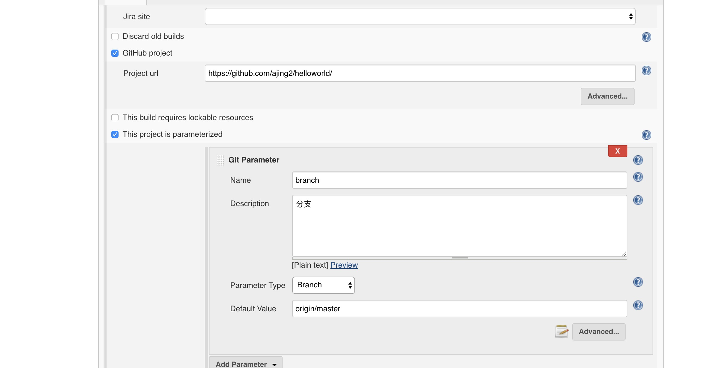

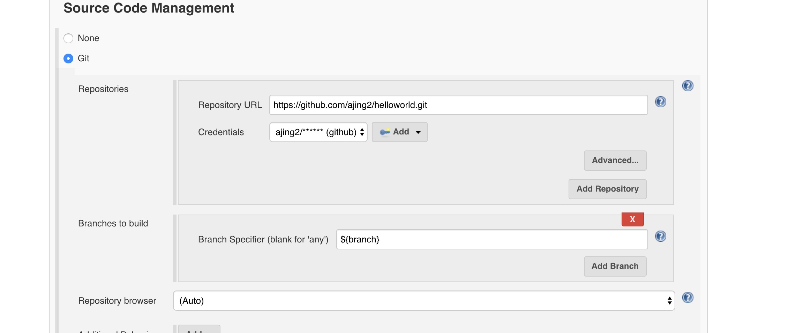

会自动拉出来我们的git的相关分支信息, 并展示出来, 可以选择相对应的分支, 进行构建

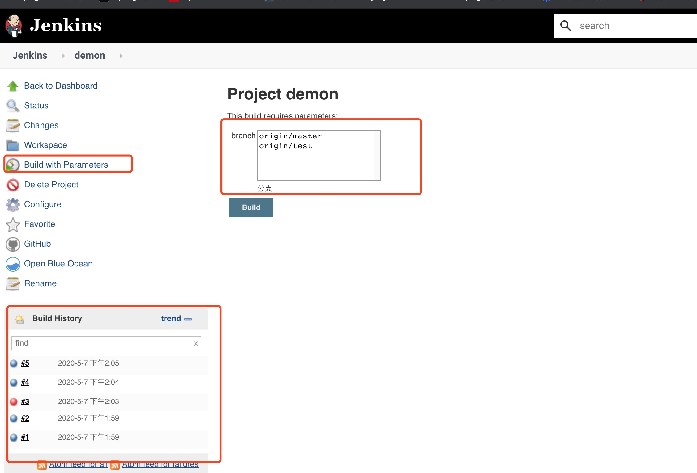