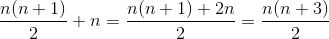

# 1. 概述

上学学数据结构的时候， 应该是学习过时间复杂度和空间复杂度的， 但是工作以后， 就早早还给老师了。 

后来刷算法题的时候， 总是提及时间复杂度和空间复杂度， 而感觉自己没有真正的理解到位，现在特意梳理出来， 做一个总结， 对以后自己刷题起到一个很大的帮助。

我们先假设所有的代码执行环境带来的影响，

时间复杂度越小， 说明程序执行的时间越快。

空间复杂度越小， 说明程序占用的空间最小

时间复杂度和空间复杂度最小的， 我们认为是最优解


# 2. 时间复杂度

由于我们忽略了代码运行环境带来的影响，所以在这之前，我们最好要定义一些衡量时间消耗的标准，而这个标准是和运行环境没有任何关系的，所以肯定不能是代码运行花费的实际时间（因为我们要得出一个算法的运行时间，就必须要在一个特定的环境上运行该代码）。于是我们引出了"步"的概念：一个算法在特定输入上的运行时间是指执行的基本操作数或步数。（引自<<算法导论>>）


首先，一个算法被任何语言实现后，比如包装成一个方法，这个方法就是一行行基础代码的集合，代码运行的时候，就是这些代码被按顺序、循环、跳转等规则执行。我们设第n行代码执行需要消耗Tn的时间，而第n行代码会被执行Qn次，那么这个方法运行需要花费的总时间Ts我们可以得出来：

```
  Ts = T1*Q1+T2*Q2+...+Tn*Qn。
```

然后，我们可以假设CPU执行每一行基础代码的时间消耗是大致相同的，也就是：T1==T2==T3==...==Tn==常量T，这个假设是复杂度理论的基础。那么上面的公式就成了:

```
 Ts = (Q1+Q2+...+Qn)*T
```

从这里我们可以看出来，T是常量，于是方法运行的总时间是和每行代码执行的次数和成正比的。上面也说了，我们目的就是要找出一个"趋势"，具体花费多少时间我们并不是太过关心，所以我们就得出了时间复杂度经典的"O"表达式：

```
T(n) = O(f(n))
```

这里的T(n)表示的就是代码运行的时间，其实也就是我们上面的Ts，只是这个(n)表示的是数据规模，f(n)表示的是计算代码执行次数的表达式，O则表示执行时间T(n)和代码执行次数总和f(n)成正比。下面我们来结合具体例子说明一下(代码仅供分析哈)：

```
1 public int calculate(int n) {
2     int result = 1;
3     for (int i = 1; i <= n; i++) {
4         result *= i;
5     }
6     return result;
7 }
```

上述代码中每行我都加了行号，我们来计算一下：第2行和第6行代码会运行1次，而第3行和第4行会运行n次，设CPU运行每行代码都会有T的时间消耗，那么总的时间消耗就是：(2+2n)*T，这里的f(n)=2+2n。由于我们认为T是常量，所以总的时间消耗就是和f(n)成正比的，也就是我们上面提到的：T(n)=O(f(n))。所以我们的任务就成了找到f(n)的表达式。比如如下代码（代码随便写的哈，仅用于分析）：

```
1 public static void test(int n) {
2     int j;
3     for (int i = 1; i <= n; i++) {
4         System.out.println(i);
5         for (j = 1; j <= n; j++) {
6             System.out.println(j);
7         }
8     }
9 }
```

上述代码中，第2行运行1次，第3行和4行运行n次，第5行和6行运行n^2次，那么总的次数，也就是f(n)=1+2n+2n^2。

我们举了两个例子，一个f(n)=2+2n，一个f(n)=1+2n+2n^2。现在已经知道，其实我们得出来的并不是一个具体的运行时间，只是一个函数关系，这个函数表征的就是随数据规模n的变化，算法的时间消耗是一个什么样的走势，所以时间复杂度又叫做“渐进时间复杂度”。

现在来考虑另外一个问题，上面列出的两个f(n)中，当n变的很大很大的时候，我们就会发现常数、n的系数、还有相对的低阶表达式对于整个的结果并不会产生太大的影响。所以通常我们只保留最高阶的表达式去除系数的情况即可，比如，2+2n简化后成了：n；1+2n+2n^2简化后成了：n^2。于是乎，对应的T(n)变成了，T(n)=O(2+2n)=>O(n)，T(n)=O(1+2n+2n^2)=>O(n^2)。这个就是我们所熟悉的大O了。
一些我们比较常用的时间复杂度也就那么几种，像O(n)、O(1)、O(n^2)、O(logn)等等，如下（在百度找的图）：


可能有些小伙伴不是特别理解O(logn)这一种时间复杂度是怎么来的，我们这里举个例子说一下，以下方法的功能是判断一个数是否为2的乘方(当然我们有更好的方法，只是在我的面试经历中，大多数应聘者都是这样做的.)：

```
public boolean isValidNum(int n){
    if (n <= 0) {
        return false;
    }
    int i = 1;
    while (i <= n) {
        i <<= 1;
    }
    return i == n;
}
```

我们来分析一下这段代码的时间复杂度，其它没有什么说的，主要就是while循环里的代码：i <<= 1;这行代码会执行多少次呢？

看得出来，每次循环就在 i 的基础上乘以2，我们设这行代码会运行x次，那么可以得出，2的x次幂大于等于n的时候退出循环。那么，x就是以2为底n的对数：x=log<sub>2</sub>n，这里的底数为2。可是有人可能会问，以2为底和以3为底是不一样的啊？其实是这样的，如果时间复杂度算出来是以3为底log<sub>3</sub>n：，可以根据对数公式做一个转化：log<sub>3</sub>n= log<sub>3</sub>2*log<sub>2</sub>n 。log<sub>3</sub>2是一个常量，而根据我们前面所说的忽略常量系数，简化后又成了log<sub>2</sub>n：。所以在我们算时间复杂度的时候，不管以多少为底，都可以认为是“一样的”，于是所有对数阶的时间复杂度都写作：O(logn)。有了logn，那么nlogn相信大家也就明白了。


# 3. 时间复杂度计算技巧

最开始我们就说过，我们的目的是简单的评估一个算法的优劣，按照上述的说法感觉也要花不少的时间去计算一个函数表达式，然后再化简。我们需要一个简单的方法！这里给出几个我自己常用的评估标准。

1.只关注循环次数最多的那一段代码。由于我们最终也会忽略常数、系数、低阶等等，所以我们在初步计算的时候就直接忽略它们，没毛病。

2.如果存在方法嵌套的情况，最终的复杂度就是嵌套内外复杂度的积。这个也好理解，外层运行m次，里层运行n次，那么里层则运行m*n次，外层较内层属于低阶，可以忽略。

3.如果我们的方法很复杂，比如几十上百行，我们只需要计算最“复杂”的那一段代码的复杂度即可，原理类似于忽略低阶。

4.不论代码有多少行，一般如果没有循环、递归等可能涉及到迭代操作的，时间复杂度都是O(1)。

# 4. 空间复杂度

其实空间复杂度和时间复杂度是类似的，时间复杂度表征的是随输入数据规模的变化，其时间消耗的变化趋势，空间复杂度则为随输入数据规模的变化，其空间消耗的变化趋势。

还是以一个简单的java例子说明一下（代码本身没有任何意义）：

```
public void test(int n){
    int i = 0;
    int[] array = new int[n];
    for (; i < n; i++) {
        array[i] = i;
    }
}
```

第一步我们需要4个字节的空间存储i变量的值(0)，然后需要4n字节的空间存储array数组，后面就没有申请多余的内存了。首先i变量的空间消耗和n是没有关系的，所以我们认为它是常量阶，而array的空间消耗是和n成正比关系的，所以最终我们的空间复杂度为：O(n)。空间复杂度相对于时间复杂度要简单一些，而且都是比较简单的一些复杂度原型，比如O(n)、O(n^2)之类的，像对数阶的空间复杂度是不会常见的。


对于空间复杂度的估量，只需要注意一点。就是在计算的时候，我们的侧重点是算法消耗的“多余的”内存空间，而输入数据本身的需要占用的内存，我们认为是“必须的”，不用算到复杂度里。


# 5. 扩展（最好情况时间复杂度、最坏情况时间复杂度、平均时间复杂度、均摊时间复杂度）

一开始我们就提出了，代码运行具体的时间消耗是和输入数据本身有莫大的联系的。怎么理解这句话呢？比如以下代码（目的是找到array数组中第一个c字符的下标）：

```
public int findIndex(char[] array, char c) {
       int i = 0;
       int index = -1;
       for (; i < array.length; i++) {
           if (c == array[i]) {
               index = i;
               break;
           }
       }
       return index;
}
```

我们想一下，如果c字符就在array数组的第一个位置上，那么for循环里面的代码只需要运行一次，最终我们的时间复杂度就是O(1);又如果c字符在array数组的最后一个位置上，或者array数组里根本就不存在c字符，那么循环里的代码就需要运行n次，n为array的长度，时间复杂度就成了O(n)。这里就引出了我们的最好情况时间复杂度、最坏情况时间复杂度。就如字面意思一样，上述代码的最好情况时间复杂度为：O(1)，最坏情况时间复杂度为：O(n)。而我们很清楚，无论是最好情况还是最坏情况，都是极小可能出现的，代表不了绝大多数情况，于是我们又引入了平均时间复杂度的概念。


上述代码中，我们先想想循环内的代码运行次数会有多少种情况？答案是n+1种。也就是c出现在array中的任何一个位置都是一个情况，比如出现在第一个位置、第二个位置等等，对应循环代码运行的次数就是1、2...n，于是就有了n种情况；另外还有一种：c字符不存在于array数组中，这个时候循环次数也是n。于是我们得出了，一共有n+1种情况，每种情况循环次数的累加为：1+2+3+...+n+n。

看得出来,1,2,3,...,n是一个等差数列，根据等差数列求和公式：Sn=n(a1+an)/2，可以得出：1+2+3+...+n+n=




然后我们用上述和除以总的情况数：n+1。也就是每种情况的步数和除以情况的个数，这个和数学中算平均的概念是一样的，比如平均速率就是一段时间内走的路程除以花费的总时间。这里得到的结果就是：，根据我们的忽略常数、系数、低阶的标准，就成了： (n<sup>2</sup> + 3n) / n=> n+3 => n。所以我们得出平均时间复杂度为：O(n)。

可是在理论上，这还没有完，我们在计算平均时间复杂度的时候忽略了一个东西：权重（权数）。也就是我们上述的1+2+3+...+n+n，不应该只是简单的相加，它们是不同情况下的组合，每种情况发生的概率呢？这个就是数学中的加权平均值的概念，通常情况下，如果没有权重，我们得出的平均概念是不够客观的。


举个简单的不怎么恰当的例子，你明天中午去餐馆吃饭的几率是90%，买菜在家自己做的几率是10%，而去餐馆吃饭需要花费50元，自己买菜做需要花费10元，那我们"平均"的消费是(50+10)/2=30吗？这个明显不客观，我们需要把几率这个权重引入到计算中，才算比较“客观”。（当然我们了解的数学中的加权平均值大多表示某一个子项的重要程度）

回到平均时间复杂度的例子上，我们需要把1+2+3+..+n+n里的每个子项都算上对应的权重，也就是出现该情况的几率，而并不是单纯的加起来然后除以n+1这么简单。比如可以简单的认为，c出现在array中和不出现在array中的概率相同，为1/2。而如果出现在array中，又出现在array的每一个位置的概率相同，为1/n。那么我们可以得出，1+2+3+...+n+n 中对应每项的概率为：1/2n、1/2n、1/2n、...、1/2n、1/2，带入我们之前的计算过程中，我们就得到最终的平均时间复杂度为：
1\*1/2n + 2\*1/2n+...+n\*1/2n+n*1/2 = (3n+1)/4

我们发现，在忽略常数阶之后，其结果也是O(n)。而对应的，我们应该称他为：**加权平均时间复杂度**。


最后还有一个均摊时间复杂度，这里做一个简单的说明。首先均摊时间复杂度涉及到一个摊还分析的概念，它区别于我们上面引出的平均时间复杂度，适用的场景比较少。比如一个算法中，如果我们绝大多数情况的时间复杂度都很低，极少情况的时间复杂度才比较高，而这些操作之间又有一定的时序关系，我们就可以把高时间复杂度“均摊”到低时间复杂度上，而在通常情况下，均摊的结果一般就等于低时间复杂度（感兴趣的小伙伴可以自行“设计”一个符合均摊概念的算法试试）


# 6. 总结

我们要明确一点，时间复杂度和空间复杂度是一个理论上的模型，它们的目的是提供给我们一种可以在短时间内评估代码在大多数情况下的一个性能消耗随数据集规模变化的走势，让我们对代码的“优劣”有一个大致的了解，但是这种了解是感性的，它并不代表最终的结果。比如理论上，O(logn)是要优于O(n)的，但是根据输入数据的不同，结果可能会不符合我们的“预期”（后面讲解具体的算法的时候会提到），我们在选择算法的时候要根据实际情况综合分析。而我们提到的复杂度有很多，什么最好情况、最坏情况、加权平均、均摊等等，看起来还是很复杂，其实我们在绝大多数情况下，只用一种分析方式分析就可以了，不要忘记我们的初衷，除非你需要这么做。
