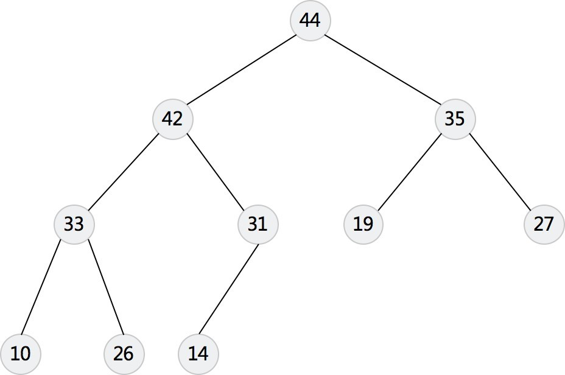

# 优先队列（PriorityQueue）

# 1. 回顾

Stack(堆栈): 先进后出

Queue（队列）: 先进先出

PriorityQueue（优先队列）:正常入， 按照优先级出


# 2. 最大堆和最小堆

## 1. 最小堆


## 2. 最大堆



## 3. heap wiki

•  https://en.wikipedia.org/wiki/Heap_(data_structure)

•  Google 搜索 **heap** 或者 **堆**


# 3. 优先队列的在代码的使用

## 1. java

Java通过PriorityQueue类来实现最大堆和最小堆。

实际上是一个堆（不指定Comparator时默认为最小堆），通过传入自定义的Comparator函数可以实现大顶堆。

```java
PriorityQueue<Integer> minHeap = new PriorityQueue<Integer>(); //小顶堆，默认容量为11
PriorityQueue<Integer> maxHeap = new PriorityQueue<Integer>(11, new Comparator<Integer>() { //大顶堆，容量11
    @Override
    public int compare(Integer i1,Integer i2){
        return i2-i1;
    }
});
```

| 方法摘要                 |                                                              |
| ------------------------ | ------------------------------------------------------------ |
| ` boolean`               | `**add**(E e)`      将指定的元素插入此优先级队列。           |
| ` void`                  | `**clear**()`      从此优先级队列中移除所有元素。            |
| ` Comparator<? super E>` | `**comparator**()`      返回用来对此队列中的元素进行排序的比较器；如果此队列根据其元素的自然顺序进行排序，则返回 `null`。 |
| ` boolean`               | `**contains**(Object o)`      如果此队列包含指定的元素，则返回 `true`。 |
| ` Iterator<E>`           | `**iterator**()`      返回在此队列中的元素上进行迭代的迭代器。 |
| ` boolean`               | `**offer**(E e)`      将指定的元素插入此优先级队列。         |
| ` E`                     | `**peek**()`      获取但不移除此队列的头；如果此队列为空，则返回 `null`。 |
| ` E`                     | `**poll**()`      获取并移除此队列的头，如果此队列为空，则返回 `null`。 |
| ` boolean`               | `**remove**(Object o)`      从此队列中移除指定元素的单个实例（如果存在）。 |
| ` int`                   | `**size**()`      返回此 collection 中的元素数。             |
| ` Object[]`              | `**toArray**()`      返回一个包含此队列所有元素的数组。      |
| `<T> T[]`                | `**toArray**(T[] a)`      返回一个包含此队列所有元素的数组；返回数组的运行时类型是指定数组的类型。 |


## 2. python

### 1. 堆

#### 1. heapq

```
import heapq
#向堆中插入元素，heapq会维护列表heap中的元素保持堆的性质
heapq.heappush(heap, item)
#heapq把列表x转换成堆
heapq.heapify(x)
#从可迭代的迭代器中返回最大的n个数，可以指定比较的key
heapq.nlargest(n, iterable[, key])
#从可迭代的迭代器中返回最小的n个数，可以指定比较的key
heapq.nsmallest(n, iterable[, key])
#从堆中删除元素，返回值是堆中最小或者最大的元素
heapq.heappop(heap)
```

#### 2. 插入数字

从上述源代码可以看出来，heapq使用的内置的小于号，或者类的**__lt__**比较运算来进行比较。

```
def heapq_int():
    heap = []
    #以堆的形式插入堆
    heapq.heappush(heap,10)
    heapq.heappush(heap,1)
    heapq.heappush(heap,10/2)
    [heapq.heappush(heap,i) for i in  range(10)]
    [heapq.heappush(heap,10 - i) for i in  range(10)]
    #最大的10个元素
    print heapq.nlargest(10,heap)
    #输出所有元素
    print [heapq.heappop(heap) for i in range(len(heap))]
```

#### 3. 插入元祖

元素会默认调用内置比较函数cmp

```
def heapq_tuple():
    heap = []
    #向推中插入元组
    heapq.heappush(heap,(10,'ten'))
    heapq.heappush(heap,(1,'one'))
    heapq.heappush(heap,(10/2,'five'))
    while heap:
        print heapq.heappop(heap),
    print
```

#### 4. 插入类

类类型，使用的是小于号***_lt_\***，当然没有重写但是有其他的比较函数例如：***_le_\***,***_gt_\***,***_cmp_\***,也是会调用的，和小于号等价的都可以调用(测试了gt)，具体的这些操作之间的关系我也没有研究过。如果类里面没有重写***_lt_\***，会调用其他的比较操作符，从源代码可以看出来，如果没有***_lt_\***，那么会调用***_ge_\***函数。
所以可以重写上述的那些函数：

```
class Skill(object):
    def __init__(self,priority,description):
        self.priority = priority
        self.description = description
    def __lt__(self,other):#operator < 
        return self.priority < other.priority
    def __ge__(self,other):#oprator >=
        return self.priority >= other.priority
    def __le__(self,other):#oprator <=
        return self.priority <= other.priority
    def __cmp__(self,other):
        #call global(builtin) function cmp for int
        return cmp(self.priority,other.priority)
    def __str__(self):
        return '(' + str(self.priority)+',\'' + self.description + '\')'

def heapq_class():
    heap  = []
    heapq.heappush(heap,Skill(5,'proficient'))
    heapq.heappush(heap,Skill(10,'expert'))
    heapq.heappush(heap,Skill(1,'novice'))
    while heap:
        print heapq.heappop(heap),
    print 
```

### 2. PriorityQueue

PriorityQueue的python源代码[PriorityQueue](https://hg.python.org/cpython/file/2.7/Lib/Queue.py)
从源代码可以看出来，PriorityQueue使用的就是heapq来实现的，所以可以认为两者算法本质上是一样的。当然PriorityQueue考虑到了线程安全的问题。
下面给出PriorityQueue的部分API和使用方法

```python
try:
    import Queue as Q #python version < 3.0
except ImportError:
    import queue as Q #python3.*
```

```python
#向队列中添加元素
Queue.put(item[, block[, timeout]])
#从队列中获取元素
Queue.get([block[, timeout]])
#队列判空
Queue.empty()
#队列大小
Queue.qsize()
```


#### 1. 插入数字

直接调用内置函数cmp进行比较

```
try:
    import Queue as Q #python version < 3.0
except ImportError:
    import queue as Q #python3.*
def PriorityQueue_int():
    que = Q.PriorityQueue()
    que.put(10)
    que.put(1)
    que.put(5)
    while not que.empty():
        print que.get(),
    print
```


#### 2. 插入元祖

```
def PriorityQueue_tuple():
    que = Q.PriorityQueue()
    que.put((10,'ten'))
    que.put((1,'one'))
    que.put((10/2,'five'))
    while not que.empty():
        print que.get(),
    print
```

#### 3. 插入类

```
class Skill(object):
    def __init__(self,priority,description):
        self.priority = priority
        self.description = description
    #下面两个方法重写一个就可以了
    def __lt__(self,other):#operator < 
        return self.priority < other.priority
    def __cmp__(self,other):
        #call global(builtin) function cmp for int
        return cmp(self.priority,other.priority)
    def __str__(self):
        return '(' + str(self.priority)+',\'' + self.description + '\')'

def PriorityQueue_class():
    que = Q.PriorityQueue()
    skill5 = Skill(5,'proficient')
    skill6 = Skill(6,'proficient6')
    que.put(skill6)
    que.put(Skill(5,'proficient'))
    que.put(Skill(10,'expert'))
    que.put(Skill(1,'novice'))
    while not que.empty():
        print que.get(),
    print
```


# 4. 实战题目

## 1. leetcode 703 [数据流中的第K大元素](https://leetcode-cn.com/problems/kth-largest-element-in-a-stream/)

首先先来简化分析， 如果是要找数据流中最大的元素， 是不是就简单了， 只需要保存最大元素就好了， 

第一种方法， 保存K个元素， 每次都堆K个元素进行排序， 然后维护K个元素

第二种方法： 通过优先队列来实现， 最小堆， 每个元素都跟K中最小的元素比， 对顶的时间复杂度为O(1)， 

不满足K个元素， 直接加入， 满足K个元素， 看是否比堆顶元素大， 如果小， 直接跳过， 如果大， 维护最小堆

java代码如下：

```java
public class KthLargest {

    private PriorityQueue<Integer> queue;
    private int limit;

    public KthLargest(int k, int[] nums) {
        limit = k;
        queue = new PriorityQueue<>(k);
        for (int num : nums) {
            add(num);
        }
    }

    public int add(int val) {
        if (queue.size() < limit) {
            queue.add(val);
        } else if (val > queue.peek()) {
            queue.poll();
            queue.add(val);
        }

        return queue.peek();
    }

}
```

python的解法：

```python
# 2.小顶堆
import heapq
class KthLargest(object):

    def __init__(self, k, nums):
        """
        :type k: int
        :type nums: List[int]
        """
        self.pool = nums
        self.size = len(self.pool)
        self.k = k
        heapq.heapify(self.pool)
        while self.size > k:
            heapq.heappop(self.pool)
            self.size -= 1

    def add(self, val):
        """
        :type val: int
        :rtype: int
        """
        if self.size < self.k:
            heapq.heappush(self.pool, val)
            self.size += 1
        elif val > self.pool[0]:
            heapq.heapreplace(self.pool, val)
        return self.pool[0]

```


## 2. leetcode [239. 滑动窗口最大值](https://leetcode-cn.com/problems/sliding-window-maximum/)

分析: 

滑动窗口的最大值， 我们可以使用最大堆来做， 因为最大堆取最大值的时间复杂度为O(1)

```
public int[] maxSlidingWindow(int[] nums, int k) {
    // 建立最大堆
    Queue<Integer> max = new PriorityQueue<Integer>(new Comparator<Integer>() {
        @Override
        public int compare(Integer i1, Integer i2) {
            // TODO Auto-generated method stub
            return i2 - i1;
        }
    });
    int n = nums.length;
    if (n == 0) {
        return nums;
    }
    int result[] = new int[n - k + 1];
    int index = 0;
    for (int i = 0; i < n; i++) {
        //移除第一个元素
        if (max.size() >= k) {
            max.remove(nums[i - k]);
        }
        max.offer(nums[i]);
        //更新 result
        if (i >= k - 1) {
            result[index++] = max.peek();
        }
    }
    return result;
}

```

我们看有没有分析可以优化的点， 最大堆， 其实维护的是最大值， 但是我们其实只需要最大值， 其实是可以优化的点的， 因为如果在一个区间， 如果后面的数值比前面的数值大， 那前面的数值就没有出头之日。我们可以选择双队列来做

```java
class Solution {
    public int[] maxSlidingWindow(int[] nums, int k) {
        Deque<Integer> queue = new ArrayDeque<>();
        int n = nums.length;
        if (n == 0) {
            return nums;
        }
        int[] result = new int[n - k + 1];
        for (int i = 0; i < n; i++) {
            // 先把左边过界的元素删除掉
            if (i >= k) {
                // 有可能有不需要删除的
                if (queue.peekFirst() == nums[i - k]) {
                    queue.pollFirst();
                }
            }
            // 然后把比新加元素小的头元素全部删除, 一定要从队尾开始， 因为队首一定是最大元素
            while (!queue.isEmpty() && nums[i] > queue.getLast()) {
                queue.pollLast();
            }

            // 最后把右边的元素加入进来
            queue.add(nums[i]);

            // 每次边界操作， 都需要输出一个结果
            if (i - k + 1 >= 0) {
                result[i - k + 1] = queue.getFirst();
            }
        }
        return result;

    }
}
```


