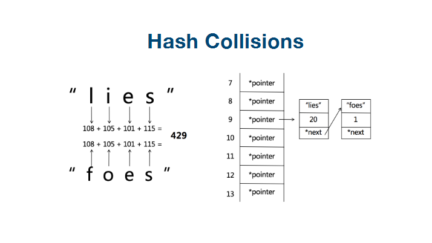

# 哈希表和集合

# 1. 基本概念

## 1. 哈希表

我们先来看一下什么是哈希表

[散列表](https://baike.baidu.com/item/散列表/10027933)（Hash table，也叫哈希表），是根据关键码值(Key value)而直接进行访问的[数据结构](https://baike.baidu.com/item/数据结构/1450)。也就是说，它通过把关键码值映射到表中一个位置来访问记录，以加快查找的速度。这个映射函数叫做[散列函数](https://baike.baidu.com/item/散列函数/2366288)，存放记录的[数组](https://baike.baidu.com/item/数组/3794097)叫做[散列表](https://baike.baidu.com/item/散列表/10027933)。

给定表M，存在函数f(key)，对任意给定的关键字值key，代入函数后若能得到包含该关键字的记录在表中的地址，则称表M为哈希(Hash）表，函数f(key)为哈希(Hash) 函数。

## 2. 通过图解来了解哈希表


hash函数算法， 就是根据每个key的值， 进行hash函数的计算， 然后映射到我们数据结构中， 我们访问的时候， 时间复杂度就是O（1）的。



如果有多个key的值， 经过hash函数的算法， 得到的value值是一样的， 那我们就通过链表的形式， 把所有的value值进行链接一下。


## 3. 集合

集合最重要的一个特征， 就是其内部元素是不能重复的。


# 2. Map和Set的一些实现方式

map的实现方式有： 

HashMap： 通过key， value的映射关系实现， 根据key获取元素， 时间复杂度为O（1）

TreeMap:  内部是通过二叉树实现的Map, 查询元素的时间复杂度为（logn）, 但是TreeMap里面的元素是排序的。


Set的实现方式有：

HashSet： 查询元素的时间复杂度也是O（1）

TreeSet： 时间复杂度为O（logn）, 但是内部的元素是排序好的。


如果我们讲究效率， 就用HashMap或者HashSet就可以， 查询快，

如果我们需要排序， 使用TreeMap和TreeSet.


# 3. leetcode常用习题分析

## 1. leetcode242（有效字母异味词）

```
//给定两个字符串 s 和 t ，编写一个函数来判断 t 是否是 s 的字母异位词。 
//
// 示例 1: 
//
// 输入: s = "anagram", t = "nagaram"
//输出: true
// 
//
// 示例 2: 
//
// 输入: s = "rat", t = "car"
//输出: false 
//
// 说明: 
//你可以假设字符串只包含小写字母。 
//
// 进阶: 
//如果输入字符串包含 unicode 字符怎么办？你能否调整你的解法来应对这种情况？ 
// Related Topics 排序 哈希表 

```

方法1：

从题目分析，我们首先容易想到的是， 把两个字符串排序， 然后在返回两个字符串的比较值， 看是否符合条件

```java
class Solution {
    public boolean isAnagram(String s, String t) {
 		return Arrays.sort(s).equals(Arrays.sort(t));   
    }
}
```

```python
def isAnagram(s, t):
    return sorted(s) == sorted(t)
```

但是上面的时间复杂度为: nlogn

方法2：

通过map缓存计数， 最后来来比较最后map的数目

```java
class Solution {
    public boolean isAnagram(String s, String t) {
        if(s.equals(t)) {
            return true;
        }
        if (s == null || t == null || s.length() != t.length()) {
            return false;
        }
        HashMap<Character, Integer> map1 = new HashMap();
        for (int i = 0; i < s.length(); i++) {
            // 对于字符串s进行相加
            map1.put(s.charAt(i), map1.getOrDefault(s.charAt(i), 0) + 1);
            // 对于字符串t进行相减
            map1.put(t.charAt(i), map1.getOrDefault(t.charAt(i), 0) - 1);
        }

        // 如果其中有一个元素个数不为0， 就代表不相等
        for (Integer item: map1.values()) {
            if (0 != item) {
                return false;
            }
        }
        return true;

    }
}
```


## 2. leetcode1（两数之和）

```
//给定一个整数数组 nums 和一个目标值 target，请你在该数组中找出和为目标值的那 两个 整数，并返回他们的数组下标。 
//
// 你可以假设每种输入只会对应一个答案。但是，数组中同一个元素不能使用两遍。 
//
// 
//
// 示例: 
//
// 给定 nums = [2, 7, 11, 15], target = 9
//
//因为 nums[0] + nums[1] = 2 + 7 = 9
//所以返回 [0, 1]
// 
// Related Topics 数组 哈希表 
// 👍 8663 👎 0
```

对于上面的题， 我们比较容易想到的是两个循环， 来实现最终的结果。但是两个循环的时间复杂度为O（n*n）

其实还是有优化的空间

下面我们来看看使用map进行缓存， 来得到两数之和

```java
class Solution {
    public int[] twoSum(int[] nums, int target) {
        int[] res = new int[2];
        HashMap<Integer, Integer> map = new HashMap<>();
        for (int i = 0; i < nums.length; i++) {
            if (map.get(nums[i]) != null) {
                res[0] = i;
                res[1] = map.get(nums[i]);
                break;
            } else {
                map.put(target - nums[i], i);
            }
        }
        return res;
    }
}
```


## 3. leetcode15（三数之和）

```
//给你一个包含 n 个整数的数组 nums，判断 nums 中是否存在三个元素 a，b，c ，使得 a + b + c = 0 ？请你找出所有满足条件且不重复
//的三元组。 
//
// 注意：答案中不可以包含重复的三元组。 
//
// 
//
// 示例： 
//
// 给定数组 nums = [-1, 0, 1, 2, -1, -4]，
//
//满足要求的三元组集合为：
//[
//  [-1, 0, 1],
//  [-1, -1, 2]
//]
// 
// Related Topics 数组 双指针 
// 👍 2584 👎 0
```

其实这个三数之和， 可以通过三个循环来实现， 时间复杂度为（nxnxn）,其实是可以优化一下的， 借鉴两数之和的思想， 我们可以在数组中， 先遍历a， 然后在剩下的数字中， 寻找两数之和， b+c = -a

```
class Solution {
    public List<List<Integer>> threeSum(int[] nums) {
        // 需要先排序一下， 否则会出现下面的结果
        /**
         * info
		 * 	运行成功:
		 *	测试用例:[-1,0,1,2,-1,-4]
		 * 	测试结果:[[-1,1,0],[-1,-1,2],[0,-1,1]]
		 *	期望结果:[[-1,-1,2],[-1,0,1]]
		 *	stdout:
		 */
        Arrays.sort(nums);
        // 需要使用set来处理， 否则没法过滤掉[0, 0, 0, 0] 这样的结果
        Set<List<Integer>> res = new HashSet<>();
        for (int i = 0; i < nums.length; i++) {
            if (nums[i] > 0) {
                break;
            }
            HashMap<Integer, Integer>map = new HashMap<>();
            for (int j = i + 1; j < nums.length; j++) {
                // a + b + c = 0, 则 b + c = -a, -nums[i]就是-a
                if (map.containsKey(-nums[i] - nums[j])) {
                    List<Integer> tmp = new ArrayList<>();
                    tmp.add(nums[i]);
                    tmp.add(nums[j]);
                    tmp.add(-nums[i] - nums[j]);
                    res.add(tmp);
                } else {
                    map.put(nums[j], j);
                }
            }
        }
        return new ArrayList<>(res);
    }
}
```

其实通过上面的这个方法， 也是可以实现的，但是我认为可能不是最好的办法，还是要学习一下官网的做法， 排序+双指针


```
class Solution {

    public List<List<Integer>> threeSum(int[] nums) {
        List<List<Integer>> res = new ArrayList<>();
        if (nums == null && nums.length < 3) {
            return res;
        }
        Arrays.sort(nums);
        for (int i = 0; i < nums.length; i++) {
        	// 最小的数都大于目标值，没有进行的必要了；
            if (nums[i] > 0) break;
            // 去重
            if (i > 0 && nums[i] == nums[i - 1]) continue;
            int L = i + 1;
            int R = nums.length - 1;
            while (L < R) {
                int sum = nums[i] + nums[L] + nums[R];
                if (sum == 0) {
                    res.add(Arrays.asList(nums[i], nums[L], nums[R]));
                    // 去重
                    while (L < R && nums[L] == nums[L + 1]) {
                        L++;
                    }
                    // 去重
                    while (L < R && nums[R] == nums[R - 1]) {
                        R--;
                    }
                    L++;
                    R--;
                } else if (sum > 0) {
                    R--;
                } else {
                    L++;
                }

            }
        }

        return res;

    }
}
```

