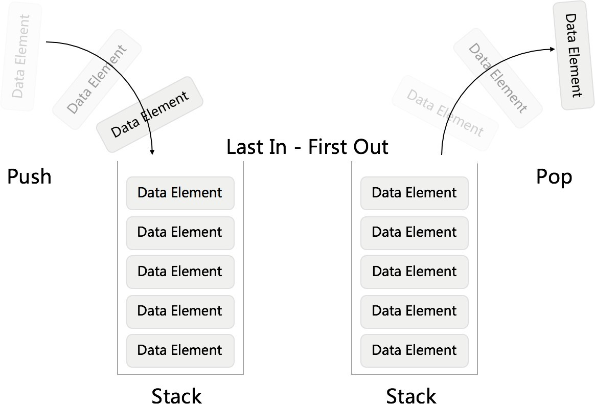
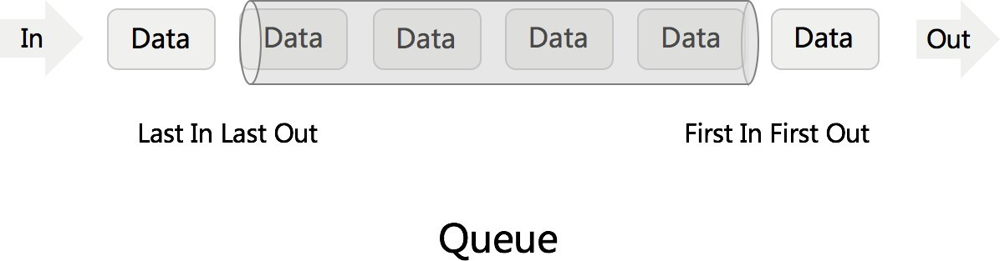
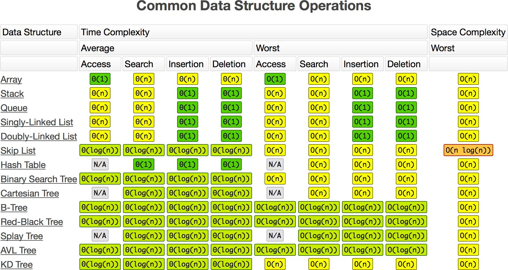

# 堆栈， 队列（stack, Queue）从leetcode算法题刷起

# 1. 什么是堆栈

堆栈， 英文名称是Stack, 我们先来看一下百度百科怎么说：

堆栈是一个特定的存储区或[寄存器](https://baike.baidu.com/item/寄存器/187682)，它的一端是固定的，另一端是浮动的 [1] 。堆这个存储区存入的数据，是一种特殊的数据结构。所有的数据存入或取出，只能在浮动的一端（称栈顶）进行，严格按照“先进后出”的原则存取，位于其中间的元素，必须在其栈上部（后进栈者）诸元素逐个移出后才能取出。在内存储器（随机存储器）中开辟一个区域作为堆栈，叫软件堆栈；用寄存器构成的堆栈，叫硬件堆栈。


通过下面的图， 我们更清楚的理解Stack的作用



# 2. 什么是队列

队列的英文名字叫Queue, 我们还是来看一下百度百科的说法

队列是一种特殊的[线性表](https://baike.baidu.com/item/线性表/3228081)，特殊之处在于它只允许在表的前端（front）进行删除操作，而在表的后端（rear）进行插入操作，和栈一样，队列是一种操作受限制的线性表。进行插入操作的端称为队尾，进行删除操作的端称为队头。


我们搞过下面的图， 更加形象的知道队列的数据结构




# 3. 常用数据结构的时间复杂度



图片来源：http://www.bigocheatsheet.com/


# 4. leetcode实战题目

## 1. leetcode848， 比较含有退格（backspace）的字符串

给定 `S` 和 `T` 两个字符串，当它们分别被输入到空白的文本编辑器后，判断二者是否相等，并返回结果。 `#` 代表退格字符。

分析：每次遇到#字符， 都要删除#前面的字符， 这种情况下， 我们使用stack的数据结构就可以轻松的解决

我们先来看看java的解决办法：

```java
class Solution {
    public boolean backspaceCompare(String S, String T) {
        // 直接比较字符串是否相等， 就可以判定
        return build(S).equals(build(T));
    }

    private String build(String s) {
        Stack<Character> stack = new Stack<>();
        for (int i = 0; i < s.length(); i++) {
            if (s.charAt(i) != '#') {
                // 不是退格键， 直接入栈
                stack.push(s.charAt(i));
            } else {
                // 先判断堆栈是否为空， 比较严谨
                if (stack.isEmpty()) {
                    continue;
                } else {
                    // 有退格键， 直接删除最后一位
                    stack.pop();
                }
            }
        }
        // 最后直接把堆栈转换成字符串返回
        return String.valueOf(stack);
    }
}
```

python的解法

```
def backspaceCompare(self, s, t) {
	return build(s) == build(t)
}

def build(s) {
	stack = []
	for i in s:
		if i != '#':
			stack.append(i)
		else:
			if stack:
				continue;
			else:
				stack.pop()
	return str(stack)
}
```


## 2. leetcode 20 题， 有效的括号

我自己的个人分析， 就是前后有照应， 或者是前后有对比， 分析的数据， 都比较适合使用stack的数据结构

但是在这个题目中， 我们还是有一些代码从可读性， 简介性上进行优化

我们先来看看python版本的吧

```python
def isValid(self, s):
    stack = []
    # 这个字典的初始化就非常的经典， 简化了我们很多的判断
    paren_map = {')': '(', ']': '[', '}': '{'}
    for c in s:
        if c not in paren_map:
            # 不是右括号， 直接入栈
            stack.append(c)
        elif not stack or paren_map[c] != stack.pop():
            # 如果堆栈为空， 或者
            return False
    return not stack
```

java的代码：

```
class Solution {
    public boolean isValid(String s) {
        Stack<Character> statck = new Stack<>();
        // 初始化的map对后面简介的代码非常的有帮助
        HashMap<Character, Character> mappings = new HashMap<>();
        mappings.put(']', '[');
        mappings.put('}', '{');
        mappings.put(')', '(');

        for (int i = 0; i < s.length(); i++) {
            char c = s.charAt(i);
            if (mappings.containsKey(c)) {
                if (statck.isEmpty()) {
                    return false;
                }
                Character out = statck.pop();
                if (mappings.get(c).charValue() != out.charValue()) {
                    return false;
                }
            } else {
                statck.push(c);
            }
        }
        return statck.isEmpty();
    }
}
```

## 3. leetcode 225题， 用队列实现栈

用队列实现栈的成本比较高， 使用两个队列，每次出栈， 都需要把一个队列的元素迁移到另外一个队列， 把最后一个元素找出来。

使用java来实现， 已经提交leetcode代码， 验证通过

```
import java.util.LinkedList;
import java.util.Queue;

//Java：用队列实现栈
//class P225ImplementStackUsingQueues{
//    public static void main(String[] args) {
//        Solution solution = new P225ImplementStackUsingQueues().new Solution();
//        // TO TEST
//    }
    //leetcode submit region begin(Prohibit modification and deletion)
class MyStack {

    private Queue<Integer> q1;
    private Queue<Integer> q2;

    /** Initialize your data structure here. */
    public MyStack() {
        this.q1 = new LinkedList<>();
        this.q2 = new LinkedList<>();
    }
    
    /** Push element x onto stack. */
    public void push(int x) {
        q1.add(x);
    }
    
    /** Removes the element on top of the stack and returns that element. */
    public int pop() {
        while (q1.size() != 1) {
            q2.add(q1.poll());
        }
        Integer res = q1.remove();
        Queue<Integer> tmp = new LinkedList<>();
        tmp = q1;
        q1 = q2;
        q2 = tmp;
        return res;
    }
    
    /** Get the top element. */
    public int top() {
        while (q1.size() != 1) {
            q2.add(q1.poll());
        }
        Integer res = q1.peek();
        q2.add(q1.poll());
        Queue<Integer> tmp = new LinkedList<>();
        tmp = q1;
        q1 = q2;
        q2 = tmp;
        return res;
    }
    
    /** Returns whether the stack is empty. */
    public boolean empty() {
        return q1.isEmpty();
    }
}
```


## 4. leetcode 232题， 用栈实现队列

也是使用两个栈来实现队列，每个元素，都需要在两个栈中过一遍， 才可以出去， 就可以实现队列

java代码实现， 已经提交leetcode，验证通过

```java
import java.util.Stack;

class MyQueue {

    private Stack<Integer> s1;
    private Stack<Integer> s2;
    /** Initialize your data structure here. */
    public MyQueue() {
        s1 = new Stack<>();
        s2 = new Stack<>();
    }
    
    /** Push element x to the back of queue. */
    public void push(int x) {
        s1.push(x);
    }


    private void shift() {
        if (s2.isEmpty()) {
            while (!s1.isEmpty()) {
                s2.push(s1.pop());
            }
        }
    }
    
    /** Removes the element from in front of queue and returns that element. */
    public int pop() {
        shift();
        if (!s2.isEmpty()) {
            return s2.pop();
        }
        throw new RuntimeException("队列里没有元素");
    }
    
    /** Get the front element. */
    public int peek() {
        shift();
        if (!s2.isEmpty()) {
            return s2.peek();
        }
        throw new RuntimeException("队列里没有元素");
    }
    
    /** Returns whether the queue is empty. */
    public boolean empty() {
        return s1.isEmpty() && s2.isEmpty();
    }
}

```

