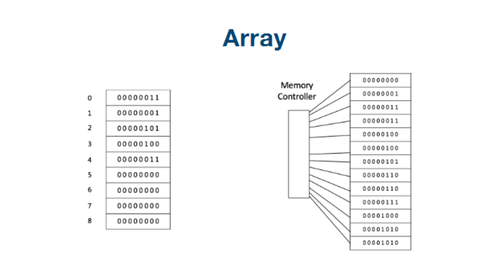
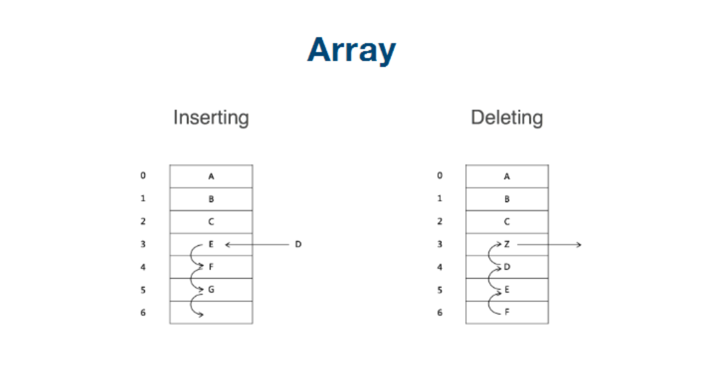
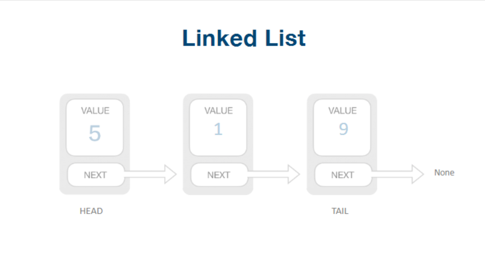
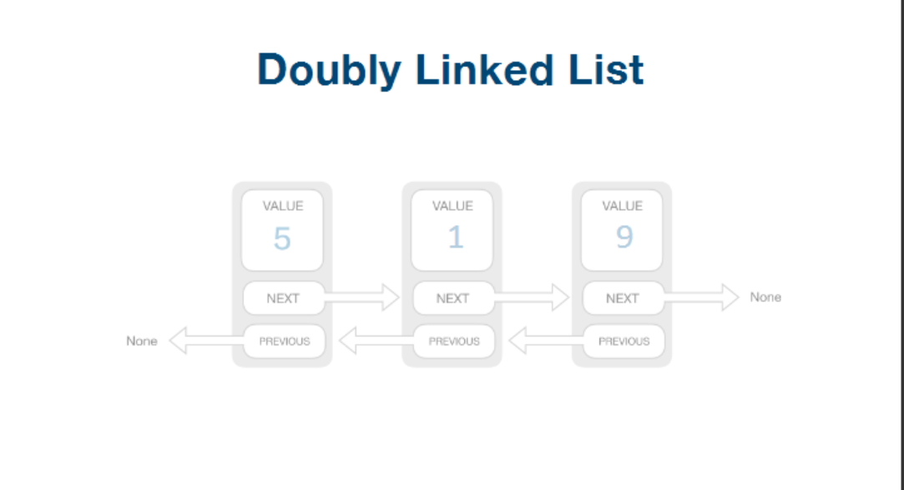
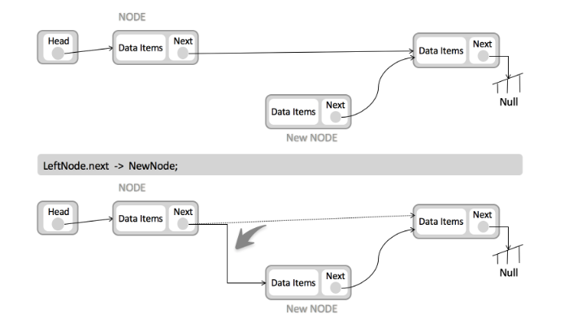
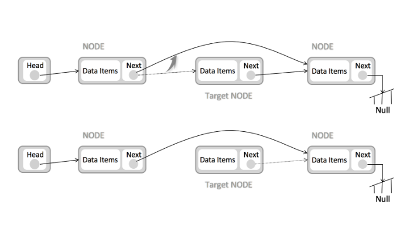

# 数组(Array)和链表(Linked List)

# 1. 什么是数组

把具有相同类型的若干元素按有序的形式组织起来的一种形式。 [1] 这些有序排列的同类数据元素的集合称为数组。

数组是用于储存多个相同类型数据的集合。

我们在申明数组的时候， 是需要定义起长度的， 所以数组在我们的内存找给你， 元素之间的内存是连续存放的



# 2. 数组增删改查的时间复杂度

数组每次删除和增加一个元素， 其后面的元素都需要跟着变动。

访问一个元素， 只要知道下标， 直接进行访问就可以了




Access: O(1)

Insert: 平均O(n)

Delete: 平均O(n)


# 3. 什么是链表？

链表是在java中， 是我们自己定义的一种数据结构， 有一个属性value， 一个next， 类似于c语言中的指针， 指向下一个链表

单链表， 就只有指向下一个指针



双向链表， 就是有头指针和尾指针



# 4. 链表相关的时间复杂度

Space: O(n)

prepend: O(1)

append: O(1)

lookup: O(n)

insert: O(1)



delete: O(1)



# 5. 练习题

## 1. 反转一个单链表。

leetcode 206题

**示例:**

```
输入: 1->2->3->4->5->NULL
输出: 5->4->3->2->1->NULL
```


链表的核心， 就是需要有两个元素， 进行相互赋值转换，所以只有有链表的题， 你就申明好两个元素就好了。

一般情况下还需要申明一个链表的头结点

因为该题目最后的数据， 永远最最新的头结点， 所以两个变量就足以满足

在改变链表使用的时候， 记得在中间替换的环节， 用一个中间变量进行转换一下， 不然找不到位置了


```java
class Solution {
    public ListNode reverseList(ListNode head) {
        ListNode cur = head;
        ListNode out = null;

        while(cur != null) {
          // 需要先保存一下next的临时节点， 要不然用的时候找不到了。
          ListNode nextTemp = cur.next;
          cur.next = out;
          out = cur;
          cur = nextTemp;
        }
        return out;
    }
}
```


python的代码就超级简洁， 替换的时候就非常有优势（python支持多类型返回）

```python
def reverseList(self, head):
    cur, prev = head, None
    while cur:
        cur.next, prev, cur = prev, cur, cur.next
    return prev
```


## 2. 两两交换链表中节点

leetcode24题

```
示例: 
//
// 给定 1->2->3->4, 你应该返回 2->1->4->3.
```

只要是链表， 我们基本需要最少是三个变量， 一个头结点， 一个变量和一个next变量来支持循环

因为要两两替换位置， 所以要增加一个变量， 循环变化的就是三个变量， 一个头结点

```java
class Solution {
    public ListNode swapPairs(ListNode head) {
        ListNode pre = new ListNode(0);
        pre.next = head;
        ListNode start = pre;

        while (pre.next != null && pre.next.next != null) {
            ListNode a = pre.next;
            ListNode b = a.next;
            ListNode nextTemp = b.next;
            pre.next = b;
            b.next = a;
            a.next = nextTemp;
            pre = a;
        }
        return start.next;
    }
}
```

python代码

```
def swapPairs(self, head):
	pre, pre.next = self, head
	while pre.next and pre.next.next:
		a = pre.next
		b = a.next
		pre.next, a.next, b.next = b, b.next, a
		pre = a
	return self.next
```


## 3. 环形链表

leetcode141题

给定一个链表，判断链表中是否有环。

为了表示给定链表中的环，我们使用整数 pos 来表示链表尾连接到链表中的位置（索引从 0 开始）。 如果 pos 是 -1，则在该链表中没有环。

```
输入：head = [3,2,0,-4], pos = 1
输出：true
解释：链表中有一个环，其尾部连接到第二个节点。
```

```
输入：head = [1,2], pos = 0
输出：true
解释：链表中有一个环，其尾部连接到第一个节点。
```

```
输入：head = [1], pos = -1
输出：false
解释：链表中没有环。
```


思路1： 

把所有的链表元素放在一个set中， 每次在set中判断是否已经存在， 如果已经存在， 则有环。


思路2：

两个指针，快指针每次走两步，慢指针每次走一步， 如果有相遇的可能， 就说明有环


java

```java
public boolean hasCycle(ListNode head) {
    if (head == null || head.next == null) {
        return false;
    }
    ListNode slow = head;
    ListNode fast = head;
    while (slow != fast) {
        if (fast == null || fast.next == null) {
            return false;
        }
        slow = slow.next;
        fast = fast.next.next;
    }
    return true;
}
```


python

```python
def hasCycle(self, head):
  fast = slow = head
  while slow and fast and fast.next:
    slow = slow.next
    fast = fast.next.next
    if slow is fast:
      return true
  return fasle 
```

