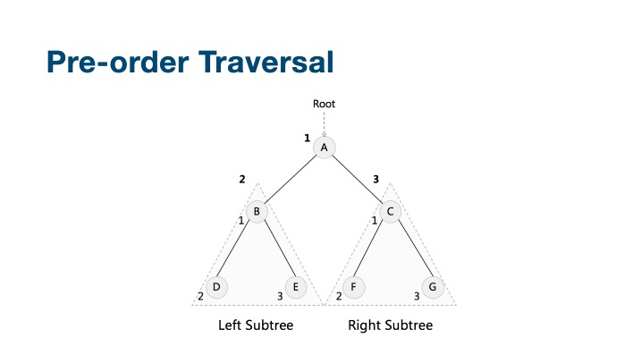
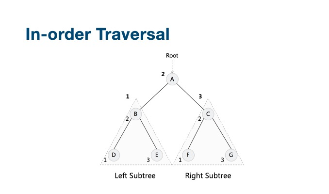
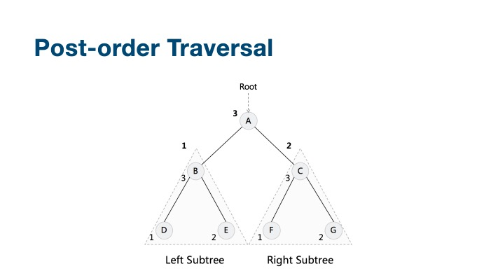

# 树和图

# 1. 什么是图？

图由顶点（vertex，node）和边（edge）组成。顶点就是代表对象，因为有时候题不会直接给顶点，而是某种对象，直接看成顶点即可。我们使用链接两顶点之间的线段来表示。顶点的集合V，边的集合是E，所以图记为G = （V，E）， 连接两点u和v的边用e=（u，v）表示。


# 2. 图是一种特殊的图

树（tree）是包含n（n>=1）个结点，(n-1)条边的有穷集，其中：

（1）每个元素称为结点（node）；

（2）有一个特定的结点被称为根结点或树根（root）。

（3）除根结点之外的其余数据元素被分为m（m≥0）个互不相交的集合T1，T2，……Tm-1，其中每一个集合Ti（1<=i<=m）本身也是一棵树，被称作原树的子树（subtree）。


# 3. 二叉树是一种特殊的树

二叉树（Binary tree）是树形结构的一个重要类型。许多实际问题抽象出来的数据结构往往是二叉树形式，即使是一般的树也能简单地转换为二叉树，而且二叉树的存储结构及其算法都较为简单，因此二叉树显得特别重要。二叉树特点是每个结点最多只能有两棵子树，且有左右之分 [1] 。


二叉搜索树： 又称二叉搜索树， 有序二叉树， 排序二叉树， 是指一颗空树或者有下列特性的二叉树：

1. 若任意节点的左子树不空， 则左子树上所有节点的值均小于它的根节点的值；
2. 若任意节点的右子树不空， 则右子树上所有节点的值均大于它的根节点的值
3. 任意节点的左， 右子树也分别为二叉树找数

# 4. 树的不通编程语言的创建

java

```java
public class TreeNode {
  public int val;
  public TreeNode left, right;
  public TreeNode(int val) {
    this.val = val;
    this.left = null;
    this.right = null;
  }
}
```

python

```python
class TreeNode:
  def __init__(self, val):
    self.val = val;
    sllf.left, self.right = None, None
```

C++

```c++
struct TreeNode {
  int val;
  TreeNode *left;
  TreeNode *right;
  TreeNode(int x): val(x), left(NULL), right(NULL) {}
}
```

# 5. 实战题目

693. 前K个高频单词

给一非空的单词列表，返回前 k 个出现次数最多的单词。

返回的答案应该按单词出现频率由高到低排序。如果不同的单词有相同出现频率，按字母顺序排序。

示例 1：

输入: ["i", "love", "leetcode", "i", "love", "coding"], k = 2
输出: ["i", "love"]
解析: "i" 和 "love" 为出现次数最多的两个单词，均为2次。
    注意，按字母顺序 "i" 在 "love" 之前。


示例 2：

输入: ["the", "day", "is", "sunny", "the", "the", "the", "sunny", "is", "is"], k = 4
输出: ["the", "is", "sunny", "day"]
解析: "the", "is", "sunny" 和 "day" 是出现次数最多的四个单词，
    出现次数依次为 4, 3, 2 和 1 次。


## 方法1： 排序

Java

```java
class Solution {
  public List<String> topKFrequent(String[] words, int k) {}
    Map<String, Integer> count = new HashMap();
    for (String word: words) {
      count.put(word, count.getOrDefault(word, 0) + 1);
    }
    List<String> candidates = new ArrayList(count.keySet());
    Collections.sort(candidates, (w1, w2) -> count.get(w1).equals(count(.get(w2)) ? w1.compareTo(w2) : count.get(w2) - count.get(w1));
                     
  	return candidates.subList(0, k);
   }
}
```

python

```python
class Solution(object):
  def topKFrequent(self, words, k):
    count = collections.Counter(words)
    candidates = count.keys()
    candidates.sort(key = lambda w: (-count[w], w))
    return candidates[:k]
```

## 2. 使用堆来实现

堆是一种非常好的方式来解决前K个最大元素或者最小元素的方法

java

```java
class Solution {
  public List<String> topKFrequent(String[] words, int k) {
    Map<String, Integer> count = new HashMap();
    // 先用HashMap缓存
    for (String word: words) {
      count.put(word, count.getOrDefault(word, 0) + 1);
    }
    // 定义一个堆的存储顺序， 头一定是最小元素
    PriorityQueue<String> heap = new PriorityQueue<String>(
    	(w1, w2) -> count.get(w1).equals(count.get(w2) ? w2.comareTo(w1) : count.get(w1) - count.get(w2)
    );
    for (String word : count.keySet()) {
      // 入堆
      heap.offer(word);
      // 堆元素超过k个， 直接把顶点的元素出堆
      if (heap.size() > k) {
        heap.poll();
      }
    }
      List<String> ans = new ArrayList();
      while (!heap.isEmpty()) {
        ans.add(heap.poll());
      }
      // 出来以后是一个频率从小到大顺序， 需要倒转
      Collections.reverse(ans);
      return ans;
      
  }
}
```

- 在 Python 中，我们使用 `heapq\heapify`，它可以在线性时间内将列表转换为堆，从而简化了我们的工作。

```python
class Solution(object):
  def topKFrequent(self, words, k):
    count = collection.Counter(words)
    heap = [(-freq, word) for word, freq in count.items()]
    heapq.heapify(heap)
    return [heapq.heappop(heap)[1] for _ in xrange(k)]
```


# 6. 二叉树的遍历

## 1. 前序（Pre-order）： 根-左-右



遍历以后的结果为： A  B C D E F G

代码： 

```
def preorder(self, root):
	if root:
		self.traverse_path.append(root.val)
		self.preorder(root.left)
		self.preorder(root.right)
```


## 2. 中序（In-order）:  左-根-右

中序遍历是排序好的



遍历以后的结果为： D B E A F C G

代码：

```
def inorder(self, root):
	if root:
		self.inorder(root.left)
		self.traverse_path.append(root.val)
		self.inorder(root.right)
```


## 3. 后序（Post-order）: 左-右-根



遍历以后的结果为: D E B F G C A

代码： 

```
def postorder(self, root):
	if root:
		self.postorder(root.left)
		self.postorder(root.right)
		self.traverse_path.append(root.val)
```

