# lvs+keepalived你不知道的那些秘密

上个月报名了玄姐百万年薪架构师的课程, 最近已经开课了, 每次上课玄姐都是滔滔不绝的讲个不停, 每次都是从晚上八点干到凌晨一点多, 你要是不提前休息好, 基本12点以后就迷糊了, 但是说实话真的是受益很多, 接下来我们可能就要学习企业级的代码落地和方案了, 还是很期待的.希望通过玄姐的课程, 通过自己架构的不断打磨, 自己的架构师之路可以走的跟快一些!

在课程中, 玄姐设计的课程面真的是太广了, 大到流量, 网络, 大中台, 小到具体的幂等设计, 等等, 很多的思想对自己来说都是另一个层面的提升, 在群里, 看到大家说对lvs+keepalived不太了解, 我想我应该是有发言权的, 自己本省就是运维出身, 原来在京东物流的时候, lvs+keepalived就是仓库物流在用的, 踩了很多坑, 只不过后来都上云了, 但是这个经验还是可以跟大家叨叨一会的. 下面我们进入主题吧.

这篇文章我们主要把思想讲清楚,具体的LVS的搭建流程, 我们在后面的文章中会讲, 请关注我微信公众号:stormling

# 1. LVS简介

## 1. 什么是LVS?

**LVS**是**Linux Virtual Server**的简写，意即**Linux虚拟服务器**，是一个虚拟的服务器集群系统。本项目在1998年5月由[章文嵩](https://baike.baidu.com/item/章文嵩/6689425)博士成立，是中国国内最早出现的自由软件项目之一。目前LVS已经被集成到Linux内核模块中.

## 2. LVS能做什么?

LVS主要用于多服务器的负载均衡

- 它工作在网络层, 可以实现高性能, 高可用的服务器集群技术.
- 它廉价，可把许多低性能的服务器组合在一起形成一个超级服务器。
- 它易用，配置非常简单，且有多种负载均衡的方法。
- 它稳定可靠，即使在集群的服务器中某台服务器无法正常工作，也不影响整体效果。
- 可扩展性也非常好。
- 性能几乎可以和F5相媲美(个人意见)

## 3. LVS的负载均衡结构图

lvs的负载均衡结构图, 大概的使用场景是这样的, 关于高可用的地方, 我们后面会进行介绍, 别着急哦!

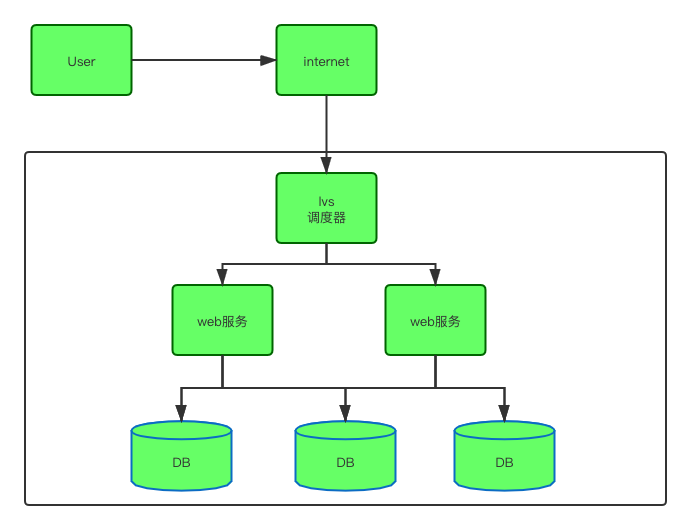

# 2. LVS的核心组件和专业术语

## 1. 核心组件

LVS的管理工具和内核模块 ipvsadm/ipvs

ipvsadm: 用于空间的命令行工具, 用于管理集群服务及集群服务上的RS等

ipvs: 工作于内核上的程序, 可根据用户定义的集群实现请求转发

## 2. 专业术语

**VS: ** Virtual Server, 虚拟服务

**Director:** 负载均衡器, 图1的lvs调度器

**Balancer: ** 分发器, 图1的lvs调度器

**RS: ** Real Server, 后端请求处理服务器, 图1的web服务

**CIP: ** client ip, 客户单ip

**VIP: ** Director Virtural IP, 负载均衡虚拟IP, 应该出现在图1的lvs调度器上

**DIP: ** Director IP 负载均衡器ip

**RIP: **Real Server IP, 后端请求处理服务器IP

# 3. LVS的常用几种模式

## 1. LVS的DR模式(最常用)

lvs的DR模式最最稳定, 是使用最多的一种模式

### 1. 什么是arp广播

在了解LVS的DR模式之前, 我们需要先了解一下arp广播, 要不然我在讲后面内容的时候会用到这个, 已经是大佬的同学跳过吧.小白请认真读完.

arp广播：**根据ip地址找mac地址**

主机A的IP地址为192.168.1.1，MAC地址为0A-11-22-33-44-01；

主机B的IP地址为192.168.1.2，MAC地址为0A-11-22-33-44-02；

当主机A要与主机B通信时：

第1步：根据主机A上的[路由表](http://baike.baidu.com/view/149989.htm)内容，IP确定用于访问主机B的转发IP地址是192.168.1.2。然后A主机在自己的本地ARP缓存中检查主机B的匹配MAC地址。

第2步：如果主机A在ARP缓存中没有找到映射，它将询问192.168.1.2的硬件地址，从而将ARP请求帧广播到本地网络上的所有主机。源主机A的IP地址和MAC地址都包括在ARP请求中。本地网络上的每台主机都接收到ARP请求并且检查是否与自己的IP地址匹配。如果主机发现请求的IP地址与自己的IP地址不匹配，它将丢弃ARP请求。

第3步：主机B确定ARP请求中的IP地址与自己的IP地址匹配，则将主机A的IP地址和MAC地址[映射](http://baike.baidu.com/view/21249.htm)添加到本地ARP缓存中。

第4步：主机B将包含其MAC地址的ARP回复消息直接发送回主机A。

第5步：当主机A收到从主机B发来的ARP回复消息时，会用主机B的IP和MAC地址映射更新ARP缓存。本机缓存是有[生存期](http://baike.baidu.com/view/159877.htm)的，生存期结束后，将再次重复上面的过程。主机B的MAC地址一旦确定，主机A就能向主机B发送IP通信了。

### 2. LVS的DR模式的请求流程图

**申明:** 首先我们先来申明一下, 举个例子: 我们在请求一个域名如: https://www.naixuejiaoyu.com/, 我们首先会访问的是DNS, DNS会根据我们的域名给我们解析VIP地址(一般情况是一个vip, 也有一种情况是一个域名对应对个vip或者ip), 我们为了简单, 下图就是画的一般情况.

**注意:**前提是我们的VIP地址都是配置在LO上的

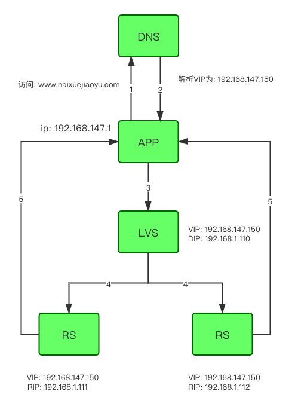

### 3. 提问一: 三个vip, 为什么dns会把请求打到LVS上, 而没有打到RS上呢?

带着这个问题我们来思考, 可能才更好的帮助我们来理解LVS的DR模式, 要解决这个问题, 我们就需要提到我们刚开始提到的ARP请求了, 我们需要在LVS, RS1, RS2上都需要绑定三个VIP, 但是需要在RS1和RS2上需要额外的做一些工作, 那就是禁止ARP请求.

我们在RS上需要执行以下的操作, 更改linux的内核参数, 如下:

```
echo "1" >/proc/sys/net/ipv4/conf/lo/arp_ignore
echo "2" >/proc/sys/net/ipv4/conf/lo/arp_announce
echo "1" >/proc/sys/net/ipv4/conf/all/arp_ignore
echo "2" >/proc/sys/net/ipv4/conf/all/arp_announce
```

为了帮助大家更好的理解三个vip之间的关系, 我们举个例子来说: LVS服务器是正常的, 当DNS在请求的时候会解析出来VIP的地址, 但是并不知道, 具体的mac地址是哪一个, 那LVS服务器会通过ARP请求, 告知别人自己的mac地址, 别人就缓存下来了, 反之, 我们的RS是禁止ARP请求的, 其实他就是一个哑巴, 让他不能说话的, 别人就不知道他的mac地址, 即使他有VIP地址, 所以DNS只会把请求转发到LVS上, 而不能转发到RS上.

### 4. 既然RS禁止了ARP请求, 那LVS如何把请求转发给RS呢?

解决了上面的问题, 那新的问题又来了, 既然我们说RS禁止了ARP请求, 那LVS是如何把请求转发给RS的呢?其实我告诉你, **是通过修改mac地址, 进行转发的,** 这个是DR模式的核心, 那LVS又是如何知道RS的mac地址呢, 其实是通过ARP请求获知的, 那有些人就会问我, 你这个不是自相矛盾吗?别担心, 接着看

首先我们看一下, 我们的vip都是绑定在lo上的, 我们要理解上面我提出的这个问题, 就要深入的了解一下linux内核参数的配置信息了.

有关arp_ignore的相关介绍:

> arp_ignore - INTEGER Define different modes for sending replies in response to received ARP requests that resolve local target IP addresses: 
>
> 0 - (default): reply for any local target IP address, configured on any interface 
>
> 1 - reply only if the target IP address is local address configured on the incoming interface 
>
> 2 - reply only if the target IP address is local address configured on the incoming interface and both with the sender's IP address are part from same subnet on this interface 
>
> 3 - do not reply for local addresses configured with scope host, only resolutions for global and link addresses are replied 
>
> 4-7 - reserved 
>
> 8 - do not reply for all local addresses 	
>
> The max value from conf/{all,interface}/arp_ignore is used when ARP request is received on the {interface}

看不懂没关系, 既然要解决, 我们肯定是要深入剖析的, 下面我们来简单的翻译一下:

arp_ignore:定义对目标地址为本地IP的ARP询问不同的应答模式

0 - (默认值): 回应任何网络接口上对任何本地IP地址的arp查询请求 

1 - 只回答目标IP地址是来访网络接口本地地址的ARP查询请求 

2 -只回答目标IP地址是来访网络接口本地地址的ARP查询请求,且来访IP必须在该网络接口的子网段内 

3 - 不回应该网络界面的arp请求，而只对设置的唯一和连接地址做出回应 

4-7 - 保留未使用 

8 -不回应所有（本地地址）的arp查询


好了我们设置的arp_ignore内核参数是1, 就是只回答目标IP地址是来访网络接口本地地址的ARP查询请求.即: **只回答本地网卡eth0上的ARP请求**

我们就拿上面的图举例:

- LVS服务器:
  - DIP: 绑定的网卡eth0: 192.168.1.110
  - VIP: 绑定的网卡是lo:0: 192.168.147.150
- RS服务器:
  - RIP: 绑定的网卡是eth0: 192.168.1.111
  - VIP: 绑定的网卡lo:0: 192.168.147.150

其实客户端在发送ARP请求的时候, 询问的是VIP的mac地址, LVS服务器进行了正确的ARP请求回应, 而当循环RS服务器的mac地址的时候, 这个时候, 我们网卡的IP地址是: 192.168.1.111/112, RS是做过阉割的, 所以不给与回应.

当LVS服务器发起ARP请求的时候, 循环192.168.1.111或者192.168.1.112的mac地址, 这个时候, RS本地的网卡地址, 就是LVS需要访问的ip地址, 就进行ARP请求的回应. 所有LVS服务器就缓存了RS服务器的mac地址

上面的问题是不是都迎刃而解了. 快来给我疯狂打call吧.

### 5. RS是如何做到, 直接返回给客户端的呢?

这个问题太好, 我们一般接收的请求, 应该都是哪里来, 哪里回, 那RS是如何做到直接返回个客户端的呢?

好的, 既然我们前面提到了在RS上进行设计linux内核参数的更改, 分别是arp_ignore和arp_announce两个内核参数, 既然arp_ignore是禁止arp请求的,我们上面已经介绍过了,  arp_announce内核参数是做什么的嗯? 我们下面就来讲解一下这个参数的作用吧.

既然存在, 那就是有意义的, arp_announce这个内核参数, 其实就是让RS可直接返回给客户端

有关**arp_announce**的相关介绍：

> arp_announce - INTEGER Define different restriction levels for announcing the local source IP address from IP packets in ARP requests sent on interface: 0 - (default) Use any local address, configured on any interface 1 - Try to avoid local addresses that are not in the target's subnet for this interface. This mode is useful when target hosts reachable via this interface require the source IP address in ARP requests to be part of their logical network configured on the receiving interface. When we generate the request we will check all our subnets that include the target IP and will preserve the source address if it is from such subnet. If there is no such subnet we select source address according to the rules for level 2. 
>
> 2 - Always use the best local address for this target. In this mode we ignore the source address in the IP packet and try to select local address that we prefer for talks with the target host. Such local address is selected by looking for primary IP addresses on all our subnets on the outgoing interface that include the target IP address. If no suitable local address is found we select the first local address we have on the outgoing interface or on all other interfaces, with the hope we will receive reply for our request and even sometimes no matter the source IP address we announce. 	
>
> The max value from conf/{all,interface}/arp_announce is used. 	
>
> Increasing the restriction level gives more chance for receiving answer from the resolved target while decreasing the level announces more valid sender's information.

arp_announce:对网络接口上，本地IP地址的发出的，ARP回应，作出相应级别的限制: 确定不同程度的限制,宣布对来自本地源IP地址发出Arp请求的接口 

0 - (默认) 在任意网络接口（eth0,eth1，lo）上的任何本地地址 

1 -尽量避免不在该网络接口子网段的本地地址做出arp回应. 当发起ARP请求的源IP地址是被设置应该经由路由达到此网络接口的时候很有用.此时会检查来访IP是否为所有接口上的子网段内ip之一.如果改来访IP不属于各个网络接口上的子网段内,那么将采用级别2的方式来进行处理. 

2 - 对查询目标使用最适当的本地地址.在此模式下将忽略这个IP数据包的源地址并尝试选择与能与该地址通信的本地地址.首要是选择所有的网络接口的子网中外出访问子网中包含该目标IP地址的本地地址. 如果没有合适的地址被发现,将选择当前的发送网络接口或其他的有可能接受到该ARP回应的网络接口来进行发送. 

其实我们RS可以直接返回给客户端, 就是arp_announce设置为2起到的作用, 他会自主的选择一个地址, 即VIP地址, 返回给我们的客户端, 其实就是利用了一个欺骗的技术, 让客户端不会把我们返回的请求丢弃掉, 让他以为RS返回的请求是正常的

### 6. LVS的DR模式请求IP地址追踪

client在发起请求之前，会发一个ARP广播的包，在网络中找“谁是vip”，由于所有的服务器，lvs和res都有vip，为了让client的请求送到lvs上，所以必须让RS不能响应client发出的ARP请求，（这也是为什么要禁止res上arp的请求和响应）下面就是lvs转发的事情了：

1. client向目标vip发送请求，lvs接收；此时ip包和数据信息如下：

```
src mac ---->       a1:b2:c3:d4:e5:f6(client的mac地址(我假设的))

dst mac ----> 			1a:2b:3c:4d:5e:6f(lvs的mac地址(我假设的))

src_ip ---->    		192.168.147.1

dst_ip ---->			  192.168.147.150
```


2. lvs根据负载均衡的算法，选择一台RS，然后把RS1的mac地址作为目的mac地址，发送到局域网中

```
src mac ---->       1a:2b:3c:4d:5e:6f(lvs的mac地址(我假设的))

dst mac ----> 			11:22:33:44:55:66(RS1的mac地址(我假设的))

src_ip ---->    		192.168.147.1

dst_ip ---->			  192.168.147.150

是的, 你没有看错, src_ip地址和dst_ip是不发生变化的, 我们前面说到, DR模式是通过修改mac地址进行转发的, IP地址的请求是不发生变化的, 这个和后面的nat模式有很大的区别
```


3. RS1在局域网中收到这个请求以后，发现目的ip和本地匹配，于是进行处理，处理完成以后，直接把源ip和目的ip直接对调，然后经过网关直接返回给用户；

```
src mac ---->       11:22:33:44:55:66(RS1的mac地址(我假设的))

dst mac ----> 			a1:b2:c3:d4:e5:f6(client的mac地址(我假设的))

src_ip ---->    		192.168.147.150

dst_ip ---->			  192.168.147.1

在RS上, 是可以直接返回给客户端的,
```


## 2. LVS的NAT模式

LVS的NAT模式, 类似于iptables的DNAT, 但是支持多目标的转发

**注意:**自己在本机做实验的时候, 客户端不能和RS在同一网段, 不然直接响应, 不走官关 

### 1. 优点

- 配置简单，通用性强
- 支持映射（NAT映射表）
- RIP可以是私网IP，用于LVS与RS之间通讯

### 2. 缺点

- LVS和RS必须在一个VLAN中（RS将LVS配置为网关，如果不在一个子网回包会经过路由器网关直接路由走，LVS没机会修改数据包）
- 进出流量都需要LVS进行处理，LVS容易成为集群瓶颈
- 需要将LVS配置为RS的网关

### 3. LVS的NAT模式的请求流程图

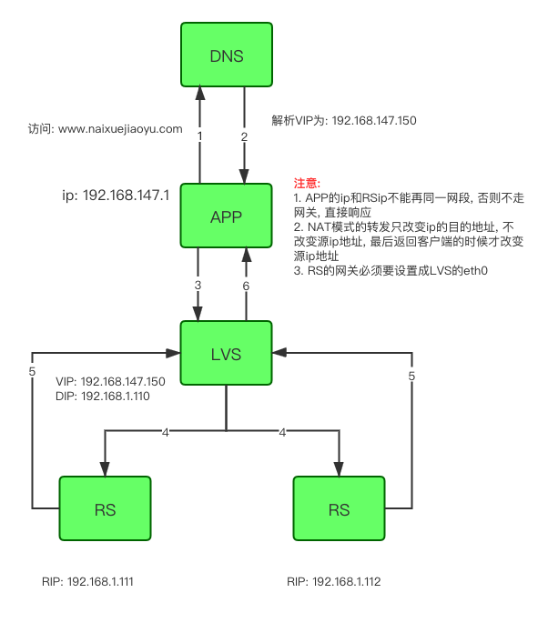

### 4. LVS的NAT模式请求流程图

1. 客户端发起请求到LVS机器上.
2. LVS服务器根据lvs的算法，转发给RS服务器（改变目的ip为RS1或者RS2），并记录连接信息，只改变目的ip，源ip不变。
3. RS收到request请求包之后，发现目的ip是自己的ip，处理请求，然后走网关，经过LVS, RS设置的官网为LVS的eth0
4. LVS收到reply包后，修改reply包的源ip地址为vip，发给客户端

5. 客户端接收到请求, 校验ip请求的包是否符合要求, 符合, 接收, 不符合, 丢弃

### 5. 抓包分析包请求流程如下:

1. 客户端发起请求:

```
source      	192.168.147.1			
dest    			192.168.147.150:80
```

在LVS服务器上, eth0网卡抓取的包如下:

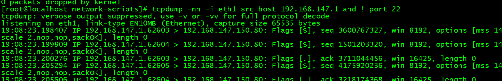

2. LVS处理请求:

在LVS服务器上抓包, 在eth0网卡抓包

```
source		192.168.147.1:59334		
dst				192.168.1.112/111:80
```

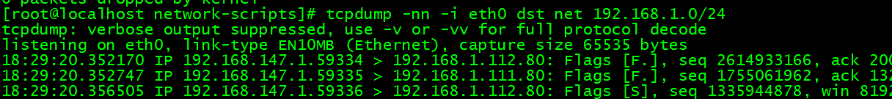

3. LVS的eth0作为RS的网关地址, 需要经过LVS周转

```
source             192.168.1.112              
dst    						 192.168.147.1
```

4. 返回客户端

包经过eth0返回vip服务器，然后经过VIP返回给客户端，源ip改成vip，目的ip不变

```
source		192.168.147.150           
dst       192.168.147.1
```

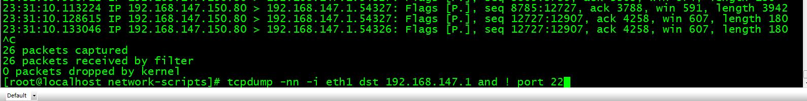


## 3. LVS的TUN模式(隧道模式)不常用

什么IP隧道技术？

简单来说IP隧道技术就是将 【IP数据包】 的上面再封装一层【IP数据包】， 然后路由器根据最外层的IP地址路由到目的地服务器，目的地服务器拆掉最外层的IP数据包，拿到里面的IP数据包进行处理。

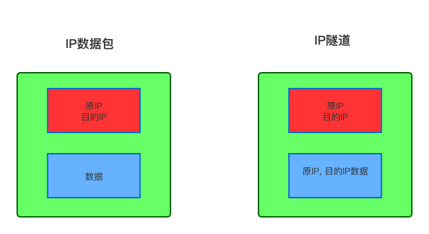

### 原理

用户请求负载均衡服务器，当IP数据包到达负载均衡服务器后，根据算法选择一台真实的服务器，然后通过IP隧道技术将数据包原封不动再次封装，并发送给真实服务器，当这个数据包到达真实服务器以后，真实服务器进行拆包（拆掉第一层的IP包）拿到里面的IP数据包进行处理，然后将结果直接返回给客户端。


### Tunnel原理流程图

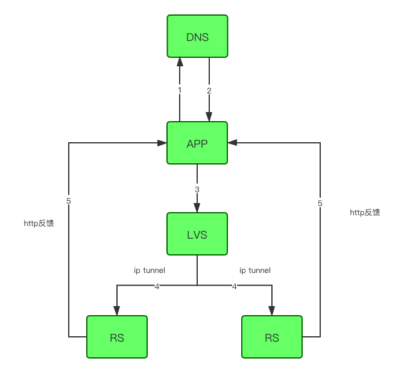


## 4. LVS的FULLNAT模式

fullnat模式听名字也是nat模式的一种, 那full是什么意思呢? 就是全部的nat模式, nat模式中, 我们是需要设置RS的网关地址为LVS的内网服务器地址, 那fullnat模式, 就是我们最通常容易理解的类型, 我们通过下面的图来了解吧,, 主要是就包的请求地址改变有不同

nat模式

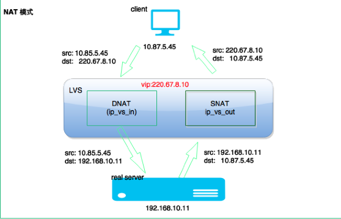

fullnat模式

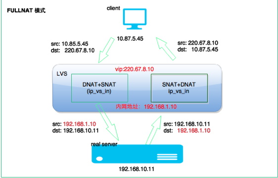

# 4. lvs负载均衡调度算法

   根据前面的介绍，我们了解了LVS的三种工作模式，但不管实际环境中采用的是哪种模式，调度算法进行调度的策略与算法都是LVS的核心技术，LVS在内核中主要实现了一下十种调度算法。

## 1.轮询调度

轮询调度（Round Robin 简称'RR'）算法就是按依次循环的方式将请求调度到不同的服务器上，该算法最大的特点就是实现简单。轮询算法假设所有的服务器处理请求的能力都一样的，调度器会将所有的请求平均分配给每个真实服务器。

## 2.加权轮询调度

加权轮询（Weight Round Robin 简称'WRR'）算法主要是对轮询算法的一种优化与补充，LVS会考虑每台服务器的性能，并给每台服务器添加一个权值，如果服务器A的权值为1，服务器B的权值为2，则调度器调度到服务器B的请求会是服务器A的两倍。权值越高的服务器，处理的请求越多。

## 3.最小连接调度

最小连接调度（Least Connections 简称'LC'）算法是把新的连接请求分配到当前连接数最小的服务器。最小连接调度是一种动态的调度算法，它通过服务器当前活跃的连接数来估计服务器的情况。调度器需要记录各个服务器已建立连接的数目，当一个请求被调度到某台服务器，其连接数加1；当连接中断或者超时，其连接数减1。

（集群系统的真实服务器具有相近的系统性能，采用最小连接调度算法可以比较好地均衡负载。)

## 4.加权最小连接调度

加权最少连接（Weight Least Connections 简称'WLC'）算法是最小连接调度的超集，各个服务器相应的权值表示其处理性能。服务器的缺省权值为1，系统管理员可以动态地设置服务器的权值。加权最小连接调度在调度新连接时尽可能使服务器的已建立连接数和其权值成比例。调度器可以自动问询真实服务器的负载情况，并动态地调整其权值。

## 5.基于局部的最少连接

基于局部的最少连接调度（Locality-Based Least Connections 简称'LBLC'）算法是针对请求报文的目标IP地址的 负载均衡调度，目前主要用于Cache集群系统，因为在Cache集群客户请求报文的目标IP地址是变化的。这里假设任何后端服务器都可以处理任一请求，算法的设计目标是在服务器的负载基本平衡情况下，将相同目标IP地址的请求调度到同一台服务器，来提高各台服务器的访问局部性和Cache命中率，从而提升整个集群系统的处理能力。LBLC调度算法先根据请求的目标IP地址找出该目标IP地址最近使用的服务器，若该服务器是可用的且没有超载，将请求发送到该服务器；若服务器不存在，或者该服务器超载且有服务器处于一半的工作负载，则使用'最少连接'的原则选出一个可用的服务器，将请求发送到服务器。

## 6.带复制的基于局部性的最少连接

带复制的基于局部性的最少连接（Locality-Based Least Connections with Replication  简称'LBLCR'）算法也是针对目标IP地址的负载均衡，目前主要用于Cache集群系统，它与LBLC算法不同之处是它要维护从一个目标IP地址到一组服务器的映射，而LBLC算法维护从一个目标IP地址到一台服务器的映射。按'最小连接'原则从该服务器组中选出一一台服务器，若服务器没有超载，将请求发送到该服务器；若服务器超载，则按'最小连接'原则从整个集群中选出一台服务器，将该服务器加入到这个服务器组中，将请求发送到该服务器。同时，当该服务器组有一段时间没有被修改，将最忙的服务器从服务器组中删除，以降低复制的程度。

## 7.目标地址散列调度

目标地址散列调度（Destination Hashing 简称'DH'）算法先根据请求的目标IP地址，作为散列键（Hash Key）从静态分配的散列表找出对应的服务器，若该服务器是可用的且并未超载，将请求发送到该服务器，否则返回空。

## 8.源地址散列调度U

源地址散列调度（Source Hashing  简称'SH'）算法先根据请求的源IP地址，作为散列键（Hash Key）从静态分配的散列表找出对应的服务器，若该服务器是可用的且并未超载，将请求发送到该服务器，否则返回空。它采用的散列函数与目标地址散列调度算法的相同，它的算法流程与目标地址散列调度算法的基本相似。

## 9.最短的期望的延迟

最短的期望的延迟调度（Shortest Expected Delay 简称'SED'）算法基于WLC算法。举个例子吧，ABC三台服务器的权重分别为1、2、3 。那么如果使用WLC算法的话一个新请求进入时它可能会分给ABC中的任意一个。使用SED算法后会进行一个运算

A：（1+1）/1=2   B：（1+2）/2=3/2   C：（1+3）/3=4/3   就把请求交给得出运算结果最小的服务器。

## 10.最少队列调度

最少队列调度（Never Queue 简称'NQ'）算法，无需队列。如果有realserver的连接数等于0就直接分配过去，不需要在进行SED运算。

# 5. keepalived

keepalive的学习参考网站:https://www.keepalived.org/

在学习keepalived之前, 我们来想一个问题, LVS只是负责负载均衡的转发, 那如果后台的Real Server的服务挂掉以后, LVS是否能主动把这个摘除掉吗? 问题是肯定不行的, 就是LVS不具备把后端挂掉的Real Server摘除掉, 那keepalived的应用而生.

keepalived起初就是为lvs设计的，专门用来监控集群系统中各个服务节点的状态，它根据tcp/ip参考模型的第三四和第五层交换机制检测每个服务节点的状态，每个服务节点异常或者工作障碍，keepalvied讲立刻检测到，并把障碍节点剔除，是毫秒级的，当后台节点恢复正常以后，keepalived有自动将服务节点重新添加在服务器集群中。

keepalvied后来又加了vrrp功能，vrrp（虚拟路由器冗余协议），出现的目的就是解决静态路由单点故障的问题，通过vrrp可以实现网络不间断稳定运行。

## 1. keepalived简介

### 什么是Keepalived？

Keepalived是用C语言编写的路由软件。该项目的主要目标是为Linux系统和基于Linux的基础结构提供负载均衡和高可用性的简单而强大的功能。 负载平衡框架依赖于提供第4层负载[平衡](http://www.linux-vs.org/)的著名且广泛使用的[Linux虚拟服务器（IPVS）](http://www.linux-vs.org/)内核模块。Keepalived实现了一组VIP功能，以根据其运行状况动态，自适应地维护和管理负载平衡的服务器池。另一方面，[VRRP](http://datatracker.ietf.org/wg/vrrp/)实现了高可用性 协议。VRRP是路由器故障转移的基础。此外，Keepalived还实现了一组VRRP有限状态机的挂钩，从而提供了低级和高速协议交互。为了提供最快的网络故障检测，Keepalived实施[BFD](http://datatracker.ietf.org/wg/bfd/)协议。VRRP状态转换可以考虑BFD提示来驱动快速状态转换。Keepalived框架可以独立使用，也可以一起使用以提供弹性基础架构。

keepalived支持多组VIP的操作, 就是一台服务器上可以部署多台VIP, 可以理解为每个VIP是一组操作

### 如何更加形象的理解keepalived的主从切换

那我不得不上一张图了, 当前我们提起来这张图, 就是特别明显的感觉和keepalived的主从切换特别形象, 没有之一


上图中, 两个桌子, 就是我们的两个服务器, 桌布就是我们的VIP, 如果心跳检查发现两个服务器之间有问题, 会主动切换到从服务器上, 时间也是毫秒级别的.

### keepalive的使用场景

可以说keepalived本身就是给LVS量身定做的, LVS虽然是可以进行负载均衡的请求的转发, 如果后端服务器检查到服务器故障, LVS是可以主动切除的, 这个LVS本身具备的功能, 而且切除后端Real Server的时间都是在毫秒级别, 特别的快速, 毕竟LVS已经集成到linux系统内核了.那就有一个问题, 如果LVS服务器挂掉了呢?我们的服务是不是就不可用了呢? 那就来看看我们keepalived的使用场景了.

1. LVS和keepalived可以说是天然的集成, 我们在linux系统安装的时候, 可能都不需要什么特殊的LVS的配置, lvs+keepalived的集成, 只需要在keepalived的配置文件中增加配置就ok
2. keepalive提供了主从切换的功能, 主从之间有心跳检测, 如果发现主从挂掉, keepalived会自动进行主从的切换
3. 单体架构中, 我们最常使用lvs+keepalived的功能'

## 2. keepalivd的工作原理

### 架构原理

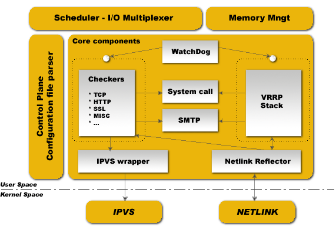

- 分为两大层：内核空间(Kernel Space)、用户空间(User Space)
- IPVS(IP Virtual Server): 实现传输层负载平衡，也称为第4层交换；
- NETLINK: 用于在内核和用户空间进程之间传输信息；

Keepalived 分为3个守护进程：

- 父进程: 很简单，负责 fork 子进程，并监视子进程健康状态(图中 WatchDog 周期性发送检测包，需要的话重启子进程)；
- 子进程A: 负责VRRP框架(图中 VRRP Stack)
- 子进程B: 负责健康检查(图中 Checkers)

### 运行原理

keepalived 通过选举（看服务器设置的权重）挑选出一台热备服务器做 MASTER 机器，MASTER 机器会被分配到一个指定的虚拟 ip，即VIP, 外部程序可通过该 VIP 访问这台服务器，如果这台服务器出现故障（断网，重启，或者本机器上的 keepalived crash 等），keepalived 会从其他的备份机器上重选（还是看服务器设置的权重）一台机器做 MASTER 并分配同样的虚拟 IP，充当前一台 MASTER 的角色。权重越高, 备用机器被拉起来的占比就越大, 一般的主备就可以满足我们的需求

### 选举策略

选举策略是根据 VRRP 协议，完全按照权重大小，权重最大的是 MASTER 机器，下面几种情况会触发选举

1. keepalived 启动的时候
2. master 服务器出现故障（断网，重启，或者本机器上的 keepalived crash 等，而本机器上其他应用程序 crash 不算）
3. 有新的备份服务器加入且权重最大

## 3. keepalived的脑裂

### 什么是脑裂

在高可用系统中, 作为主备节点的两台服务器, 可能因为一些比如说网络断开, 两台机器的心跳检测会认为主挂了, 但是主其实是正常的,只是网络断开了, 心跳检测没法检查到主还活着, 由于主从之间失去了联系, 都以为是对方发生了故障, 所以两个节点都会主动的抢占资源, 争抢应用服务, 争抢VIP, 这样就发发生一些严重的后果, 或者资源被瓜分了, 或者是两边的节点都启动不起来了, 或者是都起来了, 但是同时读写共享存储, 导致数据损坏.

### 脑裂产生的原因

- 高可用服务器对之间心跳线链路发生故障，导致无法正常通信
  - 因心跳线断开（包括网线断裂、水晶头松动等物理原因）
  - 因网卡及相关驱动坏了，ip配置及冲突问题（网卡直连）
  - 因心跳线间连接的设备故障（网卡及交换机）
  - 因仲裁的机器出问题（采用仲裁的方案）
- 高可用服务器上开启了 iptables防火墙阻挡了心跳消息传输
- 高可用服务器上心跳网卡地址等信息配置不正确，导致发送心跳失败
- 其他服务配置不当等原因，如心跳方式不同，心跳广插冲突、软件Bug等

### 脑裂常见的解决方案

在实际生产环境中，我们可以从以下几个方面来防止裂脑问题的发生：

- 同时使用串行电缆和以太网电缆连接，同时用两条心跳线路，这样一条线路坏了，另一个还是好的，依然能传送心跳消息
- 当检测到裂脑时强行关闭一个心跳节点（这个功能需特殊设备支持，如Stonith、feyce）。相当于备节点接收不到心跳消患，通过单独的线路发送关机命令关闭主节点的电源
- 做好对裂脑的监控报警（如邮件及手机短信等或值班）.在问题发生时人为第一时间介入仲裁，降低损失。例如，百度的监控报警短倍就有上行和下行的区别。报警消息发送到管理员手机上，管理员可以通过手机回复对应数字或简单的字符串操作返回给服务器.让服务器根据指令自动处理相应故障，这样解决故障的时间更短.

当然，在实施高可用方案时，要根据业务实际需求确定是否能容忍这样的损失。对于一般的网站常规业务.这个损失是可容忍的

## 4. lvs+keepalived

lvs和keepalived应该可以说是天然的集成, 在因为LVS已经集成到linux内核系统中, 我们只需要配置一下keepalived的配置文件就可以了, 那我们还是主要来研究一下keepalived的配置文件, 就可以轻松的使用了

### keepalived的配置文件

```

#全局配置
global_defs {
   notification_email { #设置报警邮件地址，每行一个，（如何要开启邮件报警，需要开启本机的sendmail服务）
      974644081@qq.com   
}
   notification_email_from 974644081@qq.com   #设置邮件的发送地址
   smtp_server smtp.qq.com            #设置邮件的smtp server地址
   smtp_connect_timeout 30            #设置连接smtp server的超时时间
   router_id LVS_DEVEL             #表示keepalived服务器的一个标识，是发邮件时显示在邮件主题中的信息
}
#keepalived的VRRPD配置，是所有keepalived配置的核心
#VRRP实例配置
vrrp_instance VIP_142    #是VRRP实例开始的标识，后跟VRRP实例名称
{
state MASTER        #keepalived的角色，MASTER主，BACKUP备
interface eth0        #用于指定HA监测网络的接口
virtual_router_id 142     #虚拟路由标识，这个标识是一个数字，同一个VRRP实例使用唯一的一个标识，即在同一个vrrp_instance下，MASTER和BACKUP必须是一致的！
priority 100         #权重优先级
advert_int 2         #用于设定master和backup主机之间同步检查的时间间隔，单位是秒
garp_master_delay 10     #用于切换到master状态后延时进行Gratuitous arp请求的时间
smtp_alert          #表示是否开启邮件通知(用全局区域的邮件设置来发通知)
authentication        #主备之间进行通信的验证类型和密码：验证类型主要有PASS和AH两种，一个在vrrp_instance下，MASTER和backup必须使用相同的密码才可以通信
{
auth_type PASS 
auth_pass 123456
}
#virtual_ipaddress用于设置虚拟ip地址，可以设置多个vip，每行一个，
virtual_ipaddress
{ 
10.95.0.200/24
}
track_interface     #用于设置一些额外的网络监控接口，其中任何一个网络接口出现故障，keepalived都会进去fault状态！
{
eth0
} 
nopreempt       #设置不抢占功能，只能在backup上使用，知道机器有故障了才切换，
preemtp_delay 300   #用于设置抢占的延时时间，（例：开启启动没必要抢占）
}
#以下是lvs的主要主要配置信息，主要实现lvs的ip包转发功能！
virtual_server 10.95.0.200 80        #虚拟ip和端口
{
  delay_loop 6        #设置健康检查的时间间隔
  lb_algo wrr         #设置负载调度算法
  lb_kind DR         #设置lvs的模式
  persistence_timeout 60    #会话保持时间，单位秒
  protocol TCP        #ip包转发协议，有TCP和UDP两种
  real_server 10.95.0.143 80    #real server 的ip
  {
    weight 3            #权重
    TCP_CHECK            #健康检查
    {
      connect_timeout 10        #表示无响应超时时间
      nb_get_retry 3            #表示重连次数
      delay_before_retry 3        #表示重试间隔
      connect_port 80            #表示端口
    }
  }
  real_server 10.95.0.144 80
  {
    weight 3
    TCP_CHECK
    {
      connect_timeout 10
      nb_get_retry 3
      delay_before_retry 3
      connect_port 80
    }
  }
}
```


### keepalived的心跳检测

健康监测应许多种检查方式，常见的有，HTTP_GET，SSL_GET，TCP_CHECK，SMTP_CHECK，MISC_CHECK.

TCP_CHECK {

  conetct_port 80

  connect_timeout 3

  nb_get_retry 3

  delay_before_retry 3

}

connect_port:健康检查的端口，如果不指定，默认是real_server指定的端口

connect_timeout:表示无响应超时时间，单位是秒，这里是3s

nb_get_retry：表示重试次数，这里是3ci

delay_before_retry：表示重试间隔，

HTTP_GET |SSL_GET

{

  url{

​    path /index.html  #指定url信息

​    digest e6owjfdsjfalsjdfsalkf30wfdsfjwqe  

​    \#ssl检查后的摘要信息，这些摘要信息可以通过genhash命令工具获取，

​      \#例：genhash -s 192.168.12.80 -p 80 -u /index.html

​    status_code 200  

}

  connect_port 80

  bindto 192.168.31.128    #表示通过此地址来对发送请求对服务器进行健康检查

  nb_get_retry 3

  delay_before_retry 2

}

## 5. lvs+keepalvied使用过程的一些坑

### 1. keepalived的启动

在配置keepalived.conf的配置文件时，一定要检查配置文件的正确性，因为keepalived在重启时，并不检查配置文件的正确性，即使没有配置文件，keepalived照样可以启动，所以一定要检查配置文件是否正确

### 2. keepalived服务器的局限性

下面LVS+DR+keepalived+nginx+tomcat的一个架构

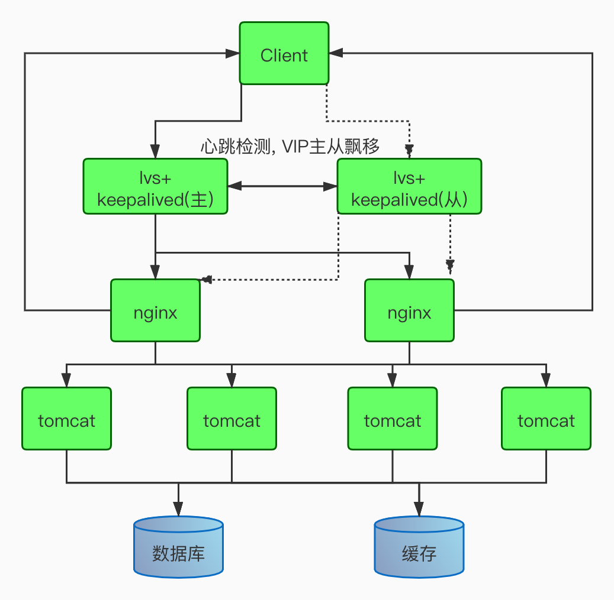

在我们的工作中, 如果要是实现上面的方案, 应用服务器的个数应该有8台服务器, 但是我们发现问题, **如果keepalvied的VIP在主上的时候, keepalived的从服务器上是没有任何请求的, 几乎没有什么压力, 只有发生VIP偏移, 从才会进行工作, 那为了提高服务器的使用率, keepalived的服务器是否可以作为tomcat服务器来使用呢? 如果用了, 那就掉坑里面了.**下面我们来说说原因

上图中的keepalived服务器, nginx服务器, 都是有绑定VIP的, 如果不清楚LVS的DR模式, 可以上看我上一篇的LVS的那篇文章.

我们如果在nginx服务器上部署tomat应用, 好的, 就是把nginx也当成是tomcat服务器, 这个可以为我们节省一些资源, **但是如果你把tomcat部署在keepalived服务器上, 你真的就有坑了**

如果在lvs+keepalvied(主)服务器上部署了tomcat应用, 不可避免的, 我们应用中有调用域名或者VIP的函数或者方法, 即服务之间的相互调用, 应用在发起请求的时候, 它的源ip地址就可以是VIP地址, 目标IP地址是VIP, 这个时候请求是可以正常转发, 处理的, 但是最后nginx处理完请求以后, nginx就懵逼了, 她没法把请求返回给lvs+keepalvied(主)服务器的请求,这时候的nginx太难了, nginx是Real Service, DR模式中, 他自己是有VIP的, 他自己是vip,让他返回给VIP, 你是nginx, 你也懵逼

**总之一句话总结: lvs+keepalived服务器上不能部署发起请求的客户端应用, 否则接收不到消息**

### 3. 主故障恢复, 避免自动切换

**背景需求：**
在一个HA集群中，如果主节点死机了，备用节点会进行接管，主节点再次正常启动后一般会自动接管服务。对于实时性和稳定性要求不高的的业务系统来说，这种来回切换的操作是可以接受的。而对于稳定性和实时性要求很高的业务系统来说，不建议来回切换，毕竟服务的切换存在一定的风险和不稳定性。

**方法一：**

在这种情况下，就需要设置nopreempt这个选项，设置mopreempt可以实现主节点故障恢复后不再切换回主节点，让服务器一直在备节点下工作，知道备用节点出现故障才会进行切换，在使用不抢占功能时，只能在“state”状态为“BACKUP”的节点上设置，而且这个节点的优先级必须高于其他节点。

**方法二：**
角色可以都设为BACKUP 权重一样 先启动一个节点 后面的故障切换谁抢到谁用

# 6. lvs的集群模式

我们用流量的并发来进行计算, 如果流量是10w以下的并发, 那我们可能使用nginx+keepalived的架构, 可能就直接可以满足需求, 那如果请求几十万的并发的, 那就推荐大家使用lvs+keepalived的架构, 这个lvs的并发, 一个配置不错的应用服务器, 应该可以扛个几十万的并发, 是没有问题, 那如果请求量还是很大的, lvs扛不住, 把我的机器打崩了呢, 那这个时候LVS集群模式就诞生了.其实就是一个思路, 请求大了机器来扛.

fullnat是淘宝开源的一种lvs转发模式，主要思想：引入local address（内网ip地址），cip-vip转换为lip->rip，而 lip和rip均为IDC内网ip，可以跨vlan通讯，这刚好符合我们的需求，因为我们的内网是划分了vlan的。

首先我们在了解这种方式之前, 我们来了解一下什么是OSPF?

### 什么是OSPF?

OSPF(Open Shortest Path First[开放式最短路径优先](https://baike.baidu.com/item/开放式最短路径优先/8966505)）是一个[内部网关协议](https://baike.baidu.com/item/内部网关协议/167192)(Interior Gateway Protocol，简称IGP），用于在单一[自治系统](https://baike.baidu.com/item/自治系统)（autonomous system,AS）内决策[路由](https://baike.baidu.com/item/路由)。是对[链路状态路由协议](https://baike.baidu.com/item/链路状态路由协议/1219386)的一种实现，隶属内部网关协议（IGP），故运作于自治系统内部。著名的迪克斯加算法被用来计算[最短路径树](https://baike.baidu.com/item/最短路径树)。OSPF支持负载均衡和基于服务类型的选路，也支持多种路由形式，如特定主机路由和子网路由等。

我们通过OSPF在服务上安装, 实现路由到LVS服务器上的最短路径是一样的, 从而实现LVS平均接收请求, 可以接受更高的并发量.

### 架构图

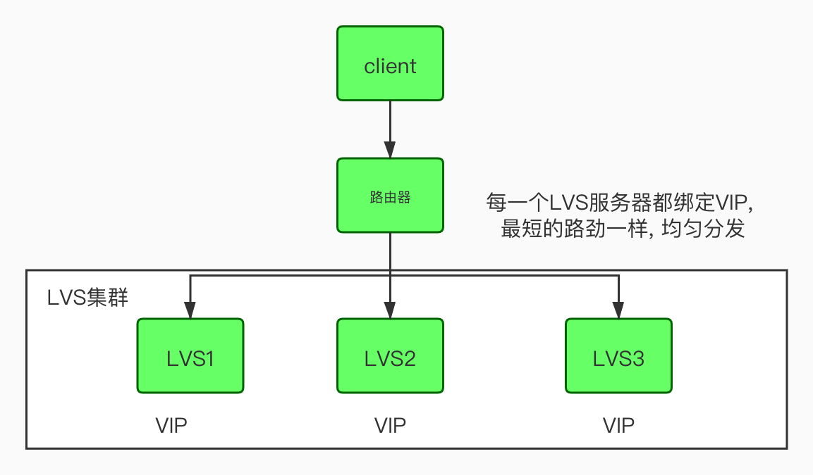

针对集群操作篇, 我放在了下一篇的文章中, 是阿里的大佬写的, 大家在运维的时候, 可以参考.


作者：凌晶

**简介：生活中的段子手，目前就职于一家地产公司做 DevOPS 相关工作, 曾在大型互联网公司做高级运维工程师，熟悉 Linux 运维，Python 运维开发，Java 开发，DevOPS 常用开发组件等，个人公众号：stormling，欢迎来撩我哦!**

