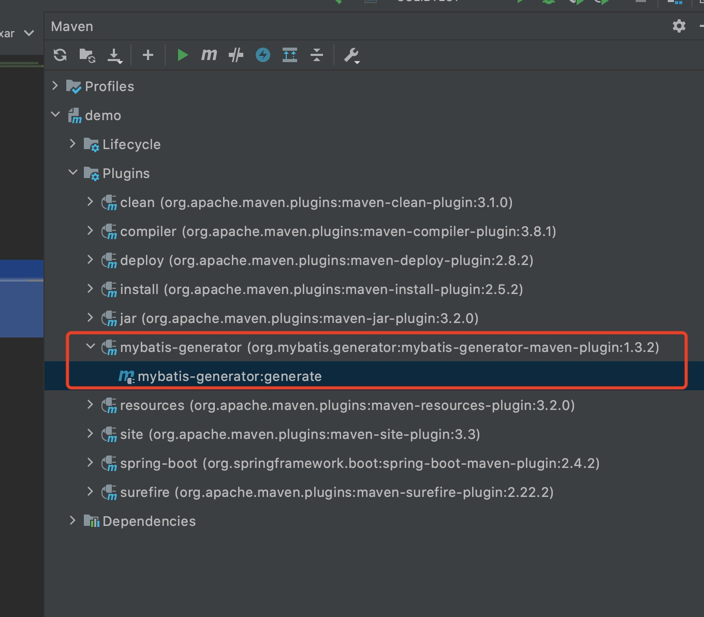
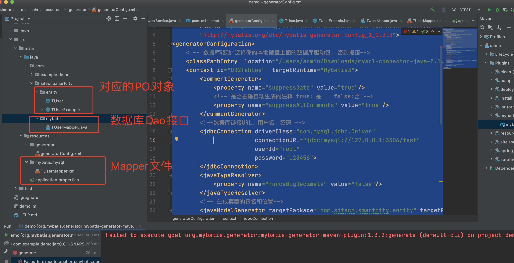

# mybatis的逆向工程

# 1. 逆向工程介绍

使用官方网站的Mapper自动生成工具mybatis-generator-core-1.3.2来针对单表生成**po**类 (Example)和Mapper接口和mapper映射文件


# 2. 新建项目

新建一个demon的maven项目， 增加如下插件

```
			<plugin>
           <groupId>org.mybatis.generator</groupId>
           <artifactId>mybatis-generator-maven-plugin</artifactId>
           <version>1.3.2</version>
           <configuration>
                <!--配置文件的位置-->
                												<configurationFile>${basedir}/src/main/resources/generator/generatorConfig.xml</configurationFile>
                <verbose>true</verbose>
                <overwrite>true</overwrite>
            </configuration>
            <executions>
                <execution>
                    <id>Generate MyBatis Artifacts</id>
                    <goals>
                        <goal>generate</goal>
                    </goals>
                </execution>
            </executions>
            <dependencies>
                <dependency>
                    <groupId>org.mybatis.generator</groupId>
                    <artifactId>mybatis-generator-core</artifactId>
                    <version>1.3.2</version>
                </dependency>
            </dependencies>
            </plugin>
```

配置以上插件以后， 会在maven出发现新加的插件




# 3. 修改配置文件

在resource下创建generator目录， 然后创建generatorConfig.xml文件

修改mysql的用户名， 密码， 生成文件目录， 表明， 就会自动创建目录

```
<?xml version="1.0" encoding="UTF-8"?>
<!DOCTYPE generatorConfiguration
        PUBLIC "-//mybatis.org//DTD MyBatis Generator Configuration 1.0//EN"
        "http://mybatis.org/dtd/mybatis-generator-config_1_0.dtd">
<generatorConfiguration>
    <!-- 数据库驱动:选择你的本地硬盘上面的数据库驱动包, 否则报错-->
    <classPathEntry  location="/Users/admin/Downloads/mysql-connector-java-5.1.47.jar"/>
    <context id="DB2Tables"  targetRuntime="MyBatis3">
        <commentGenerator>
            <property name="suppressDate" value="true"/>
            <!-- 是否去除自动生成的注释 true：是 ： false:否 -->
            <property name="suppressAllComments" value="true"/>
        </commentGenerator>
        <!--数据库链接URL，用户名、密码 -->
        <jdbcConnection driverClass="com.mysql.jdbc.Driver"
                        connectionURL="jdbc:mysql://127.0.0.1:3306/test"
                        userId="root"
                        password="xxxxxx">
        </jdbcConnection>
        <javaTypeResolver>
            <property name="forceBigDecimals" value="false"/>
        </javaTypeResolver>
        <!-- 生成模型的包名和位置-->
        <javaModelGenerator targetPackage="com.sitech.smartcity.entity" targetProject="src/main/java">
            <!-- enableSubPackages:是否让schema作为包的后缀 -->
            <property name="enableSubPackages" value="true"/>
            <!-- 从数据库返回的值被清理前后的空格 -->
            <property name="trimStrings" value="true"/>
        </javaModelGenerator>
        <!-- 生成映射文件的包名和位置-->
        <sqlMapGenerator targetPackage="mybatis/mysql" targetProject="src/main/resources">
            <property name="enableSubPackages" value="true"/>
        </sqlMapGenerator>
        <!-- 生成DAO的包名和位置-->
        <javaClientGenerator type="XMLMAPPER" targetPackage="com.sitech.smartcity.mybatis" targetProject="src/main/java">
            <property name="enableSubPackages" value="true"/>
        </javaClientGenerator>

        <!-- 要生成的表 tableName是数据库中的表名或视图名 domainObjectName是实体类名-->
        <table tableName="t_user"></table>

    </context>
</generatorConfiguration>
```


# 4. 运行插件

自动生产文件目录： 如下所示， 拷贝到自己需要的地方就可以了。




# 5. 结束语

官网给我们提供了简单的代码生成器， 非常的好用， 不过也看你具体开发过程中， 自己的需求。

其实上面的这个， 其实就是代码生成器的一个小模块， 我们是不是可以根据这个， 自己集成一个代码生成器呢？