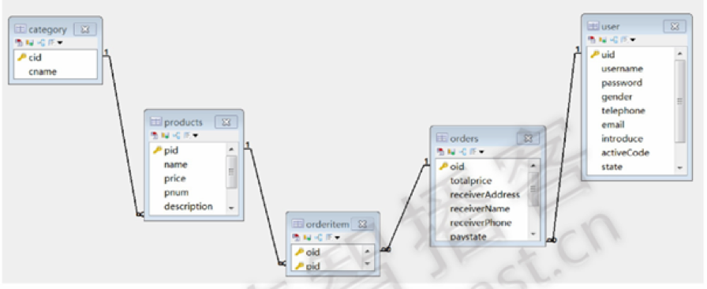
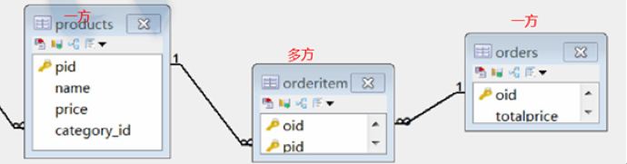
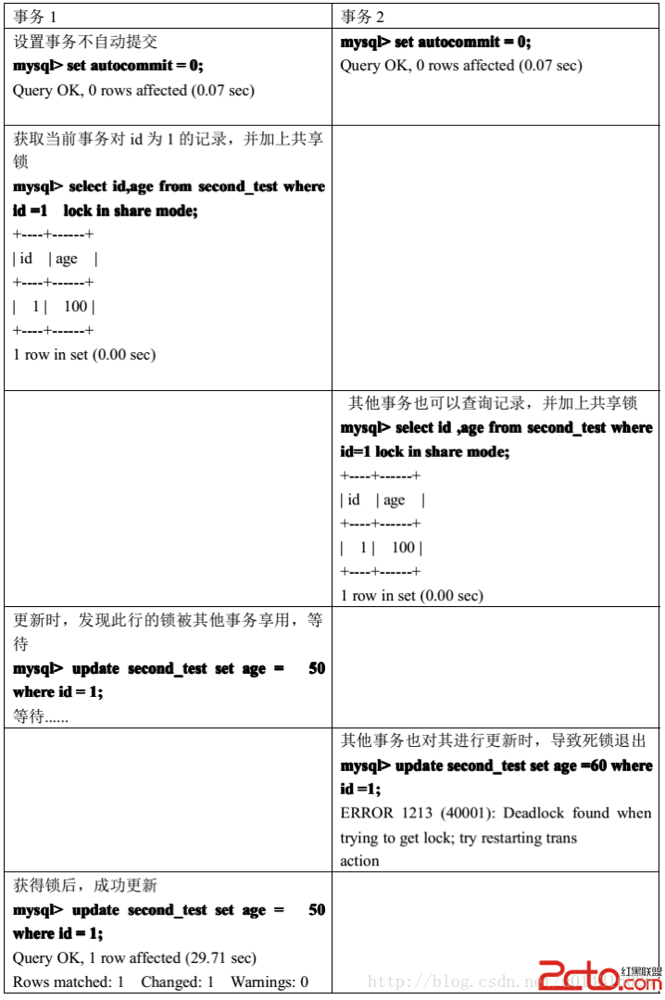
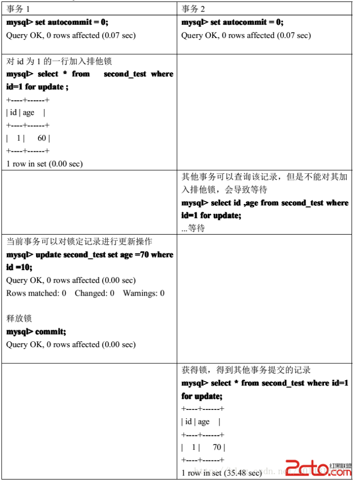
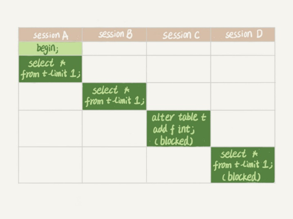

# 6. 多表之间的关系



如图，实际业务数据库中的表之间都是有关系的，我们接下来主要要学习的就是如何分析表关系及建立表关系。

分类表

```
create table category(

 cid varchar(32) primary key,
  cname varchar(100)
 );


```

商品表

```
create table product(

 pid varchar(32) primary key,
  pname varchar(40),
  price double
 ); 
```

订单表

```
create table orders(

 oid varchar(32) primary key,
  totalprice double
 );
```

订单项表

```
create table orderitem(

 oid varchar(50),
  pid varchar(50)
 );
```

## 6.1 表与表之间的关系

表与表之间的关系，说的就是表与表之间数据的关系。

 

1）一对一关系：一夫一妻

2）一对多关系：会员和订单

3）多对多关系（需要中间表实现）：商品和订单

## 6.2 外键

如何表示表与表之间的关系呢？就是使用外键约束表示的。

要想理解外键，我们先去理解表的角色：主表和从表（需要建立关系才有了主从表的角色区分）

**注意： 一般的设计表结构中， 避免使用外键**

## 6.3 一对一关系

在实际工作中，一对一在开发中应用不多，因为一对一完全可以创建成一张表

 

案例：一个丈夫只能有一个妻子

```
CREATE TABLE wife(

 id  INT PRIMARY KEY ,
  wname  VARCHAR(20),
  sex CHAR(1)
 );
 CREATE TABLE husband(
  id  INT PRIMARY KEY ,
  hname  VARCHAR(20),
  sex CHAR(1)
 );
```

## 6.4 一对多

案例：一个分类对应多个商品

总结：有外键的就是多的一方。

注意事项：一对多关系和一对一关系的创建很类似，唯一区别就是外键不唯一。

一对多关系创建：

​    \- 添加外键列

​    \- 添加外键约束 

案例：

​    \- 在商品表中添加一条记录，该记录的cid在分类表中不存在

​    \- 在分类表中，删除一条记录，这条记录在商品表中有外键关联

## 6.5 多对多

同一个商品对应多个订单，一个订单对应多个商品



注意事项：

\- 需要中间表去完成多对多关系的创建
 \- 多对多关系其实就是两个一对多关系的组合

 

多对多关系创建：

\- 创建中间表，并在其中创建多对多关系中两张表的外键列
 \- 在中间表中添加外键约束
 \- 在中间表中添加联合主键约束


# 7.多表关联查询

我们已经学会了如何在一张表中读取数据，这是相对简单的，但是在真正的应用中经常需要从多个数据表中读取数据。本章节我们将向大家介绍如何使用 MySQL 的 JOIN 在两个或多个表中查询数据。你可以在 SELECT, UPDATE 和 DELETE 语句中使用 MySQL 的 JOIN 来联合多表查询。

JOIN 按照功能大致分为如下三类：

\- CROSS JOIN（交叉连接）

\- INNER JOIN（内连接或等值连接）。

\- OUTER JOIN（外连接） 

建表语句：

```
insert into category (cid,cname) values ('c001','家电');
insert into category (cid,cname) values ('c002','服饰');
insert into category (cid,cname) values ('c003','化妆品');
insert into product(pid,pname,price,cid) values ('p001','联想',5000,'c001');
insert into product(pid,pname,price,cid) values ('p002','海尔',3000,'c001');
insert into product(pid,pname,price,cid) values ('p003','雷神',5000,'c001');
insert into product(pid,pname,price,cid) values ('p004','阿迪',1000,'c002');
insert into product(pid,pname,price,cid) values ('p005','耐克',1200,'c002');
insert into product(pid,pname,price,cid) values ('p006','NB',800,'c002');
insert into product(pid,pname,price,cid) values ('p007','彪马',600,'c002');
insert into product(pid,pname,price,cid) values ('p008','雪花秀',1500,'c003');
insert into product(pid,pname,price,cid) values ('p009','悦诗风吟',1100,'c003');
```

## 7.1 交叉连接

关键字：CROSS JOIN

交叉连接也叫笛卡尔积连接。笛卡尔积是指在数学中，两个集合X和Y的笛卡尓积（Cartesian product），又称直积，表示为X*Y，第一个对象是X的成员而第二个对象是Y的所有可能有序对的其中一个成员。

交叉连接的表现：行数相乘、列数相加

隐式交叉连接

`SELECT * FROM  A, B`

显式交叉连接

`SELECT * FROM A CROSS JOIN B`

## 7.2 内连接

关键字：INNER JOIN 

内连接也叫等值连接，内联接使用比较运算符根据每个表共有的列的值匹配两个表中的行。 

隐式内连接

`SELECT * FROM A,B WHERE A.id = B.id`

显式内连接

`SELECT * FROM A INNER JOIN B ON A.id = B.id`

## 7.3 外连接

外联接可以是左向外联接、右向外联接或完整外部联接。

也就是说外连接又分为：左外连接、右外连接、全外连接。

外连接需要有主表或者保留表的概念。

在 FROM子句中指定外联接时，可以由下列几组关键字中的一组指定：

### 1. 左外连接

LEFT JOIN 或者 LEFT OUTER JOIN

`SELECT * FROM A LEFT JOIN B ON A.id = B.id`

案例：查询分类信息，关联查询商品信息

### 2. 右外连接

RIGHT JOIN 或者 RIGHT OUTER JOIN

`SELECT * FROM A RIGHT JOIN B ON A.id = B.id`

### 3. 全外连接（mysql不支持）

FULL JOIN 或 FULL OUTER JOIN

`SELECT * FROM A FULL JOIN B ON A.id = B.id`

### 外连接总结

通过业务需求，分析主从表

如果使用LEFT JOIN，则主表在它左边

如果使用RIGHT JOIN，则主表在它右边

查询结果以主表为主，从表记录匹配不到，则补null

# 8. mysql锁

## 8.1 mysql锁介绍

按照锁的粒度来说，MySQL主要包含三种类型（级别）的锁定机制：

\- 全局锁：锁的是整个database。由MySQL的SQL layer层实现的
 \- 表级锁：锁的是某个table。由MySQL的SQL layer层实现的
 \- 行级锁：锁的是某行数据，也可能锁定行之间的间隙。由某些存储引擎实现，比如InnoDB。

 

按照锁的功能来说分为：共享读锁和排他写锁。

按照锁的实现方式分为：悲观锁和乐观锁（使用某一版本列或者唯一列进行逻辑控制）

 

表级锁和行级锁的区别：

- 表级锁：开销小，加锁快；不会出现死锁；锁定粒度大，发生锁冲突的概率最高，并发度最低；

- 行级锁：开销大，加锁慢；会出现死锁；锁定粒度最小，发生锁冲突的概率最低，并发度也最高

  

## 8.2 mysql表级锁

### 1）表级锁介绍

由MySQL SQL layer层实现

MySQL的表级锁有两种：

一种是表锁。
一种是元数据锁（meta data lock，MDL)。

MySQL 实现的表级锁定的争用状态变量：

mysql> show status like 'table%';

- table_locks_immediate：产生表级锁定的次数；
- table_locks_waited：出现表级锁定争用而发生等待的次数；

### 2）表锁介绍

① 表锁有两种表现形式：

- **表共享读锁**（Table Read Lock）是读取操作创建的锁。其他用户可以并发读取数据，但任何事务都不能对数据进行修改（获取数据上的排他锁），直到已释放所有共享锁。 
   如果事务T对数据A加上共享锁后，则其他事务只能对A再加共享锁，不能加排他锁。获准共享锁的事务只能读数据，不能修改数据。
- **表独占写锁**（Table Write Lock）如果事务T对数据A加上排他锁后，则其他事务不能再对A加任任何类型的封锁。获准排他锁的事务既能读数据，又能修改数据。

② 手动增加表锁：lock table 表名称 read(write),表名称2 read(write)，其他;

③ 查看表锁情况：show open tables;

④ 删除表锁：unlock tables;

### 3）表锁演示

环境准备

```
CREATE TABLE mylock (  
	id int(11) NOT NULL AUTO_INCREMENT,  
	NAME varchar(20) DEFAULT NULL,  
	PRIMARY KEY (id) 
 );
 INSERT INTO mylock (id,NAME) VALUES (1, 'a');
 INSERT INTO mylock (id,NAME) VALUES (2, 'b');
 INSERT INTO mylock (id,NAME) VALUES (3, 'c');
 INSERT INTO mylock (id,NAME) VALUES (4, 'd');
```

读锁演示



写锁演示：



读锁和写锁都是行级锁，InnoDB的行锁是通过给索引上的索引项加锁来实现的，如果没有索引，InnoDB将通过隐藏的聚簇索引来对记录加锁，InnoDB行锁分为3中情形： 

1. Record Lock：对索引项加锁。 

2. Gap Lock：对索引项之间的“间隙”、第一条记录前的“间隙”或最后一条记录后的“间隙”加锁。 

3. Next-key Lock：前两种的结合，对记录及其前面的间隙加锁。  

InnoDB这种行锁的实现特点意味着，如果不通过索引条件检索数据，那么InnoDB将对表中的所有记录加锁，实际效果跟锁表一样。

### 4）元数据锁介绍

MDL不需要显式使用，在访问一个表的时候会被自动加上。

MDL的作用是，保证读写的正确性。你可以想象一下，如果一个查询正在遍历一个表中的数据，而执行期间另一个线程对这个表结构做变更，删了一列，那么查询线程拿到的结果跟表结构对不上，肯定是不行的。

因此，在 MySQL 5.5 版本中引入了 MDL，当对一个表做增删改查操作的时候，加 MDL 读锁；当要对表做结构变更操作的时候，加 MDL 写锁。

- 读锁之间不互斥，因此你可以有多个线程同时对一张表增删改查。

- 读写锁之间、写锁之间是互斥的，用来保证变更表结构操作的安全性。因此，如果有两个线程要同时给一个表加字段，其中一个要等另一个执行完才能开始执行。

### 5）元数据锁演示



我们可以看到 session A 先启动，这时候会对表 t 加一个 MDL 读锁。由于 session B 需要的也是 MDL 读锁，因此可以正常执行。

 

之后 session C 会被 blocked，是因为 session A 的 MDL 读锁还没有释放，而 session C 需要 MDL 写锁，因此只能被阻塞。

 

如果只有 session C 自己被阻塞还没什么关系，但是之后所有要在表 t 上新申请 MDL 读锁的请求也会被 session C 阻塞。前面我们说了，所有对表的增删改查操作都需要先申请 MDL 读锁，就都被锁住，等于这个表现在完全不可读写了。

 

你现在应该知道了，事务中的 MDL 锁，在语句执行开始时申请，但是语句结束后并不会马上释放，而会等到整个事务提交后再释放。

## 8.3 mysql行级锁

### 1. 行级锁介绍

MySQL的行级锁，是由存储引擎来实现的，这里我们主要讲解InnoDB的行级锁。

 

InnoDB的行级锁，按照锁定范围来说，分为三种：

\- 记录锁（Record Locks）：锁定索引中一条记录。

\- 间隙锁（Gap Locks）：要么锁住索引记录中间的值，要么锁住第一个索引记录前面的值或者最后一个索引记录后面的值。
 \- Next-Key Locks：是索引记录上的记录锁和在索引记录之前的间隙锁的组合。

 

InnoDB的行级锁，按照功能来说，分为两种：

\- 共享锁（S）：允许一个事务去读一行，阻止其他事务获得相同数据集的排他锁。

\- 排他锁（X）：允许获得排他锁的事务更新数据，阻止其他事务取得相同数据集的共享读锁和排他写锁。

 

对于UPDATE、DELETE和INSERT语句，InnoDB会自动给涉及数据集加排他锁（X)；

对于普通SELECT语句，InnoDB不会加任何锁，事务可以通过以下语句显示给记录集加共享锁或排他锁。

 

手动添加共享锁（S）：

`SELECT * FROM table_name WHERE ... LOCK IN SHARE MODE`

 

手动添加排他锁（x）：

`SELECT * FROM table_name WHERE ... FOR UPDATE`


InnoDB也实现了表级锁，也就是意向锁，意向锁是mysql内部使用的，不需要用户干预。

- **意向共享锁（IS）**：事务打算给数据行加行共享锁，事务在给一个数据行加共享锁前必须先取得该表的IS锁。

- **意向排他锁（IX）**：事务打算给数据行加行排他锁，事务在给一个数据行加排他锁前必须先取得该表的IX锁。

 

意向锁和行锁可以共存，意向锁的主要作用是为了【全表更新数据】时的性能提升。否则在全表更新数据时，需要先检索该范是否某些记录上面有行锁。

 

|                  | 共享锁（S） | 排他锁（X） | 意向共享锁（IS） | 意向排他锁（IX） |
| ---------------- | ----------- | ----------- | ---------------- | ---------------- |
| 共享锁（S）      | 兼容        | 冲突        | 兼容             | 冲突             |
| 排他锁（X）      | 冲突        | 冲突        | 冲突             | 冲突             |
| 意向共享锁（IS） | 兼容        | 冲突        | 兼容             | 兼容             |
| 意向排他锁（IX） | 冲突        | 冲突        | 兼容             | 兼容             |

 

InnoDB行锁是通过给索引上的索引项加锁来实现的，因此InnoDB这种行锁实现特点意味着：只有通过索引条件检索的数据，InnoDB才使用行级锁，否则，InnoDB将使用表锁！

Innodb所使用的行级锁定争用状态查看：

mysql> show status like 'innodb_row_lock%';

 

\- Innodb_row_lock_current_waits：当前正在等待锁定的数量；
 \- Innodb_row_lock_time：从系统启动到现在锁定总时间长度；
 \- Innodb_row_lock_time_avg：每次等待所花平均时间；
 \- Innodb_row_lock_time_max：从系统启动到现在等待最常的一次所花的时间；
 \- Innodb_row_lock_waits：系统启动后到现在总共等待的次数；

 

对于这5个状态变量，比较重要的主要是：

\- Innodb_row_lock_time_avg（等待平均时长）
 \- Innodb_row_lock_waits（等待总次数）
 \- Innodb_row_lock_time（等待总时长）这三项。

 

尤其是当等待次数很高，而且每次等待时长也不小的时候，我们就需要分析系统中为什么会有如此多的等待，然后根据分析结果着手指定优化计划。


### 2. InnoDB行锁演示

创建表及索引

```
create table test_innodb_lock (a int(11),b varchar(16)) engine=innodb;

create index test_innodb_a_idx on test_innodb_lock(a);

create index test_innodb_lock_b_idx on test_innodb_lock(b);
```

 

行锁定基本演示

|      | SESSION A                                                    | SESSION B                                                    |
| ---- | ------------------------------------------------------------ | ------------------------------------------------------------ |
| 1    | mysql> set autocommit=0; Query OK, 0  rows affected (0.00 sec) | mysql> set autocommit=0; Query OK, 0  rows affected (0.00 sec) |
| 2    | mysql> update test_innodb_lock set b =  'b1' where a = 1; Query OK, 1 row affected (0.00 sec) Rows matched: 1  Changed: 1 Warnings: 0 更新，但是不提交 |                                                              |
| 3    |                                                              | mysql> update test_innodb_lock set b =  'b2' where a = 1; 被阻塞，等待 |
| 4    | mysql> commit; Query OK, 0 rows affected  (0.05 sec) 提交    |                                                              |
| 5    |                                                              | mysql> update test_innodb_lock set b =  'b2' where a = 1; Query OK, 0 rows affected (36.14 sec) Rows matched: 1  Changed: 0 Warnings: 0 解除阻塞，更新正常进行 |

 无索引升级为表锁演示

|      | SESSION A                                                    | SESSION B                                                    |
| ---- | ------------------------------------------------------------ | ------------------------------------------------------------ |
| 1    | mysql> set autocommit=0; Query OK, 0  rows affected (0.00 sec) | mysql> set autocommit=0; Query OK, 0  rows affected (0.00 sec) |
| 2    | mysql> update test_innodb_lock set b =  '2' where b = 2000; Query OK, 1 row affected (0.02 sec) Rows matched: 1  Changed: 1 Warnings: 0 | mysql> update test_innodb_lock set b =  '3' where b = 3000; 被阻塞，等待 |
| 3    | mysql> commit; Query OK, 0 rows  affected (0.10 sec)         |                                                              |
| 4    |                                                              | mysql> update test_innodb_lock set b =  '3' where b = 3000; Query OK, 1 row affected (1 min 3.41 sec) Rows matched: 1  Changed: 1 Warnings: 0 阻塞解除，完成更新 |

 间隙锁带来的插入问题演示

|      | SESSION A                                                    | SESSION B                                                    |
| ---- | ------------------------------------------------------------ | ------------------------------------------------------------ |
| 1    | mysql> set autocommit=0; Query OK, 0  rows affected (0.00 sec) | mysql> set autocommit=0; Query OK, 0  rows affected (0.00 sec) |
| 2    | mysql> select * from test_innodb_lock;  \| a \| b \| \| 1 \| b2 \| \| 3 \| 3 \| \| 4 \| 4000 \| \| 5 \| 5000 \| \| 6 \| 6000 \| \| 7 \|  7000 \| \| 8 \| 8000 \| \| 9 \| 9000 \| \| 1 \| b1 \| 9 rows in set (0.00 sec) |                                                              |
| 3    | mysql> update test_innodb_lock set b =  a * 100 where a < 4 and a > 1; Query OK, 1 row affected (0.02 sec) Rows  matched: 1 Changed: 1 Warnings: 0 |                                                              |
| 4    |                                                              | mysql> insert into test_innodb_lock  values(2,'200'); 被阻塞，等待 |
| 5    | mysql> commit; Query OK, 0 rows  affected (0.02 sec)         |                                                              |
| 6    |                                                              | mysql> insert into test_innodb_lock  values(2,'200'); Query OK, 1 row affected (38.68 sec) 阻塞解除，完成插入 |

 

 使用共同索引不同数据的阻塞示例

|      | SESSION A                                                    | SESSION B                                                    |
| ---- | ------------------------------------------------------------ | ------------------------------------------------------------ |
| 1    | mysql> set autocommit=0; Query OK, 0  rows affected (0.00 sec) | mysql> set autocommit=0; Query OK, 0  rows affected (0.00 sec) |
| 2    | mysql> update test_innodb_lock set b =  'bbbbb' where a = 1 and b = 'b2'; Query OK, 1 row affected (0.00 sec) Rows  matched: 1 Changed: 1 Warnings: 0 |                                                              |
| 3    |                                                              | mysql> update test_innodb_lock set b =  'bbbbb' where a = 1 and b = 'b1'; 被阻塞 |
| 4    | mysql> commit; Query OK, 0 rows  affected (0.02 sec)         |                                                              |
| 5    |                                                              | mysql> update test_innodb_lock set b =  'bbbbb' where a = 1 and b = 'b1'; Query OK, 1 row affected (42.89 sec) Rows  matched: 1 Changed: 1 Warnings: 0 session 提交事务，阻塞去除，更新完成 |

 

死锁演示

|      | SESSION A                                                    | SESSION B                                                    |
| ---- | ------------------------------------------------------------ | ------------------------------------------------------------ |
| 1    | mysql> set autocommit=0; Query OK, 0  rows affected (0.00 sec) | mysql> set autocommit=0; Query OK, 0  rows affected (0.00 sec) |
| 2    | mysql> update t1 set id = 110 where id  = 11; Query OK, 0 rows affected (0.00 sec) Rows matched: 0 Changed: 0  Warnings: 0 |                                                              |
| 3    |                                                              | mysql> update t2 set id = 210 where id  = 21; Query OK, 1 row affected (0.00 sec) Rows matched: 1 Changed: 1  Warnings: 0 |
| 4    | mysql>update t2 set id=2100 where  id=21; 等待sessionb释放资源，被阻塞 |                                                              |
| 5    |                                                              | mysql>update t1 set id=1100 where  id=11; Query OK,0 rows affected (0.39sec) Rows matched: 0 Changed: 0  Warnings:0 等待sessiona释放资源，被阻塞 |
|      | 两个 session 互相等等待对方的资源释放之后才能释放自己的资源,造成了死锁 |                                                              |

# 9. mysql事务

## 9.1 事务介绍

在MySQL中的事务是由存储引擎实现的，而且支持事务的存储引擎不多，我们主要讲解InnoDB存储引擎中的事务。事务处理可以用来维护数据库的完整性，保证成批的 SQL 语句要么全部执行，要么全部不执行。

 

事务用来管理DDL、DML、DCL操作，比如 insert,update,delete 语句，默认是自动提交的。

 

一般来说，事务是必须满足4个条件（ACID）：

 

① Atomicity（原子性）：构成事务的的所有操作必须是一个逻辑单元，要么全部执行，要么全部不执行。

② Consistency（一致性）：数据库在事务执行前后状态都必须是稳定的或者是一致的。

③ Isolation（隔离性）：事务之间不会相互影响。

​    由锁机制和MVCC机制来实现的

​    MVCC：优化读写性能（读不加锁、读写不冲突）

④ Durability（持久性）：事务执行成功后必须全部写入磁盘。

## 9.2 事务开启

在MySQL命令行的默认设置下，事务都是自动提交的，即执行SQL语句后就会马上执行COMMIT操作。因此要显式地开启一个事务务须使用命令BEGIN或START TRANSACTION，或者执行命令SET AUTOCOMMIT=0，用来禁止使用当前会话的自动提交。

 

常见的操作有以下三个：

 

① BEGIN或START TRANSACTION；显式地开启一个事务；

② COMMIT也可以使用COMMIT WORK，不过二者是等价的。COMMIT会提交事务，并使已对数据库进行的所有修改称为永久性的；

③ ROLLBACK有可以使用ROLLBACK WORK，不过二者是等价的。回滚会结束用户的事务，并撤销正在进行的所有未提交的修改；

## 9.3 事务并发问题

在事务的并发操作中可能会出现一些问题：

 

① 丢失更新：一个事务更新之后，另一个事务也更新了，但是第二个事务回滚了，则第一个事务也被回滚了。

② 脏读：一个事务读取到另一个事务未提交的数据。

③ 不可重复读：一个事务因读取到另一个事务已提交的update或者delete数据。导致对同一条记录读取两次以上的结果不一致。

④ 幻读：一个事务因读取到另一个事务已提交的insert数据。导致对同一张表读取两次以上的结果不一致。

## 9.4 事务隔离级别

### 1）四种隔离级别（SQL92标准）

现在来看看MySQL数据库为我们提供的四种隔离级别（由低到高）：

 

① Read uncommitted (读未提交)：最低级别，任何情况都无法保证。

② Read committed (RC，读已提交)：可避免脏读的发生。

③ Repeatable read (RR，可重复读)：可避免脏读、不可重复读的发生。

（注意事项：InnoDB的RR还可以解决幻读，主要原因是Next-Key锁，只有RR才能使用Next-Key锁）

④ Serializable (串行化)：可避免脏读、不可重复读、幻读的发生。

（由MVCC降级为Locking-Base CC）

### 2）默认隔离级别

大多数数据库的默认隔离级别是Read Committed，比如Oracle、DB2等。

MySQL数据库的默认隔离级别是Repeatable Read。

### 3）如何查看和设置隔离级别

在MySQL数据库中查看当前事务的隔离级别： 

select @@tx_isolation;

 

在MySQL数据库中设置事务的隔离级别：

set [glogal | session] transaction isolation level 隔离级别名称;

set tx_isolation=’隔离级别名称;’

### 4）注意事项

隔离级别越高，越能保证数据的完整性和一致性，但是对并发性能的影响也越大。

 

对于多数应用程序，可以优先考虑把数据库系统的隔离级别设为Read Committed。它能够避免脏读取，而且具有较好的并发性能。尽管它会导致不可重复读、幻读这些并发问题，在可能出现这类问题的个别场合，可以由应用程序采用悲观锁或乐观锁来控制。