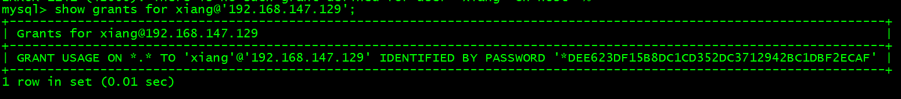
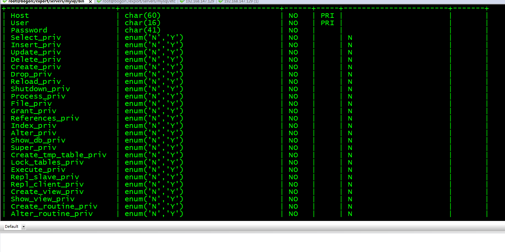

# 1. mysql主从复制

## 1、基础知识

日志是把数据库的每一个变化都记载到一个专用的文件里，这种文件就叫做日志文件。mysql默认只开启错误日志，因为过多的日志将会影响系统的处理性能。

在mysql5.0以前版本支持文本格式和二进制格式的日志，但是在mysql5.0后版本就只支持二进制格式的日志。因为二进制日志在性能、信息处理等方面有更多的优点。

## 2、启用mysql二进制日志

mysql二进制日志由配置文件my.cnf的log-bin选项负责启用的。

mysql服务器默认会在数据根目录创建两个新文件：XXX-bin.000001和XXX-bin.index。若配置选项没有给出文件名，mysql将使用mysql-bin来命名这两个文件，其中.index文件包含一份完整的日志文件清单。

只需要开启主数据库的二进制日志

vim /export/servers/mysql/etc/my.cnf

log_bin

两个可选参数（2选1）：

binlog-do-db=db1,db2 #需要同步的库

binlog-ignore-db=db1,db2 #忽略不同步的库

\####两个都不写就是全部同步

server_id = 1(从库和主库的id是不能一样的！！！！)

开启完以后重启mysql，以后，在msyql的datadir目录下面有一个bogon-bin.000001 ，每次重启数字都会加1

可以使用mysqlbinlog bogon-bin.00000

## 3.授权一个同步的账号：

授权：

```
grant replication slave on *.* to 'repl'@'127.0.0.1' identified by '123123'; 

grant all on *.* to xiang@'192.168.147.129';

show grants for xiang@'192.168.147.129';         ###查看用户的权限

show grants       ######查看当前用户的权限
```



只是一个普通用户，没有权限复制，遇到一个错误：Last_IO_Error: Master command COM_REGISTER_SLAVE failed: Access denied for user 'xiang'@'192.168.147.129' (using password: YES) (Errno: 1045)

desc mysql.user;




大部分除去priv就是权限

在授权从库的手，也可以用这两个权限

Repl_slave  

Repl_client

也是相同的道理

## 4.show master status;


要记住这两个参数，后面在从库的时候要用

## 5.修改slave配置文件

vim /export/servers/mysql/etc/my.cnf

server-id=2

重启mysql

mysql -uroot -p

mysql> stop slave;

\########停止复制

change master to master_host='192.168.147.150', master_port=3358, master_user='xiang', master_password='xiang', master_log_file='bogon-bin.000003', master_log_pos=120; 

start slave;

show slave status\G;

Relay_Master_Log_File: bogon-bin.000003

​             Slave_IO_Running: Yes

​            Slave_SQL_Running: Yes

这个地方看到两个yes，就可以ok的


如果有报错信息，就会有提示，根据提示操作就可以了！


# 2. mysql读写分离

## 1. 读写分离的理解

为什么要有读写分离集群呢？

我们先来看看主从集群的问题： 只有主对外提供服务， 主既要写操作， 还要负责写操作， 对于主从集群来说， 只是保证了数据的安全备份。


对于app应用来说， mysql Proxy就认为是mysql server


## 2. Mysql-Proxy安装配置

```
MySQL master:135 
MySQL slave :136 
MySQL proxy :137
```


下载：

```
wget https://downloads.mysql.com/archives/get/file/mysql-proxy-0.8.5-linux-el6-x86-
64bit.tar.gz
```

解压

```
tar -xf mysql-proxy-0.8.5-linux-el6-x86-64bit.tar.gz -C /data/
```

创建mysql-proxy.cnf配置文件

```mysql
[mysql-proxy]
user=root
admin-username=root
admin-password=root
proxy-address=192.168.10.137:4040
proxy-backend-addresses=192.168.10.135:3306
proxy-read-only-backend-addresses=192.168.10.136:3306
proxy-lua-script=/root/mysql-proxy/share/doc/mysql-proxy/rw-splitting.lua
log-file=/root/mysql-proxy/logs/mysql-proxy.log
log-level=debug
keepalive=true
daemon=true
```

修改mysql-proxy.cnf文件的权限

```
chmod 660 mysql-proxy.cnf
```

修改rw-plitting.lua脚本

```lua
-- connection pool
if not proxy.global.config.rwsplit then
  proxy.global.config.rwsplit = {
    min_idle_connections = 1,
    max_idle_connections = 2,
    is_debug = false
  }
  end
```

启动命令

```
./mysql-proxy --defaults-file=mysql-proxy.cnf 配置文件的地址
```


注意事项： 

如果没有配置profile文件的环境变量，则需要去拥有mysql-proxy命令的目录通过./mysql-proxy进行启动


在其他客户端，通过mysql命令去连接mysql proxy机器

```
mysql -uroot -proot -h192.168.10.137 -P4040
```


# 3. mysql分库分表篇


