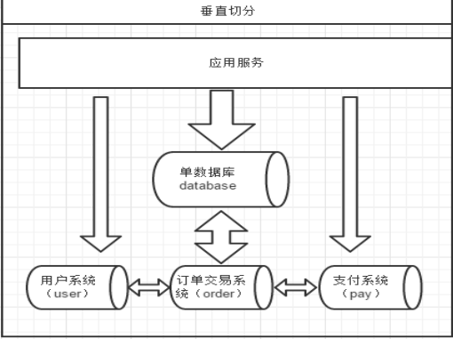
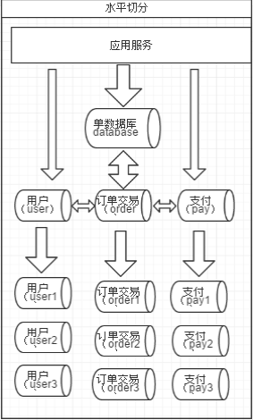
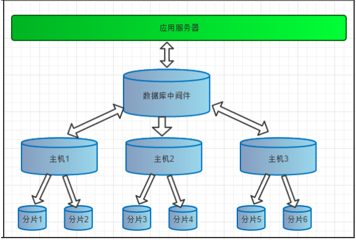
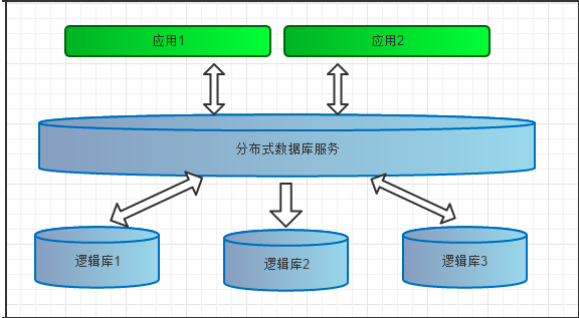

# mysql分库分表篇

# 1. 分库分表介绍

## 1. 使用背景

- 当表的数量达到几百上千张表时， 众多的业务模块都访问这个数据库， 压力会非常的大， 考虑对其进行分库
- 当表的数据达到几千万级别， 在做很多操作的时候比较吃力， 考虑对其进行分库或者分表

## 2. 数据切分方案

数据气氛根据其切分规则的类型， 可以分为两种切分模式：

- 垂直切分： 按照业务模块进行切分， 将不同模块的表切分到不同的数据库中。



- 水平切分： 将一张大表按照一定的切分规则， 按照行切分成不同的表或者切分到不同的库中。



水平切分的原则：

- 按照ID取模： 对ID进行取模， 余数决定该行数据切分到哪个表或者库中
- 按照日期： 按照年月日， 将数据切分到不同的表或者库中
- 按照范围： 可以对某一列按照范围进行切分， 不同的范围切分到不同的表或者数据库中

## 3. 切分的原则

- 第一： 能不切分尽量不要切分
- 第二： 如果要切分一定要选择合适的切片规则， 提前规划好
- 第三： 数据切分尽量通过数据冗余或者表分组来降低扩库join的可能
- 第四： 由于数据库中间件对数据join实现的优劣难以把握， 而且实现高性能难度极大， 业务读取尽量少使用多表join


## 4. 分库分表需要解决的问题

### 1. 分布式事务的问题

强一直性事务

最终一致性事务

### 2. 分布式主键ID问题

- Redis incr命令
- 数据生成主键
- UUID
- snowflake算法

### 3. 跨库join问题

- 通过业务分析， 将不同的join查询拆分成多个select
- 建立全局表
- 冗余字段， 避免跨库查询
- E-R分片（将有ER关系的记录都存储在一个库中）
- 最多支持跨两张表跨库的join

### 4. 跨库count， order by， group by问题


## 5. 分库分表实现技术

- 阿里的TDDL， Cobar
- 基于阿里Cobar开发的mycat
- 当当网的sharding-jdbc


# 2. mycat介绍

## 1. 什么是mycat？

Mycat数据库分库分表中间件

活跃的、性能好的开源数据库中间件！

一个彻底开源的，面向企业应用开发的大数据库集群

支持事务、ACID、可以替代MySQL的加强版数据库

一个可以视为MySQL集群的企业级数据库，用来替代昂贵的Oracle集群

一个融合内存缓存技术、NoSQL技术、HDFS大数据的新型SQL Server

结合传统数据库和新型分布式数据仓库的新一代企业级数据库产品

一个新颖的数据库中间件产品


## 2. Mycat架构


## 3. mycat的关键特性

支持SQL92标准

支持MySQL、Oracle、DB2、SQL Server、PostgreSQL等DB的常见SQL语法

遵守Mysql原生协议，跨语言，跨平台，跨数据库的通用中间件代理。

基于心跳的自动故障切换，支持读写分离，支持MySQL主从，以及galera cluster集群。

支持Galera for MySQL集群，Percona Cluster或者MariaDB cluster

基于Nio实现，有效管理线程，解决高并发问题。

支持数据的多片自动路由与聚合，支持sum,count,max等常用的聚合函数,支持跨库分页。

支持单库内部任意join，支持跨库2表join，甚至基于caltlet的多表join。

支持通过全局表，ER关系的分片策略，实现了高效的多表join查询。

支持多租户方案。

支持分布式事务（弱xa）。

支持XA分布式事务（1.6.5）。

支持全局序列号，解决分布式下的主键生成问题。

分片规则丰富，插件化开发，易于扩展。

强大的web，命令行监控。

支持前端作为MySQL通用代理，后端JDBC方式支持Oracle、DB2、SQL Server 、 mongodb 、巨杉。

支持密码加密

支持服务降级

支持IP白名单

支持SQL黑名单、sql注入攻击拦截

支持prepare预编译指令（1.6）

支持非堆内存(Direct Memory)聚合计算（1.6）

支持PostgreSQL的native协议（1.6）

支持mysql和oracle存储过程，out参数、多结果集返回（1.6）

支持zookeeper协调主从切换、zk序列、配置zk化（1.6）

支持库内分表（1.6）

集群基于ZooKeeper管理，在线升级，扩容，智能优化，大数据处理（2.0开发版）。

## 4. mycat的原理

Mycat 的原理中最重要的一个动词是“拦截”，它拦截了用户发送过来的 SQL 语句，首先对 SQL 语句做了 一些特定的分析：如分片分析、路由分析、读写分离分析、缓存分析等，然后将此 SQL 发往后端的真实数据库， 并将返回的结果做适当的处理，最终再返回给用户。


# 3. mycat中的概念

## 1. 数据库中间件

前面讲了 Mycat 是一个开源的分布式数据库系统，但是由于真正的数据库需要存储引擎，而 Mycat 并没有 存储引擎，所以并不是完全意义的分布式数据库系统。 那么 Mycat 是什么？Mycat 是数据库中间件，就是介于数据库与应用之间，进行数据处理与交互的中间服务。 由于前面讲的对数据进行分片处理之后，从原有的一个库，被切分为多个分片数据库，所有的分片数据库集群构 成了整个完整的数据库存储。



如上图所表示，数据被分到多个分片数据库后，应用如果需要读取数据，就要需要处理多个数据源的数据。 如果没有数据库中间件，那么应用将直接面对分片集群，数据源切换、事务处理、数据聚合都需要应用直接处理， 原本该是专注于业务的应用，将会花大量的工作来处理分片后的问题，最重要的是每个应用处理将是完全的重复 造轮子。 

所以有了数据库中间件，应用只需要集中与业务处理，大量的通用的数据聚合，事务，数据源切换都由中间 件来处理，中间件的性能与处理能力将直接决定应用的读写性能，所以一款好的数据库中间件至关重要。

## 2. 逻辑库（schema）

前面一节讲了数据库中间件，通常对实际应用来说，并不需要知道中间件的存在，业务开发人员只需要知道 数据库的概念，所以数据库中间件可以被看做是一个或多个数据库集群构成的逻辑库。 


在云计算时代，数据库中间件可以以多租户的形式给一个或多个应用提供服务，每个应用访问的可能是一个 独立或者是共享的物理库，常见的如阿里云数据库服务器 RDS。



# 4. mycat的安装

**注意： 需要先安装jdk**

1. 下载mycat

```
wget http://dl.mycat.io/1.6-RELEASE/Mycat-server-1.6-RELEASE-20161028204710-
linux.tar.gz
```

2. 解压缩

```
tar -zxvf Mycat-server-1.6-RELEASE-20161028204710-linux.tar.gz
```

3. 启动mycat

```
- 启动命令:./mycat start
- 停止命令:./mycat stop
- 重启命令:./mycat restart - 查看状态:./mycat status
```

4. 访问mycat

```
使用mysql的客户端直接连接mycat服务。默认服务端口为【8066】
```


# 5. mycat分片配置

## 1. 配置schema.xml

schema.xml介绍 schema.xml作为Mycat中重要的配置文件之一，管理着Mycat的逻辑库、表、分片规则、DataNode以及

DataHost之间的映射关系。弄懂这些配置，是正确使用Mycat的前提。

schema 标签用于定义MyCat实例中的逻辑库
 Table 标签定义了MyCat中的逻辑表
 dataNode 标签定义了MyCat中的数据节点，也就是我们通常说所的数据分片。 dataHost标签在mycat逻辑库中也是作为最底层的标签存在，直接定义了具体的数据库实例、读写分离配置 和心跳语句。

schema.xml配置

```
<?xml version="1.0"?>
<!DOCTYPE mycat:schema SYSTEM "schema.dtd">
<mycat:schema xmlns:mycat="http://io.mycat/">
<schema name="TESTDB" checkSQLschema="false" sqlMaxLimit="100"> <!-- auto sharding by id (long) -->
<table name="item" dataNode="dn1,dn2,dn3" rule="mod-long" /> <!-- 一个库中拆成多个表 -->
        <table name="user" dataNode="dn1" rule="mod-long" subTables="user$1-3" />
    </schema>
    <!-- <dataNode name="dn1$0-743" dataHost="localhost1" database="db$0-743"
        /> -->
    <dataNode name="dn1" dataHost="localhost1" database="db1" />
    <dataNode name="dn2" dataHost="localhost1" database="db2" />
    <dataNode name="dn3" dataHost="localhost1" database="db3" />
    <dataHost name="localhost1" maxCon="1000" minCon="10" balance="0"
              writeType="0" dbType="mysql" dbDriver="native" switchType="1"
 slaveThreshold="100">
        <heartbeat>select user()</heartbeat>
        <writeHost host="hostM1" url="192.168.10.135:3306" user="root"
                   password="111111" >
        </writeHost>
    </dataHost>
</mycat:schema>
```


## 2. 配置server.xml

server.xml几乎保存了所有mycat需要的系统配置信息。最常用的是在此配置用户名、密码及权限。

Server.xml配置

```
<?xml version="1.0" encoding="UTF-8"?>
<!DOCTYPE mycat:server SYSTEM "server.dtd">
<mycat:server xmlns:mycat="http://io.mycat/">
     <system>
          <property name="defaultSqlParser">druidparser</property>
     </system>
     <user name="mycat">
          <property name="password">mycat</property>
          <property name="schemas">TESTDB</property>
     </user>
</mycat:server>
 
```


## 3. 配置rule.xml

配置rule.xml

rule.xml里面就定义了我们对表进行拆分所涉及到的规则定义。我们可以灵活的对表使用不同的分片算法，或者对 表使用相同的算法但具体的参数不同。这个文件里面主要有tableRule和function这两个标签。在具体使用过程中可 以按照需求添加tableRule和function。

此配置文件可以不用修改，使用默认即可。

```
<?xml version="1.0" encoding="UTF-8"?>
<!DOCTYPE mycat:rule SYSTEM "rule.dtd">
<mycat:rule xmlns:mycat=”http://io.mycat/“ >
    <tableRule name="sharding-by-intfile">
       <rule>
           <columns>sharding_id</columns>
           <algorithm>hash-int</algorithm>
       </rule>
    </tableRule>
    <function name="hash-int" class="io.mycat.route.function.PartitionByFileMap">
         <property name="mapFile">partition-hash-int.txt</property>
     </function>
 </mycat:rule>
```

# 6. 十个常用的分片规则

## 1. 枚举法

```
<tableRule name="sharding-by-intfile">
    <rule>
        <columns>user_id</columns>
        <algorithm>hash-int</algorithm>
    </rule>
</tableRule>
<function name="hash-int"
    class="io.mycat.route.function.PartitionByFileMap">
    <property name="mapFile">partition-hash-int.txt</property>
    <property name="type">0</property>
    <property name="defaultNode">0</property>
</function>
```

配置说明：

- tableRule标签:

  columns :标识将要分片的表字段 

  algorithm :指定分片函数

- function标签:
   mapFile :指定分片函数需要的配置文件名称
   type :默认值为0，0表示Integer，非零表示String
   defaultNode :指定默认节点，小于0表示不设置默认节点，大于等于0表示设置默认节点，0代表节点1。

默认节点的作用:枚举分片时，如果碰到不识别的枚举值，就让它路由到默认节点。 如果不配置默认节点(defaultNode值小于0表示不配置默认节点)，碰到不识别的枚举值就会报错:

can't find datanode for sharding column:column_name val:ffffffff


partition-hash-int.txt 配置:

```
10000=0
10010=1
```


## 2. 固定分片hash算法

```
<tableRule name="rule1">
    <rule>
        <columns>user_id</columns>
        <algorithm>func1</algorithm>
    </rule>
</tableRule>
<function name="func1"
    class="io.mycat.route.function.PartitionByLong">
    <property name="partitionCount">2,1</property>
    <property name="partitionLength">256,512</property>
</function>
```

配置说明: tableRule标签:

columns :标识将要分片的表字段 algorithm :指定分片函数

function标签:
 partitionCount :指定分片个数列表
 partitionLength : 分片范围列表，分区长度:默认为最大2^n=1024 ,即最大支持1024分区

约束 :
 count,length 两个数组的长度必须是一致的。 1024 = sum((count[i]*length[i]))

用法例子:

```java
@Test
public void testPartition() {
// 本例的分区策略:希望将数据水平分成3份，前两份各占25%，第三份占50%。(故本例非均匀分区) // |<---------------------1024------------------------>|
// |<----256--->|<----256--->|<----------512---------->|
// | partition0 | partition1 | partition2 |
// | 共2份,故count[0]=2 | 共1份，故count[1]=1 |
int[] count = new int[] { 2, 1 };
int[] length = new int[] { 256, 512 };
PartitionUtil pu = new PartitionUtil(count, length);
// 下面代码演示分别以offerId字段或memberId字段根据上述分区策略拆分的分配结果 int DEFAULT_STR_HEAD_LEN = 8; // cobar默认会配置为此值
long offerId = 12345;
String memberId = "qiushuo";
// 若根据offerId分配，partNo1将等于0，即按照上述分区策略，offerId为12345时将会被分配到 partition0中
    int partNo1 = pu.partition(offerId);
  // 若根据memberId分配，partNo2将等于2，即按照上述分区策略，memberId为qiushuo时将会被分到 partition2中
    int partNo2 = pu.partition(memberId, 0, DEFAULT_STR_HEAD_LEN);
    Assert.assertEquals(0, partNo1);
    Assert.assertEquals(2, partNo2);
}
 
```

如果需要平均分配设置:平均分为4分片，partitionCount*partitionLength=1024

```
<function name="func1"
    class="org.opencloudb.route.function.PartitionByLong">
    <property name="partitionCount">4</property>
    <property name="partitionLength">256</property>
</function>
```


## 3. 范围约定

```
<tableRule name="auto-sharding-long">
    <rule>
        <columns>user_id</columns>
        <algorithm>rang-long</algorithm>
    </rule>
</tableRule>
<function name="rang-long"
    class="io.mycat.route.function.AutoPartitionByLong">
    <property name="mapFile">autopartition-long.txt</property>
</function>
```

配置说明: 

- tableRule标签:

columns :标识将要分片的表字段 

algorithm :指定分片函数

- function标签:
   mapFile :指定分片函数需要的配置文件名称

autopartition-long.txt文件内容: 所有的节点配置都是从0开始，及0代表节点1，此配置非常简单，即预先制定可能的id范围对应某个分片

```
# range start-end ,data node index
# K=1000,M=10000.
0-500M=0
500M-1000M=1
1000M-1500M=2
# 或以下写法
# 0-10000000=0
# 10000001-20000000=1
 
```


## 4. 求模法

此种配置非常明确，即根据id与count(你的结点数)进行求模运算，相比方式1，此种在批量插入时需要切换数据

源，id不连续

```
<tableRule name="mod-long">
    <rule>
        <columns>user_id</columns>
        <algorithm>mod-long</algorithm>
    </rule>
</tableRule>
<function name="mod-long"
    class="io.mycat.route.function.PartitionByMod">
    <!-- how many data nodes -->
    <property name="count">3</property>
</function>
```

配置说明: 

- tableRule标签:

columns :标识将要分片的表字段

 algorithm :指定分片函数

- function标签: 

count :节点数量


## 5. 日期列分区法

```
<tableRule name="sharding-by-date">
    <rule>
        <columns>create_time</columns>
        <algorithm>sharding-by-date</algorithm>
    </rule>
</tableRule>
<function name="sharding-by-date"
    class="io.mycat.route.function..PartitionByDate">
    <property name="dateFormat">yyyy-MM-dd</property>
    <property name="sBeginDate">2014-01-01</property>
    <property name="sPartionDay">10</property>
</function>
 
```

配置说明: 

- tableRule标签:

columns :标识将要分片的表字段 

algorithm :指定分片函数

- function标签:
   dateFormat :日期格式
   sBeginDate :开始日期
   sPartionDay :分区天数，即默认从开始日期算起，分隔10天一个分区


## 6. 通配取模

```
<tableRule name="sharding-by-pattern">
    <rule>
        <columns>user_id</columns>
        <algorithm>sharding-by-pattern</algorithm>
    </rule>
</tableRule>
<function name="sharding-by-pattern"
    class="io.mycat.route.function.PartitionByPattern">
    <property name="patternValue">256</property>
    <property name="defaultNode">2</property>
    <property name="mapFile">partition-pattern.txt</property>
</function>
```

配置说明: 

- tableRule标签:

columns :标识将要分片的表字段 

algorithm :指定分片函数

- function标签

patternValue:求模基数

defaultNode :默认节点，如果不配置了默认，则默认是0即第一个结点 

mapFile :配置文件路径

partition-pattern.txt文件内容:

配置文件中， 1-32 即代表 id%256 后分布的范围，如果在1-32则在分区1，其他类推，如果id非数字数据，则会

分配在defaultNode 默认节点

```
# id partition range start-end ,data node index
###### first host configuration
1-32=0
33-64=1
65-96=2
97-128=3
######## second host configuration
129-160=4
161-192=5
193-224=6
225-256=7
0-0=7
```


## 7. ascii码求模通配

```
<tableRule name="sharding-by-prefixpattern">
    <rule>
        <columns>user_id</columns>
        <algorithm>sharding-by-prefixpattern</algorithm>
    </rule>
</tableRule>
<function name="sharding-by-pattern"
    class="io.mycat.route.function.PartitionByPrefixPattern">
    <property name="patternValue">256</property>
    <property name="prefixLength">5</property>
    <property name="mapFile">partition-pattern.txt</property>
</function>
```

配置说明: 

- tableRule标签:

columns :标识将要分片的表字段 

algorithm :指定分片函数

- function标签: 

patternValue :求模基数

prefixLength: ASCII 截取的位数 

mapFile :配置文件路径

partition-pattern.txt文件内容:

配置文件中， 1-32 即代表 id%256 后分布的范围，如果在1-32则在分区1，其他类推

此种方式类似方式6，只不过采取的是将列中前prefixLength位所有ASCII码的和与patternValue 进行求模，即 sum%patternValue ,获取的值在通配范围内的，即分片数。

> ASCII编码:
>
> 48-57=0-9阿拉伯数字
>
> 64、65-90=@、A-Z 
>
> 97-122=a-z


```
# range start-end ,data node index # ASCII
# 48-57=0-9
# 64、65-90=@、A-Z
# 97-122=a-z
###### first host configuration
1-4=0
5-8=1
9-12=2
13-16=3
###### second host configuration
17-20=4
21-24=5
25-28=6
29-32=7
0-0=7
```


## 8. 编程指定

```
<tableRule name="sharding-by-substring">
    <rule>
        <columns>user_id</columns>
        <algorithm>sharding-by-substring</algorithm>
    </rule>
</tableRule>
<function name="sharding-by-substring"
    class="io.mycat.route.function.PartitionDirectBySubString">
    <property name="startIndex">0</property> <!-- zero-based -->
    <property name="size">2</property>
    <property name="partitionCount">8</property>
    <property name="defaultPartition">0</property>
</function>
 
```

配置说明: 

- tableRule标签:

columns :标识将要分片的表字段 

algorithm :指定分片函数

- function标签:

startIndex :字符串截取的起始索引位置 

size :截取的位数

partitionCount :分区数量

defaultPartition :默认分区

此方法为直接根据字符子串(必须是数字)计算分区号(由应用传递参数，显式指定分区号)。 例如id=05-100000002

在此配置中代表根据id中从startIndex=0，开始，截取siz=2位数字即05，05就是获取的分区，如果没传默认分配 到defaultPartition


## 9. 字符串拆分hash解析

```
<tableRule name="sharding-by-stringhash">
    <rule>
        <columns>user_id</columns>
        <algorithm>sharding-by-stringhash</algorithm>
    </rule>
</tableRule>
<function name="sharding-by-substring"
    class="io.mycat.route.function.PartitionByString">
    <property name="length">512</property> <!-- zero-based -->
    <property name="count">2</property>
    <property name="hashSlice">0:2</property>
</function>
```

配置说明: 

- tableRule标签:

columns :标识将要分片的表字段 

algorithm :指定分片函数

- function标签:

length :代表字符串hash求模基数

count :分区数

hashSlice : hash预算位，即根据子字符串 hash运算

> "2" -> (0,2) 
>
> "1:2" -> (1,2 
>
> "1:" -> (1,0) 
>
> "-1:" -> (-1,0) 
>
> ":-1" -> (0,-1) 
>
> ":" -> (0,0)


```java
public class PartitionByStringTest {
@Test
   public void test() {
      PartitionByString rule = new PartitionByString();
      String idVal=null;
      rule.setPartitionLength("512");
      rule.setPartitionCount("2");
      rule.init();
      rule.setHashSlice("0:2");
//    idVal = "0";
//    Assert.assertEquals(true, 0 == rule.calculate(idVal));
// //
   idVal = "45a";
   Assert.assertEquals(true, 1 == rule.calculate(idVal));
//last 4
   rule = new PartitionByString();
   rule.setPartitionLength("512");
   rule.setPartitionCount("2");
   rule.init();
   //last 4 characters
   rule.setHashSlice("-4:0");
   idVal = "aaaabbb0000";
   Assert.assertEquals(true, 0 == rule.calculate(idVal));
   idVal = "aaaabbb2359";
   Assert.assertEquals(true, 0 == rule.calculate(idVal));
}
```


## 10. 一致性hash

```xml
<tableRule name="sharding-by-murmur">
    <rule>
        <columns>user_id</columns>
        <algorithm>murmur</algorithm>
    </rule>
</tableRule>
<function name="murmur"
class="io.mycat.route.function.PartitionByMurmurHash"> <!-- 默认是0 -->
<property name="seed">0</property>
<!-- 要分片的数据库节点数量，必须指定，否则没法分片 --> <property name="count">2</property>
<!-- 一个实际的数据库节点被映射为这么多虚拟节点，默认是160倍，也就是虚拟节点数是物理节点数的 160倍 -->
    <property name="virtualBucketTimes">160</property>
<!-- <property name="weightMapFile">weightMapFile</property> 节点的权重，没有指定权 重的节点默认是1。以properties文件的格式填写，以从0开始到count-1的整数值也就是节点索引为key，以节 点权重值为值。所有权重值必须是正整数，否则以1代替 -->
<!-- <property name="bucketMapPath">/etc/mycat/bucketMapPath</property> 用于测试时观察各物理节点与虚拟节点的分布情况，如果指定了这个属性，会把虚拟节点的murmur
hash值与物理节点的映射按行输出到这个文件，没有默认值，如果不指定，就不会输出任何东西 --> </function>
```

一致性hash预算有效解决了分布式数据的扩容问题，前1-9中id规则都多少存在数据扩容难题，而10规则解决了数 据扩容难点


# 7. 测试分片

需求： 把商品表分片存储到三个数据节点上

## 1. 创建表

创建表 配置完毕后，重新启动mycat。使用mysql客户端连接mycat，创建表。

```
CREATE TABLE `item` (
  `id` int(11) NOT NULL,
  `name` varchar(20) DEFAULT NULL,
  PRIMARY KEY (`id`)
) ENGINE=InnoDB DEFAULT CHARSET=utf8;
```


## 2. 分片测试 

分片策略指定为“auto-sharding-long”

分片规则指定为“mod-long”


## 3. 用户购物下单实践

需求

需求:把订单信息分片，商家要查询出售的订单，用户要查询自己的订单。 

表设计:用户、商家订单、订单明细、用户订单

分片规则:

“用户表”---user_id 取模，“商家订单”----seller_user_id 取模 

“订单明细”----“商家订单”ER 分片，“买家订单”----buyer_user_id 取模


业务表

```mysql
CREATE TABLE tb_user (
login_name VARCHAR (32) comment '登录名', user_id BIGINT comment '用户标识',
TYPE INT comment '用户类型 1 商家，2买家', passwd VARCHAR (128) comment '密码', primary key (user_id)
);
alter table tb_user comment '用户表';
CREATE TABLE tb_seller_order (
seller_user_id BIGINT comment '商家标识', buyer_user_id BIGINT comment '用户标识',
order_id BIGINT comment '订单标识',
price BIGINT comment '价格',
STATUS INT comment '状态',
primary key (order_id)
);
alter table tb_seller_order comment '商家订单表';
CREATE TABLE tb_order_detail(
seller_user_id BIGINT comment '商家标识', order_detail_id BIGINT comment '订单明细标识', order_id BIGINT comment '订单标识',
goods_id BIGINT comment '标识',
goods_name VARCHAR(32) comment '商品名称', cnt INT comment '数量',
unit_price INT comment '单价',
primary key (order_detail_id)
);
alter table tb_order_detail comment '订单明细';
CREATE TABLE tb_buyer_order ( buyer_user_id BIGINT comment '用户标识', seller_user_id BIGINT comment '商家标识', order_id BIGINT comment '订单标识',
price BIGINT comment '价格',
STATUS INT comment '状态',
primary key (order_id)
);
alter table tb_buyer_order comment '买家订单';
 
```


服务器分配：

mysql

```
主 192.168.10.135
主 192.168.10.136
主 192.168.10.137
```

mycat:

```
192.168.10.137
```

表主键生成策略

使用mycat全局序列生成  mycat 全局序列号:http://blog.csdn.net/convict_eva/article/details/51917499) 

- 添加mycat全局序列号:

```
USER_ID_SQUE=dn_master
ORDER_ID_SQUE=dn_master
DETAIL_ID_SQUE=dn_master
```

- 在dn_master结点执行:

```
insert into MYCAT_SEQUENCE(NAME,current_value,increment)
values('USER_ID_SQUE',1,100),('ORDER_ID_SQUE',1,100),('DETAIL_ID_SQUE',1,100);
```

- 重启mycat测试:

```
SELECT NEXT VALUE FOR MYCATSEQ_USER_ID_SQUE;
SELECT NEXT VALUE FOR MYCATSEQ_ORDER_ID_SQUE;
SELECT NEXT VALUE FOR MYCATSEQ_DETAIL_ID_SQUE;
```


rule.xml配置

配置function 标签

找到function 标签name="mod-long" 的function 配置，修改总结点数为3(和使用的mysql 结点数一致)。

```
<function name="mod-long" class="org.opencloudb.route.function.PartitionByMod">
      <!-- how many data nodes -->
      <property name="count">3</property>
</function>
```


配置tableRule标签

注意事项:name 要全局唯一 

rule.xml 配置添加如下配置

```
<!-- user分片规则 -->
<tableRule name="tb_user_mod-long">
<rule>
<!-- 分片使用的字段 --> <columns>user_id</columns>
<!-- 分片使用的方法，对应function 名称 -->
        <algorithm>mod-long</algorithm>
    </rule>
</tableRule>
<!-- 卖家订单分片规则 -->
<tableRule name="seller_order_mod-long">
    <rule>
        <columns>seller_user_id</columns>
        <algorithm>mod-long</algorithm>
    </rule>
</tableRule>
<!-- 买家订单分片规则 -->
<tableRule name="buyer_order_mod-long">
    <rule>
        <columns>buyer_user_id</columns>
        <algorithm>mod-long</algorithm>
    </rule>
</tableRule>
```


schema.xml 配置

```
<?xml version="1.0"?>
<!DOCTYPE mycat:schema SYSTEM "schema.dtd">
<mycat:schema xmlns:mycat="http://org.opencloudb/">
    <schema name="TESTDB" checkSQLschema="false" sqlMaxLimit="100">
        <!-- auto sharding by id (long) -->
        <table name="tb_a" dataNode="dn_master" />
<!-- 全局表，使用type属性指定，多个结点要都执行建表语句。所有结点的数据一致。 --> <table name="tb_global_test"
            dataNode="dn_master,dn_master2,dn_master3" type="global" />
<!-- 配置表所在的分片结点，指定主键和分片规则。指定主键是为了使用主键查询时mycat什么缓存 主键对应的dn，提高查询效率。 -->
        <table name="tb_user" rule="tb_user_mod-long"
            primaryKey="user_id" dataNode="dn_master,dn_master2,dn_master3" />
        <table name="tb_seller_order" rule="seller_order_mod-long"
            primaryKey="order_id" dataNode="dn_master,dn_master2,dn_master3">
   
<!-- 配置ER 分片，子表的存储依赖于主表，并且物理上紧邻存放。 --> <childTable name="tb_order_detail"
                primaryKey="order_detail_id" joinKey="order_id"
parentKey="order_id" />
</table>
        <table name="tb_buyer_order" rule="buyer_order_mod-long"
            primaryKey="order_id" dataNode="dn_master,dn_master2,dn_master3" />
</schema>
<!-- 配置数据结点 -->
<dataNode name="dn_master" dataHost="master"
        database="test_db" />
    <dataNode name="dn_master2" dataHost="master2"
        database="test_db" />
    <dataNode name="dn_master3" dataHost="master3"
        database="test_db" />
<!-- ddata node host 配置 -->
<dataHost name="master" maxCon="1000" minCon="10" balance="3"
writeType="0" dbType="mysql" dbDriver="native" switchType="1" slaveThreshold="100">
<!-- 主从心跳语句配置 -->
<heartbeat>show slave status</heartbeat>
<writeHost host="hostM1" url="192.168.109.128:3306" user="root" password="Abc123!@#">
<!-- 从库 -->
<readHost host="hostS2" url="192.168.109.130:3306"
                user="root" password="Abc123!@#" />
        </writeHost>
</dataHost>
    <dataHost name="master2" maxCon="1000" minCon="10" balance="0"
        writeType="0" dbType="mysql" dbDriver="native" switchType="1"
        slaveThreshold="100">
        <heartbeat>select user()</heartbeat>
        <writeHost host="hostM2" url="192.168.109.131:3306"
            user="root" password="Abc123!@#"></writeHost>
</dataHost>
    <dataHost name="master3" maxCon="1000" minCon="10" balance="0"
        writeType="0" dbType="mysql" dbDriver="native" switchType="1"
        slaveThreshold="100">
        <heartbeat>select user()</heartbeat>
        <writeHost host="hostM3" url="192.168.109.132:3306"
            user="root" password="Abc123!@#"></writeHost>
    </dataHost>
</mycat:schema>
 
```

重启mycat，使用SQLyog连接到mycat，并执行建表语句。


测试

插入user

```
INSERT INTO `tb_user`(`login_name`,`user_id`,`TYPE`,`passwd`)
VALUES ('name-1',NEXT VALUE FOR MYCATSEQ_USER_ID_SQUE,1,'passwd-A');
INSERT INTO `tb_user`(`login_name`,`user_id`,`TYPE`,`passwd`)
VALUES ('name-2',NEXT VALUE FOR MYCATSEQ_USER_ID_SQUE,1,'passwd-A');
INSERT INTO `tb_user`(`login_name`,`user_id`,`TYPE`,`passwd`)
VALUES ('name-3',NEXT VALUE FOR MYCATSEQ_USER_ID_SQUE,1,'passwd-A');
INSERT INTO `tb_user`(`login_name`,`user_id`,`TYPE`,`passwd`)
VALUES ('name-4',NEXT VALUE FOR MYCATSEQ_USER_ID_SQUE,1,'passwd-A');
INSERT INTO `tb_user`(`login_name`,`user_id`,`TYPE`,`passwd`)
VALUES ('name-5',NEXT VALUE FOR MYCATSEQ_USER_ID_SQUE,1,'passwd-A');
INSERT INTO `tb_user`(`login_name`,`user_id`,`TYPE`,`passwd`)
VALUES ('name-6',NEXT VALUE FOR MYCATSEQ_USER_ID_SQUE,1,'passwd-A');
INSERT INTO `tb_user`(`login_name`,`user_id`,`TYPE`,`passwd`)
VALUES ('name-7',NEXT VALUE FOR MYCATSEQ_USER_ID_SQUE,1,'passwd-A');
INSERT INTO `tb_user`(`login_name`,`user_id`,`TYPE`,`passwd`)
VALUES ('name-8',NEXT VALUE FOR MYCATSEQ_USER_ID_SQUE,1,'passwd-A');
INSERT INTO `tb_user`(`login_name`,`user_id`,`TYPE`,`passwd`)
VALUES ('name-9',NEXT VALUE FOR MYCATSEQ_USER_ID_SQUE,1,'passwd-A');
INSERT INTO `tb_user`(`login_name`,`user_id`,`TYPE`,`passwd`)
VALUES ('name-10',NEXT VALUE FOR MYCATSEQ_USER_ID_SQUE,1,'passwd-A');
INSERT INTO `tb_user`(`login_name`,`user_id`,`TYPE`,`passwd`)
VALUES ('name-11',NEXT VALUE FOR MYCATSEQ_USER_ID_SQUE,1,'passwd-A');
INSERT INTO `tb_user`(`login_name`,`user_id`,`TYPE`,`passwd`)
VALUES ('name-12',NEXT VALUE FOR MYCATSEQ_USER_ID_SQUE,1,'passwd-A');
INSERT INTO `tb_user`(`login_name`,`user_id`,`TYPE`,`passwd`)
VALUES ('name-13',NEXT VALUE FOR MYCATSEQ_USER_ID_SQUE,1,'passwd-A');
INSERT INTO `tb_user`(`login_name`,`user_id`,`TYPE`,`passwd`)
VALUES ('name-14',NEXT VALUE FOR MYCATSEQ_USER_ID_SQUE,1,'passwd-A');
INSERT INTO `tb_user`(`login_name`,`user_id`,`TYPE`,`passwd`)
VALUES ('name-15',NEXT VALUE FOR MYCATSEQ_USER_ID_SQUE,1,'passwd-A');
INSERT INTO `tb_user`(`login_name`,`user_id`,`TYPE`,`passwd`)
VALUES ('name-16',NEXT VALUE FOR MYCATSEQ_USER_ID_SQUE,1,'passwd-A');
INSERT INTO `tb_user`(`login_name`,`user_id`,`TYPE`,`passwd`)
VALUES ('name-17',NEXT VALUE FOR MYCATSEQ_USER_ID_SQUE,1,'passwd-A');
INSERT INTO `tb_user`(`login_name`,`user_id`,`TYPE`,`passwd`)
VALUES ('name-18',NEXT VALUE FOR MYCATSEQ_USER_ID_SQUE,1,'passwd-A');
INSERT INTO `tb_user`(`login_name`,`user_id`,`TYPE`,`passwd`)
VALUES ('name-19',NEXT VALUE FOR MYCATSEQ_USER_ID_SQUE,1,'passwd-A');
INSERT INTO `tb_user`(`login_name`,`user_id`,`TYPE`,`passwd`)
VALUES ('name-20',NEXT VALUE FOR MYCATSEQ_USER_ID_SQUE,1,'passwd-A');
INSERT INTO `tb_user`(`login_name`,`user_id`,`TYPE`,`passwd`)
VALUES ('name-21',NEXT VALUE FOR MYCATSEQ_USER_ID_SQUE,1,'passwd-A');
INSERT INTO `tb_user`(`login_name`,`user_id`,`TYPE`,`passwd`)
VALUES ('name-22',NEXT VALUE FOR MYCATSEQ_USER_ID_SQUE,1,'passwd-A');
INSERT INTO `tb_user`(`login_name`,`user_id`,`TYPE`,`passwd`)
VALUES ('name-23',NEXT VALUE FOR MYCATSEQ_USER_ID_SQUE,1,'passwd-A');
```

查看插入的数据是否按照id取模分片。


下单测试：

上面创建的是商家用户， 下面创建买家用户

```
INSERT INTO `tb_user`(`login_name`,`user_id`,`TYPE`,`passwd`)
VALUES ('buyer-1',NEXT VALUE FOR MYCATSEQ_USER_ID_SQUE,2,'passwd-A');
INSERT INTO `tb_user`(`login_name`,`user_id`,`TYPE`,`passwd`)
VALUES ('buyer-2',NEXT VALUE FOR MYCATSEQ_USER_ID_SQUE,2,'passwd-A');
INSERT INTO `tb_user`(`login_name`,`user_id`,`TYPE`,`passwd`)
VALUES ('buyer-3',NEXT VALUE FOR MYCATSEQ_USER_ID_SQUE,2,'passwd-A');
```

所有的用户如下: 

```
mysql> select * from tb_user order by login_name; +------------+---------+------+----------+ | login_name | user_id | TYPE | passwd | +------------+---------+------+----------+ | buyer-1 | 248 | 2 | passwd-A | | buyer-2 | 249 | 2 | passwd-A | | buyer-3 | 250 | 2 | passwd-A | | name-1 | 225 | 1 | passwd-A | | name-10 | 234 | 1 | passwd-A | | name-11 | 235 | 1 | passwd-A | | name-12 | 236 | 1 | passwd-A | | name-13 | 237 | 1 | passwd-A | | name-14 | 238 | 1 |
passwd-A | | name-15 | 239 | 1 | passwd-A | | name-16 | 240 | 1 | passwd-A | | name-17 241 | 1 | passwd-A | | name-18 | 242 | 1 | passwd-A | | name-19 | 243 | 1 | passwd-A | | name-2 | 226 | 1 | passwd-A | | name-20 | 244 | 1 | passwd-A | | name-21 | 245 | 1 |
passwd-A | | name-22 | 246 | 1 | passwd-A | | name-23 | 247 | 1 | passwd-A | | name-3 227 | 1 | passwd-A | | name-4 | 228 | 1 | passwd-A | | name-5 | 229 | 1 | passwd-A | | name-6 | 230 | 1 | passwd-A | | name-7 | 231 | 1 | passwd-A | | name-8 | 232 | 1 | passwd-A | | name-9 | 233 | 1 | passwd-A | +------------+---------+------+----------+
```

下单:

```
SELECT NEXT VALUE FOR MYCATSEQ_ORDER_ID_SQUE;
INSERT INTO `tb_seller_order`(`seller_user_id`,`buyer_user_id`,`order_id`,`price`)
VALUES (225,248,201,1222);
INSERT INTO `tb_order_detail`
(`seller_user_id`,`order_detail_id`,`order_id`,`goods_id`,`goods_name`,`cnt`,`unit_
price`)
VALUES (225, NEXT VALUE FOR MYCATSEQ_DETAIL_ID_SQUE,201,11,'goods_name',1,1220);
INSERT INTO `tb_order_detail`
(`seller_user_id`,`order_detail_id`,`order_id`,`goods_id`,`goods_name`,`cnt`,`unit_
price`)
VALUES (225, NEXT VALUE FOR MYCATSEQ_DETAIL_ID_SQUE,201,11,'goods_name2',1,2);
```

说明:商家225 在109.128 上，tb_seller_order表根据seller_user_id 取模分片，所有此订单数据存储在与user id 为225 的商家同一分片 tb_order_detail 表使用的是与tb_seller_order ER 分片，使用order_id 关联，所以 tb_order_detail 存储的分片与相同的order_id 的tb_seller_order 的数据在同一分片。


再测试一条数据:user_id为238 的用户存储在109.131 分片上。

```
INSERT INTO `tb_seller_order`(`seller_user_id`,`buyer_user_id`,`order_id`,`price`)
VALUES (238,248,203,1222);
INSERT INTO `tb_order_detail`
(`seller_user_id`,`order_detail_id`,`order_id`,`goods_id`,`goods_name`,`cnt`,`unit_pr
ice`)
VALUES (238, NEXT VALUE FOR MYCATSEQ_DETAIL_ID_SQUE,203,11,'goods_name',1,1220);
INSERT INTO `tb_order_detail`
(`seller_user_id`,`order_detail_id`,`order_id`,`goods_id`,`goods_name`,`cnt`,`unit_pr
ice`)
VALUES (238, NEXT VALUE FOR MYCATSEQ_DETAIL_ID_SQUE,203,11,'goods_name2',1,2);
 
```


 测试结果: 109.128数据为: 

```
mysql> select * from tb_user; +------------+---------+------+----------+ | login_name | user_id | TYPE | passwd | +------------+---------+------+----------+ | name-1 | 225 | 1 | passwd-A | | name- 4 | 228 | 1 | passwd-A | | name-7 | 231 | 1 | passwd-A | | name-10 | 234 | 1 | passwd-A | | name-13 | 237 | 1 | passwd-A | | name-16 | 240 | 1 | passwd-A | | name-19 | 243 | 1 | passwd-A | | name-22 | 246 | 1 | passwd-A | | buyer-2 | 249 | 2 | passwd-A | +------------+------- --+------+----------+ 9 rows in set (0.00 sec)
mysql> select * from tb_seller_order; +----------------+---------------+----------+-------+--------+ | seller_user_id | buyer_user_id | order_id | price | STATUS | +----------------+---------------+----------+-------+--------+ | 225 |
248 | 201 | 1222 | NULL | +----------------+---------------+----------+-------+--------+ 1 row in set (0.00 sec)
mysql> select * from tb_order_detail; +----------------+-----------------+----------+----------+-------------+------+------------+ | seller_user_id | order_detail_id | order_id | goods_id | goods_name | cnt | unit_price | +----------------+-------- ---------+----------+----------+-------------+------+------------+ | 225 | 201 | 201 | 11 | goods_name |
1 | 1220 | | 225 | 202 | 201 | 11 | goods_name2 | 1 | 2 | +----------------+------- ----------+----------+----------+-------------+------+------------+ 2 rows in set (0.00 sec)
```


109.131数据为: 

```
mysql> select * from tb_user; +------------+---------+------+----------+ | login_name | user_id | TYPE | passwd | +------------+---------+------+----------+ | name-2 | 226 | 1 | passwd-A | | name-5 |
229 | 1 | passwd-A | | name-8 | 232 | 1 | passwd-A | | name-11 | 235 | 1 | passwd-A | | name-14 | 238 | 1 | passwd-A | | name-17 | 241 | 1 | passwd-A | | name-20 | 244 | 1 | passwd-A | | name-23 | 247 | 1 | passwd-A | | buyer-3 | 250 | 2 | passwd-A | +------------+--------- +------+----------+ 9 rows in set (0.00 sec)
mysql> select * from tb_seller_order; +----------------+---------------+----------+-------+--------+ | seller_user_id | buyer_user_id | order_id | price | STATUS | +----------------+---------------+----------+-------+--------+ | 238 |
248 | 203 | 1222 | NULL | +----------------+---------------+----------+-------+--------+ 1 row in set (0.00 sec)
mysql> select * from tb_order_detail; +----------------+-----------------+----------+----------+-------------+------+------------+ | seller_user_id | order_detail_id | order_id | goods_id | goods_name | cnt | unit_price | +----------------+-------- ---------+----------+----------+-------------+------+------------+ | 238 | 203 | 203 | 11 | goods_name |
1 | 1220 | | 238 | 204 | 203 | 11 | goods_name2 | 1 | 2 | +----------------+------- ----------+----------+----------+-------------+------+------------+ 2 rows in set (0.00 sec)
```


# 8. mycat读写分离

MyCat的读写分离是建立在MySQL主从复制基础之上实现的，所以必须先搭建MySQL的主从复制。

数据库读写分离对于大型系统或者访问量很高的互联网应用来说，是必不可少的一个重要功能。对于MySQL来说， 标准的读写分离是主从模式，一个写节点Master后面跟着多个读节点，读节点的数量取决于系统的压力，通常是1- 3个读节点的配置

Mycat实现的读写分离和自动切换机制，需要mysql的主从复制机制配合。 

## Mycat配置

Mycat 1.4 支持MySQL主从复制状态绑定的读写分离机制，让读更加安全可靠，配置如下:

```
<dataNode name="dn1" dataHost="localhost1" database="db1" />
   <dataNode name="dn2" dataHost="localhost1" database="db2" />
   <dataNode name="dn3" dataHost="localhost1" database="db3" />
   <dataHost name="localhost1" maxCon="1000" minCon="10" balance="1"
       writeType="0" dbType="mysql" dbDriver="native" switchType="2"
slaveThreshold="100">
       <heartbeat>show slave status</heartbeat>
       <writeHost host="hostM" url="192.168.25.134:3306" user="root"
           password="root">
           <readHost host="hostS" url="192.168.25.166:3306" user="root"
           password="root" />
       </writeHost>
   </dataHost>
```


(1) 设置 balance="1"与writeType="0" Balance参数设置:

1. balance=“0”, 所有读操作都发送到当前可用的writeHost上。
2. balance=“1”，所有读操作都随机的发送到readHost。
3. balance=“2”，所有读操作都随机的在writeHost、readhost上分发


WriteType参数设置:

1. writeType=“0”, 所有写操作都发送到可用的writeHost上。
2. writeType=“1”，所有写操作都随机的发送到readHost。
3. writeType=“2”，所有写操作都随机的在writeHost、readhost分上发。

“readHost是从属于writeHost的，即意味着它从那个writeHost获取同步数据，因此，当它所属的writeHost宕机 了，则它也不会再参与到读写分离中来，即“不工作了”，这是因为此时，它的数据已经“不可靠”了。基于这个考 虑，目前mycat 1.3和1.4版本中，若想支持MySQL一主一从的标准配置，并且在主节点宕机的情况下，从节点还能 读取数据，则需要在Mycat里配置为两个writeHost并设置banlance=1。”


(2) 设置 switchType="2" 与slaveThreshold="100" switchType 目前有三种选择:
 -1:表示不自动切换
 1:默认值，自动切换 2:基于MySQL主从同步的状态决定是否切换

Mycat心跳检查语句配置为 show slave status ，dataHost 上定义两个新属性: switchType="2" 与 slaveThreshold="100"，此时意味着开启MySQL主从复制状态绑定的读写分离与切换机制。Mycat心跳机制通过 检测 show slave status 中的 "Seconds_Behind_Master", "Slave_IO_Running", "Slave_SQL_Running" 三个 字段来确定当前主从同步的状态以及Seconds_Behind_Master主从复制时延。