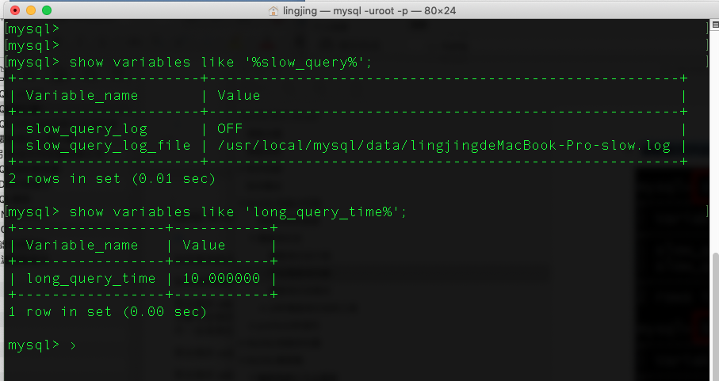
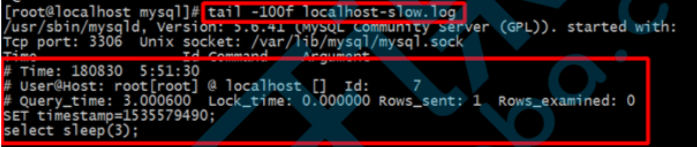
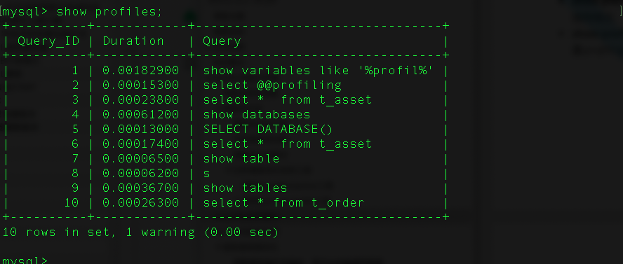
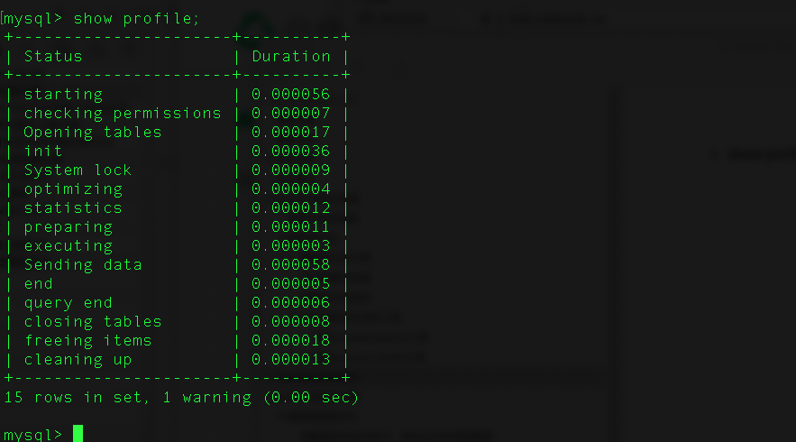

# mysql实操篇

# 1. mysql性能分析

## 1. 性能分析思路

1. 首先需要使用【慢查询日志】功能， 去获取多有查询时间比较长的sql语句
2. 其次【查看执行计划】， 查看有问题的sql的执行计划
3. 最后由可以使用【show profiles[s]】查看有问题的SQL的性能使用情况

## 2. 慢查询日志

### 1. 慢查询日志介绍

数据库查询快慢是影响项目性能的一大因素， 对于数据库， 我们除了要优化SQL， 更重要的是得先找到需要优化的SQL， MYSQL数据库又一个慢查询日志功能， 用来记录查询时间超过某个设定值的SQL语句， 这将极大程序帮助我们快速定位到问题， 以便对症下药

至于查询时间的多少才算是慢查询， 每个项目， 业务都有不同的要求

mysql的慢查询日志默认是关闭的， 需要我们手工开启

### 2. 开启慢查询功能

查看是否开启慢查询功能



参数说明：

- 【slow_query_log】:  是否开启慢查询日志， 1或者ON为开启， 0或者OFF为关闭
- 【slow_query_log_file】: 5.6版本以上， mysql数据库慢查询日志存储路径， 可以不设置该参数， 系统则会默认给一个缺省的文件host_name-slow.log
- 【long_query_time】: 慢查询阀值， 当查询时间多于设定的阀值时， 记录日志， 【单位为秒】

#### 1. 临时开始慢查询功能

```
set global show_query_log = ON;
set global long_query_time = 1;
```

#### 2. 永久开启慢查询功能

修改mysql的配置文件， my.cnf, 重启mysql就可以永久生效

```
[mysqld]
slow_query_log = 1
slow_query_log_file = /var/lib/mysql/slow.log
long_query_time = 1
```


### 3. 慢查询日志格式



格式说明：

- 第一行： SQL查询执行的具体时间
- 第二行： 执行SQL查询的连接信息， 用户和连接IP
- 第三行： 记录了一些我们比较有用的信息， 如下解析

```
Query_time, 这条SQL的执行时间， 越长表示越慢

Lock_time, 在mysql服务器阶段（不是在存储引擎阶段） 等待表锁时间

Rows_sent, 查询返回的行数

Rows_examined， 查询检查的行数， 越长就当然越费时间
```

- 第四行， 设置时间戳， 
- 第五行以及后面的， 执行sql语句的记录信息

### 4. 分析慢查询日志的工具

#### 1. 使用mysqldumpslow工具

mysqldumpslow是mysql自带的慢查询日志工具， 可以使用mysqldumpslow工具搜索慢查询日志中的SQL语句


按照时间排序的前10条里面包含左连接的查询语句：

```
mysqldumpslow -s t -t 10 -g "left join" /var/log/mysql/slow.log
```

参数介绍：

- -s: 是表示按照何种方式排序
  - c： 访问计数
  - l：锁定时间
  - r: 返回记录
  - t: 查询时间
  - al: 平均锁定时间
  - ar: 平均返回记录数
  - at: 平均查询时间

- -t: 是top n的意思， 即为返回前面多少条的数据
- -g: 后边可以写已给正则匹配模式， 大小写不敏感的

#### 2. 使用perconal-toolkit工具

percona-toolkit是一组高级命令行工具的集合， 可以查看当前服务的摘要信息， 磁盘检查， 分析慢查询日志， 查找重复索引， 实现表同步等等。

下载地址：https://www.percona.com/downloads/percona-toolkit/3.0.11/binary/tarball/percona-toolkit-3.0.11_x86_64.tar.gz

安装命令：

```
wget https://www.percona.com/downloads/percona-toolkit/3.0.11/binary/tarball/percona-toolkit-3.0.11_x86_64.tar.gz
# 避免报错
yum install -y perl-extUtils-CBuilder perl-ExtUtils-MakeMaker perl-Time-HiRes Perl-digest-MD5.x84_64

tar -xvf percona-toolkit-3.0.11_x86_64.tar.gz
cd percona-toolkit-3.0.11
perl Makefile.PL
make
make install
```


使用pt-query-digest 查看慢查询日志

```
pt-query-digest /var/lib/mysql/localhost-slow.log
```


pt-query-digest语法及重要选项

```
pt-query-digest [OPTIONS] [FILES] [DSN]
--create-review-table 当使用--review参数把分析结果输出到表中时，如果没有表就自动创建。 
--create-history-table 当使用--history参数把分析结果输出到表中时，如果没有表就自动创建。 
--filter 对输入的慢查询按指定的字符串进行匹配过滤后再进行分析
--limit 限制输出结果百分比或数量，默认值是20,即将最慢的20条语句输出，如果是50%则按总响应时间占 比从大到小排序，输出到总和达到50%位置截止。
--host mysql服务器地址
--user mysql用户名
--password mysql用户密码
--history 将分析结果保存到表中，分析结果比较详细，下次再使用--history时，如果存在相同的语句，且查 询所在的时间区间和历史表中的不同，则会记录到数据表中，可以通过查询同一CHECKSUM来比较某类型查询的历 史变化。
--review 将分析结果保存到表中，这个分析只是对查询条件进行参数化，一个类型的查询一条记录，比较简单。 当下次使用--review时，如果存在相同的语句分析，就不会记录到数据表中。
--output 分析结果输出类型，值可以是report(标准分析报告)、slowlog(Mysql slow log)、json、 json-anon，一般使用report，以便于阅读。
--since 从什么时间开始分析，值为字符串，可以是指定的某个”yyyy-mm-dd [hh:mm:ss]”格式的时间点， 也可以是简单的一个时间值:s(秒)、h(小时)、m(分钟)、d(天)，如12h就表示从12小时前开始统计。 
--until 截止时间，配合—since可以分析一段时间内的慢查询。
```

分析pt-query-digest输出结果

- 第一部分 总体统计结果 Overall:总共有多少条查询 Time range:查询执行的时间范围 unique:唯一查询 数量，即对查询条件进行参数化以后，总共有多少个不同的查询 total:总计 min:最小 max:最大 avg:平 均 95%:把所有值从小到大排列，位置位于95%的那个数，这个数一般最具有参考价值 median:中位数， 把所有值从小到大排列，位置位于中间那个数

```
# 该工具执行日志分析的用户时间，系统时间，物理内存占用大小，虚拟内存占用大小
# 340ms user time, 140ms system time, 23.99M rss, 203.11M vsz # 工具执行时间
# Current date: Fri Nov 25 02:37:18 2016
# 运行分析工具的主机名
# Hostname: localhost.localdomain
# 被分析的文件名
# Files: slow.log
# 语句总数量，唯一的语句数量，QPS，并发数
# Overall: 2 total, 2 unique, 0.01 QPS, 0.01x concurrency ________________ 
# 日志记录的时间范围
# Time range: 2016-11-22 06:06:18 to 06:11:40
#属性
# Attribute
# ============
# 语句执行时间
# Exec time
# 锁占用时间
# Lock time
# 发送到客户端的行数 # Rows sent
# select语句扫描行数 # Rows examine
# 查询的字符数
# Query size
总计 最小 最大 平均 95% 标准 中等
total min max avg 95% stddev median ======= ======= ======= ======= ======= ======= =======

......
```

- 第二部分： 

查询分组统计结果 Rank:所有语句的排名，默认按查询时间降序排列，通过--order-by指定 Query ID:语句的ID，(去掉多余空格和文本字符，计算hash值) Response:总的响应时间 time:该查询 在本次分析中总的时间占比 calls:执行次数，即本次分析总共有多少条这种类型的查询语句 R/Call:平均每 次执行的响应时间 V/M:响应时间Variance-to-mean的比率 Item:查询对象

```
# Profile
# Rank Query ID           Response time Calls R/Call V/M   Item
# ==== ================== ============= ===== ====== ===== ===============
#    1 0xF9A57DD5A41825CA  2.0529 76.2%     1 2.0529  0.00 SELECT
#    2 0x4194D8F83F4F9365  0.6401 23.8%     1 0.6401  0.00 SELECT wx_member_base
```

- 第三部分： 

每一种查询的详细统计结果 由下面查询的详细统计结果，最上面的表格列出了执行次数、最大、 最小、平均、95%等各项目的统计。 ID:查询的ID号，和上图的Query ID对应 Databases:数据库名 Users:各个用户执行的次数(占比) Query_time distribution :查询时间分布, 长短体现区间占比，本例中 1s-10s之间查询数量是10s以上的两倍。 Tables:查询中涉及到的表 Explain:SQL语句

```
# Query 1: 0 QPS, 0x concurrency, ID 0xF9A57DD5A41825CA at byte 802 ______
# This item is included in the report because it matches --limit.
# Scores: V/M = 0.00
# Time range: all events occurred at 2016-11-22 06:11:40
# Attribute    pct   total     min     max     avg     95%  stddev  median
# ============ === ======= ======= ======= ======= ======= ======= =======
....
 
```


用法示例：

1. 直接分析慢查询文件：

```
pt-query-digest slow.log > slow_report.log
```

2. 分析最近12小时内的查询

```
pt-query-digest --since = 12h slow.log > slow_report2.log
```

3. 分析指定时间范围内的查询：

```
pt-query-digest slow.log --since '2019-01-01 07:00:00' --until '2020-01-01 07:00:00' > slow.report3.log
```

4. 分析指含有select语句的慢查询

```
pt-qeury-digest --filter '$event->{fingeprint} =~ m/^select/i' slow.log > slow_report4.log
```

5. 针对某个用户的慢查询

```
pt-query-digest --filter '($event->{user} || "") =~ m/^root/i' slow.log>
slow_report5.log
```

6. 查询所有所有的全表扫描或full join的慢查询

```
pt-query-digest --filter '(($event->{Full_scan} || "") eq "yes") ||(($event->
{Full_join} || "") eq "yes")' slow.log> slow_report6.log
```

7. 把查询保存到query_review表

```
pt-query-digest --user=root –password=abc123 --review
h=localhost,D=test,t=query_review--create-review-table  slow.log
```

8. 把查询保存到query_history表

```
pt-query-digest  --user=root –password=abc123 --review
h=localhost,D=test,t=query_history--create-review-table  slow.log_0001
pt-query-digest  --user=root –password=abc123 --review
h=localhost,D=test,t=query_history--create-review-table  slow.log_0002
```

9. 通过tcpdump抓取mysql的tcp协议数据，然后再分析

```
tcpdump -s 65535 -x -nn -q -tttt -i any -c 1000 port 3306 > mysql.tcp.txt
pt-query-digest --type tcpdump mysql.tcp.txt> slow_report9.log
```

10. 分析binlog

```
mysqlbinlog mysql-bin.000093 > mysql-bin000093.sql
pt-query-digest  --type=binlog  mysql-bin000093.sql > slow_report10.log
```

11. 分析genneral log

```
pt-query-digest  --type=genlog  localhost.log > slow_report11.log
```


## 3. profile分析语句

### 1. 介绍

Query Profiler是MySQL自带的一种query诊断分析工具，通过它可以分析出一条SQL语句的硬件性能瓶颈在什么 地方。

通常我们是使用的explain,以及slow query log都无法做到精确分析，但是Query Profiler却可以定位出一条SQL 语句执行的各种资源消耗情况，比如CPU，IO等，以及该SQL执行所耗费的时间等。不过该工具只有在MySQL 5.0.37以及以上版本中才有实现。

默认的情况下，MYSQL的该功能没有打开，需要自己手动启动。

### 2. 语句使用

- show profile 和 show profiles 语句可以展示当前会话(退出session后,profiling重置为0) 中执行语句的资源 使用情况.
- show profiles :以列表形式显示最近发送到服务器上执行的语句的资源使用情况.显示的记录数由变 量:profiling_history_size 控制,默认15条



- show profile: 展示最近一条语句执行的详细资源占用信息,默认显示 Status和Duration两列
- show profile 还可根据 show profiles 列表中的 Query_ID ,选择显示某条记录的性能分析信息



### 3. 开启profile功能

Profile 功能由MySQL会话变量 : profiling控制,默认是OFF关闭状态。

查看是否开启了Profile功能:

```
select @@profiling;
show variables like ‘%profil%’;
```

开启profile功能

```
set profiling=ON; --1是开启、0是关闭
```

### 4. 示例

执行show profiles 查看分析列表


查询第二条语句的执行情况

```
show profile for query 2;
```

可指定资源类型查询

```
show profile cpu,swaps for query 2;
```


