# mysql性能分析篇

mysql的性能分析， 我们主要是通过查看mysql的执行计划来判断他的执行性能是否ok， 下面我们来看一个实例吧

## 1. 建表语句

```
create table mylock(
	id int(10) primary key,
	name varchar(100),
	age int(3),
	address varchar(100)
 );

 alter table mylock add index idx_name_name(name, age);
```


## 2. 介绍

MySQL 提供了一个 **EXPLAIN 命令**, 它可以**对 SELECT 语句的执行计划进行分析**, 并输出 SELECT 执行的详细信息, 以供开发人员针对性优化。

​                             

使用explain这个命令来查看一个这些SQL语句的执行计划，查看该SQL语句有没有使用上了索引，有没有做全表扫描，这都可以通过explain命令来查看。

 

可以通过explain命令深入了解MySQL的基于开销的优化器，还可以获得很多可能被优化器考虑到的访问策略的细节，以及当运行SQL语句时哪种策略预计会被优化器采用。

 

EXPLAIN 命令用法十分简单, 在 SELECT 语句前加上 explain 就可以了, 例如:


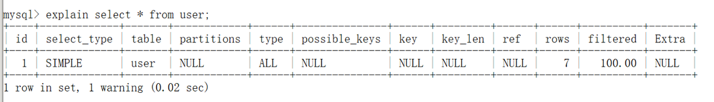


## 3. 参数说明

expain出来的信息有10列，分别是

id、select_type、table、type、possible_keys、key、key_len、ref、rows、Extra 


### 1. id

每个 SELECT语句都会自动分配的一个唯一标识符。

表示查询中操作表的顺序，有三种情况：

id相同：执行顺序由上到下

id不同：如果是子查询，id号会自增，id越大，优先级越高。

id相同的不同的同时存在

id列为null的就表示这是一个结果集，不需要使用它来进行查询。


### 2. select_type（重要）

**查询类型**，主要用于区别**普通查询、联合查询(union、union all)、子查询等复杂查询**。


#### simple

表示不需要union操作或者不包含子查询的简单select查询。

有连接查询时，外层的查询为simple，且只有一个


#### primary

一个需要union操作或者含有子查询的select，位于最外层的单位查询的select_type即为primary。

且只有一个


#### union

union连接的两个select查询，第一个查询是dervied派生表，除了第一个表外，

第二个以后的表select_type都是union


#### dependent union

与union一样，出现在union 或union all语句中，但是这个查询要受到外部查询的影响


#### union result

包含union的结果集，在union和union all语句中,因为它不需要参与查询，所以id字段为null


#### subquery

除了from字句中包含的子查询外，其他地方出现的子查询都可能是subquery


#### dependent subquery

与dependent union类似，表示这个subquery的查询要受到外部表查询的影响


#### derived

from字句中出现的子查询，也叫做派生表，其他数据库中可能叫做内联视图或嵌套select


### 3. table

- 显示的查询表名，如果查询使用了别名，那么这里显示的是别名

- 如果不涉及对数据表的操作，那么这显示为null

- 如果显示为尖括号括起来的<derived N>就表示这个是临时表，后边的N就是执行计划中的id，表示结果来自于这个查询产生。

- 如果是尖括号括起来的<union M,N>，与<derived N>类似，也是一个临时表，表示这个结果来自于union查询的id为M,N的结果集。


### 4. type（重要）

依次从好到差：

system，const，eq_ref，ref，fulltext，ref_or_null，unique_subquery，index_subquery，range，index_merge，

index，ALL

 

**除了all之外，其他的type都可以使用到索引，除了index_merge之外，其他的type只可以用到一个索引**

注意事项：最少要索引使用到range级别。

#### 1）system

表中只有一行数据或者是空表。explain select * from (select * from mylock where id = 1) a;

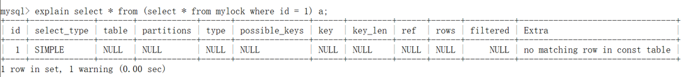

#### 2）const（重要）

使用唯一索引或者主键，返回记录一定是1行记录的等值where条件时，通常type是const。其他数据库也叫做唯一索引扫描。


#### 3）eq_ref（重要）

关键字：连接字段**主键或者唯一性索引**。

 

此类型通常出现在多表的 join 查询, 表示对于前表的每一个结果, **都只能匹配到后表的一行结果**。并且查询的比较操作通常是 =, 查询效率较高。


示例：

order 表

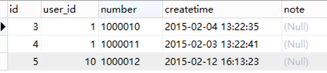


user 表（eq_ref）

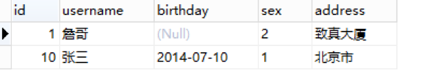

演示SQL

`EXPLAIN SELECT * FROM orders o LEFT JOIN user u ON o.user_id = u.id ;`


#### 4）ref（重要）

针对非唯一性索引，使用等值（=）查询。或者是使用了最左前缀规则索引的查询。

 

非唯一性索引ref示例：

orders表（ref）


user 表


演示SQL

`EXPLAIN SELECT * FROM user u LEFT JOIN orders o ON o.user_id = u.id ；`

组合索引最左前缀ref示例：

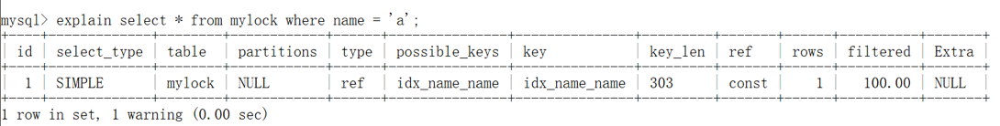

#### 

#### 5）fulltext

全文索引检索，要注意，全文索引的优先级很高，若全文索引和普通索引同时存在时，mysql不管代价，优先选择使用全文索引。


#### 6）ref_or_null

与ref方法类似，只是增加了null值的比较，实际用的不多。


#### 7）unique_subquery

用于where中的in形式子查询，子查询返回不重复值唯一值。


#### 8）index_subquery

用于in形式子查询使用到了辅助索引或者in常数列表，子查询可能返回重复值，可以使用索引将子查询去重。


#### 9）range（重要）

索引范围扫描，常见于使用>,<,is null,between ,in ,like等运算符的查询中。

`explain select * from mylock where name like 'a%';`

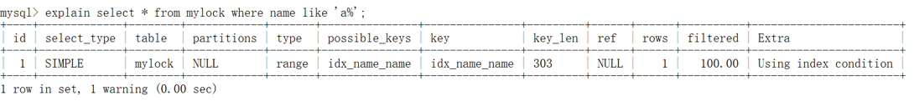


`explain select * from mylock where id > 1;`

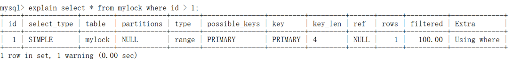


#### 10）index_merge

表示查询使用了两个以上的索引，最后取交集或者并集，常见and，or的条件使用了不同的索引，官方排序这个在ref_or_null之后，但是实际上由于要读取所个索引，性能可能大部分时间都不如range


#### 11）index（重要）

**关键字：条件是出现在索引树中的节点的。可能没有完全匹配索引**。

 

**索引全表扫描**，把索引从头到尾扫一遍，常见于使用索引列就可以处理不需要读取数据文件的查询、可以使用索引排序或者分组的查询。

`explain select * from mylock where name like '%a%';`

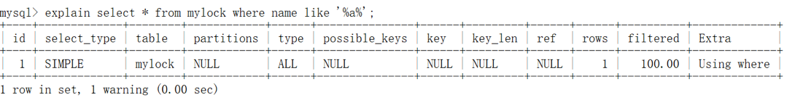

`explain select * from mylock where age = 10;`

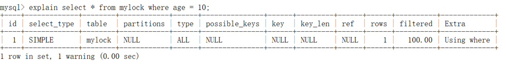


#### 12）all（重要）

这个就是全表扫描数据文件，然后再**在server层进行过滤**返回符合要求的记录。

`explain select * from mylock;`

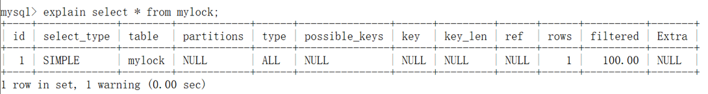

`explain select * from mylock where address = '至真大厦';`

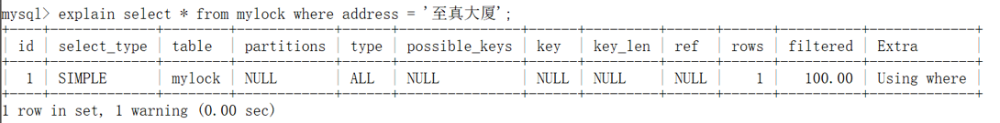


### 5. possible_keys

此次查询中可能选用的索引，一个或多个


### 6. key

查询真正使用到的索引，select_type为index_merge时，这里可能出现两个以上的索引，其他的select_type这里只会出现一个。


### 7. key_len

用于处理查询的索引长度，如果是单列索引，那就整个索引长度算进去，如果是多列索引，那么查询不一定都能使用到所有的列，具体使用到了多少个列的索引，这里就会计算进去，没有使用到的列，这里不会计算进去。

留意下这个列的值，算一下你的多列索引总长度就知道有没有使用到所有的列了。

另外，key_len只计算where条件用到的索引长度，而排序和分组就算用到了索引，也不会计算到key_len中。


### 8. ref

如果是使用的常数等值查询，这里会显示const

如果是连接查询，被驱动表的执行计划这里会显示驱动表的关联字段

如果是条件使用了表达式或者函数，或者条件列发生了内部隐式转换，这里可能显示为func


### 9. rows

这里是执行计划中估算的扫描行数，不是精确值（InnoDB不是精确的值，MyISAM是精确的值，主要原因是InnoDB里面使用了MVCC并发机制）


### 10. extra（重要）

这个列包含不适合在其他列中显示单十分重要的额外的信息，这个列可以显示的信息非常多，有几十种，

常用的有：


#### 1）distinct

在select部分使用了distinct关键字


#### 2）no tables used

不带from字句的查询或者From dual查询

**使用not in()形式子查询或not exists运算符的连接查询，这种叫做反连接**

即，一般连接查询是先查询内表，再查询外表，反连接就是先查询外表，再查询内表。


#### 3）using filesort（重要）

- 排序时无法使用到索引时，就会出现这个。常见于order by和group by语句中

- 说明MySQL会使用一个外部的索引排序，而不是按照索引顺序进行读取。

- MySQL中无法利用索引完成的排序操作称为“文件排序

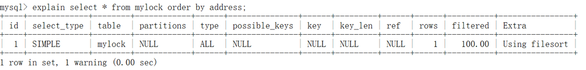


#### 4）using index（重要）

查询时**不需要回表查询**，直接通过索引就可以获取查询的数据。

- 表示相应的SELECT查询中使用到了**覆盖索引（Covering Index）**，避免访问表的数据行，效率不错！

- 如果同时出现Using Where ，说明索引被用来执行查找索引键值

- 如果没有同时出现Using Where ，表明索引用来读取数据而非执行查找动作。

`explain select id,name,age from mylock;`

`explain select name,age from mylock;`

`explain select age from mylock;`

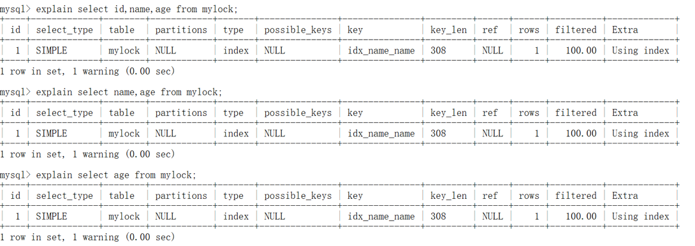


#### 5）using join buffer（block nested loop），using join buffer（batched key accss）

5.6.x之后的版本优化关联查询的BNL，BKA特性。主要是减少内表的循环数量以及比较顺序地扫描查询。


#### 6）using sort_union，using_union，using intersect，using sort_intersection

- using intersect：表示使用and的各个索引的条件时，该信息表示是从处理结果获取交集

- using union：表示使用or连接各个使用索引的条件时，该信息表示从处理结果获取并集

- using sort_union和using sort_intersection：与前面两个对应的类似，只是他们是出现在用and和or查询信息量大时，先查询主键，然后进行排序合并后，才能读取记录并返回。


#### 7）using temporary（重要）

- 表示使用了临时表存储中间结果。

- MySQL在对查询结果order by和group by时使用临时表

- 临时表可以是内存临时表和磁盘临时表，执行计划中看不出来，需要查看status变量，used_tmp_table，used_tmp_disk_table才能看出来。


#### 8）using where（重要）

- 表示存储引擎返回的记录并不是所有的都满足查询条件，需要在server层进行过滤。


#### 9）firstmatch(tb_name)

5.6.x开始引入的优化子查询的新特性之一，常见于where字句含有in()类型的子查询。如果内表的数据量比较大，就可能出现这个


#### 10）loosescan(m..n)

5.6.x之后引入的优化子查询的新特性之一，在in()类型的子查询中，子查询返回的可能有重复记录时，就可能出现这个

 

除了这些之外，还有很多查询数据字典库，执行计划过程中就发现不可能存在结果的一些提示信息


#### 11）filtered

使用explain extended时会出现这个列，5.7之后的版本默认就有这个字段，不需要使用explain extended了。这个字段表示存储引擎返回的数据在server层过滤后，剩下多少满足查询的记录数量的比例，注意是百分比，不是具体记录数。


##### 参考网站

https://segmentfault.com/a/1190000008131735

https://blog.csdn.net/rewiner120/article/details/70598797

 

