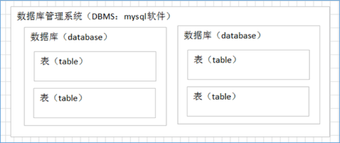
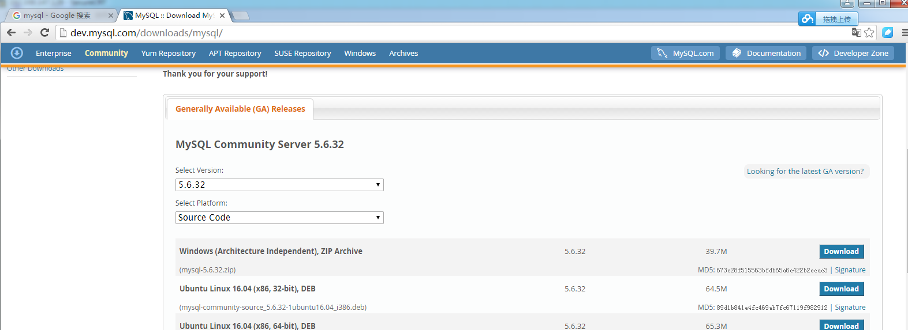
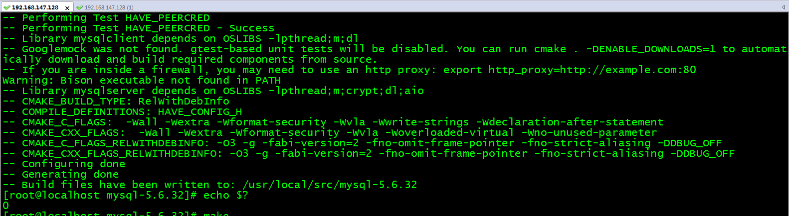

# mysql数据库

# 1. 数据库概述

## 1. 什么是数据库？

数据库就是【存储数据的仓库】，其本质是一个【文件系统】，数据按照特定的格式将数据存储起来，用户可以通过SQL对数据库中的数据进行增加，修改，删除及查询操作。

## 2. 什么是关系型数据库？

数据库中的【记录是有行有列的数据库】就是关系型数据库（RDBMS, Relational Database Management System），与之相反的就是**NoSQL**数据库了。

## 3. 数据库和表

数据库管理系统（DataBase Management System，DBMS）：指一种【操作和管理数据库】的大型软件，用于建立、使用和维护数据库，对数据库进行统一管理和控制，以保证数据库的安全性和完整性。用户通过数据库管理系统访问数据库中表内的数据。(记录)



## 4. 常见的数据库管理系统

1）**MYSQL**：开源免费的数据库，小型的数据库.已经被Oracle收购了。MySQL5.5版本之后都是由Oracle发布的版本。

2）**Oracle**：收费的大型数据库，Oracle公司的产品。Oracle收购SUN公司，收购MYSQL。

3）**DB2**：IBM公司的数据库产品,收费的。常应用在银行系统中。在中国的互联网公司，要求去IOE（IBM小型机、Oracle数据库、EMC存储设备）

4）**SQLServer**：MicroSoft 公司收费的中型的数据库。C#、.net等语言常使用。

5）**SyBase** ：已经淡出历史舞台。提供了一个非常专业数据建模的工具PowerDesigner。

6）**SQLite** : 嵌入式的小型数据库，应用在手机端。

# 2. mysql介绍

## 2.1 mysql是什么

MySQL 是最流行的【关系型数据库管理系统】，在WEB应用方面 MySQL是最好的RDBMS应用软件之一。且开源免费


# 3. SQL介绍

## 3.1 什么是sql

【SQL是Structured Query Language的缩写】，它的前身是著名的关系数据库原型系统System R所采用的SEQUEL语言。作为一种访问【关系型数据库的标准语言】，SQL自问世以来得到了广泛的应用，不仅是著名的大型商用数据库产品Oracle、DB2、Sybase、SQL Server支持它，很多开源的数据库产品如PostgreSQL、MySQL也支持它，甚至一些小型的产品如Access也支持SQL。近些年蓬勃发展的NoSQL系统最初是宣称不再需要SQL的，后来也不得不修正为Not Only SQL，来拥抱SQL。

## 3.2 SQL语言分类

1）数据定义语言：简称【DDL】(Data Definition Language)，用来定义数据库对象：数据库，表，列等。关键字：create，alter，drop等


 ​2）数据操作语言：简称【DML】(Data Manipulation Language)，用来对数据库中表的记录进行更新。关键字：insert，delete，update等
 ​

3）数据控制语言：简称【DCL】(Data Control Language)，用来定义数据库的访问权限和安全级别，及创建用户；关键字：grant等
 ​

4）数据查询语言：简称【DQL】(Data Query Language)，用来查询数据库中表的记录。关键字：select，from，where等


# 4 安装mysql

我们的教程是centos7源码安装mysql5.6， 其他的请参考

## 1. 上官网下载源码包



## 2. 安装依赖工具：

```
yum -y install make gcc-c++ cmake bison-devel ncurses-devel libaio libaio-devel  perl-Data-Dumper net-tools
```

## 3. 解压

```
rz
cd /usr/local/src
tar xzvf mysql-5.6.32.tar.gz
cd mysql-5.6.32
```

## 4. 编译：

```
cmake -DCMAKE_INSTALL_PREFIX=/export/servers/mysql/ -DMYSQL_DATADIR=/export/Data/mysql/data -DSYSCONFDIR=/export/servers/mysql/etc -DWITH_INNOBASE_STORAGE_ENGINE=1 -DWITH_PERFSCHEMA_STORAGE_ENGINE=1 -DDEFAULT_CHARSET=utf8 -DDEFAULT_COLLATION=utf8_general_ci -DMYSQL_UNIX_ADDR=/export/Data/mysql/tmp/mysql.sock -DENABLED_LOCAL_INFILE=ON -DENABLED_PROFILING=ON -DWITH_DEBUG=0 -DMYSQL_TCP_PORT=3358

make && make install
```

| DCMAKE_INSTALL_PREFIX          | /usr/local/mysql          | 安装目录             |
| ------------------------------ | ------------------------- | -------------------- |
| DMYSQL_DATADIR                 | /usr/local/mysql/data     | 数据库位置           |
| DSYSCONFDIR                    | /etc                      | 配置文件位置         |
| DWITH_MYISAM_STORAGE_ENGINE    | 1                         | 安装myisam存储引擎   |
| DWITH_INNOBASE_STORAGE_ENGINE  | 1                         | 安装innodb存储引擎   |
| DWITH_MEMORY_STORAGE_ENGINE    | 1                         | 安装memory存储引擎   |
| DWITH_READLINE                 | 1                         | 快捷键功能           |
| DMYSQL_UNIX_ADDR               | /var/lib/mysql/mysql.sock | Unix socket 文件路径 |
| DMYSQL_TCP_PORT                | 3306                      | MySQL监听端口        |
| DENABLED_LOCAL_INFILE          | 1                         | 许从本地导入数据-    |
| DWITH_PARTITION_STORAGE_ENGINE | 1                         | 安装数据库分区       |
| DEXTRA_CHARSETS                | all                       | 安装所有扩展字符集   |
| DDEFAULT_CHARSET               | utf8                      | 使用utf8字符         |
| DDEFAULT_COLLATION             | utf8_general_ci           | 校验字符             |

如图所示编译成功，每次进行echo $?进行验证



## 5. 创建用户并授权

```
useradd mysql -s /sbin/nologin
chown -R mysql:mysql /export/servers/mysql /export/Data/mysql
```

## 6. 初始化系统表

```
cd /export/servers/mysql/scripts
./mysql_install_db --basedir=/export/servers/mysql/ --datadir=/export/Data/mysql/data --user=mysql
mkdir -p /export/servers/mysql/etc
cp /export/servers/mysql/my.cnf
yum remove -y mysql
```

## 7. 启动mysql

```
cd /export/servers/mysql
cp support-files/mysql.server /etc/init.d/mysqld
# 检查配置文件的datadir，basedir等是否正确
service mysqld start
```

## 8. 检查mysql是否启动成功

```
ps -ef |grep mysql
netstat -lnp |grep mysql
```

## 9. 报错排查

如果启动不了，就在/export/Data/mysql/data找`hostname`.err对应的日志查看

## 10. 登陆mysql

登录命令

`mysql -uroot -p`

命令说明：

-u：指定数据库用户名

-p：指定数据库密码，记住-u和登录密码之间没有空格

## 11.  MySQL远程连接授权

授权命令

grant 权限 on 数据库对象 to 用户

示例：授予root用户对所有数据库对象的全部操作权限：

```
GRANT ALL PRIVILEGES ON *.* TO 'root'@'%' IDENTIFIED BY 'root' WITH GRANT OPTION;
```

命令说明：

1）ALL PRIVILEGES：表示授予所有的权限，此处可以指定具体的授权权限。

2）*.* ：表示所有库中的所有表。

3）'root'@'%'：myuser是数据库的用户名，%表示是任意ip地址，可以指定具体ip地址。

4）IDENTIFIED BY 'mypassword'：mypassword是数据库的密码。

## 12. 关闭linux防火墙

```
systemctl stop firewalld（默认）
systemctl disable firewalld.service（设置开启不启动）
```


# 5. DDL语句

## 1. 数据库操作

### 1）创建数据库

create database 数据库名;

create database 数据库名 character set 字符集;

### 2）查看数据库

查看数据库服务器中的所有的数据库:

show databases;

查看某个数据库的定义的信息:

show create database 数据库名;

删除数据库（慎用）

drop database 数据库名称;

### 3）其他数据库操作命令

切换数据库： 

use 数据库名;

查看正在使用的数据库:

select database();

## 2. 表操作

### 1）字段类型

常用的类型有：

 

① 数字型：int

② 浮点型：double
③ 字符型：varchar（可变长字符串）
④ 日期类型：date（只有年月日，没有时分秒）datetime（年月日，时分秒）
⑤boolean类型：不支持，一般使用tinyint替代（值为0和1）

### 2）创建表

create table 表名(

 字段名 类型(长度) 约束,
  字段名 类型(长度) 约束
 );

### 3）单表约束

\- 主键约束：primary key

\- 唯一约束：unique
 \- 非空约束：not null

### 4）注意

主键约束 = 唯一约束 + 非空约束

### 5）查看表

查看数据库中的所有表：

`show tables; `

查看表结构：

`desc 表名;``

删除表：

`drop table 表名;`

修改表：

`alter table 表名 add 列名 类型(长度) 约束;  `           --修改表添加列

`alter table 表名 modify 列名 类型(长度) 约束;   `        --修改表修改列的类型长度及约束
`alter table 表名 change 旧列名 新列名 类型(长度) 约束; ` --修改表修改列名
`alter table 表名 drop 列名; `                      --修改表删除列
`rename table 表名 to 新表名; `                    --修改表名
`alter table 表名 character set 字符集; `                 --修改表的字符集

# 6. DML语句

## 1 插入记录：insert

语法：

`insert into 表 (列名1,列名2,列名3..) values (值1,值2,值3..); `  -- 向表中插入某些列

`insert into 表 values (值1,值2,值3..);  `                 -- 向表中插入所有列

`insert into 表 (列名1,列名2,列名3..) values select (列名1,列名2,列名3..) from 表`

`insert into 表 values select * from 表`

注意：

① 列名数与values后面的值的个数相等

② 列的顺序与插入的值得顺序一致

③ 列名的类型与插入的值要一致.

④ 插入值得时候不能超过最大长度.

⑤ 值如果是字符串或者日期需要加引号’’ （一般是单引号）

 

具体如下：

```
INSERT INTO sort(sid,sname) VALUES('s001', '电器');
INSERT INTO sort(sid,sname) VALUES('s002', '服饰');
INSERT INTO sort VALUES('s003', '化妆品');
INSERT INTO sort VALUES('s004','书籍');
```


#### 3.2 更新记录：update

语法：

`update 表名 set 字段名=值,字段名=值;`

`update 表名 set 字段名=值,字段名=值 where 条件;`

注意：

① 列名的类型与修改的值要一致.

② 修改值得时候不能超过最大长度.

③ 值如果是字符串或者日期需要加’’.

#### 3.3 删除记录：delete

语法：

`delete from 表名 [where 条件];`

#### 3.4 面试题

删除表中所有记录使用【delete from 表名】，还是用【truncate table 表名】？
 ​

删除方式：
 \- delete ：一条一条删除，不清空auto_increment记录数。
 \- truncate ：直接将表删除，重新建表，auto_increment将置为零，从新开始。


# 6. DQL语句

## 1. 准备工作

创建商品表：

```
CREATE TABLE products (
    pid INT PRIMARY KEY AUTO_INCREMENT,  # 自增加 AUTO_INCREMENT
    pname VARCHAR(20),                    # 商品名称
    price DOUBLE,                         # 商品价格
    pdate DATE,                           # 日期
    sid VARCHAR(20)                       # 分类ID
);
INSERT INTO products VALUES(NULL,'泰国大榴莲', 98, NULL, 's001');
INSERT INTO products VALUES(NULL,'新疆大枣', 38, NULL, 's002');
INSERT INTO products VALUES(NULL,'新疆切糕', 68, NULL, 's001');
INSERT INTO products VALUES(NULL,'十三香', 10, NULL, 's002');
INSERT INTO products VALUES(NULL,'老干妈', 20, NULL, 's002');

```

## 2. DQL语法顺序

完整DQL语法顺序：

```
SELECT DISTINCT

  < select_list >

FROM

  < left_table > < join_type >

JOIN < right_table > ON < join_condition >

WHERE

  < where_condition >

GROUP BY

  < group_by_list >

HAVING

  < having_condition >

ORDER BY

  < order_by_condition >

LIMIT < limit_number >
```

### 1. 简单查询

SQL语法关键字：SELECT、FROM 

查询所有的商品. 

`select * from product;`

查询商品名和商品价格. 

`select pname,price from product;`

别名查询，使用的**as关键字**，as可以省略的. 

表别名: 

`select * from product as p;`

列别名：

`select pname as pn from product; `

去掉重复值. 

`select distinct price from product;`

查询结果是表达式（运算查询）：将所有商品的价格+10元进行显示.

`select pname,price+10 from product;`

### 2. 条件查询

SQL语法关键字： WHERE

查询商品名称为十三香的商品所有信息：

`select * from product where pname = '十三香';`

查询商品价格>60元的所有的商品信息:

`select * from product where price > 60;` 

where后的条件写法：

① > ,<,=,>=,<=,<>

② like 使用占位符 _ 和 % _代表一个字符 %代表任意个字符. 
  ` select * from product where pname like '%新%';`

③ in在某个范围中获得值（exists）.
   `select * from product where pid in (2,5,8);`

### 3. 排序

SQL语法关键字：ORDER BY、ASC（升序）、DESC（降序）

查询所有的商品，按价格进行排序.(asc-升序,desc-降序)

`select * from product order by price;`

查询名称有新的商品的信息并且按价格降序排序.

`select * from product where pname like '%新%' order by price desc;`

### 4. 聚合函数（组函数）

特点：只对单列进行操作

常用的聚合函数： 

sum()：求某一列的和

avg()：求某一列的平均值

max()：求某一列的最大值

min()：求某一列的最小值

count()：求某一列的元素个数

获得所有商品的价格的总和：

`select sum(price) from product;`

获得所有商品的平均价格：

`select avg(price) from product;`

获得所有商品的个数：

`select count(*) from product;`

### 5. 分组

SQL语法关键字：GROUP BY、HAVING

根据cno字段分组，分组后统计商品的个数.

`select cid,count(*) from product group by cid;`

根据cno分组，分组统计每组商品的平均价格，并且平均价格> 60;

`select cid,avg(price) from product group by cid having avg(price)>60;`

注意事项：

① select语句中的列（非聚合函数列），必须出现在group by子句中

② group by子句中的列，不一定要出现在select语句中

③ 聚合函数只能出现select语句中或者having语句中，一定不能出现在where语句中。

## 3. 分页查询

关键字：limit [offset,] rows 

limit关键字不是SQL92标准提出的关键字，它是MySQL独有的语法。

通过limit关键字，MySQL实现了物理分页。

分页分为逻辑分页和物理分页：

**逻辑分页**：将数据库中的数据查询到内存之后再进行分页。

**物理分页**：通过LIMIT关键字，直接在数据库中进行分页，最终返回的数据，只是分页后的数据。

格式：

`SELECT * FROM table LIMIT [offset,] rows`

offset：编译量

rows：每页多少行记录。

案例：分页查询商品表，每页3条记录，查第一页

## 4.子查询

定义：子查询允许把一个查询嵌套在另一个查询当中。

子查询，又叫内部查询，相对于内部查询，包含内部查询的就称为外部查询。 ​

子查询可以包含普通select可以包括的任何子句，比如：distinct、 group by、order by、limit、join和union等；

但是对应的外部查询必须是以下语句之一：select、insert、update、delete。

使用的位置：select中、from 后、where 中；group by 和order by 中无实用意义。

举例：查询“化妆品”分类下的商品信息

## 5. sql解析顺序

union 集合的并集（不包含重复记录）

unionall集合的并集（包含重复记录）