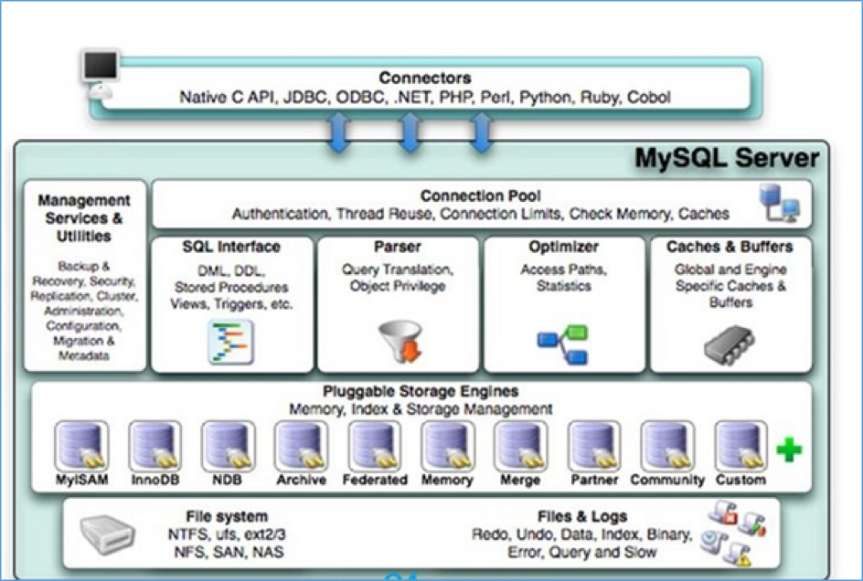
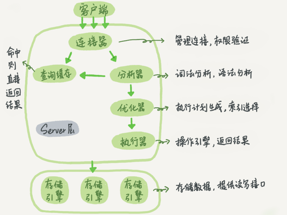
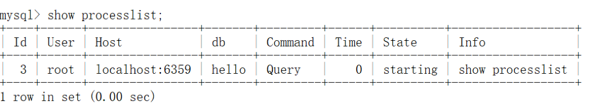
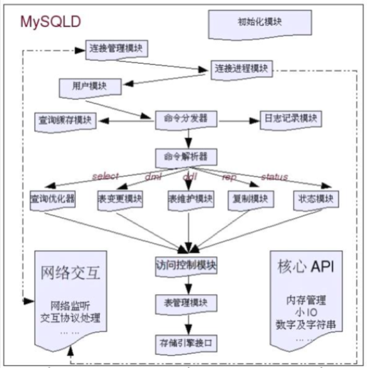
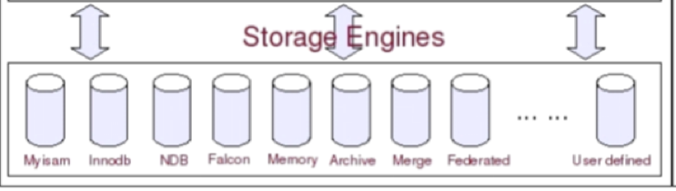
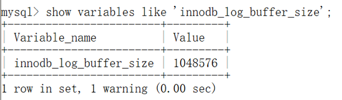
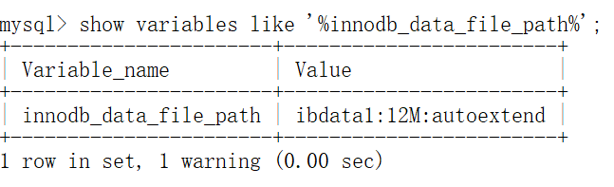

# mysql的架构篇

# 1. mysql架构图



1. Connectors：连接器，指的是不同语言中与SQL的交互

2. Management Serveices & Utilities**：系统管理和控制工具**

3. Connection Pool**: 连接池
   a. 管理缓冲用户连接，线程处理等需要缓存的需求。

   b. 负责监听对 MySQL Server 的各种请求，接收连接请求，转发所有连接请求到线程管理模块。每一个连接上 MySQL Server 的客户端请求都会被分配（或创建）一个连接线程为其单独服务。

   c. 而连接线程的主要工作就是负责 MySQL Server 与客户端的通信，接受客户端的命令请求，传递 Server 端的结果信息等。线程管理模块则负责管理维护这些连接线程。包括线程的创建，线程的 cache 等。

4. SQL Interface**: SQL接口

接受用户的SQL命令，并且返回用户需要查询的结果。比如select from就是调用SQL Interface

5. Parser: 解析器

   SQL命令传递到解析器的时候会被解析器验证和解析。

**主要功能**

​		a . 将SQL语句进行语义和语法的分析，分解成数据结构，然后按照不同的操作类型进行分类，然后做出针对性的转发到后续步骤，以后SQL语句的传递和处理就是基于这个结构的。

​		b. 如果在分解过程中遇到错误，那么就说明这个sql语句是不合理的。

6. Optimizer: 查询优化器

SQL语句在查询之前会使用查询优化器对查询进行优化。explain语句查看的SQL语句执行计划，就是由查询优化器生成的。

7. Cache和Buffer：查询缓存

他的主要功能是将客户端提交给MySQL的 select请求的返回结果集 cache 到内存中，与该 query 的一个 hash 值 做一个对应。该 Query 所取数据的基表发生任何数据的变化之后， MySQL 会自动使该 query 的Cache 失效。在读写比例非常高的应用系统中， Query Cache 对性能的提高是非常显著的。当然它对内存的消耗也是非常大的。

如果查询缓存有命中的查询结果，查询语句就可以直接去查询缓存中取数据。这个缓存机制是由一系列小缓存组成的。比如表缓存，记录缓存，key缓存，权限缓存等。

8. Pluggable Storage Engines：存储引擎

与其他数据库例如Oracle 和SQL Server等数据库中只有一种存储引擎不同的是，MySQL有一个被称为“Pluggable Storage Engine Architecture”(可插拔的存储引擎架构)的特性，也就意味着MySQL数据库提供了多种存储引擎。

而且存储引擎是针对表的，用户可以根据不同的需求为数据表选择不同的存储引擎，用户也可以根据自己的

需要编写自己的存储引擎。也就是说，同一数据库不同的表可以选择不同的存储引擎

creat table xxx()engine=InnoDB/Memory/MyISAM

总之，存储引擎就是如何存储数据、如何为存储的数据建立索引和如何更新、查询数据等技术的实现方法。 


## MySQL存储引擎种类 

MySQL的存储引擎是针对表进行指定的。（engine=InnoDB\myisam）  

| **存储引擎**        | **说明**                                                     |
| ------------------- | ------------------------------------------------------------ |
| **MyISAM**          | 高速引擎，拥有较高的插入，查询速度，**但不支持事务、不支持行锁** |
| **InnoDB**          | **5.5****版本后****MySQL****的默认数据库，支持事务和行级锁定**，比MyISAM处理速度稍慢 |
| ISAM                | MyISAM的前身，MySQL5.0以后不再默认安装                       |
| MRG_MyISAM（MERGE） | 将多个表联合成一个表使用，在超大规模数据存储时很有用         |
| **Memory**          | **内存存储引擎，拥有极高的插入，更新和查询效率。**但是会占用和数据量成正比的内存空间。只在内存上保存数据，意味着数据可能会丢失 |
| Falcon              | 一种新的存储引擎，支持事物处理，传言可能是InnoDB的替代者     |
| Archive             | 将数据压缩后进行存储，非常适合存储大量的独立的，作为历史记录的数据，但是只能进行插入和查询操作 |
| CSV                 | CSV 存储引擎是基于 CSV 格式文件存储数据(应用于跨平台的数据交换) |

 

xtraDB存储引擎是由Percona公司提供的存储引擎，该公司还出品了Percona Server这个产品，它是基于MySQL开源代码进行修改之后的产品。 

阿里对于Percona Server服务器进行修改，衍生了自己的数据库（alisql）。 

查看存储引擎：

`mysql> show engines;`

## InnoDB和MyISAM存储引擎区别：

|              | **INNODB**                              | **MYISAM**                                  |
| ------------ | --------------------------------------- | ------------------------------------------- |
| **存储文件** | .frm 表定义文件 .ibd 数据文件和索引文件 | .frm 表定义文件 .myd 数据文件 .myi 索引文件 |
| **锁**       | 表锁、行锁                              | 表锁                                        |
| **事务**     | 支持                                    | 不支持                                      |
| **CRDU**     | 读、写                                  | 读多                                        |
| **count**    | 扫表                                    | 专门存储的地方                              |
| **索引结构** | B+ Tree                                 | B+ Tree                                     |

# 2. 简版执行流程



待分析SQL语句如下：

​    mysql> select * from T where ID=10；

 

我们看到的只是输入一条语句，返回一个结果，却不知道这条语句在 MySQL 内部的执行过程。

 

所以今天我想和你一起把 MySQL 拆解一下，看看里面都有哪些“零件”，希望借由这个拆解过程，让你对 MySQL 有更深入的理解。这样当我们碰到 MySQL 的一些异常或者问题时，就能够直戳本质，更为快速地定位并解决问题。

 

上面给出的是 MySQL 的基本架构示意图，从中你可以清楚地看到 SQL 语句在 MySQL 的各个功能模块中的执行过程。

 

大体来说，MySQL 可以分为 Server 层和存储引擎层两部分。

 

Server 层包括连接器、查询缓存、分析器、优化器、执行器等，涵盖 MySQL 的大多数核心服务功能，以及所有的内置函数（如日期、时间、数学和加密函数等），所有跨存储引擎的功能都在这一层实现，比如存储过程、触发器、视图等。

 

而存储引擎层负责数据的存储和提取。其架构模式是插件式的，支持 InnoDB、MyISAM、Memory 等多个存储引擎。现在最常用的存储引擎是 InnoDB，它从 MySQL 5.5.5 版本开始成为了默认存储引擎。

 

也就是说，你执行 create table 建表的时候，如果不指定引擎类型，默认使用的就是 InnoDB。不过，你也可以通过指定存储引擎的类型来选择别的引擎，比如在 create table 语句中使用 engine=memory, 来指定使用内存引擎创建表。不同存储引擎的表数据存取方式不同，支持的功能也不同，在后面的文章中，我们会讨论到引擎的选择。

 

从图中不难看出，不同的存储引擎共用一个Server 层，也就是从连接器到执行器的部分。你可以先对每个组件的名字有个印象，接下来我会结合开头提到的那条 SQL 语句，带你走一遍整个执行流程，依次看下每个组件的作用。

## 1. 连接器

第一步，你会先连接到这个数据库上，这时候接待你的就是连接器。连接器负责跟客户端建立连接、获取权限、维持和管理连接。连接命令一般是这么写的：

`mysql -h${ip} -P${port} -u${user} -p${passwd}`


输完命令之后，你就需要在交互对话里面输入密码。虽然密码也可以直接跟在 -p 后面写在命令行中，但这样可能会导致你的密码泄露。如果你连的是生产服务器，强烈建议你不要这么做。

 

连接命令中的 mysql 是客户端工具，用来跟服务端建立连接。在完成经典的 TCP 握手后，连接器就要开始认证你的身份，这个时候用的就是你输入的用户名和密码。

 

\- 如果用户名或密码不对，你就会收到一个"Access denied for user"的错误，然后客户端程序结束执行。

\- 如果用户名密码认证通过，连接器会到权限表里面查出你拥有的权限。之后，这个连接里面的权限判断逻辑，都将依赖于此时读到的权限。

 

这就意味着，一个用户成功建立连接后，即使你用管理员账号对这个用户的权限做了修改，也不会影响已经存在连接的权限。修改完成后，只有再新建的连接才会使用新的权限设置。

 

连接完成后，如果你没有后续的动作，这个连接就处于空闲状态，你可以在 **show processlist 命令**中看到它。文本中这个图是 show processlist 的结果，其中的 Command 列显示为“Sleep”的这一行，就表示现在系统里面有一个空闲连接。



 

客户端如果太长时间没动静，连接器就会自动将它断开。这个时间是由参数 wait_timeout 控制的，默认值是 8 小时。

 

如果在连接被断开之后，客户端再次发送请求的话，就会收到一个错误提醒： Lost connection to MySQL server during query。这时候如果你要继续，就需要重连，然后再执行请求了。


数据库里面，长连接是指连接成功后，如果客户端持续有请求，则一直使用同一个连接。短连接则是指每次执行完很少的几次查询就断开连接，下次查询再重新建立一个。建立连接的过程通常是比较复杂的，所以我建议你在使用中要尽量减少建立连接的动作，也就是尽量使用长连接。

 

但是全部使用长连接后，你可能会发现，有些时候 MySQL 占用内存涨得特别快，这是因为 MySQL 在执行过程中临时使用的内存是管理在连接对象里面的。这些资源会在连接断开的时候才释放。所以如果长连接累积下来，可能导致内存占用太大，被系统强行杀掉（OOM），从现象看就是 MySQL 异常重启了。

 

 

怎么解决这个问题呢？你可以考虑以下两种方案。

 

1）定期断开长连接。使用一段时间，或者程序里面判断执行过一个占用内存的大查询后，断开连接，之后要查询再重连。

 

2）如果你用的是 MySQL 5.7 或更新版本，可以在每次执行一个比较大的操作后，通过执行 mysql_reset_connection 来重新初始化连接资源。这个过程不需要重连和重新做权限验证，但是会将连接恢复到刚刚创建完时的状态。


## 2. 查询缓存

连接建立完成后，你就可以执行 select 语句了。执行逻辑就会来到第二步：查询缓存。

 

MySQL 拿到一个查询请求后，会先到查询缓存看看，之前是不是执行过这条语句。之前执行过的语句及其结果可能会以 key-value 对的形式，被直接缓存在内存中。key 是查询的语句hash之后的值，value 是查询的结果。如果你的查询能够直接在这个缓存中找到 key，那么这个 value 就会被直接返回给客户端。

 

如果语句不在查询缓存中，就会继续后面的执行阶段。执行完成后，执行结果会被存入查询缓存中。你可以看到，如果查询命中缓存，MySQL 不需要执行后面的复杂操作，就可以直接返回结果，这个效率会很高。

 

但是大多数情况下我会建议你不要使用查询缓存，为什么呢？因为查询缓存往往弊大于利。

 

查询缓存的失效非常频繁，只要有对一个表的更新，这个表上所有的查询缓存都会被清空。因此很可能你费劲地把结果存起来，还没使用呢，就被一个更新全清空了。对于更新压力大的数据库来说，查询缓存的命中率会非常低。除非你的业务就是有一张静态表，很长时间才会更新一次。比如，一个系统配置表，那这张表上的查询才适合使用查询缓存。

 

好在 MySQL 也提供了这种“按需使用”的方式。你可以将**参数 query_cache_type 设置成 DEMAND**，这样对于默认的 SQL 语句都不使用查询缓存。而对于你确定要使用查询缓存的语句，可以用 SQL_CACHE 显式指定，

像下面这个语句一样：

 

mysql> select SQL_CACHE * from T where ID=10；

 

需要注意的是，**MySQL 8.0 版本直接将查询缓存的整块功能删掉了**，也就是说 8.0 开始彻底没有这个功能了。


## 3. 分析器

如果没有命中查询缓存，就要开始真正执行语句了。首先，MySQL 需要知道你要做什么，因此需要对 SQL 语句做解析。

 

分析器先会做“词法分析”。你输入的是由多个字符串和空格组成的一条 SQL 语句，MySQL 需要识别出里面的字符串分别是什么，代表什么。MySQL 从你输入的"select"这个关键字识别出来，这是一个查询语句。它也要把字符串“T”识别成“表名 T”，把字符串“ID”识别成“列 ID”。

 

做完了这些识别以后，就要做“语法分析”。根据词法分析的结果，语法分析器会根据语法规则，判断你输入的这个 SQL 语句是否满足 MySQL 语法。如果你的语句不对，就会收到“You have an error in your SQL syntax”的错误提醒，比如下面这个语句 select 少打了开头的字母“s”。

 

```
mysql> elect * from t where ID=1;


 ERROR 1064 (42000): You have an error in your SQL syntax; check the manual that corresponds to your MySQL server version for the right syntax to use near 'elect * from t where ID=1' at line 1

```


一般语法错误会提示第一个出现错误的位置，所以你要关注的是紧接“use near”的内容。


## 4. 优化器

经过了分析器，MySQL 就知道你要做什么了。在开始执行之前，还要先经过优化器的处理。

 

优化器是在表里面有多个索引的时候，决定使用哪个索引；或者在一个语句有多表关联（join）的时候，决定各个表的连接顺序。比如你执行下面这样的语句，这个语句是执行两个表的 join：

 

mysql> select * from t1 join t2 using(ID) where t1.c=10 and t2.d=20;

 

- 既可以先从表 t1 里面取出 c=10 的记录的 ID 值，再根据 ID 值关联到表 t2，再判断 t2 里面 d 的值是否等于 20。

- 也可以先从表 t2 里面取出 d=20 的记录的 ID 值，再根据 ID 值关联到 t1，再判断 t1 里面 c 的值是否等于 10。

 

这两种执行方法的逻辑结果是一样的，但是执行的效率会有不同，而优化器的作用就是决定选择使用哪一个方案。

 

优化器阶段完成后，这个语句的执行方案就确定下来了，然后进入执行器阶段。如果你还有一些疑问，比如优化器是怎么选择索引的，有没有可能选择错等等，没关系，我会在后面的文章中单独展开说明优化器的内容。


## 5. 执行器

MySQL 通过分析器知道了你要做什么，通过优化器知道了该怎么做，于是就进入了执行器阶段，开始执行语句。

 

开始执行的时候，要先判断一下你对这个表 T 有没有执行查询的权限，如果没有，就会返回没有权限的错误，如下所示 (在工程实现上，如果命中查询缓存，会在查询缓存返回结果的时候，做权限验证。查询也会在优化器之前调用 precheck 验证权限)。

mysql> select * from T where ID=10;


 ERROR 1142 (42000): SELECT command denied to user 'b'@'localhost' for table 'T'

如果有权限，就打开表继续执行。打开表的时候，执行器就会根据表的引擎定义，去使用这个引擎提供的接口。

 

比如我们这个例子中的表 T 中，ID 字段没有索引，那么执行器的执行流程是这样的：

1）调用 InnoDB 引擎接口取这个表的第一行，判断 ID 值是不是 10，如果不是则跳过，如果是则将这行存在结果集中；

2）调用引擎接口取“下一行”，重复相同的判断逻辑，直到取到这个表的最后一行。

3）执行器将上述遍历过程中所有满足条件的行组成的记录集作为结果集返回给客户端。

 

至此，这个语句就执行完成了。

 

# 3. 详细执行流程






# 4. 物理结构

MySQL是通过文件系统对数据和索引进行存储的。

MySQL从物理结构上可以分为日志文件和数据索引文件。

MySQL在Linux中的数据索引文件和日志文件都在/var/lib/mysql目录下。


## 1. 日志文件（顺序IO）

MySQL通过日志记录了数据库操作信息和错误信息。常用的日志文件包括错误日志、二进制日志、查询日志、慢查询日志和事务Redo 日志、中继日志等。

 

可以通过命令查看当前数据库中的日志使用信息：

mysql> show variables like 'log_%';

### 1）错误日志（errorlog）

默认是开启的，而且从5.5.7以后无法关闭错误日志，错误日志记录了运行过程中遇到的所有严重的错误信息,以及 MySQL每次启动和关闭的详细信息。

windows 中查看错误日志 C:\ProgramData\MySQL\MySQL Server 5.7\Data

默认的错误日志名称：hostname.err。

错误日志所记录的信息是可以通过log-error和log-warnings来定义的，其中log-err是定义是否启用错误日志的功能和错误日志的存储位置，log-warnings是定义是否将警告信息也定义至错误日志中。

 

\#可以直接定义为文件路径，也可以为ON|OFF

log_error=/var/log/mysqld.log
 \#只能使用1|0来定义开关启动，默认是启动的
 log_warings=1


### 2）二进制日志（bin log）

默认是关闭的，需要通过以下配置进行开启。：

log-bin=mysql-bin

其中mysql-bin是binlog日志文件的basename，binlog日志文件的完整名称：mysql-bin-000001.log

需要在 my.ini 文件中找到 [mysqld] 下面，再添加。

binlog记录了数据库所有的ddl语句和dml语句，但不包括select语句内容，语句以事件的形式保存，描述了数据的变更顺序，binlog还包括了每个更新语句的执行时间信息。如果是DDL语句，则直接记录到binlog日志，而DML语句，必须通过事务提交才能记录到binlog日志中。

 

binlog主要用于实现mysql主从复制、数据备份、数据恢复。


### 3）通用查询日志（general query log）

默认情况下通用查询日志是关闭的。

 

由于通用查询日志会记录用户的所有操作，其中还包含增删查改等信息，在并发操作大的环境下会产生大量的信息从而导致不必要的磁盘IO，会影响mysql的性能的。如若不是为了调试数据库的目的建议生产环境不要开启查询日志。

mysql> show global variables like 'general_log';

 

开启方式：

\#启动开关

general_log={ON|OFF}
 \#日志文件变量，而general_log_file如果没有指定，默认名是host_name.log
 general_log_file=/PATH/TO/file
 \#记录类型
 log_output={TABLE|FILE|NONE}


### 4）慢查询日志（slow query log）

默认是关闭的。

 

需要通过以下设置进行开启：

\#开启慢查询日志

slow_query_log=ON
 \#慢查询的阈值
 long_query_time=10
 \#日志记录文件如果没有给出file_name值， 默认为主机名，后缀为-slow.log。如果给出了文件名，但不是绝对路径名，文件则写入数据目录。
 slow_query_log_file=file_name

 

记录执行时间超过long_query_time秒的所有查询，便于收集查询时间比较长的SQL语句


### 5）重做日志（redo log）

**作用**： 确保事务的持久性。 防止在发生故障的时间点，尚有脏页未写入磁盘，在重启mysql服务的时候，根据redo log进行重做，从而达到事务的持久性这一特性。

 

**内容**： 物理格式的日志，记录的是物理数据页面的修改的信息，其redo log是顺序写入redo log file的物理文件中去的。

 

**什么时候产生**： 事务开始之后就产生redo log，redo log的落盘并不是随着事务的提交才写入的，而是在事务的执行过程中，便开始写入redo log文件中。

 

**什么时候释放**： 当对应事务的脏页写入到磁盘之后，redo log的使命也就完成了，重做日志占用的空间就可以重用（被覆盖）。

 

**对应的物理文件**： 默认情况下，对应的物理文件位于数据库的data目录下的ib_logfile1&ib_logfile2 

\- innodb_log_group_home_dir 指定日志文件组所在的路径，默认./ ，表示在数据库的数据目录下。

\- innodb_log_files_in_group 指定重做日志文件组中文件的数量，默认2 关于文件的大小和数量，由一下两个参数配置 innodb_log_file_size 重做日志文件的大小。 

\- innodb_mirrored_log_groups 指定了日志镜像文件组的数量，默认1

 

**其他**： 很重要一点，redo log是什么时候写盘的？前面说了是在事物开始之后逐步写盘的。

 

之所以说重做日志是在事务开始之后逐步写入重做日志文件，而不一定是事务提交才写入重做日志缓存，

原因就是，重做日志有一个缓存区Innodb_log_buffer，Innodb_log_buffer的默认大小为8M(这里设置的16M)，Innodb存储引擎先将重做日志写入innodb_log_buffer中。



**然后会通过以下三种方式将innodb日志缓冲区的日志刷新到磁盘** 

1，Master Thread 每秒一次执行刷新Innodb_log_buffer到重做日志文件。

2，每个事务提交时会将重做日志刷新到重做日志文件。

3，当重做日志缓存可用空间 少于一半时，重做日志缓存被刷新到重做日志文件

 

由此可以看出，重做日志通过不止一种方式写入到磁盘，尤其是对于第一种方式，Innodb_log_buffer到重做日志文件是Master Thread线程的定时任务。

 

因此重做日志的写盘，并不一定是随着事务的提交才写入重做日志文件的，而是随着事务的开始，逐步开始的。

另外引用《MySQL技术内幕 Innodb 存储引擎》（page37）上的原话：

 

即使某个事务还没有提交，Innodb存储引擎仍然每秒会将重做日志缓存刷新到重做日志文件。这一点是必须要知道的，因为这可以很好地解释再大的事务的提交（commit）的时间也是很短暂的。


### 6）回滚日志（undo log）

**作用**： 保存了事务发生之前的数据的一个版本，可以用于回滚，同时可以提供多版本并发控制下的读（MVCC），也即非锁定读

 

**内容**： 逻辑格式的日志，在执行undo的时候，仅仅是将数据从逻辑上恢复至事务之前的状态，而不是从物理页面上操作实现的，这一点是不同于redo log的。

 

**什么时候产生**： 事务开始之前，将当前是的版本生成undo log，undo 也会产生 redo 来保证undo log的可靠性

 

**什么时候释放**： 当事务提交之后，undo log并不能立马被删除，而是放入待清理的链表，由purge线程判断是否由其他事务在使用undo段中表的上一个事务之前的版本信息，决定是否可以清理undo log的日志空间。

 

**对应的物理文件**： MySQL5.6之前，undo表空间位于共享表空间的回滚段中，共享表空间的默认的名称是ibdata，位于数据文件目录中。 

 

MySQL5.6之后，undo表空间可以配置成独立的文件，但是提前需要在配置文件中配置，完成数据库初始化后生效且不可改变undo log文件的个数。 　　

 

如果初始化数据库之前没有进行相关配置，那么就无法配置成独立的表空间了。 　　

 

关于MySQL5.7之后的独立undo 表空间配置参数如下： 　　

 innodb_undo_directory = /data/undospace/ --undo独立表空间的存放目录 　　

 innodb_undo_logs = 128 --回滚段为128KB 　　

 innodb_undo_tablespaces = 4 --指定有4个undo log文件

 

如果undo使用的共享表空间，这个共享表空间中又不仅仅是存储了undo的信息，共享表空间的默认为与MySQL的数据目录下面，其属性由参数innodb_data_file_path配置。



**其他**： undo是在事务开始之前保存的被修改数据的一个版本，产生undo日志的时候，同样会伴随类似于保护事务持久化机制的redolog的产生。 　

 

默认情况下undo文件是保持在共享表空间的，也即ibdatafile文件中，当数据库中发生一些大的事务性操作的时候，要生成大量的undo信息，全部保存在共享表空间中的。 　

 

因此共享表空间可能会变的很大，默认情况下，也就是undo 日志使用共享表空间的时候，被“撑大”的共享表空间是不会也不能自动收缩的。 　　

因此，mysql5.7之后的“独立undo 表空间”的配置就显得很有必要了。


### 7）中继日志（relay log）

* 是在主从复制环境中产生的日志。

* 主要作用是为了从机可以从中继日志中获取到主机同步过来的SQL语句，然后执行到从机中。


## 2. 数据文件（随机IO）

查看MySQL数据文件：

`SHOW VARIABLES LIKE ‘%datadir%’;`

 

InnoDB数据文件：

.frm文件：主要存放与表相关的数据信息,主要包括表结构的定义信息

.ibd：使用独享表空间存储表数据和索引信息，一张表对应一个ibd文件。

ibdata文件：使用共享表空间存储表数据和索引信息，所有表共同使用一个或者多个ibdata文件。

 

MyIsam数据文件：

.frm文件：主要存放与表相关的数据信息,主要包括表结构的定义信息

.myd文件：主要用来存储表数据信息。

.myi文件：主要用来存储表数据文件中任何索引的数据树。