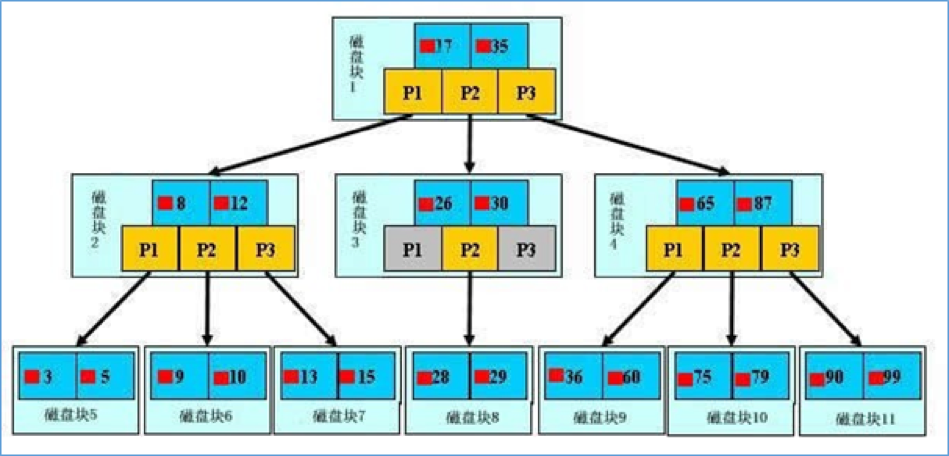
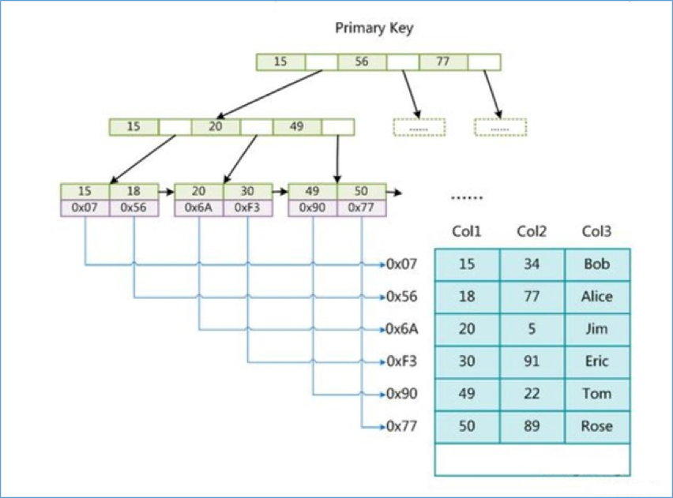
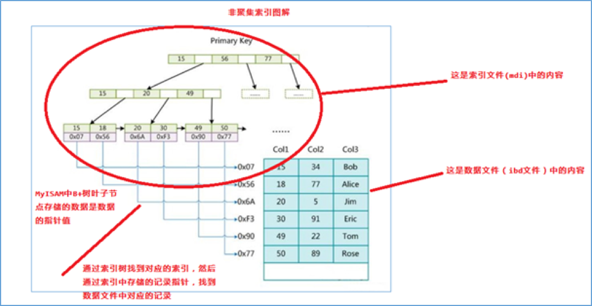
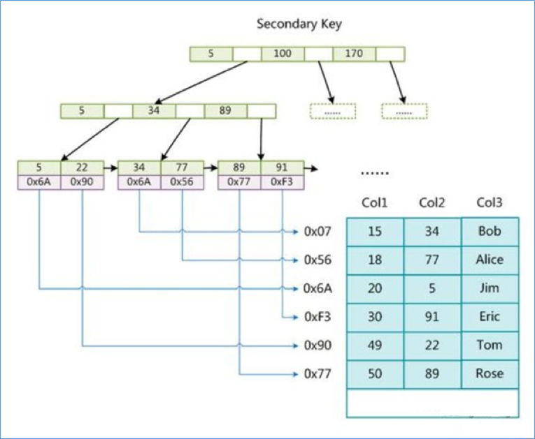
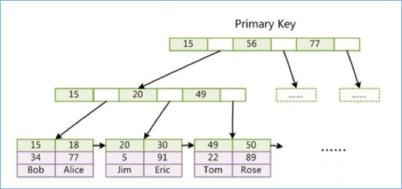
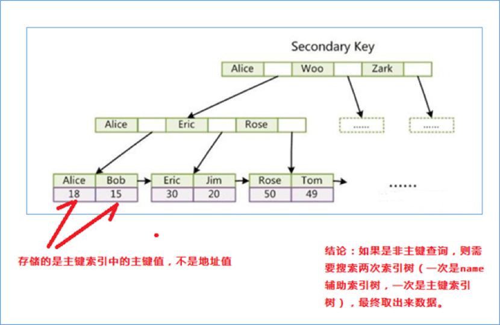
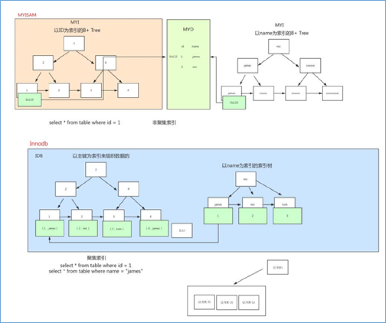

# mysql索引

# 1. 索引介绍

## 1. 索引是什么?

官方介绍索引是帮助MySQL**高效获取数据**的**数据结构**。更通俗的说，数据库索引好比是一本书前面的目录，能**加快数据库的查询速度**。

 

一般来说索引本身也很大，不可能全部存储在内存中，因此**索引往往是存储在磁盘上的文件中的**（可能存储在单独的索引文件中，也可能和数据一起存储在数据文件中）。

 

**我们通常所说的索引，包括聚集索引、覆盖索引、组合索引、前缀索引、唯一索引等，没有特别说明，默认都是使用B+树结构组织（多路搜索树，并不一定是二叉的）的索引**。

## 2. 索引的优势和劣势

### 1）优势

可以提高数据检索的效率，降低数据库的IO成本，类似于书的目录。

通过索引列对数据进行排序，降低数据排序的成本，降低了CPU的消耗。

- 被索引的列会自动进行排序，包括【单列索引】和【组合索引】，只是组合索引的排序要复杂一些。

- 如果按照索引列的顺序进行排序，对应order by语句来说，效率就会提高很多。

### 2）劣势

**索引会占据磁盘空间**

**索引虽然会提高查询效率，但是会降低更新表的效率**。比如每次对表进行增删改操作，MySQL不仅要保存数据，还有保存或者更新对应的索引文件。

# 2. 索引的分类

## 1）单列索引

**普通索引**：MySQL中基本索引类型，没有什么限制，允许在定义索引的列中插入重复值和空值，纯粹为了查询数据更快一点。

**唯一索引**：索引列中的值必须是唯一的，但是允许为空值。

**主键索引**：是一种特殊的唯一索引，不允许有空值。

## 2）组合索引

在表中的**多个字段组合上创建的索引**

组合索引的使用，需要遵循**最左前缀原则（最左匹配原则，后面高级篇讲解）**。

一般情况下，**建议使用组合索引代替单列索引**（主键索引除外，具体原因后面知识点讲解）。

## 3）全文索引

只有在**MyISAM引擎**上才能使用，而且只能在CHAR,VARCHAR,TEXT类型字段上使用全文索引。

## 4）空间索引

不做介绍，一般使用不到。

# 3. 索引的使用

## 1）创建索引

单列索引之普通索引

`CREATE INDEX index_name ON table(column(length)) ;`

`ALTER TABLE table_name ADD INDEX index_name ON (column(length)) ;`

 

单列索引之唯一索引

`CREATE UNIQUE INDEX index_name ON table(column(length)) ;`

 

单列索引之全文索引

`CREATE FULLTEXT INDEX index_name ON table(column(length)) ;`

 

组合索引

`ALTER TABLE article ADD INDEX index_titme_time (title, time) ;`

## 2）删除索引

`DROP INDEX index_name ON table;`

## 3）查看索引

`SHOW INDEX FROM table_name \G;`

# 4. 索引原理分析

## 1）索引的存储结构

索引是在**存储引擎中实现**的，也就是说不同的存储引擎，会使用不同的索引

**MyISAM****和InnoDB存储引擎**：只支持**BTREE索引**， 也就是说**默认使用BTREE，不能够更换**

MEMORY/HEAP存储引擎：支持HASH和BTREE索引

## 2）B树和B+树

数据结构示例网站：https://www.cs.usfca.edu/~galles/visualization/Algorithms.html

### B树图示

B树是为了磁盘或其它存储设备而设计的一种多叉（下面你会看到，相对于二叉，B树每个内结点有多个分支，即多叉）平衡查找树。

- B树的高度一般都是在2-4这个高度，树的高度直接影响IO读写的次数。

- 如果是三层树结构---支撑的数据可以达到20G，如果是四层树结构---支撑的数据可以达到几十T

### B树和B+树的区别

B树和B+树的最大区别在于**非叶子节点是否存储数据**的问题。

- B树是非叶子节点和叶子节点都会存储数据。
- B+树只有叶子节点才会存储数据，而且存储的数据都是在一行上，而且这些数据都是有指针指向的，也就是有顺序的。

## 3）非聚集索引（MyISAM）

B+树叶子节点只会存储数据行（数据文件）的指针，简单来说**数据和索引不在一起**，就是非聚集索引。

**非聚集索引包含主键索引和辅助索引都会存储指针的值**

### 主键索引

这里设表一共有三列,假设我们以 Col1 为主键,则上图是一个 MyISAM 表的主索引(Primary key)示意。可以看出 MyISAM 的索引文件仅仅保存数据记录的地址。

### 辅助索引（次要索引）

在 MyISAM 中,主索引和辅助索引(Secondary key)在结构上没有任何区别,只是主索引要求 key 是唯一的,而辅助索引的 key 可以重复。如果我们在 Col2 上建立一个辅助索引,则此索引的结构如下图所示

**同样也是一颗 B+Tree,data 域保存数据记录的地址**。因此,MyISAM 中索引检索的算法为首先按照 B+Tree 搜索算法搜索索引,如果指定的 Key 存在,则取出其data 域的值,然后以 data 域的值为地址,读取相应数据记录。 

## 4）聚集索引（InnoDB）

主键索引（聚集索引）的叶子节点会存储数据行，**也就是说数据和索引是在一起，这就是聚集索引**。

 

辅助索引只会存储主键值

 

如果没有主键，则使用唯一索引建立聚集索引；如果没有唯一索引，MySQL会按照一定规则创建聚集索引。

### 主键索引

1. InnoDB 要求表必须有主键(MyISAM 可以没有)，如果没有显式指定，则 MySQL系统会自动选择一个可以唯一标识数据记录的列作为主键，如果不存在这种列，则MySQL 自动为 InnoDB 表生成一个隐含字段作为主键，类型为长整形。

### 辅助索引（次要索引）

2. 第二个与 MyISAM 索引的不同是 InnoDB 的辅助索引 data 域存储相应记录主键的值而不是地址。换句话说，InnoDB 的所有辅助索引都引用主键作为 data 域。

聚集索引这种实现方式使得按主键的搜索十分高效,但是辅助索引搜索需要检索两遍索引：首先检索辅助索引获得主键，然后用主键到主索引中检索获得记录。

**引申：为什么不建议使用过长的字段作为主键?**

因为所有辅助索引都引用主索引，过长的主索引会令辅助索引变得过大。

**同时,请尽量在 InnoDB 上采用自增字段做表的主键。**

## 5）MyISAM和InnoDB的存储结构图示

为了更形象说明这两种索引的区别, 我们假想一个表如下图存储了 4 行数据。 **其中Id 作为主索引, Name 作为辅助索引**。 图示清晰的显示了聚簇索引和非聚簇索引的差异：

# 5. 为什么使用组合索引

**为了节省mysql索引存储空间以及提升搜索性能，可建立组合索引（能使用组合索引就不使用单列索引）**

 

例如：创建组合索引（相当于建立了col1,col1 col2,col1 col2 col3三个索引）

`ALTER TABLE 'table_name' ADD INDEX index_name('col1','col2','col3'）`

# 6. 哪些情况需要创建索引

1）主键自动建立唯一索引

2）频繁作为查询条件的字段应该创建索引

3）多表关联查询中，关联字段应该创建索引

4）查询中排序的字段，应该创建索引

mysql创建组合索引的规则是首先会对组合索引的最左边的，也就是第一个name字段的数据进行排序，在

第一个字段的排序基础上，然后再对后面第二个的cid字段进行排序。其实就相当于实现了类似 order by name cid这样一种排序规则。

5）查询中统计或者分组字段，应该创建索引

# 7. 哪些情况不需要创建索引

1）表记录太少

2）经常进行增删改操作的表

3）频繁更新的字段

4）where条件里使用频率不高的字段

