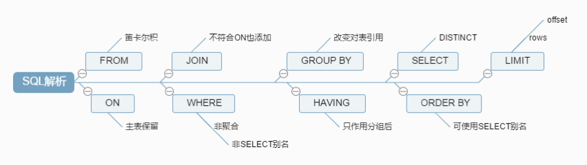

# sql的解析顺序

接下来再走一步，让我们看看一条SQL语句的前世今生。

首先看一下示例语句：

```
SELECT DISTINCT

 < select_list >
 FROM
  < left_table > < join_type >
 JOIN < right_table > ON < join_condition >
 WHERE
  < where_condition >
 GROUP BY
  < group_by_list >
 HAVING
  < having_condition >
 ORDER BY
  < order_by_condition >
 LIMIT < limit_number >
```

然而它的执行顺序是这样的：

```
1 FROM <left_table>
2 ON <join_condition>
3 <join_type> JOIN <right_table>   第二步和第三步会循环执行
4 WHERE <where_condition>  	    第四步会循环执行，多个条件的执行顺序是从左往右的。
5 GROUP BY <group_by_list>
6 HAVING <having_condition>
7 SELECT 							分组之后才会执行SELECT
8 DISTINCT <select_list>
9 ORDER BY <order_by_condition>
10 LIMIT <limit_number>				前9步都是SQL92标准语法。limit是MySQL的独有语法。

```

虽然自己没想到是这样的，不过一看还是很自然和谐的，从哪里获取，不断的过滤条件，要选择一样或不一样的，排好序，那才知道要取前几条呢。

既然如此了，那就让我们一步步来看看其中的细节吧。

## 1. 准备工作

1、创建测试数据库

```
create database testQuery
```

2、创建测试表

```
CREATE TABLE table1

(
    uid VARCHAR(10) NOT NULL,
    name VARCHAR(10) NOT NULL,
    PRIMARY KEY(uid)
 )ENGINE=INNODB DEFAULT CHARSET=UTF8;
 
 CREATE TABLE table2
 (
    oid INT NOT NULL auto_increment,
    uid VARCHAR(10),
    PRIMARY KEY(oid)
 )ENGINE=INNODB DEFAULT CHARSET=UTF8;
```

3、插入数据

```
INSERT INTO table1(uid,name) VALUES('aaa','mike'),('bbb','jack'),('ccc','mike'),('ddd','mike');

INSERT INTO table2(uid) VALUES('aaa'),('aaa'),('bbb'),('bbb'),('bbb'),('ccc'),(NULL);
```

4、最后需要的结果

```
SELECT
  a.uid,
   count(b.oid) AS total
 FROM
  table1 AS a
 LEFT JOIN table2 AS b ON a.uid = b.uid
 WHERE
  a. NAME = 'mike'
 GROUP BY
  a.uid
 HAVING
   count(b.oid) < 2
 ORDER BY
  total DESC
 LIMIT 1;
```

现在开始SQL解析之旅吧！

## 2. from

对FROM的左边的表和右边的表计算笛卡尔积(CROSS JOIN)。产生虚表VT1

```
mysql> select * from table1,table2;

+-----+------+-----+------+
 | uid | name | oid | uid |
 +-----+------+-----+------+
 | aaa | mike |  1 | aaa |
 | bbb | jack |  1 | aaa |
 | ccc | mike |  1 | aaa |
 | ddd | mike |  1 | aaa |
 | aaa | mike |  2 | aaa |
 | bbb | jack |  2 | aaa |
 | ccc | mike |  2 | aaa |
 | ddd | mike |  2 | aaa |
 | aaa | mike |  3 | bbb |
 | bbb | jack |  3 | bbb |
 | ccc | mike |  3 | bbb |
 | ddd | mike |  3 | bbb |
 | aaa | mike |  4 | bbb |
 | bbb | jack |  4 | bbb |
 | ccc | mike |  4 | bbb |
 | ddd | mike |  4 | bbb |
 | aaa | mike |  5 | bbb |
 | bbb | jack |  5 | bbb |
 | ccc | mike |  5 | bbb |
 | ddd | mike |  5 | bbb |
 | aaa | mike |  6 | ccc |
 | bbb | jack |  6 | ccc |
 | ccc | mike |  6 | ccc |
 | ddd | mike |  6 | ccc |
 | aaa | mike |  7 | NULL |
 | bbb | jack |  7 | NULL |
 | ccc | mike |  7 | NULL |
 | ddd | mike |  7 | NULL |
 +-----+------+-----+------+
 rows in set (0.00 sec)
```

## 3. on 过滤

对虚表VT1进行ON筛选，只有那些符合 <join-condition> 的行才会被记录在虚表VT2中。

注意：这里因为语法限制，使用了WHERE代替，从中读者也可以感受到两者之间微妙的关系；

```
mysql> SELECT
 -> *
  -> FROM
  -> table1,
  -> table2
  -> WHERE
  -> table1.uid = table2.uid
  -> ;
 +-----+------+-----+------+
 | uid | name | oid | uid |
 +-----+------+-----+------+
 | aaa | mike |  1 | aaa |
 | aaa | mike |  2 | aaa |
 | bbb | jack |  3 | bbb |
 | bbb | jack |  4 | bbb |
 | bbb | jack |  5 | bbb |
 | ccc | mike |  6 | ccc |
 +-----+------+-----+------+
 rows in set (0.00 sec)
```

## 4. Outer join 添加外部列

如果指定了OUTER JOIN（比如left join、 right join），那么保留表中未匹配的行就会作为外部行添加到虚拟表VT2中，产生虚拟表VT3。

如果FROM子句中包含两个以上的表的话，那么就会对上一个join连接产生的结果VT3和下一个表重复执行步骤1~3这三个步骤，一直到处理完所有的表为止。

```
mysql> SELECT
 -> *
  -> FROM
  -> table1 AS a
  -> LEFT OUTER JOIN table2 AS b ON a.uid = b.uid;
 +-----+------+------+------+
 | uid | name | oid | uid |
 +-----+------+------+------+
 | aaa | mike |   1 | aaa |
 | aaa | mike |   2 | aaa |
 | bbb | jack |   3 | bbb |
 | bbb | jack |   4 | bbb |
 | bbb | jack |   5 | bbb |
 | ccc | mike |   6 | ccc |
 | ddd | mike | NULL | NULL |
 +-----+------+------+------+
 rows in set (0.00 sec)
```

## 5. where

对虚拟表VT3进行WHERE条件过滤。只有符合<where-condition>的记录才会被插入到虚拟表VT4中。

注意：此时因为分组，不能使用聚合运算；也不能使用SELECT中创建的别名；

与ON的区别：

\- 如果有外部列，ON针对过滤的是关联表，主表（保留表）会返回所有的列；

\- 如果没有添加外部列，两者的效果是一样的；

 应用：

\- 对主表的过滤应该放在WHERE；

\- 对于关联表，先条件查询后连接则用ON，先连接后条件查询则用WHERE；

```
mysql> SELECT
  -> *
  -> FROM
  -> table1 AS a
  -> LEFT OUTER JOIN table2 AS b ON a.uid = b.uid
  -> WHERE
  -> a. NAME = 'mike';
  
+-----+------+------+------+
| uid | name | oid | uid |
+-----+------+------+------+
| aaa | mike |  1 | aaa |
| aaa | mike |  2 | aaa |
| ccc | mike |  6 | ccc |
| ddd | mike | NULL | NULL |
+-----+------+------+------+
rows in set (0.00 sec)
```

## 6. Group by

根据group by子句中的列，对VT4中的记录进行分组操作，产生虚拟表VT5。

注意：其后处理过程的语句，如SELECT,HAVING，所用到的列必须包含在GROUP BY中。对于没有出现的，得用聚合函数；

原因：GROUP BY改变了对表的引用，将其转换为新的引用方式，能够对其进行下一级逻辑操作的列会减少；

我的理解是：

根据分组字段，将具有相同分组字段的记录归并成一条记录，因为每一个分组只能返回一条记录，除非是被过滤掉了，而不在分组字段里面的字段可能会有多个值，多个值是无法放进一条记录的，所以必须通过聚合函数将这些具有多值的列转换成单值；

```
mysql> SELECT
 -> *
  -> FROM
  -> table1 AS a
  -> LEFT OUTER JOIN table2 AS b ON a.uid = b.uid
  -> WHERE
  -> a. NAME = 'mike'
  -> GROUP BY
  -> a.uid;
 +-----+------+------+------+
 | uid | name | oid | uid |
 +-----+------+------+------+
 | aaa | mike |   1 | aaa |
 | ccc | mike |   6 | ccc |
 | ddd | mike | NULL | NULL |
 +-----+------+------+------+
 rows in set (0.00 sec)
```

## 7. having

对虚拟表VT5应用having过滤，只有符合<having-condition>的记录才会被 插入到虚拟表VT6中。

```
mysql> SELECT
 -> *
  -> FROM
  -> table1 AS a
  -> LEFT OUTER JOIN table2 AS b ON a.uid = b.uid
  -> WHERE
  -> a. NAME = 'mike'
  -> GROUP BY
  -> a.uid
  -> HAVING
  -> count(b.oid) < 2;
 +-----+------+------+------+
 | uid | name | oid | uid |
 +-----+------+------+------+
 | ccc | mike |   6 | ccc |
 | ddd | mike | NULL | NULL |
 +-----+------+------+------+
 rows in set (0.00 sec)
```

## 8. select

这个子句对SELECT子句中的元素进行处理，生成VT5表。

(5-J1)计算表达式 计算SELECT 子句中的表达式，生成VT5-J1

## 9. distinct

寻找VT5-1中的重复列，并删掉，生成VT5-J2

如果在查询中指定了DISTINCT子句，则会创建一张内存临时表（如果内存放不下，就需要存放在硬盘了）。这张临时表的表结构和上一步产生的虚拟表VT5是一样的，不同的是对进行DISTINCT操作的列增加了一个唯一索引，以此来除重复数据。

 ```
mysql> SELECT
 -> a.uid,
  -> count(b.oid) AS total
  -> FROM
  -> table1 AS a
  -> LEFT OUTER JOIN table2 AS b ON a.uid = b.uid
  -> WHERE
  -> a. NAME = 'mike'
  -> GROUP BY
  -> a.uid
  -> HAVING
  -> count(b.oid) < 2;
 +-----+-------+
 | uid | total |
 +-----+-------+
 | ccc |   1 |
 | ddd |   0 |
 +-----+-------+
 rows in set (0.00 sec)
 ```

## 10. order by

从VT5-J2中的表中，根据ORDER BY 子句的条件对结果进行排序，生成VT6表。

**注意**：唯一可使用SELECT中别名的地方；

 ```
 mysql> SELECT
 -> a.uid,
  -> count(b.oid) AS total
  -> FROM
  -> table1 AS a
  -> LEFT OUTER JOIN table2 AS b ON a.uid = b.uid
  -> WHERE
  -> a. NAME = 'mike'
  -> GROUP BY
  -> a.uid
  -> HAVING
  -> count(b.oid) < 2
  -> ORDER BY
  -> total DESC;
 +-----+-------+
 | uid | total |
 +-----+-------+
 | ccc |   1 |
 | ddd |   0 |
 +-----+-------+
 rows in set (0.00 sec)
 ```

## 11. limit(mysql特有)

LIMIT子句从上一步得到的VT6虚拟表中选出从指定位置开始的指定行数据。

**注意**：offset和rows的正负带来的影响；

**当偏移量很大时效率是很低的，可以这么做**：

\- 采用子查询的方式优化，在子查询里先从索引获取到最大id，然后倒序排，再取N行结果集

\- 采用INNER JOIN优化，JOIN子句里也优先从索引获取ID列表，然后直接关联查询获得最终结果

```
mysql> SELEC
 -> a.uid,
  -> count(b.oid) AS total
  -> FROM
  -> table1 AS a
  -> LEFT JOIN table2 AS b ON a.uid = b.uid
  -> WHERE
  -> a. NAME = 'mike'
  -> GROUP BY
  -> a.uid
  -> HAVING
  -> count(b.oid) < 2
  -> ORDER BY
  -> total DESC
  -> LIMIT 1;
 +-----+-------+
 | uid | total |
 +-----+-------+
 | ccc |   1 |
 +-----+-------+
 row in set (0.00 sec)
```


## 12. sql解析总结

### 1. 图示



### 2. 流程分析

1. FROM（将最近的两张表，进行笛卡尔积）---VT1

2. ON（将VT1按照它的条件进行过滤）---VT2
3. LEFT JOIN（保留左表的记录）---VT3
4.  WHERE（过滤VT3中的记录）--VT4…VTn
5. GROUP BY（对VT4的记录进行分组）---VT5
6. HAVING（对VT5中的记录进行过滤）---VT6
7. SELECT（对VT6中的记录，选取指定的列）--VT7
8. ORDER BY（对VT7的记录进行排序）--VT8
9. LIMIT（对排序之后的值进行分页）--MySQL特有的语法

 

单表查询：根据WHERE条件过滤表中的记录，形成中间表（这个中间表对用户是不可见的）；然后根据SELECT的选择列选择相应的列进行返回最终结果。

两表连接查询：对两表求积（笛卡尔积）并用ON条件和连接连接类型进行过滤形成中间表；然后根据WHERE条件过滤中间表的记录，并根据SELECT指定的列返回查询结果。

笛卡尔积：行相乘、列相加。

多表连接查询：先对第一个和第二个表按照两表连接做查询，然后用查询结果和第三个表做连接查询，以此类推，直到所有的表都连接上为止，最终形成一个中间的结果表，然后根据WHERE条件过滤中间表的记录，并根据SELECT指定的列返回查询结果。

WHERE条件解析顺序

\- MySQL：从左往右去执行WHERE条件的。

\- Oracle：从右往左去执行WHERE条件的。

**写WHERE条件的时候，优先级高的部分要去编写过滤力度最大的条件语句。**