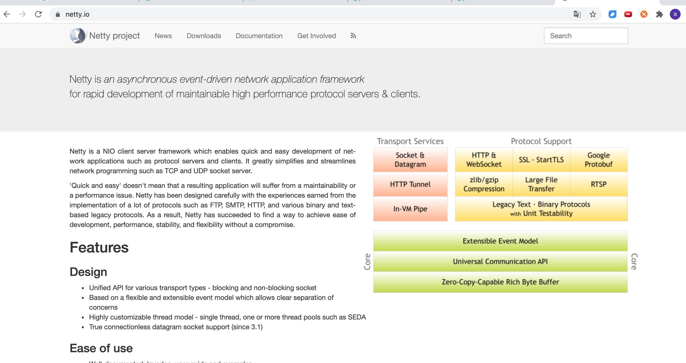
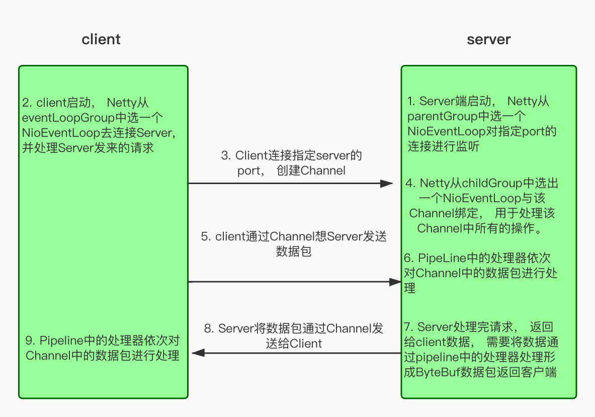

# netty其实也没那么难， 知道一些套路， 手撕一个实例

# 1. netty的概念

## 1. netty简介

netty到底是一个什么东西嗯? 反正我知道的一点就是面试的时候都会问， 简而言之， 就是非常的重要， 要想拿到牛逼的工资， 不会netty是不行的。下面我们来看看官网的权威的解释吧。



我们来简单翻译一下上面的话：

>
>
>- netty是一个异步事件驱动的网络应用程序框架， 用于快速开发可维护的高性能服务器和客户端。
>- netty是一个NIO客户端和服务端框架， 他支持快速， 简单的开发网络应用程序的服务端和客户端。它大大简化了网络编程如TCP和UDP套接字服务。
>- 快速和简单并不意味着生成应用程序将会受到可维护性或性能问题的影响。netty经过精心设计， 并积累了许多协议（如： ftp， smtp， http）的实验， 以及各种二进制和基于文本的遗留协议。因此netty成功的找到了一种方法， 在不妥协的情况下实现了易于开发， 性能， 稳定性和灵活性。


## 2. netty的应用范围

Dubbo， zk， rocketmq， elasticsearch， spring5（对http协议）， grpc， spark等大型开源项目都在使用netty作为底层通信框架


# 2. netty中的核心概念

## 1. Channel

管道， 其实是多socket的封装， 其中包含了一组api， 大大简化了我们直接进行socket编程的复杂性

## 2. EventLoopGroup

EventLoopGroup是一个EventLoop池， 包含很多的EventLoop.

Netty 为每个 Channel 分配了一个 EventLoop，用于处理用户连接请求、对用户请求的处 理等所有事件。EventLoop 本身只是一个线程驱动，在其生命周期内只会绑定一个线程，让 该线程处理一个 Channel 的所有 IO 事件。

一个 Channel 一旦与一个 EventLoop 相绑定，那么在 Channel 的整个生命周期内是不能 改变的。一个 EventLoop 可以与多个 Channel 绑定。即 Channel 与 EventLoop 的关系是 n:1， 而 EventLoop 与线程的关系是 1:1。

**<u>画外音： 一个线程可以处理多个Channel</u>**


## 3. ServerBootStrap

用于配置整个 Netty 代码，将各个组件关联起来。服务端使用的是 ServerBootStrap，而

客户端使用的是则 BootStrap。

## 4. ChannelHandler与ChannelPipeline

ChannelHandler 是对 Channel 中数据的处理器，这些处理器可以是系统本身定义好的编 解码器，也可以是用户自定义的。这些处理会被统一添加到一个 ChannelPipeline 的对象中， 然后按照添加的顺序对 Channel 中的数据进行依次处理。

## 5. ChannelFuture

Netty 中所有的 I/O 操作都是异步的，即操作不会立即得到返回结果，所以 Netty 中定义 了一个 ChannelFuture 对象作为这个异步操作的“代言人”，表示异步操作本身。如果想获取 到该异步操作的返回值，可以通过该异步操作对象的 addListener()方法为该异步操作添加监听器，为其注册回调:当结果出来后马上调用执行。

Netty 的异步编程模型都是建立在 Future 与回调概念之上的。

# 3. netty的执行流程图



# 4. 代码示例：

github代码地址： 

https://github.com/ajing2/stormling/tree/master/netty/netty-studty

## 1. 创建工程

创建maven工程， 添加maven依赖

```maven
				<!-- netty-all 依赖 -->
        <dependency>
            <groupId>io.netty</groupId>
            <artifactId>netty-all</artifactId>
            <version>4.1.36.Final</version>
        </dependency>

        <!--lombok 依赖-->
        <dependency>
            <groupId>org.projectlombok</groupId>
            <artifactId>lombok</artifactId>
            <version>1.18.6</version>
            <scope>provided</scope>
        </dependency>

```

## 2. 定义服务端启动类

