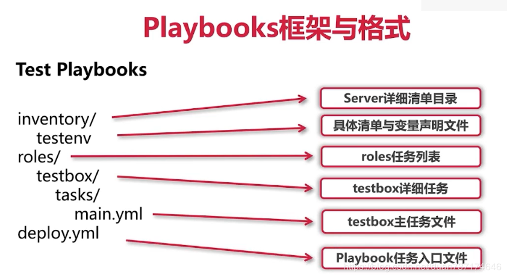

# Playbook

# 1. ansible playbook介绍

playbook是ansible用于配置，部署，和管理被控节点的剧本。

  通过playbook的详细描述，执行其中的一系列tasks，可以让远端主机达到预期的状态。playbook就像Ansible控制器给被控节点列出的的一系列to-do-list，而被控节点必须要完成。也可以这么理解，playbook 字面意思，即剧本，现实中由演员按照剧本表演，在Ansible中，这次由计算机进行表演，由计算机安装，部署应用，提供对外服务，以及组织计算机处理各种各样的事情。

# 2. playbook的框架



# 3. playbook的架构图

官方给出的架构图如下:


```
production # 正式环境的inventory文件 
staging #测试环境用得inventory文件 
group_vars/ # 机器组的变量文件 
      group1 
      group2 
host_vars/ #执行机器成员的变量 
      hostname1 
      hostname2 
================================================ 
site.yml # 主要的playbook剧本 
webservers.yml # webserver类型服务所用的剧本 
dbservers.yml # 数据库类型的服务所用的剧本 
roles/ 
      webservers/      #webservers这个角色相关任务和自定义变量 
           tasks/      # 任务存放目录
               main.yml   # 存放任务信息
           handlers/      
               main.yml 
           vars/          # 存放变量的目录
               main.yml   # 存放变量信息
     dbservers/           #dbservers这个角色相关任务和定义变量 
         ... 
     common/ # 公共的 
           tasks/ # 
                main.yml # 
           handlers/ # 
                main.yml # handlers file. 
           vars/             # 角色所用到的变量 
               main.yml # 
=============================================== 
     templates/ # 
           ntp.conf.j2        # 模版文件 
     files/                   # 用于上传存放文件的目录 
           bar.txt # 
           foo.sh # 
     meta/                    # 角色的依赖 
           main.yml # 
```

# 4. playbook的基础概念介绍

## 1. Inventory

ansible可管理的主机源。

> 若多个环境有不同的inventory源，可创建多个目录来区分，目录结构一致。比如将测试环境、生产环境区分开来。production # 正式环境的inventory文件 , staging #测试环境用得inventory文件
>

inventory目录包含:

- hosts 主机及主机组列表

ansible安装完成以后, 默认使用的是/etc/ansible下面的host文件, host文件命名下面可以使用组进行命名, 如下:

```
[root@localhost nginx_ntp]# cat hosts
[webserver]
192.168.34.129
192.168.34.130
```

- host_vars 主机变量，目录里包含以组名命名的yaml文件

如下： host_vars

```
# cat /etc/ansible/inventory/hosts_vars/127.0.0.1
---
myname: ajing2
address: beijing
```

- group_vars 主机组变量，目录里包含以组名命名的yaml文件

根据 inventory 来区分，all 表示所有，webserver 则指 hosts 中的 webserver section

```
[root@localhost nginx_ntp]# cd group_vars/
[root@localhost group_vars]# ll
total 8
-rw-r--r--. 1 root root 32 Mar  6 18:12 all
-rw-r--r--. 1 root root 72 Mar  6 18:24 webserver
[root@localhost group_vars]# cat all 
---
ntpserver: ntp.sjtu.edu.cn

[root@localhost group_vars]# cat webserver 
---
worker_processes: 4
root: /data1
worker_connections: 1024
user: www
```

- inventory.py 动态主机列表脚本

## 2. playbook

playbook的主程序入口, 跟根据不同的任务, 依次执行下面的文件, 会根据不同任务, 来执行不同的role, 更好的模块化管理各个角色

```
[root@localhost nginx_ntp]# cat site.yml 
---
- name: apply common configuration to all nodes
  hosts: all
  roles:
    - common

- name: configure and deploy the webserver and application code
  hosts: webserver
  roles:
    - web
```

## 3. Roles

角色很适合组织多个相关任务并封装完成这些任务所需的数据。例如，安装Nginx可能涉及添加软件包存储库，安装软件包和设置配置。
此外，真实的配置通常需要额外的数据，如变量，文件，动态模板等等。这些工具可以与Playbook一起使用，但是我们可以通过将相关任务和数据组织成一个角色（role， 相关的结构）很快就能做得更好。
角色有一个这样的目录结构：

```
roles
  rolename
   - files
   - handlers
   - meta
   - templates
   - tasks
   - vars
```

在每个子目录中（eg： files，handlers等等），Ansible将自动搜索并读取叫做main.yml的yaml文件。
接下来我们将分解nginx.yml文件内容为不同的组件，并将每个组件放在相应的目录中，以创建一个更干净，更完整的配置工具集。

### 1. Create a role

我们可以使用ansible-galaxy命令来创建一个新角色。此工具可用于将角色保存到Ansible的公共注册表，但是我通常只是使用它来在本地创建role的基础目录结构。

我们来看看如何设置：

```
# Head to our previously created directory
cd ~/ansible-example

# In case we left our virtualenv at some point 
source .venv/bin/activate

# Create a roles directory
mkdir roles
cd roles

# Bootstrap a new role named "nginx"
ansible-galaxy init nginx
```

目录名称roles是一种惯例，在运行一个playbook时可以用来查找角色。该目录应该始终被命名roles，但并不强制。在roles目录中运行 ansible-galaxy init nginx 命令将创建新角色所需的目录和文件。

我们来看看我们新建的nginx角色的每个部分~/ansible-example/roles/nginx。

```
[root@izz roles]# ansible-galaxy init nginx
/usr/lib/python2.7/site-packages/requests/__init__.py:80: RequestsDependencyWarning: urllib3 (1.22) or chardet (2.2.1) doesn't match a supported version!
  RequestsDependencyWarning)
- nginx was created successfully
[root@izz roles]# ls
nginx
[root@izz roles]# tree nginx
nginx
├── defaults
│   └── main.yml
├── files
├── handlers
│   └── main.yml
├── meta
│   └── main.yml
├── README.md
├── tasks
│   └── main.yml
├── templates
├── tests
│   ├── inventory
│   └── test.yml
└── vars
    └── main.yml
```

### 2. files

首先，在files目录中，我们可以添加我们要复制到我们的服务器中的文件。对于nginx，我经常复制H5BP的Nginx组件配置。我只需从Github下载最新的信息，进行一些调整，并将它们放入files目录中。

```
~/ansible-example
 - roles
 - - nginx
 - - - files
 - - - - h5bp
```

我们稍后会看到，H5BP配置文件将通过复制模块添加到服务器。

### 3. handlers

任务执行改变后触发的动作。handler也是task，但stask notify通知后才会触发，且多个task同时调用handler，只会触发一次。

```
# cat /etc/ansible/roles/epel/handlers/main.yaml
---
# Example shows using the local machine still
# Remove 'connection' and set hosts to 'remote' for a remote connection
- hosts: local
  connection: local
  become: yes
  become_user: root
  tasks:
   - name: Install Nginx
     apt:
       name: nginx
       state: installed
       update_cache: true
     notify:
      - Start Nginx

  handlers:
   - name: Start Nginx
     service:
       name: nginx
       state: started
```

这里我们添加一个notify指令到安装任务。这将在任务运行后通知名为“Start Nginx”的处理程序。

> 目录下要有一个main.yaml文件，其他文件用Include引用到main中

### 4. meta

meta目录中的main.yml文件包含Role元数据，包含的依赖关系。如果这个角色依赖于另一个角色，我们可以在这里定义。例如，nginx角色取决于安装SSL证书的ssl角色。约定必须包含main.yml文件。
meta/main.yml 内容：

```
---
dependencies:
  - { role: ssl }
```

如果我调用了“nginx”角色，它将尝试首先运行“ssl”角色。
否则我们可以省略此文件，或将角色定义为没有依赖关系:

```
---
dependencies: []
```


### 5. templates

使用template模板渲染功能时，所需的模块文件存放在这个目录。

基于Python的Jinja2模板引擎（和django的模板引擎很类似），模板文件可以包含模板变量。这里的文件应该以.j2为类型后缀（eg.uwsgi.j2），提倡但是不强制，也可以取其他的名字。类似于files，在templates目录中没有main.yml文件，只包含.j2后缀的模板文件。
这是一个Nginx服务器（“虚拟主机”）配置的例子。请注意，它使用了稍后在vars/main.yml文件中定义的一些变量。
我们的示例中的Nginx配置文件位于templates/serversforhackers.com.conf.j2：

```
server {
    # Enforce the use of HTTPS
    listen 80 default_server;
    server_name {{ domain }};
    return 301 https://$server_name$request_uri;
}

server {
    listen 443 ssl default_server;

    root /var/www/{{ domain }}/public;
    index index.html index.htm index.php;

    access_log /var/log/nginx/{{ domain }}.log;
    error_log  /var/log/nginx/{{ domain }}-error.log error;

    server_name {{ domain }};

    charset utf-8;

    include h5bp/basic.conf;

    ssl_certificate           {{ ssl_crt }};
    ssl_certificate_key       {{ ssl_key }};
    include h5bp/directive-only/ssl.conf;

    location / {
        try_files $uri $uri/ /index.php$is_args$args;
    }

    location = /favicon.ico { log_not_found off; access_log off; }
    location = /robots.txt  { log_not_found off; access_log off; }

    location ~ \.php$ {
        include snippets/fastcgi.conf;
        fastcgi_pass unix:/var/run/php7.1-fpm.sock;
    }
}
```

这是一个相当标准的用于PHP应用程序的Nginx配置。这里有三个变量：

domain
ssl_crt
ssl_key
这三个变量将在变量部分（vars）中定义。


### 5. vars

定义的主机变量和主机组变量。若group_vars，host_vars，role/vars目录中定义了相同变量名，优先级group_vars < host_vars < vars。

```
[root@izz roles]# cat /vars/main.yml
---
domain: serversforhackers.com
ssl_key: /etc/ssl/sfh/sfh.key
ssl_crt: /etc/ssl/sfh/sfh.crt
```

> **目录下要有一个main.yaml文件，其他文件用Include引用到main中**

### 7. tasks

play中运行的任务命令，也就是执行的哪些ansible模块，如command,shell,service,yum等。

```
# cat /etc/ansible/roles/epel/tasks/main.yaml
---

- name: install epel-release repo
  remote_user: root
  yum: name=epel-release state=installed
  notify: make yum cache
```

> **目录下要有一个main.yaml文件，其他文件用Include引用到main中**