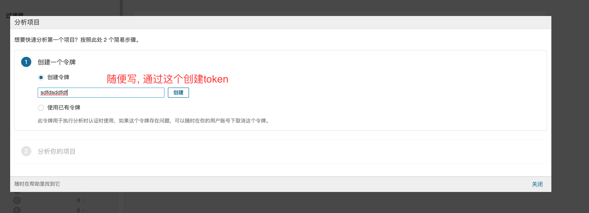
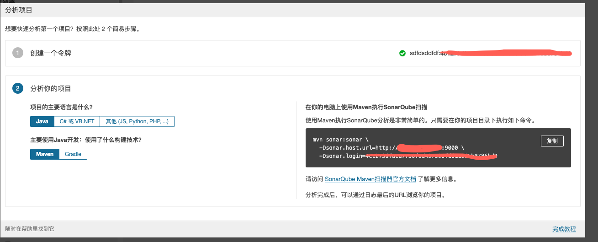
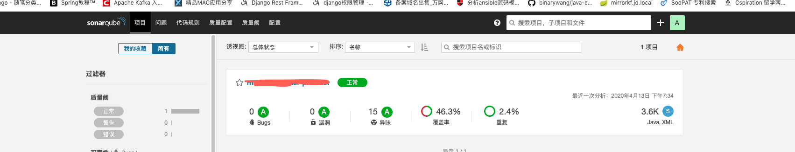

# sonar的安装和配置

目前在devops的开发中, 使用频繁的是sonar, jira, jenkins, ansible, artifactory, nexus等, 目前公司对单元测试做了强要求, 单元测试的覆盖率要达到35以上, 我们自己组内今年的目标, 单元测试的覆盖率是要达到70%左右, 这个对我们来说都是一个很大的挑战啊.

下面来说说单测的重要性吧, 自己原来是不怎么写单测的, 注释关注业务功能的开发, 可能对单元测试不是很看中, 觉得没什么用, 但是在自己投入时间写单测的过程中, 确实受益很大, 单侧可以大大提高我们代码的bug率, 可以帮助我们很好的提高代码的质量, 真的是一个很好的方式

不得不说的一个idea插件, 就是sonarlint了, 这个插件真的是太好用了, 在我们平时开发的过程中, 只要实时打开这个插件, 就会把我们代码的一些代码异味, 代码bug, 可能存在的隐患都会提示出来, 最重要的是, 还给我们提供很友好的修改方式和提示信息, 让我们知道是哪里有问题, 应该如何去修改, 这个对自己来说是帮助很大的, 很好的帮助我们提升了自己的代码质量

# 1. soanr的安装依赖

- 要求jdk1.8以上
- 要求mysql版本>5.6 <=8.0, 如果不符合要求会造成应用启动失败
- 8.0以上的版本,要求使用jdk11.

# 2. 下载和安装

我们主要还是按照linux来举例

```shell
wget https://binaries.sonarsource.com/Distribution/sonarqube/sonarqube-7.5.zip
unzip sonarqube-7.5.zip
mv sonarqube-7.5 /data/apps/
```

# 3. 配置sonarqube

sonar支持多种数据的配置, 推荐还是使用PostgreSQL

Mysql:

```properties
sonar.jdbc.username=sonar
sonar.jdbc.password=
sonar.jdbc.url=jdbc:mysql://localhost:3306/sonar?useUnicode=true&characterEncoding=utf8&rewriteBatchedStatements=true&useConfigs=maxPerformance&useSSL=false
sonar.web.host=0.0.0.0
sonar.web.port=9000
```

postgresql

```properties
sonar.jdbc.username=sonar
sonar.jdbc.password=sonar123
sonar.jdbc.url=jdbc:postgresql://localhost/sonar
```

# 4. sonar的启动

sonarquebe内置elasticsearch, 而且elasticsearch不应许使用root进行启动, 所以我们需要新建一个普通账户来启动sonar程序, 否则报错

```shell
useradd sonar
/data/apps/soanrqube-7.5/bin/sonar.sh start
```

- 检查是否启动成功:

查看sonarqube-7.5/logs/sonar.log, 查看日志是否有报错信息, 如果有报错, 根据提示信息进行排查

```shell
ps -ef |grep sonar
netstat -anp |grep 9000
```

如果上面的都正常, 代表启动成功

# 5. 配置自己的第一个项目

sonar启动成功后, 登陆http://ip:9000, 我们可以查看到soanr的信息, 我们首选需要我们的超级用户登陆

默认密码是: admin/admin

登陆以后, 创建一个项目: 如下图所示:



继续:



```shell
mvn soanr:sonar -Dsonar.host.url=http://ip:9000 -Dsoanr.login=sdsadfasdfjljljlj
```


我们只需要在我们的项目中, 执行上面提示的命令, 就可以把我们的扫描结果上传到我们的sonarquebe的服务器上



# 6. 使用sonar-scanner

## 下载sonar-scanner

- Linux

```shell
wget https://binaries.sonarsource.com/Distribution/sonar-scanner-cli/sonar-scanner-cli-3.3.0.1492-linux.zip
unzip sonar-scanner-cli-3.3.0.1492-linux.zip
mv sonar-scanner-3.3.0.1492-linux  /opt/sonar-scanner
```

- Windows 

https://binaries.sonarsource.com/Distribution/sonar-scanner-cli/sonar-scanner-cli-3.3.0.1492-windows.zip, 直接下载就好了

- mac

```shell
brew install sonar-scanner
```

## 安装sonar-scanner

1.编辑/etc/profile，在底部追加：export PATH=$PATH:/opt/sonar-scanner/bin
2.然后执行source /etc/profile，使修改后的环境变量生效
3.执行sonar-scanner -v，显示如下安装成功：

```shell
sonar-scanner -v
```

## 使用篇

在项目根目录下新建文件sonar-project.properties，添加如下配置：

```properties
#sonarqube服务器地址
sonar.host.url=http://IP:9000
#sonarqube用户名
sonar.login=sonar
#sonarqube密码
sonar.password=sonar2019
#项目唯一标识（不能出现重复）
sonar.projectKey=testsonar
#项目名称
sonar.projectName=testsonar
#源代码目录
sonar.sources=src/main
#编译生成的class文件的所在目录
sonar.java.binaries=target
#版本号
sonar.projectVersion=0.0.1-SNAPSHOT
#语言
sonar.language=java
#源代码文件编码
sonar.sourceEncoding=UTF-8
```

然后在项目根目录运行, 执行`sonar-scanner`

如果就可以在我们的项目中查看项目的分析情况了

