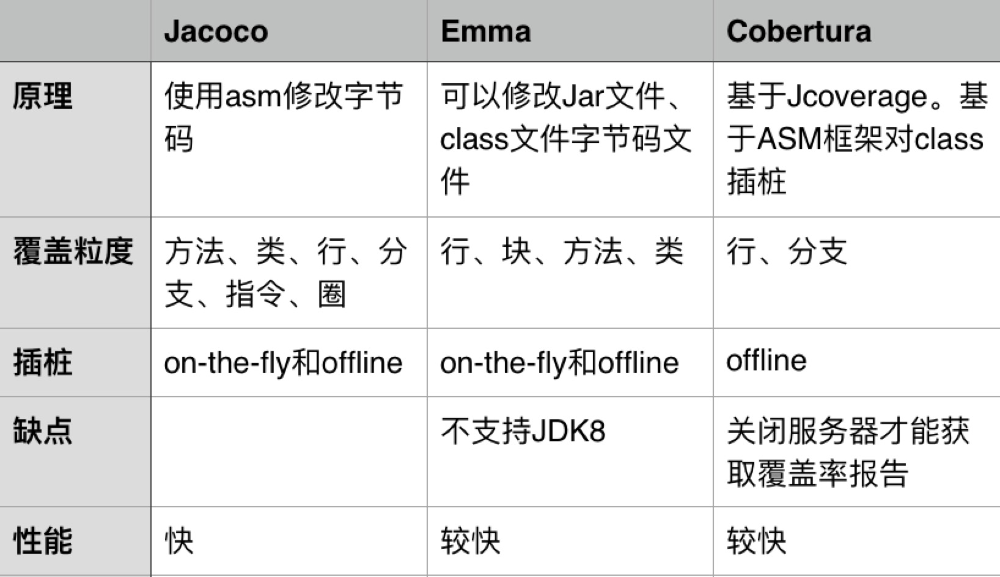

# 记录sonar才的一些坑

这两天一直在研究sonar单元测试覆盖率的问题, 我们线上使用的是sonar的单元测试的扫描.我们平时单测是使用groovy语言写的, 使用的是spock框架, 自己研究了很长时间, 今天也是跟大佬研究讨论了一下, 聊了聊他们自己踩的坑, 学习到新的知识点, 今天记录一下最近踩的一些坑吧, 

我们知道sonar本省底层的扫描结果是使用jacoco进行扫描的, 我们进行扫描, 只需要执行mvn sonar:sonar就可以了, 默认是使用jacoco插件进行扫描.

目前java常用的覆盖率工具有: Jacoco、Emma和Cobertura

jacoco, 这个东西很不错, 但是如果以前看过我自己写的spock的静态方法单测的话, 应该是知道spock如果想测试java代码的静态方法, spock本身提供的方法是不行的, 他们的方法只支持groovy语言的静态方法啊, 如果是java语言, 就可能需要借助第三方的单元测试框架, 如powermock等, 自己写了powermock的方法, 并且研究了很长时间, 最后通过groovy终于搞定了java的静态方法测试, 但是sonar扫描覆盖率为0, 让我很是心酸, 研究了很长时间.

**如果你使用JaCoCo作为你的code coverage插件的话，那么所有写在注解@PrepareForTest里的类的覆盖率都是零。这是JaCoCo插件的限制或者说是Bug：https://github.com/jacoco/eclemma/issues/15，而且它并不打算修改这个Bug。所以如果你想使用PowerMock提升覆盖率的话，请使用其它的code coverage插件：cobertura
Sonar里默认的code coverage插件是JaCoCo。**

自己使用cobertura扫描以后, 自己的那个powermock的单元测试覆盖率达到96%, 但是jacoco的单侧覆盖率为0, 这个让人还困扰, 后来自己研究如何使用cobertura, 看看cobertura是否可以和jacoco来联合使用, 后来这个方案是不行的, 我们只能选用一个, 如果我们替换成cobertura扫描插件的话, 就有一起其他方法方法是扫描不到的, 比如我们经常使用的`import lombok.Data;`这个就没法自动帮我们进行扫描, 可能还有一些其他的问题, 自己也还没有遇到过, 这个是比较麻烦的.

所有我们jacoco有三种情况, 我们是没法进行单元测试覆盖的

1. java的静态方法, 没法mock, 即使通过powermock, 也无法被sonar扫描到
2. java的私有方法, 如果也是通过powermock来搞的, 那估计也是不行的
3. java的构造方法, 这个也是扫描不到的

这个三个方法, 可能我们公众推广的时候, 可能需要提示一下大家这些坑.

那我们有什么改进方案呢?

1. 我们静态方法尽量不要要求依赖外部的其他第三方应用
2. 如果使用http接口, 建议使用@FeignClient的注解来进行方法管理, 如果不使用, 看是否可以把方法封装时接口, 通过spring进行管理, 这样方面我们在单元测试中mock使用

最近终于搞定了这个事情, 也算松了一口气啊, 感觉自己消耗的这段时间, 也是没有白费的, 知道应该如何编写单元测试, 如何避免单元测试的一些坑等, 接下来, 可能自己要准备夸中心的交流ppt了, 希望总结出来对大家有帮助.

最近看到一篇redis cluster的文章, 讲的是底层原理的, 感觉很不错, 等我自己学习完, 总结了, 会给大家分享出来, 明天期待吧!

