# spring boot中， 日志操作白皮书（你还不会就弄死我吧）

作为一个运维老司机， 本来java基础就菜的一批， 最近在对接DevOps中， 一个拦路虎， 吓的我满身鸡皮疙瘩


spring容器中的日志配置， 以前遇到， 都是网上搜一下， 草草了事， 但是总感觉不是自己的内容


特意查看了很多资料， 今天特意总结出来， 和大家分享， 看了的都说好。不信你回去问问你妈！😝😝


今天是高考的第一天， 为学子们加油吧！


**天王盖地虎 全上985**

**宝塔镇河妖 都上211**


## 1. 默认日志Logback

默认情况下，Spring Boot会用Logback来记录日志，并用INFO级别输出到控制台。

在运行应用程序和其他例子时，你应该已经看到很多INFO级别的日志了。

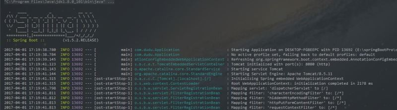

从上图可以看到，日志输出内容元素具体如下：

- 时间日期：精确到毫秒
- 日志级别：ERROR, WARN, INFO, DEBUG or TRACE
- 进程ID
- 分隔符：— 标识实际日志的开始
- 线程名：方括号括起来（可能会截断控制台输出）
- Logger名：通常使用源代码的类名
- 日志内容

## 2. 添加日志依赖

假如maven依赖中添加了`spring-boot-starter-logging`：

```
<dependency>
    <groupId>org.springframework.boot</groupId>
    <artifactId>spring-boot-starter-logging</artifactId>
</dependency>
```

但是呢，实际开发中我们不需要直接添加该依赖。
你会发现`spring-boot-starter`其中包含了 `spring-boot-starter-logging`，该依赖内容就是 `Spring Boot` 默认的日志框架 `logback`。


## 3. 控制台输出

### 1. 日志级别

日志级别从低到高分为：

> `TRACE` < `DEBUG` < `INFO` < `WARN` < `ERROR` < `FATAL`。


如果设置为 `WARN` ，则低于 `WARN` 的信息都不会输出。

`Spring Boot`中默认配置`ERROR`、`WARN`和`INFO`级别的日志输出到控制台。


您还可以通过启动您的应用程序 `--debug` 标志来启用“调试”模式（开发的时候推荐开启）,以下两种方式皆可：

- 在运行命令后加入`--debug`标志，如：`$ java -jar springTest.jar --debug`
- 在`application.properties`中配置`debug=true`，该属性置为`true`的时候，核心`Logger`（包含嵌入式容器、hibernate、spring）会输出更多内容，但是你**自己应用的日志并不会输出为`DEBUG`级别**。


### 2. 在程序中如何定义日志

如下图：

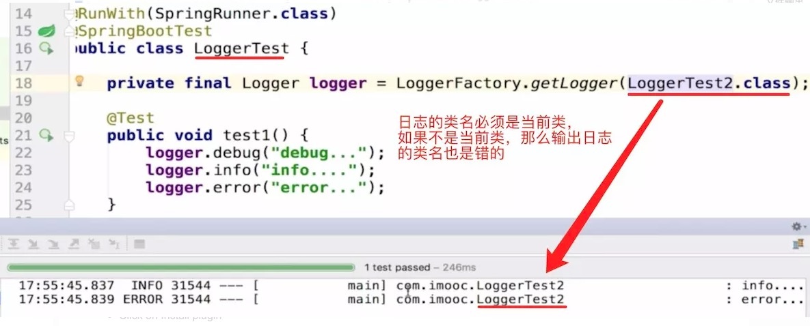


如果每次都写这行代码会很麻烦。 

可以使用注解，那就可以使用`lombok`：来帮助我们完美的解决


### 3. 使用lombok简化我们的代码

#### 1. lombok的maven配置

```xml
<!-- https://mvnrepository.com/artifact/org.projectlombok/lombok -->
<dependency>
    <groupId>org.projectlombok</groupId>
    <artifactId>lombok</artifactId>
    <version>1.18.6</version>
    <scope>provided</scope>
</dependency>

```

#### 

#### 2. 安装lombok的插件

- Go to File > Settings > Plugins
- Click on Browse repositories...
- Search for Lombok Plugin
- Click on Install plugin
- Restart Android Studio
- 允许注解处理，Settings -> Compiler -> Annotation Processors


如下图使用注解进行定义日志：

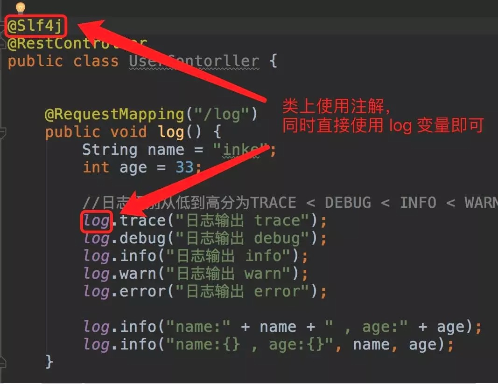


## 4. 文件输出

默认情况下，Spring Boot将日志输出到控制台，不会写到日志文件。

使用`Spring Boot`喜欢在`application.properties`或`application.yml`配置，这样只能配置简单的场景，保存路径、日志格式等，复杂的场景（区分 info 和 error 的日志、每天产生一个日志文件等）满足不了，只能自定义配置，下面会演示。

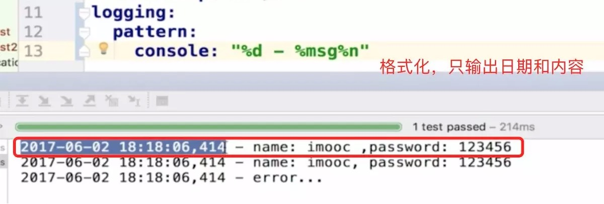


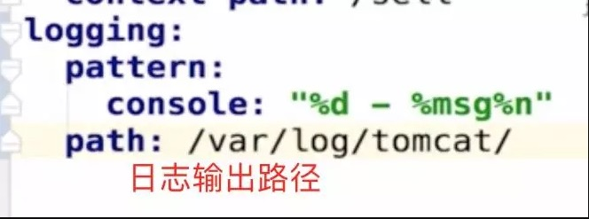


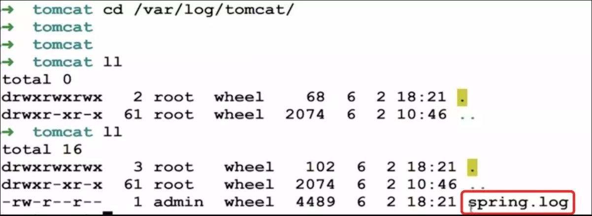


默认会在设置的 `path` 生成一个`spring.log` 文件。

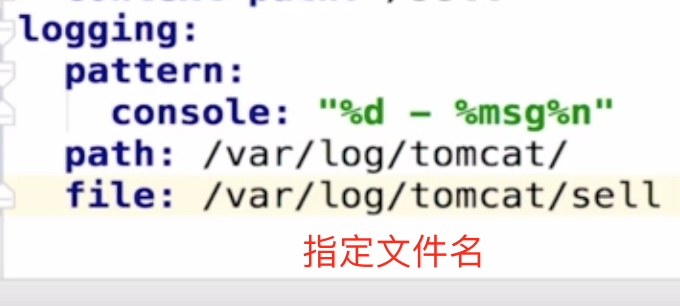


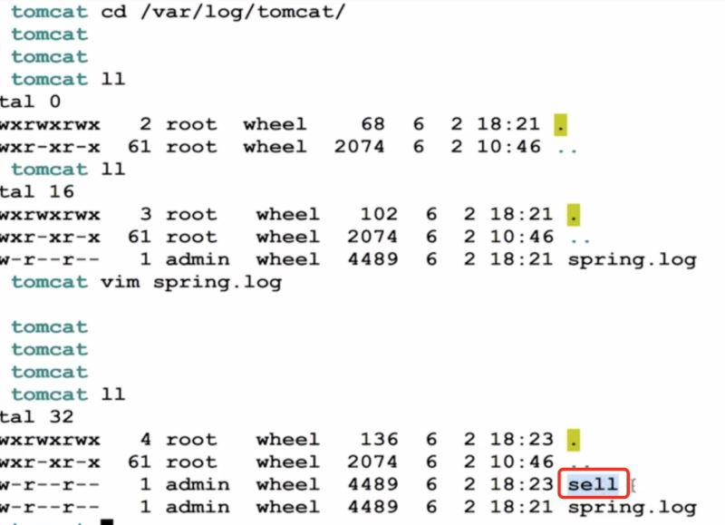


如果要编写除控制台输出之外的日志文件，则需在 application.properties 中设置 logging.file 或 logging.path 属性。

- logging.file ，设置文件，可以是绝对路径，也可以是相对路径。如： logging.file=my.log
- logging.path ，设置目录，会在该目录下创建 spring.log 文件，并写入日志内容，如： logging.path=/var/log

如果只配置 logging.file ，会在项目的当前路径下生成一个 xxx.log 日志文件。

如果只配置 logging.path ，在 /var/log 文件夹生成一个日志文件为 spring.log


> 注：二者不能同时使用，如若同时使用，则只有 logging.file 生效
>
> 默认情况下，日志文件的大小达到 **10MB** 时会切分一次，产生新的日志文件，默认级别为： ERROR、WARN、INFO


## 5. 级别控制

所有支持的日志记录系统都可以在`Spring`环境中设置记录级别（例如在`application.properties`中）

格式为：`'logging.level.* = LEVEL'`

`logging.level`：日志级别控制前缀，*为包名或Logger名

`LEVEL`：选项TRACE, DEBUG, INFO, WARN, ERROR, FATAL, OFF

举例：

```properties
logging.level.com.dudu=DEBUG：com.dudu包下所有class以DEBUG级别输出
logging.level.root=WARN：root日志以WARN级别输出
```

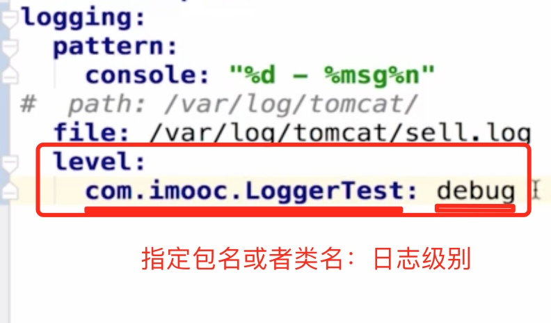


## 6. 自定义日志配置

根据不同的日志系统，你可以按如下规则组织配置文件名，就能被正确加载：

- Logback：`logback-spring.xml, logback-spring.groovy, logback.xml, logback.groovy`
- Log4j：`log4j-spring.properties, log4j-spring.xml, log4j.properties, log4j.xml`
- Log4j2：`log4j2-spring.xml, log4j2.xml`
- JDK (Java Util Logging)：`logging.properties`

`Spring Boot`官方推荐优先使用带有`-spring`的文件名作为你的日志配置（如使用`logback-spring.xml`，而不是`logback.xml`），命名为`logback-spring.xml`的日志配置文件，`spring boot`可以为它添加一些`spring boot`特有的配置项（下面会提到）。

默认的命名规则，并且放在 `src/main/resources` 下面即可

如果你即想完全掌控日志配置，但又不想用`logback.xml`作为`Logback`配置的名字，`application.yml`可以通过`logging.config`属性指定自定义的名字：

```yml
logging.config=classpath:logging-config.xml
```

虽然一般并不需要改变配置文件的名字，但是如果你想针对不同运行时`Profile`使用不同的日志配置，这个功能会很有用。

一般不需要这个属性，而是直接在`logback-spring.xml`中使用`springProfile`配置，不需要`logging.config`指定不同环境使用不同配置文件。`springProfile`配置在下面介绍。


**根节点\<configuration>包含的属性**

- scan:当此属性设置为`true`时，配置文件如果发生改变，将会被重新加载，默认值为`true`。
- scanPeriod:设置监测配置文件是否有修改的时间间隔，如果没有给出时间单位，默认单位是毫秒。当`scan`为`true`时，此属性生效。默认的时间间隔为1分钟。
- debug:当此属性设置为`true`时，将打印出`logback`内部日志信息，实时查看`logback`运行状态。默认值为`false`。

根节点`<configuration>`有5个子节点，下面一一会详细介绍。

### 1. 子节点一 `<root>`

root节点是必选节点，用来指定最基础的日志输出级别，只有一个level属性。

level:用来设置打印级别，大小写无关：TRACE, DEBUG, INFO, WARN, ERROR, ALL 和 OFF，不能设置为INHERITED或者同义词NULL。

默认是DEBUG。

可以包含零个或多个元素，标识这个appender将会添加到这个loger。

```xml
<root level="debug">
  <appender-ref ref="console" />
  <appender-ref ref="file" />
</root>
```


### 2. 子节点二：`<contextName>` 设置上下文名称

每个logger都关联到logger上下文，默认上下文名称为“default”。但可以使用设置成其他名字，用于区分不同应用程序的记录。一旦设置，不能修改,可以通过`%contextName`来打印日志上下文名称，一般来说我们不用这个属性，可有可无。

```xml
<contextName>logback</contextName>
```

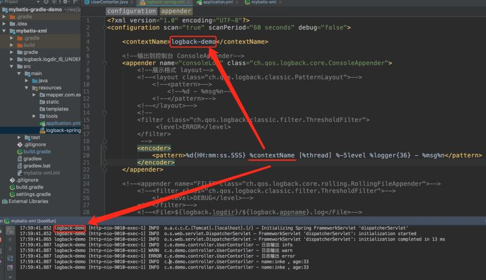


### 3. 子节点三：`<property>` 设置变量

用来定义变量值的标签， 有两个属性，name和value；其中name的值是变量的名称，value的值时变量定义的值。通过定义的值会被插入到logger上下文中。定义变量后，可以使“${}”来使用变量。

```xml
<property name="logback.logdir" value="/Users/inke/dev/log/tomcat"/>
<property name="logback.appname" value="app"/>
```

这里可以看后通过 application.yml 传递参数过来。


### 4. 子节点四：`<appender>`

appender用来格式化日志输出节点，有俩个属性name和class，class用来指定哪种输出策略，常用就是控制台输出策略和文件输出策略。

控制台输出`ConsoleAppender`：

- 示例一：

```
<?xml version="1.0" encoding="UTF-8"?>
<configuration scan="true" scanPeriod="60 seconds" debug="false">
 
    <contextName>logback-demo</contextName>
 
    <!--输出到控制台 ConsoleAppender-->
    <appender name="consoleLog1" class="ch.qos.logback.core.ConsoleAppender">
        <!--展示格式 layout-->
        <layout class="ch.qos.logback.classic.PatternLayout">
            <pattern>%d -1 %msg%n</pattern>
        </layout>
    </appender>
 
    <!--输出到控制台 ConsoleAppender-->
    <appender name="consoleLog2" class="ch.qos.logback.core.ConsoleAppender">
        <encoder>
            <pattern>%d -2 %msg%n</pattern>
        </encoder>
    </appender>
 
    <!--指定最基础的日志输出级别-->
    <root level="INFO">
        <!--appender将会添加到这个loger-->
        <appender-ref ref="consoleLog1"/>
        <appender-ref ref="consoleLog2"/>
    </root>
 
</configuration>
```


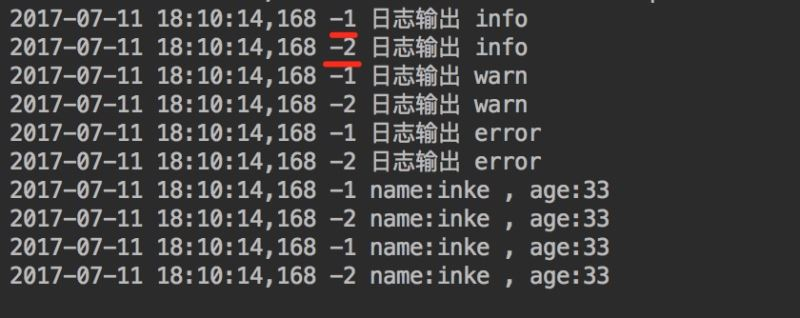

可以看到`layout`和`encoder`，都可以将事件转换为格式化后的日志记录，但是控制台输出使用`layout`，文件输出使用`encoder`，具体原因可以看[http://blog.csdn.net/cw_hello1/article/details/51969554](https://link.jianshu.com/?t=http://blog.csdn.net/cw_hello1/article/details/51969554)


- 示例二：

```xml
<?xml version="1.0" encoding="UTF-8"?>
<configuration scan="true" scanPeriod="60 seconds" debug="false">
 
    <contextName>logback-demo</contextName>
 
    <!--输出到控制台 ConsoleAppender-->
    <appender name="consoleLog1" class="ch.qos.logback.core.ConsoleAppender">
        <!--展示格式 layout-->
        <layout class="ch.qos.logback.classic.PatternLayout">
            <pattern>
                <pattern>%d{HH:mm:ss.SSS} %contextName [%thread] %-5level %logger{36} - %msg%n</pattern>
            </pattern>
        </layout>
        <!--
        <filter class="ch.qos.logback.classic.filter.ThresholdFilter">
             <level>ERROR</level>
        </filter>
         -->
    </appender>
 
    <!--指定最基础的日志输出级别-->
    <root level="INFO">
        <!--appender将会添加到这个loger-->
        <appender-ref ref="consoleLog1"/>
        <appender-ref ref="consoleLog2"/>
    </root>
</configuration>
```

输出日志：

```
18:15:22.148 logback-demo [http-nio-9010-exec-1] INFO c.e.demo.controller.UserContorller - 日志输出 info
18:15:22.148 logback-demo [http-nio-9010-exec-1] WARN c.e.demo.controller.UserContorller - 日志输出 warn
18:15:22.148 logback-demo [http-nio-9010-exec-1] ERROR c.e.demo.controller.UserContorller - 日志输出 error
18:15:22.148 logback-demo [http-nio-9010-exec-1] INFO c.e.demo.controller.UserContorller - name:inke , age:33
18:15:22.149 logback-demo [http-nio-9010-exec-1] INFO c.e.demo.controller.UserContorller - name:inke , age:33
```


`<encoder>`表示对日志进行编码：

- %d{HH: mm:ss.SSS}——日志输出时间
- %thread——输出日志的进程名字，这在Web应用以及异步任务处理中很有用
- %-5level——日志级别，并且使用5个字符靠左对齐
- %logger{36}——日志输出者的名字
- %msg——日志消息
- %n——平台的换行符
  ThresholdFilter为系统定义的拦截器，例如我们用ThresholdFilter来过滤掉ERROR级别以下的日志不输出到文件中。如果不用记得注释掉，不然你控制台会发现没日志~


输出到文件 `RollingFileAppender`

另一种常见的日志输出到文件，随着应用的运行时间越来越长，日志也会增长的越来越多，将他们输出到同一个文件并非一个好办法。`RollingFileAppender`用于切分文件日志：

```xml
<appender name="fileInfoLog" class="ch.qos.logback.core.rolling.RollingFileAppender">
    <!--如果只是想要 Info 级别的日志，只是过滤 info 还是会输出 Error 日志，因为 Error 的级别高，
    所以我们使用下面的策略，可以避免输出 Error 的日志-->
    <filter class="ch.qos.logback.classic.filter.LevelFilter">
        <!--过滤 Error-->
        <level>ERROR</level>
        <!--匹配到就禁止-->
        <onMatch>DENY</onMatch>
        <!--没有匹配到就允许-->
        <onMismatch>ACCEPT</onMismatch>
    </filter>
    <!--日志名称，如果没有File 属性，那么只会使用FileNamePattern的文件路径规则
        如果同时有<File>和<FileNamePattern>，那么当天日志是<File>，明天会自动把今天
        的日志改名为今天的日期。即，<File> 的日志都是当天的。
    -->
    <File>${logback.logdir}/info.${logback.appname}.log</File>
    <!--滚动策略，按照时间滚动 TimeBasedRollingPolicy-->
    <rollingPolicy class="ch.qos.logback.core.rolling.TimeBasedRollingPolicy">
        <!--文件路径,定义了日志的切分方式——把每一天的日志归档到一个文件中,以防止日志填满整个磁盘空间-->
        <FileNamePattern>${logback.logdir}/info.${logback.appname}.%d{yyyy-MM-dd}.log</FileNamePattern>
        <!--只保留最近90天的日志-->
        <maxHistory>90</maxHistory>
        <!--用来指定日志文件的上限大小，那么到了这个值，就会删除旧的日志-->
        <!--<totalSizeCap>1GB</totalSizeCap>-->
    </rollingPolicy>
    <!--日志输出编码格式化-->
    <encoder>
        <charset>UTF-8</charset>
        <pattern>%d [%thread] %-5level %logger{36} %line - %msg%n</pattern>
    </encoder>
</appender>
 
 
<appender name="fileErrorLog" class="ch.qos.logback.core.rolling.RollingFileAppender">
    <!--如果只是想要 Error 级别的日志，那么需要过滤一下，默认是 info 级别的，ThresholdFilter-->
    <filter class="ch.qos.logback.classic.filter.ThresholdFilter">
        <level>Error</level>
    </filter>
    <!--日志名称，如果没有File 属性，那么只会使用FileNamePattern的文件路径规则
        如果同时有<File>和<FileNamePattern>，那么当天日志是<File>，明天会自动把今天
        的日志改名为今天的日期。即，<File> 的日志都是当天的。
    -->
    <File>${logback.logdir}/error.${logback.appname}.log</File>
    <!--滚动策略，按照时间滚动 TimeBasedRollingPolicy-->
    <rollingPolicy class="ch.qos.logback.core.rolling.TimeBasedRollingPolicy">
        <!--文件路径,定义了日志的切分方式——把每一天的日志归档到一个文件中,以防止日志填满整个磁盘空间-->
        <FileNamePattern>${logback.logdir}/error.${logback.appname}.%d{yyyy-MM-dd}.log</FileNamePattern>
        <!--只保留最近90天的日志-->
        <maxHistory>90</maxHistory>
        <!--用来指定日志文件的上限大小，那么到了这个值，就会删除旧的日志-->
        <!--<totalSizeCap>1GB</totalSizeCap>-->
    </rollingPolicy>
    <!--日志输出编码格式化-->
    <encoder>
        <charset>UTF-8</charset>
        <pattern>%d [%thread] %-5level %logger{36} %line - %msg%n</pattern>
    </encoder>
</appender>
```

如果同时有`<File>`和`<FileNamePattern>`，根据日期分割日志，代码注释写的很清楚了。


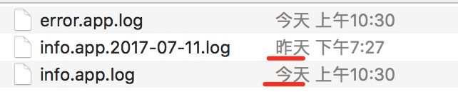

### 5. 子节点五`<loger>`

`<loger>`用来设置某一个包或者具体的某一个类的日志打印级别、以及指定`<appender>`。`<loger>`仅有一个`name`属性，一个可选的`level`和一个可选的`addtivity`属性。

- `name`:用来指定受此loger约束的某一个包或者具体的某一个类。
- `level`:用来设置打印级别，大小写无关：TRACE, DEBUG, INFO, WARN, ERROR, ALL 和 OFF，还有一个特俗值INHERITED或者同义词NULL，代表强制执行上级的级别。如果未设置此属性，那么当前loger将会继承上级的级别。
- `addtivity`:是否向上级loger传递打印信息。默认是true。

loger在实际使用的时候有两种情况
先来看一看代码中如何使用

```java
package com.dudu.controller;
@Controller
public class LearnController {
    private Logger logger = LoggerFactory.getLogger(this.getClass());
 
    @RequestMapping(value = "/login",method = RequestMethod.POST)
    @ResponseBody
    public Map<String,Object> login(HttpServletRequest request, HttpServletResponse response){
        //日志级别从低到高分为TRACE < DEBUG < INFO < WARN < ERROR < FATAL，如果设置为WARN，则低于WARN的信息都不会输出。
        logger.trace("日志输出 trace");
        logger.debug("日志输出 debug");
        logger.info("日志输出 info");
        logger.warn("日志输出 warn");
        logger.error("日志输出 error");
        Map<String,Object> map =new HashMap<String,Object>();
        String userName=request.getParameter("userName");
        String password=request.getParameter("password");
        if(!userName.equals("") && password!=""){
            User user =new User(userName,password);
            request.getSession().setAttribute("user",user);
            map.put("result","1");
        }else{
            map.put("result","0");
        }
        return map;
    }
}
```

这是一个登录的判断的方法，我们引入日志，并且打印不同级别的日志，然后根据logback-spring.xml中的配置来看看打印了哪几种级别日志。

#### 第一种：带有`loger`的配置，不指定级别，不指定`appender`

`logback-spring.xml`增加 `loger` 配置如下：

```
<logger name="com.dudu.controller"/>
```

`<logger name="com.dudu.controller" />`将控制`controller`包下的所有类的日志的打印，但是并没用设置打印级别，所以继承他的上级的日志级别`“info”`；
没有设置`addtivity`，默认为true，将此`loger`的打印信息向上级传递；
没有设置`appender`，此`loger`本身不打印任何信息。
`<root level="info">`将`root`的打印级别设置为`“info”`，指定了名字为`“console”`的`appender`。

当执行`com.dudu.controller.LearnController`类的`login`方法时，`LearnController` 在包com.dudu.controller中，所以首先执行`<logger name="com.dudu.controller"/>`，将级别为`“info”`及大于`“info”`的日志信息传递给`root`，本身并不打印；
`root`接到下级传递的信息，交给已经配置好的名为“console”的`appender`处理，`“console”` `appender` 将信息打印到控制台；

打印结果如下：

```
16:00:17.407 logback [http-nio-8080-exec-8] INFO  com.dudu.controller.LearnController - 日志输出 info
16:00:17.408 logback [http-nio-8080-exec-8] WARN  com.dudu.controller.LearnController - 日志输出 warn
16:00:17.408 logback [http-nio-8080-exec-8] ERROR com.dudu.controller.LearnController -
```


#### 第二种：带有多个`loger`的配置，指定级别，指定`appender`

`logback-spring.xml`增加 `loger` 配置如下：

```xml
<configuration>
    ...
    
    <!--logback.LogbackDemo：类的全路径 -->
    <logger name="com.dudu.controller.LearnController" level="WARN" additivity="false">
        <appender-ref ref="console"/>
    </logger>
</configuration>
```

控制`com.dudu.controller.LearnController`类的日志打印，打印级别为“`WARN`”;
`additivity`属性为`false`，表示此`loger`的打印信息不再向上级传递;
指定了名字为“`console`”的`appender`;

这时候执行`com.dudu.controller.LearnController`类的login方法时，先执行`<logger name="com.dudu.controller.LearnController" level="WARN" additivity="false">`,将级别为“`WARN`”及大于“WARN”的日志信息交给此`loger`指定的名为“`console`”的`appender`处理，在控制台中打出日志，不再向上级`root`传递打印信息。

打印结果如下：

```
16:00:17.408 logback [http-nio-8080-exec-8] WARN  com.dudu.controller.LearnController - 日志输出 warn
16:00:17.408 logback [http-nio-8080-exec-8] ERROR com.dudu.controller.LearnController - 日志输出 error
```


当然如果你把`additivity="false"`改成`additivity="true"`的话，就会打印两次，因为打印信息向上级传递，logger本身打印一次，root接到后又打印一次。

**注意：范围有重叠的话，范围小的，有效。**

```xml
<configuration>
 ...
 <logger name="com.example.demo.controller" level="WARN" additivity="false">
 <appender-ref ref="consoleLog"/>
 </logger>
 <logger name="com.example.demo.controller"/>
 <logger name="com.example.demo"/>
</configuration>
```

多环境日志输出

```xml
<configuration>
    ...
    
    <!-- 测试环境+开发环境. 多个使用逗号隔开. -->
    <springProfile name="test,dev">
        <logger name="com.example.demo.controller" level="DEBUG" additivity="false">
            <appender-ref ref="consoleLog"/>
        </logger>
    </springProfile>
    
    <!-- 生产环境. -->
    <springProfile name="prod">
        <logger name="com.example.demo.controller" level="INFO" additivity="false">
            <appender-ref ref="consoleLog"/>
        </logger>
    </springProfile>
</configuration>
```

application.yml`增加环境选择的配置`active: dev

```
server:
  port: 9010
 
spring:
  profiles:
    active: dev
  datasource:
    url: jdbc:mysql://localhost:3306/test?characterEncoding=utf8
    username: root
    password: root
 
mybatis:
    type-aliases-package: org.larry.springboot.entity
    mapper-locations: classpath:mapper/**/*.xml
    check-config-location: true
```


## 7. 指定包或类输出至单独的日志文件中

`application.yml`增加日志相关自定义配置

```yml
logback:
  logdir: /Users/inke/dev/log/tomcat/sell
  appname: sell
```

在`logback-spring.xml`

```xml
<!-- 配置job日志输出至单独的日志文件中 -->
    <appender name="JOB_LOG" class="ch.qos.logback.core.rolling.RollingFileAppender">
        <rollingPolicy class="ch.qos.logback.core.rolling.TimeBasedRollingPolicy">
            <!--日志文件输出的文件名-->
            <FileNamePattern>${LOG_HOME}/job/job.log.%d{yyyy-MM-dd}.log</FileNamePattern>
            <MaxHistory>30</MaxHistory>
        </rollingPolicy>
        <encoder
                class="ch.qos.logback.core.encoder.LayoutWrappingEncoder">
            <!-- 日志输出编码 -->
            <layout class="ch.qos.logback.classic.PatternLayout">
                <!--格式化输出：%d表示日期，%thread表示线程名，%-5level：级别从左显示5个字符宽度%msg：日志消息，%n是换行符-->
                <pattern>%d{yyyy-MM-dd HH:mm:ss.SSS} [%thread] %-5level %logger{50} - %msg%n
                </pattern>
            </layout>
        </encoder>
        <!--日志文件最大的大小-->
        <triggeringPolicy class="ch.qos.logback.core.rolling.SizeBasedTriggeringPolicy">
            <MaxFileSize>10MB</MaxFileSize>
        </triggeringPolicy>
    </appender>
    
    <!--需要将日志单独输出的包路径-->
    <logger name="com.nx.web.task" additivity="false">
        <appender-ref ref="JOB_LOG"/>
    </logger>
 
 
    <!-- 日志输出级别 -->
    <root level="DEBUG">
        <appender-ref ref="STDOUT" />
        <!-- 将我们新增的配置添加进root中统一设置输出级别 -->
        <appender-ref ref="JOB_LOG" />
    </root>
```


