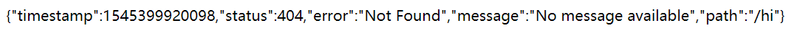
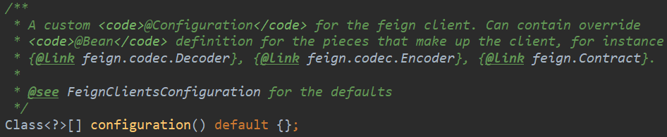
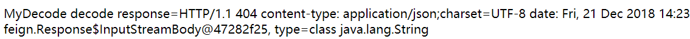

# @FeignClient注解详解

在我们的工作中, jenkins，git，安全对接，质量对接全部是feigen, 自己刚看到这个的时候, 还是懵逼的不行, 可能没怎么当过老司机, 趁着晚上, 自己赶紧脑部一下吧.

# 1. @FeignClient注解源码

FeignClient注解被@Target(ElementType.TYPE)修饰，表示FeignClient注解的作用目标在接口上。源码如下：

```java
@Target(ElementType.TYPE)
@Retention(RetentionPolicy.RUNTIME)
@Documented
public @interface FeignClient {
    @AliasFor("name")
    String value() default "";
    @Deprecated
    String serviceId() default "";
    @AliasFor("value")
    String name() default "";
    String qualifier() default "";
    String url() default "";
    boolean decode404() default false;
    Class<?>[] configuration() default {};
    Class<?> fallback() default void.class;
    Class<?> fallbackFactory() default void.class;
    String path() default "";
    boolean primary() default true;
}
```

声明接口之后，在代码中通过@Resource注入之后即可使用。@FeignClient标签的常用属性下面将逐一详解.

# 2. name, value和serviceId

从源码可以得知，name是value的别名，value也是name的别名。两者的作用是一致的，name指定FeignClient的名称，如果项目使用了Ribbon，name属性会作为微服务的名称，用于服务发现。

其中，serviceId和value的作用一样，用于指定服务ID，已经废弃。

实例：下面通过name或者value指定服务名，然后根据服务名调用hi或getDate服务。

```java
@FeignClient(name = "service-hi")
public interface SchedualServiceHi1 {
  
  @RequestMapping(value = "/app/service/hi", method = RequestMethod.GET)
  String sayHiFromClientOne(@RequestParam(value = "name") String name);
  
  @RequestMapping(value = "/app/service/getDate", method = RequestMethod.GET)
  String getDate();
}
```


# 3. qualifier

该属性用来指定@Qualifier注解的值, 该值是该FeignClient的限定词, 可以使用该值进行引用, 实例如下:

```java
@FeignClient(qualifier = "mySchedualService", name = "service-hi", path = "/app/service")
public interface SchedualServiceHi5 {
  
  @RequestMapping(value = "/hi", method = RequestMethod.GET)
  String sayHiFromClientOne(@RequestParam(value = "name") String name);
  
  @RequestMapping(value = "/getDate", method = RequestMethod.GET)
  String getDate();
}
```

客户端使用"mySchedualService"标识注入服务. 代码如下:

```java
@RestController
@RequestMapping("/demo5")
public class HiController5 {
  @AutoWired
  @Qualifier("mySchedualService")
  private SchedualServiceHi5 schedualServiceHi;
}
```

# 4. url

url属性一般用于调式程序, 允许我们手动指定@FeignClient调用的地址.实例:

```java
@FeignClient(value = "service-hi", path = "/app/service", url = "http://localhost:8762")
public interface SchedualServiceHi3 {
  @RequestMapping(value = "/hi", method = RequestMethod.GET)
  String sayHiFromClientOne(@RequestParam(value = "name") String name);
  
  @RequestMapping(value = "/getDate", method = RequestMethod.GET)
  String getDate();
}
```

上面指定服务调用的地址为: http://localhost:8762

# 5. decode404

当发生http 404错误时，如果该字段位true，会调用decoder进行解码，否则抛出FeignException。

实例：下面代码去访问一个在服务“service-hi”上面没有的服务/hi（服务实际地址为：/app/service/hi），代码如下：

```java
@FeignClient(value = "service-hi")
public interface SchedualServiceHi6 {
  // 正确的服务地址为: /app/servcie/hi
  @RequestMapping(value = "/hi", method = RequestMethod.GET)
  String sayHiFromClientOne(@RequestParam(value = "name") String name);
}
```

调用上面的sayHiFromClientOne()方法时, Spring Boot将给出如下的报错信息:


为了在调用服务抛出404错误时，返回一些有用的信息。我们可以将decode404参数设置为true。代码如下：

```java
@FeignClient(value = "service-hi", decode404 = true)
public interface SchedualServiceHi6 {
  // 正确的服务地址为: /app/servcie/hi
  @RequestMapping(value = "/hi", method = RequestMethod.GET)
  String sayHiFromClientOne(@RequestParam(value = "name") String name);
}
```

此时调用sayHiFromClientOne()方法时，返回如下错误信息：



设置decode404=true，需要通过设置configuration去配置decode。configuration的源码如下：



通过源码得知，默认情况下使用FeignClientsConfiguration类，其中Decoder默认使用SpringDecoder。FeignClientsConfiguration部分源代码如下：

```java
@Bean
@ConditionalOnMissingBean
public Decoder feignDecoder() {
  return new ResponseEntityDecoder(new SpringDecode(this.messageConverters));
}
```

# 6. configuration

Feign配置类, 可以自定义Feign的Encoder. Decoder, LogLevel. Contract.

实例: 自定义configuration配置类, 简单的定义一个自己的Decoder, 该Decoder配合decod404=true使用, 当服务调用抛出404错误时, 将自动调用自定义的Decoder, 输出一个简单的字符串. 代码如下:

1. 定义一个Controller, 提供给一个REST服务/hi, 如下:

```java
@RestController
@RequestMapping("/demo7")
public class HiController7 {
  @Autowired
  pirvate SchedualServiceHi7 schedualServiceHi7;
  
  @RequestMapping(value = "/hi", method = RequestMethod.GET)
  public String sayHi(@RequestParam String name) {
    return schedualServiceHi.sayHiFromClientOne(name);
  }
}
```

2. 编写FeignClient类SchedualServiceHi7, 代码如下:

```java
@FeignClient(value = "service-hi", decode404 = true, configuration = Myconfiguration.class)
public interface SchedualServiceHi7 {
  // 正确服务地址: /app/service/hi
  @RequestMapping(value = "/hi", method = RequestMethod.GET)
  String sayHiFromClientOne(@RequestParam(value = "name") String name);
}
```

3. 编写MyConfiguratioin配置类, 代码如下:

```java
@Configuration
public class MyConfiguration {
  @Bean
  @ConditionalOnMissingBean
  public Decoder feignDecoder() {
    return new MyDecoder();
  }
}
```

4. 编写自定义的Decoder类MyDecoder. 代码如下:

```java
public class MyDecoder implements Decoder {
  @Overrider
  public Object decode(Response rsponse, Type type) throws IOException, DecoderException, FeignException {
    return "MyDecode decode response = " + response + ", type = " + type;
  }
}
```

当你调用服务/hi发生404时，输出如下信息：

