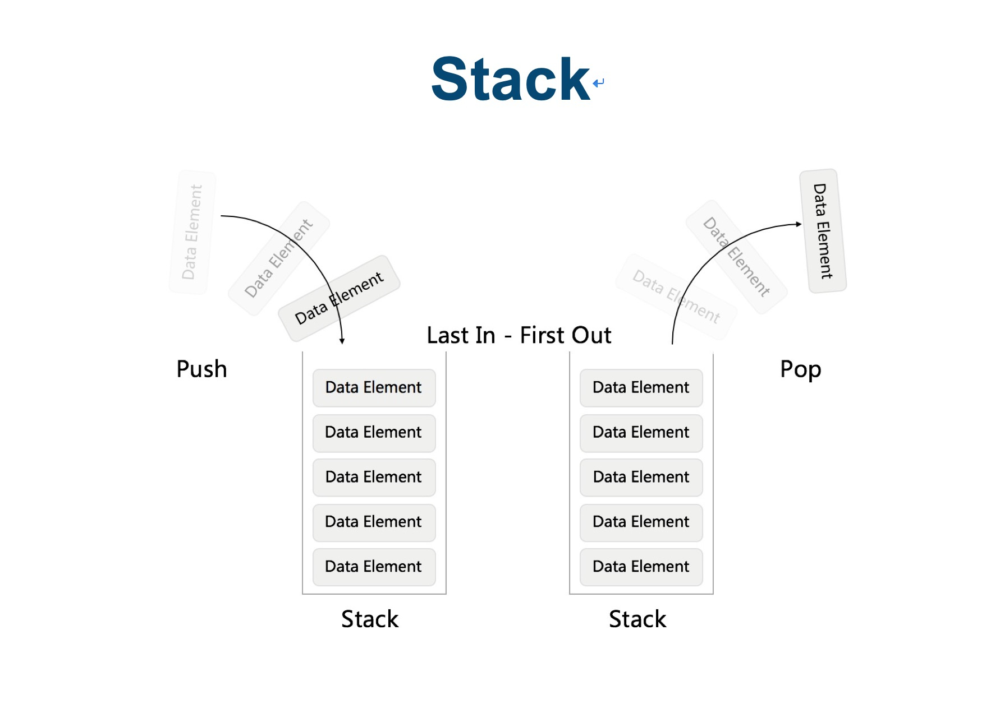
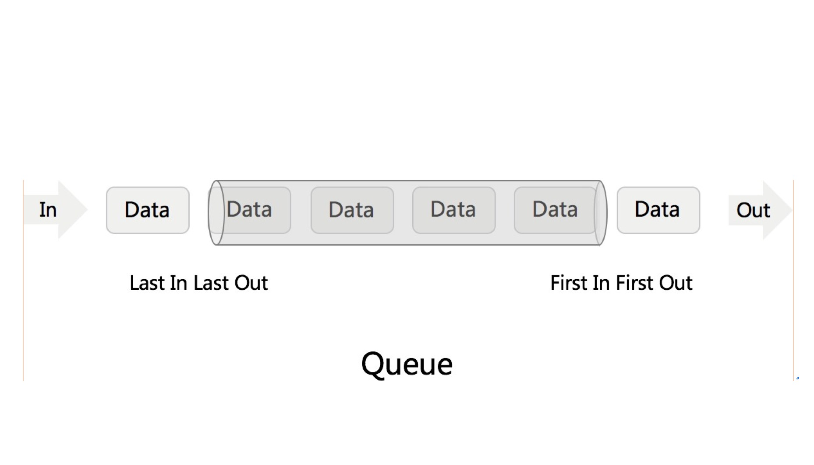

# 堆栈， 队列

# 1. 什么是Stack？

stack就是堆栈， 存放数据的特点就是先进后出



# 2. 栈在python和java的使用方式

其实我们使用的这些数据结构， 在我们的开发语言中， 都给我们准备好了， 我们直接使用就可以了

- java

```
Stack<Integer> statck = new Stack();
```

- python

```python

```


# 3. 什么是Queue?

数据的存放特点就是： 先进先出

