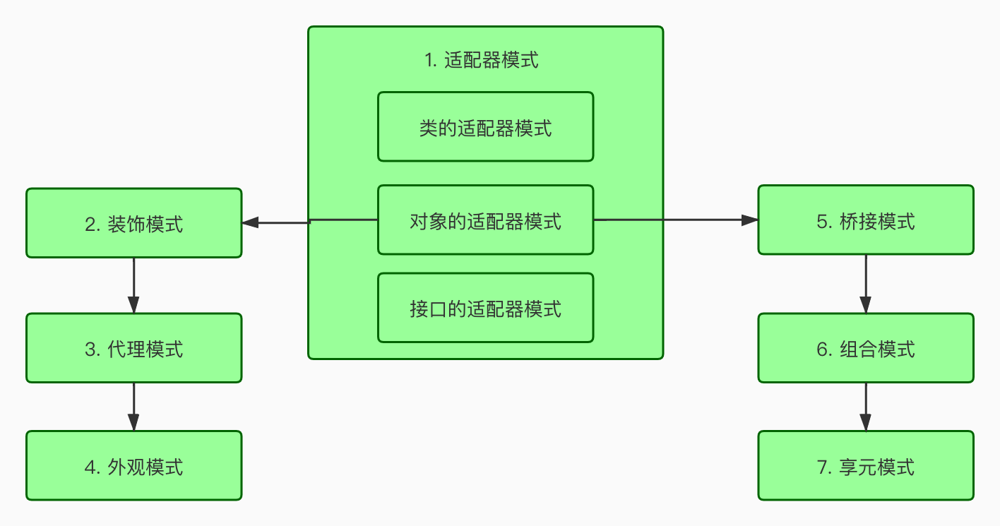

# 设计模式

# 1. 设计模式概述

- 设计模式(Design pattern)代表了最佳的实践, 通常被有经验的面向对象的软件开发人员采用
- 设计模式是软件开发人员在软件开发过程中面临的一般问题的解决方案, 这些解决方案是众多软件开发人员经常相对长一段时间的试验和错误总结出来的.
- 设计模式是一套被反复使用, 多数人知晓, 经过分类编码,代码设计经验的总结, 使用设计模式是为了可重复代码, 让代码更加被他人理解, 保证代码可靠性
- 设计模式不是一种方法和技术, 而是一种思想
- 设计模式和具体的语言无关, 学习设计模式就是要建立面向对象的思想, 尽可能的面向接口编程, 低耦合, 高内聚, 使设计的程序可复用
- 学习设计模式能够促进对面向对象思想的理解, 反之亦然, 他们相辅相成

# 2. 设计模式的类型

总体来说, 设计模式分为三类23种:

- 创建型(5种): 工厂模式, 抽象工厂模式, 单例模式, 原型模式, 构建者模式
- 结构性(7种): 适配器模式, 装饰模式, 代理模式, 外观模式, 桥接模式, 组合模式, 享元模式
- 行为型(11种): 模板方法模式, 策略模式, 观察者模式, 中介者模式, 状态模式, 责任模式, 命令模式, 迭代器模式, 访问者模式, 解释器模式, 备忘录模式

# 3. 创建型设计模式

## 1. 简单工厂模式

### 1. 介绍

工厂类拥有一个工厂方法(create), 接受了一个参数, 通过不同的参数实例化不同的产品类

### 2. 图示


### 3. 优缺点:

- **优点**
  - 很明显, 简单工厂的特点就是"简单粗暴", 通过一个含参数的工厂方法, 我们可以实例化任何产品类, 上至飞机火箭, 下至土豆面条, 无所不能
  - 所有简单工厂有一个别名: 上帝类
- 缺点:
  - 人呢和"东西"的子类都可以被生产, 负担太重了, 当所要生产产品类非常多时, 工厂方法的代码量可能会很庞大
  - 在遵循开闭原则的条件下, 简单工厂对于增加新的产品, 无能为力, 因为增加新产品只能通过修改工厂方法来实现

工厂方法正好可以解决简单工厂的这两个缺点

> 小提示: spring中是通过配置文件和反射解决简单工厂中的缺点.

### 4. 示例:

- 普通-简单工厂

```java
public class AnimalFactory { 
  //简单工厂设计模式(负担太重、不符合开闭原则)
  public static Animal createAnimal(String name){
    if ("cat".equals(name)) {
        return new Cat();
    }else if ("dog".equals(name)) {
        return new Dog();
    }else if ("cow".equals(name)) {
        return new Dog();
    }else{
        return null;
    }
  }
}
```

- 静态方法工厂

```java
//该简单工厂，也称为静态方法工厂 
public class AnimalFactory2 {
    public static Dog createDog(){
        return new Dog();
}
    public static Cat createCat(){
        return new Cat();
} }
```

### 本质:

简单工厂的本质, 简单工厂不够灵活, 没增加一种新的类型, 都需要更改方法具体的实现内容, 很不友好.

## 2. 工厂方法模式

### 1. 介绍

工厂方法时针对每一种产品提供一个工厂类

通过不同的工厂实例来创建不同的产品实例

### 2. 图示


### 3. 优缺点

**优先: **

- 工厂方法模式就很好的减轻了工厂类的负担, 把某一类/某一种东西交由一个工厂生产;(对应简单工厂的缺点)
- 同事增加某一类"东西"并不需要修改工厂类, 只需要添加生产这类"东西"的工厂即可, 使的工厂类符合开发-关闭原则

**缺单:**

- 对于某些可以形成产品族(一组产品)的情况处理比较复杂

### 4. 示例

- 抽象出来的工厂对象

```java
// 抽象出来的动物工厂----它只负责生产一种产品 
public abstract class AnimalFactory {
// 工厂方法
    public abstract Animal createAnimal();
}
```

- 工具的工厂对象1

```java
// 具体的工厂实现类
public class CatFactory extends AnimalFactory {
@Override
    public Animal createAnimal() {
        return new Cat();
} }
```

- 工具的工厂对象2

```java
//具体的工厂实现类
public class DogFactory extends AnimalFactory {
@Override
    public Animal createAnimal() {
        return new Dog();
} }
```

### 本质:

工厂方法模式, 底层使用的是定义一个抽象类和抽象的方法, 那具体的一类的方法, 指定给一个具体的类去生产, 需要什么, 自己开发什么, 并不需要修改工厂类, 符合开闭原则

## 3. 抽象工厂模式

### 1. 介绍

- 抽象工厂是应对产品族概念的
- 上边的工厂方法模式是一种极端情况的抽象工厂模式(即只生产一种产品的抽象工厂模式), 而抽象工厂模式可以看成是工厂方法模式的一种推广

上面的工厂方法, 一个工厂只能生产一种产品, 所有有了抽象工厂模式, 用来在一个具体的工厂中生产多个产品, 既然多了一个产品, 就需要新增也给产品的接口, 同样我们依然需要简单工厂中的产品.

1. 我们需要在包中新增加一个产品：水，具体的产品有：苏打水，矿泉水，接口如下

```java
package com.only.abstractfactory;

public interface Water {
    void name();
}
```

2. 两个新增的具体化的产品

矿泉水

```java
package com.only.abstractfactory;

public class WaterA implements Water{
    @Override
    public void name() {
        System.out.println("矿泉水");
    }
}
```

苏打水

```java
package com.only.abstractfactory;

public class WaterB implements Water{
    @Override
    public void name() {
        System.out.println("苏打水");
    }
}
```

3. 因为以前的工厂只能生产一种产品, 所以我们就需要另一个抽象的工厂类, 这个工厂类既可以生产瓶子, 又可以生产水

```java
package com.only.abstractfactory;

import com.only.simplefactory.Bottle;

abstract public class AbstractFactory {
    abstract public Bottle createBottle();
    abstract public Water createWater();
}
```

4. 但每个具体的工厂，可能生产不同的水和瓶子

A工厂生产塑料瓶 和 矿泉水

```java
package com.only.abstractfactory;

import com.only.simplefactory.Bottle;
import com.only.simplefactory.BottleA;

public class AbstractFactoryA extends AbstractFactory{
    @Override
    public Bottle createBottle() {
        return new BottleA();
    }
    @Override
    public Water createWater() {
        return new WaterA();
    }
}
```

B工厂生产玻璃瓶和苏打水

```java
package com.only.abstractfactory;

import com.only.simplefactory.Bottle;
import com.only.simplefactory.BottleB;

public class AbstractFactoryB extends AbstractFactory{
    @Override
    public Bottle createBottle() {
        return new BottleB();
    }
    @Override
    public Water createWater() {
        return new WaterB();
    }
}
```

### 2. 图示


### 3. 工厂模式区别

- 简单工厂: 使用一个工厂对象用来生产同一等级架构中的任意产品(不支持扩展增加产品)
- 工厂方法: 使用多个工厂对象用来生产同一等级结构中对应的固定产品. (支持扩展增加产品)
- 抽象方法:  使用多个工厂对象用来生产不同产品品族的全部产品(不支持扩展新增产品; 支持增加品族)

### 本质: 

抽象工厂模式我自己感觉是从工厂模式中分类出来, 把多个工厂进行组合, 把多个工厂抽象出来, 可以让不同的工厂去生产不同的产品, 抽象出来,就是一种思想, 可以让一个抽象工厂生产不同工厂的不同产品

## 4. 单例模式(面试)

### 1. 介绍

单例对象(Singleton)是一种常用的设计模式。在Java应用中，单例对象能保证在一个JVM中，该对象只有一个实 例存在。这样的模式有几个好处:

1、某些类创建比较频繁，对于一些大型的对象，这是一笔很大的系统开销。 

2、省去了new操作符，降低了系统内存的使用频率，减轻GC压力。

### 2. 示例

#### 1. 懒汉式，线程不安全

这种方式是最基本的实现方式，这种实现最大的问题就是不支持多线程。因为没有加锁 synchronized，所以严格意义上它并不算单例模式。
这种方式 lazy loading 很明显，不要求线程安全，在多线程不能正常工作。

```java
public class Singleton {  
    private static Singleton instance;  
    private Singleton (){}  
  
    public static Singleton getInstance() {  
    if (instance == null) {  
        instance = new Singleton();  
    }  
    return instance;  
    }  
}
```

#### 2. 懒汉式，线程安全

这种方式具备很好的 lazy loading，能够在多线程中很好的工作，但是，效率很低，99% 情况下不需要同步。
优点：第一次调用才初始化，避免内存浪费。
缺点：必须加锁 synchronized 才能保证单例，但加锁会影响效率。
getInstance() 的性能对应用程序不是很关键（该方法使用不太频繁）。

```java
public class Singleton {  
    private static Singleton instance;  
    private Singleton (){}  
    public static synchronized Singleton getInstance() {  
    if (instance == null) {  
        instance = new Singleton();  
    }  
    return instance;  
    }  
}
```

#### 3. 饿汉式

这种方式比较常用，但容易产生垃圾对象。
优点：没有加锁，执行效率会提高。
缺点：类加载时就初始化，浪费内存。
它基于 classloader 机制避免了多线程的同步问题，不过，instance 在类装载时就实例化，虽然导致类装载的原因有很多种，在单例模式中大多数都是调用 getInstance 方法， 但是也不能确定有其他的方式（或者其他的静态方法）导致类装载，这时候初始化 instance 显然没有达到 lazy loading 的效果。

```java
public class Singleton {  
    private static Singleton instance = new Singleton();  
    private Singleton (){}  
    public static Singleton getInstance() {  
    return instance;  
    }  
}
```

#### 4、双检锁/双重校验锁（DCL，即 double-checked locking）

这种方式采用双锁机制，安全且在多线程情况下能保持高性能。
getInstance() 的性能对应用程序很关键。

```java
public class Singleton {  
    private volatile static Singleton singleton;  
    private Singleton (){}  
    public static Singleton getSingleton() {  
    if (singleton == null) {  
        synchronized (Singleton.class) {  
        if (singleton == null) {  
            singleton = new Singleton();  
        }  
        }  
    }  
    return singleton;  
    }  
}
```

#### 5. 登记式/静态内部类

这种方式能达到双检锁方式一样的功效，但实现更简单。对静态域使用延迟初始化，应使用这种方式而不是双检锁方式。这种方式只适用于静态域的情况，双检锁方式可在实例域需要延迟初始化时使用。
这种方式同样利用了 classloader 机制来保证初始化 instance 时只有一个线程，它跟第 3 种方式不同的是：第 3 种方式只要 Singleton 类被装载了，那么 instance 就会被实例化（没有达到 lazy loading 效果），而这种方式是 Singleton 类被装载了，instance 不一定被初始化。因为 SingletonHolder 类没有被主动使用，只有通过显式调用 getInstance 方法时，才会显式装载 SingletonHolder 类，从而实例化 instance。想象一下，如果实例化 instance 很消耗资源，所以想让它延迟加载，另外一方面，又不希望在 Singleton 类加载时就实例化，因为不能确保 Singleton 类还可能在其他的地方被主动使用从而被加载，那么这个时候实例化 instance 显然是不合适的。这个时候，这种方式相比第 3 种方式就显得很合理。

```java
public class Singleton {  
    private static class SingletonHolder {  
    private static final Singleton INSTANCE = new Singleton();  
    }  
    private Singleton (){}  
    public static final Singleton getInstance() {  
    return SingletonHolder.INSTANCE;  
    }  
}
```

#### 6. 枚举

这种实现方式还没有被广泛采用，但这是实现单例模式的最佳方法。它更简洁，自动支持序列化机制，绝对防止多次实例化。
这种方式是 Effective Java 作者 Josh Bloch 提倡的方式，它不仅能避免多线程同步问题，而且还自动支持序列化机制，防止反序列化重新创建新的对象，绝对防止多次实例化。不过，由于 JDK1.5 之后才加入 enum 特性，用这种方式写不免让人感觉生疏，在实际工作中，也很少用。
不能通过 reflection attack 来调用私有构造方法。

```java
public enum Singleton {  
    INSTANCE;  
    public void whateverMethod() {  
    }  
}
```

### 本质:

双重加锁的机制用的是比较多的, 但是枚举应该是单例模式中最佳的实践方法.

单例模式能够保证一个类仅有唯一的实例，并提供一个全局访问点。从而达到节约资源的目的

**什么情况下使用单例模式**

单例模式也是一种比较常见的设计模式，它到底能带给我们什么好处呢？其实无非是三个方面的作用：

第一、控制资源的使用，通过线程同步来控制资源的并发访问；

第二、控制实例产生的数量，达到节约资源的目的。

第三、作为通信媒介使用，也就是数据共享，它可以在不建立直接关联的条件下，让多个不相关的两个线程或者进程之间实现通信。

## 5. 原型模式(面试)

介绍

> 原型模式虽然是创建型的模式， 但是与工厂模式没有关系， 从名字既可看出， 该模式的思想就是将一个对象作为原型， 对其进行复制， 克隆， 产生一个和原对象类似的新对象

示例

- 先创建一个原型类

```java
public class Prototype implements Cloneable {
    public Object clone() throws CloneNotSupportedException {
        Prototype proto = (Prototype) super.clone();
        return proto;
    }
}
```

> 很简单， 一个原型类， 只需要实现Cloneable接口， 复写clone方法， 此处clone方法可以改成任意的名称， 因为Cloneable接口是一个空接口， 你可以任意定义实现类的方法名， 如cloneA或者cloneB， 因为此处的重点是super.clone()这句话， super.clone()调用的Object的clone()方法， 而在Object类中， clone()是native的， 具体怎么实现， 此处不再深究
>
> 在这里， 我将结合对象的浅复制和深复制说一下， 首先需要了解对象深浅复制的概念：
>
> - 浅复制：将一个对象复制后， 基本数据类型的变量都会重新创建， 而引用类型， 指向的还是原对象所指向的。
> - 深复制：将一个对象复制后， 不论是基本数据类型还是引用类型， 都是重新创建的， 简单来说， 就是深复制进行了完全彻底的复制， 而浅复制不彻底


- 写一个深浅复制的例子

```java
public class Prototype implements Cloneable, Serializable {
    private static final long serialVersionUID = 1L;
    private String string;
    private SerializableObject obj;
    
    // 浅复制
    public Object clone() throws CloneNotSupportedException {
        Prototype proto = (Prototype) super.clone();
        return proto;
    }
    
    // 深复制
    public Object deepClone() throws IOException, ClassNotFoundException {
        // 写入当前对象的二进制流
        ByteArrayOutputStream bos = new ByteArrayOutputStream();
        ObjectOutputStream oos = new ObjectOutputStream(bos);
        oos.writeObject(this);
        // 读出二进制流产生的新对象
        ByteArrayInputStream bis = new ByteArrayInputStream(bos.toByteArray());
        ObjectInputStream ois = new ObjectInputStream(bis);
        return ois.readObject();
    }
    
    public String getString() {
        return string;
    }
    public void setString(String string) {
        this.string = string;
    }
    public SerializableObject getObj() {
        return obj;
    }
    public void setObject(SerializableObject obj) {
        this.obj = obj;
    }
    
}

class SerializableObject implements Serializable  {
    private static final long serialVersionUID = 1L;
    
}
```

### 本质的思考

**意图：**用原型实例指定创建对象的种类，并且通过拷贝这些原型创建新的对象。

**何时使用：** 1、当一个系统应该独立于它的产品创建，构成和表示时。 2、当要实例化的类是在运行时刻指定时，例如，通过动态装载。 3、为了避免创建一个与产品类层次平行的工厂类层次时。 4、当一个类的实例只能有几个不同状态组合中的一种时。建立相应数目的原型并克隆它们可能比每次用合适的状态手工实例化该类更方便一些。

**如何解决：**利用已有的一个原型对象，快速地生成和原型对象一样的实例。


## 6. 构建者模式

介绍

建造者模式的定义是：将一个复杂的对象的构造与它的表示分离， 使同样的构建过程可以创建不同的表示， 这样的设计模式被称为建造者模式。

建造者模式的角色定义， 在建造者模式中存在以下4个角色：

1. builder: 为创建一个产品对象的各个部件指定抽象接口
2. ConcreteBuilder: 实现Builder的接口以构造和装配该产品的各个部件， 定义并明确它所创建的表示， 并提供一个检索产品的接口。
3. Director: 构造一个使用Builder接口的对象
4. Product: 表示被构造的复杂对象， ConcreteBuilder创建该产品的内部表示并定义它的转配过程， 包含定义组成部件的类， 包括将这些部件装配成最终产品的接口

工厂模式和构建模式的区别

构建者模式和工厂模式很类似， 区别在于构建者模式是一种个性产品的创建， 而工厂模式是一种标准化的产品创建

- 导演类：按照一定的顺序或者一定的需求去组装一个产品
- 构造者类：提供对产品的不同个性化定制， 最终创建出产品
- 产品类：最终的产品

示例

- 构建者

```java
// 构建者
public class StudentBuilder {
    // 需要的构建对象
    private Student student = new Student();
    
    public StudentBuilder id(int id) {
        student.setId(id);
        return this;
    }
    public StudentBuilder name(String name) {
        student.setName(name);
        return this;
    }
    public StudentBuilder age(int age) {
        student.setAge(age);
        return age;
    }
    public StudentBuilder father(String fatherName) {
        Father father = new Father();
        father.setName(fatherName);
        student.setFather(father);
        return this;
    }
    // 构建对象
    public Student build() {
        return student;
    }
    
}
```

- 导演类

```java
// 导演类/ 测试类
public class BuildDemo {
    public static void main(String[] args) {
        StudentBuilder builder = new StudentBuilder();
        // 如何创建一个Student
        Student student = builder.age(1).name("zhangsan").father("zhaosi").build();
        System.out.println(student);
    }
}
```

### 本质的思考

将一个复杂的构建与其表示相分离，使得同样的构建过程可以创建不同的表示。一个 Builder 类会一步一步构造最终的对象。该 Builder 类是独立于其他对象的。

# 4. 结构型设计模式

我们接着讨论设计模式，上篇文章我讲完了5种创建型模式，这章开始，我将讲下7种结构型模式: 适配器模式, 装饰模式, 代理模式, 外观模式, 桥接模式, 组合模式, 享元模式. 其中对象的适配器模式是各种模式的起源, 我们看下面的图:




## 7. 适配器模式(Adapter)

适配器模式将某个类的接口转换成客户端期望的另外一个接口表示, 目的是消除由于接口不匹配所造成的的类的兼容性问题. 主要分为三类: 类的适配器模式, 对象的适配器模式, 接口的适配器模式

### 类的适配器模式

核心思想就是: 有一个Source类, 拥有一个方法, 待适配, 目标接口是Targetable, 通过Adapter类, 将Source的功能扩展到Targetable里, 看代码:

```java
public class Source {
  public void method1() {
    System.out.println("this is original method!");
  }
}
```

```java
public interface Targetable {
  // 与原类中的方法相同
  public void method1();
  // 新类的方法
  public void method2();
}
```

```java
public class Adapter extends Source implements Targetable {
  @Override
  public void method2() {
    System.out.println("this is the targetable method!")
  }
}
```

Adapter类继承Source类, 实现接口Targetable接口, 下面是测试类:

```java
public class AdapterTest {
  public static void main(String[] args) {
    public static void main(String[] args) {
      Targetable target = new Adapter();
      target.method1();
      target.method2();
    }
  }
}
```

输出:

```java
this is original method!
this is the targetable method!
```

这样Targetable接口的实现类就具有了Source类的功能.

### 对象的适配器模式

基本思路和类的适配器模式相同, 只是将Adapter类作修改, 这次不继承Source类, 而是持有Source类的实例, 已达到解决兼容性的问题. 

只需要修改Adapter类的源码即可:

```java
public class Wrapper implements Targetable {
  private Source source;
  public Wrapper(Source source) {
    super();
    this.source = source;
  }
  @Override
  public void method2() {
    System.out.println("this is the targetable method!");
  }
  @Override
  public void method1() {
    source.method1();
  }
}
```

测试类:

```java
public class AdapterTest {
  public static void main(String[] args) {
    Source source = new Source();
    Targetable target = new Wrapper(source);
    target.method1();
    target.method2();
  }
}
```

输出与第一种一样, 只是适配的方法不同而已

### 接口的适配器模式

第三种适配器模式是接口的适配器模式, 接口的适配器是这样的: 有时我们写的一个接口中有多个抽象方法, 当我们写该接口的实现类时, 必须实现该接口的所有方法, 这明显有时比较浪费, 因为并不是所有的方法都是我们需要的, 有时只需要某一, 些, 此处为了解决这个问题, 我们引入了接口的适配器模式, 借助于一个抽象类, 该抽象类实现了该接口, 实现了所有的方法, 而我们不和原始的接口打交道, 只和该抽象类取得联系, 所以我们写一个类, 继承该抽象类, 重写我们需要的方法就行.

看代码:

```java
public interface Sourceable {
  public void method1();
  public void method2();
}
```

抽象类Wrapper2

```java
public abstract class Wrapper2 implements Sourceable {
  public void method1(){}
  public void method2(){}
}
```

```java
public class SourceSub1 extends Wrapper2 {
  public void method1(){
    System.out.println("the sourceable interface's first Sub1!");
  }
}
```

```java
public class SourceSub2 extends Wrapper2 {
  public void method2() {
    System.out.println("the sourceable interface's second Sub2!")
  }
  
}
```

测试类:

```java
public class WrapperTest {
  public static void main(String[] args) {
    Sourceable source1 = new SourceSub1();
    Sourceable source2 = new SourceSub2();
    
    source1.method1();
    source1.method2();
    source2.method1();
    source2.method2();
  }
}
```

测试输出:

```java
the sourceable interface's first Sub1!
the sourceable interface's second Sub2!
```

讲了这么多, 总结一下三种适配器模式的应用场景:

- 类适配器: 当希望一个类转换成满足另一个新接口的类时, 可以使用类的适配器模式, 创建一个新类, 继承原有的类, 实现新的接口即可.
- 对象的适配器模式: 当希望将一个对象转换成满足另一个新的接口的对象时, 可以创建一个Wrapper类, 持有原有类的一个实例, 在Wrapper类的方法中, 调用实例的方法就行.
- 接口的适配器模式: 当不希望实现一个接口中所有的方法时, 可以创建一个抽象的类Wrapper, 实现所有方法, 我们写别的类的时候, 继承抽象类即可.

### 反思: 适配器的本质是什么?

刚开始自己不懂什么叫做适配器的时候, 查资料, 请教同事, 都是拿我们的插座举例,让我刚接触的一个菜鸟就是理解不了本质是什么


适配器就是我们中间的那个插头, 他给我们起一个转换的作用, 所以我们来分析一下适配器的本质:

1. 插座的不管它是什么样的, 它是客观存在的, 而且你重构它的可能性真的不太大, 因为自己写一个插座的成本太高, 首先就是有一个已经成熟可用的, 庞大的, 成体系的东西
2. 主要是我们还想用他们这个东西, 但是我没法直接调用这个东西
3. 那我们就需要出现一个中间的东西, 需要帮助我们来转换一下, 通过插座提供的功能, 通过转换, 提供给友好的插头使用

说白了就是一种中间转换的思想.就是适配器的模式, 也是符合最小化成本的原则, 要不然自己写就好了.那不管你类也好, 对象也好, 接口也好, 只是实现方式不同而已.


## 8. 装饰模式

顾名思义, 装饰模式就是给一个对象增加装饰一些新的功能, 而且是动态的, 要求装饰对象和被装饰对象实现同一个接口, 装饰对象持有被装饰对象的实例

Source类是被装饰类, Decorator类是一个装饰类, 可以为Source类动态的增加一些功能, 代码如下:

```java
public interface Sourceable {
  public void method();
}
```

```java
public class Source implements Sourceable {
  @Override
  public void method() {
    System.out.println("the original method!")
  }
}
```

```java
public class Decorator implements sourceable {
  private Sourceable source;
  private Decorator(Sourceable source) {
    super();
    this.source = source;
  }
  @Override
  public void method() {
    System.out.println("before decorator!");
    source.method();
    System.out.println("after decorator!");
  }
}
```

测试类:

```java
before decorator!
the original method!
after decorator!
```

装饰器模式的应用场景:

1. 需要扩展一个类的功能
2. 动态的为一个对象增加功能, 而且还能动态的撤销. (继承不能做到这一点, 继承的功能是静态的, 不能动态增删)

缺点:

产生过多的相似对象, 不易拍错!

### 反思: 装饰器的本质是什么?

装饰器本身的一个本质, 就是不想改变原来的函数, 但是还想给该函数增加或者删除一些功能.就是装饰器, 和python的也很类似, 装饰器就是适配器思想的一种实现

装饰模式是针对接口的


## 9. 代理模式(面试)

其实每个模式名称就表明了改模式的作用, 代理模式就是多一个代理类出来, 替原对象进行一些操作, 代理又分为动态代理和静态代理

### 静态代理

比如我们在租房子的时候去找中介, 为什么呢?因为你对该地区房屋信息掌握的不够全面, 希望找一个更熟悉的人去帮你做, 此处的代理就是这个意思. 代码如下:

```java
public interface Sourceable {
  public void method();
}
```

```java
public class Source implements Sourceable {
  @Override
  public void method() {
    System.out.println("the original method!"); 
  }
}
```

```java
public class Proxy implements Sourceable {
  private Source source;
  public Proxy() {
    super();
    this.source = new Source;
  }
  @Override
  public void method() {
    before();
    source.method();
    after();;
  }
  
  private void before() {
    system.out.println("before proxy!"); 
  }
  
  private void after() {
    system.out.println("after proxy!"); 
  }
}
```

测试类:

```java
public class ProxyTest {
  public static void main(String[] args) {
    Sourceable source = new Proxy();
    source.method();
  }
}
```

输出:

```java
before proxy!
the original method!
after proxy!
```

代理模式的应用场景:

如果已有的方法在使用的时候需要对原有的方法进行改进, 此时有两种方法:

1. 修改原来的方法来适应. 这样违反了"对扩展开放, 对修改关闭"的原则.
2. 就是采用一个代理类调用原有的方法, 且对生产的结果进行控制, 这种方法就是代理模式

使用代理模式, 可以将功能划分的更加清晰, 有助于后期维护.


#### 装饰和模式和静态代理模式的区别:

静态代理, 更加关注的类, 传入的是这个对象的具体实例

而装饰模式传入的是一个接口, 在调用接口实现的时候, 会调用接口实现里面的方法, 是动态的.


### 动态代理

#### JDK动态代理


```java
package com.lnjecit.proxy;

/**
 * Subject
 * 抽象主题接口
 * @author
 * @create 2018-03-29 14:16
 **/
public interface Subject {

    void doSomething();
}
```

```java
/**
 * RealSubject
 * 真实主题类
 * @author
 * @create 2018-03-29 14:21
 **/
public class RealSubject implements Subject {
    @Override
    public void doSomething() {
        System.out.println("RealSubject do something");
    }
}
```


基于接口去实现的动态代理

```java
package com.lnjecit.proxy.dynamic.jdk;

import java.lang.reflect.InvocationHandler;
import java.lang.reflect.Method;
import java.lang.reflect.Proxy;

/**
 * JDKDynamicProxy
 * jdkd动态代理
 *
 * @author
 * @create 2018-03-29 16:17
 **/
public class JDKDynamicProxy implements InvocationHandler {

    private Object target;

    public JDKDynamicProxy(Object target) {
        this.target = target;
    }

    /**
     * 获取被代理接口实例对象
     * @param <T>
     * @return
     */
    public <T> T getProxy() {
        return (T) Proxy.newProxyInstance(target.getClass().getClassLoader(), target.getClass().getInterfaces(), this);
    }

    @Override
    public Object invoke(Object proxy, Method method, Object[] args) throws Throwable {
        System.out.println("Do something before");
        Object result = method.invoke(target, args);
        System.out.println("Do something after");
        return result;
    }
}
```

测试类:

```java
package com.lnjecit.proxy;

import com.lnjecit.proxy.dynamic.jdk.JDKDynamicProxy;

/**
 * Client
 * client测试代码
 *
 * @author
 * @create 2018-03-29 14:26
 **/
public class Client {
    public static void main(String[] args) {
        // 保存生成的代理类的字节码文件
        System.getProperties().put("sun.misc.ProxyGenerator.saveGeneratedFiles", "true");

        // jdk动态代理测试
        Subject subject = new JDKDynamicProxy(new RealSubject()).getProxy();
        subject.doSomething();
    }
}
```

输出结果:

```
Do something before
RealSubject do something
Do something after
```

#### CGLib动态搭理

实现一个业务类，注意，这个业务类并没有实现任何接口：

```java
package com.jpeony.spring.proxy.cglib;
 
public class HelloService {
 
    public HelloService() {
        System.out.println("HelloService构造");
    }
 
    /**
     * 该方法不能被子类覆盖,Cglib是无法代理final修饰的方法的
     */
    final public String sayOthers(String name) {
        System.out.println("HelloService:sayOthers>>"+name);
        return null;
    }
 
    public void sayHello() {
        System.out.println("HelloService:sayHello");
    }
}
```

自定义MethodInterceptor：

```java
package com.jpeony.spring.proxy.cglib;
 
import net.sf.cglib.proxy.MethodInterceptor;
import net.sf.cglib.proxy.MethodProxy;
 
import java.lang.reflect.Method;
 
/**
 * 自定义MethodInterceptor
 */
public class MyMethodInterceptor implements MethodInterceptor{
 
    /**
     * sub：cglib生成的代理对象
     * method：被代理对象方法
     * objects：方法入参
     * methodProxy: 代理方法
     */
    @Override
    public Object intercept(Object sub, Method method, Object[] objects, MethodProxy methodProxy) throws Throwable {
        System.out.println("======插入前置通知======");
        Object object = methodProxy.invokeSuper(sub, objects);
        System.out.println("======插入后者通知======");
        return object;
    }
}
```


生成CGLIB代理对象调用目标方法：

```java
package com.jpeony.spring.proxy.cglib;
 
import net.sf.cglib.core.DebuggingClassWriter;
import net.sf.cglib.proxy.Enhancer;
 
public class Client {
    public static void main(String[] args) {
        // 代理类class文件存入本地磁盘方便我们反编译查看源码
        System.setProperty(DebuggingClassWriter.DEBUG_LOCATION_PROPERTY, "D:\\code");
        // 通过CGLIB动态代理获取代理对象的过程
        Enhancer enhancer = new Enhancer();
        // 设置enhancer对象的父类
        enhancer.setSuperclass(HelloService.class);
        // 设置enhancer的回调对象
        enhancer.setCallback(new MyMethodInterceptor());
        // 创建代理对象
        HelloService proxy= (HelloService)enhancer.create();
        // 通过代理对象调用目标方法
        proxy.sayHello();
    }
}
```

输出:

```
HelloService构造
======插入前置通知======
HelloService:sayHell
======插入后者通知======
```


### 动态代理的本质:

都不是通过自己时间, 都是通过中间的代理对象, 代理对象调用父类的方法, 还可以在前面和后面增加一些功能

## 行为型设计模式

### 模板方法模式

### 策略模式

# 其他设计模式

## MVC设计模式

## 委托设计模式