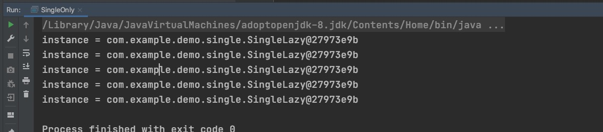
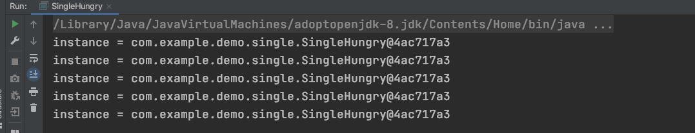
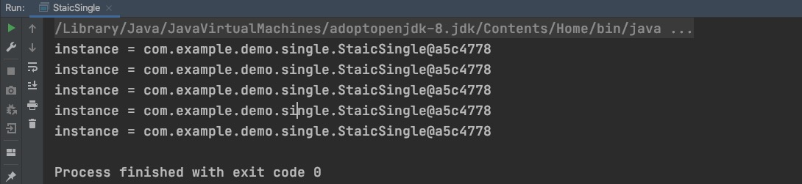
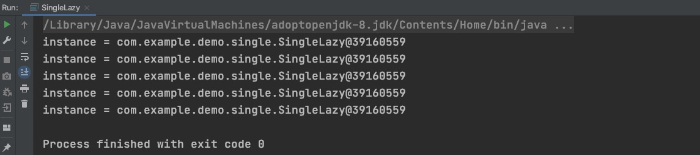
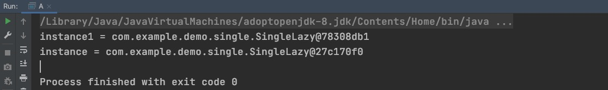
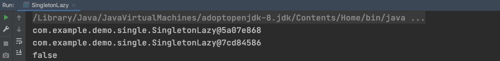
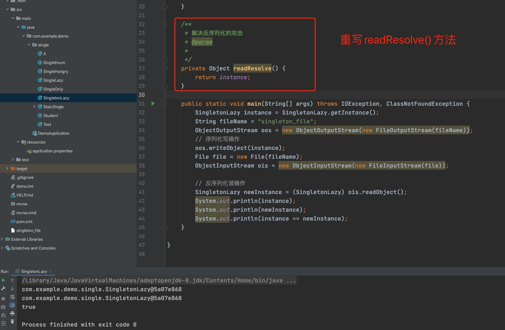
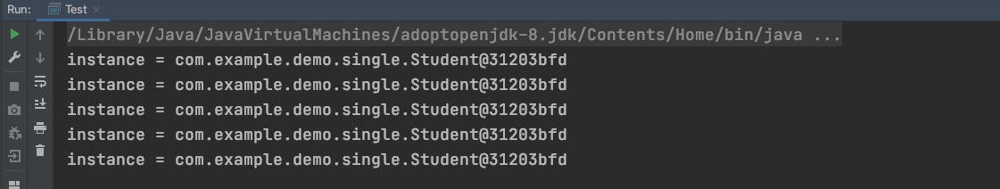

# 单例模式

面试中， 经常会问到单例模式， 饿汉模式和懒汉模式， 并且手撕一下代码， 说实话， 我自己真的是看过很多遍了， 大概是什么应该是知道的， 但是真正让你手写， 并且完全通过自己的知识体系整理出来， 不一定就完全的理解， 所以我在这里就是自己纯粹的用自己的理解梳理一下， 希望对自己和大家都有帮助。


**如果你也想掌握好这一块的内容， 我建议你在读完以后， 自己手撕一下代码，并且可以完全复述出来其中原委， 你就算过关了， 一定要动手练练啊！**


单例模式： 是 Java 中最简单的设计模式之一。这种类型的设计模式属于创建型模式，它提供了一种创建对象的最佳方式。

说人话： 就是创建一个全局只能有一个对象的类且不能重复。


# 1. 单线程的单例模式

我们先从简单的单线程入手， 就是不存在线程竞争问题，直接上代码：

```

import java.util.stream.IntStream;

public class SingleOnly {
    private static SingleOnly instance = null;

    public static SingleOnly getInstance() {
        if (null == instance) {
            instance = new SingleOnly();
        }
        return instance;
    }


    public static void main(String[] args) {
        IntStream.rangeClosed(1, 5)
                .forEach(i -> {
                        System.out.println("instance = " + SingleOnly.getInstance());
                    });
    }
}
```

结果：



从结果我们可以看出， 因为没有线程竞争， 我们看到创建的对象且都是唯一的。


**对于多线程的一些思考： **

那如果是多线程的情况， 存在线程竞争关系呢？ 我们有哪些方案或改进的方法呢？

>1. 我们能否在对象创建之初， 就创建好这个对象， 以后再调用的时候， 直接使用就可以了。
>
>   > 优点： 代码简单， 维护方便， 线程安全
>   >
>   > 
>   >
>   > 缺点： 对象在不执行的情况下， 就自行创建， 浪费内存空间
>
>2. 我们能否需要的时候创建， 且创建一次，但是对于多线程来说， 就存在竞争关系，我们可以用锁来解决。
>
>   >优点： 需要的时候创建对象， 节省内存。
>   >
>   >
>   >
>   >缺点： 代码复杂， 需要考虑的方便比较多。


# 2. 创建对象初始化

## 1. 饿汉式

不管你用不用， 类在创建的时候， 就创建， 后期直接使用就可以了。

```
/**
 * 饿汉式， 线性安全的
 */
public class SingleHungry {
    private static SingleHungry instance = new SingleHungry();

    public static SingleHungry getInstance() {
        return instance;
    }

    public static void main(String[] args) {
        IntStream.rangeClosed(1, 5)
                .forEach(i -> {
                    new Thread(() -> {
                        System.out.println("instance = " + SingleHungry.getInstance());
                    }).start();
                });
    }
}
```

结果：




## 2. 静态内部类

```
import java.util.stream.IntStream;

/**
 * 通过静态内部类来实现， 思想和方法， 和懒汉式都差不多
 */
public class StaicSingle {
    private StaicSingle() {};

    private static class HanderInstance {
        private static StaicSingle instance = new StaicSingle();
    }

    public static StaicSingle getInstance() {
        return HanderInstance.instance;
    }


    public static void main(String[] args) {
        IntStream.rangeClosed(1, 5)
                .forEach(i -> {
                    new Thread(() -> {
                        System.out.println("instance = " + StaicSingle.getInstance());
                    }).start();
                });
    }

}
```

结果：




以上两种方法， 思想都是一样的， 都是通过先创建一个类对象， 后期直接使用就可以了，优缺点都很明显。


# 2. 使用的时候在创建单例

这一节， 我们主要来说懒汉式， 我们会一一进行代码改造， 改造成双重检查的单例模式， 并我们都会描述单例模式中所遇到的极端情况， 分析其中利弊， 让我们更好的掌握好单例模式

## 1. 加synchronized锁

我们在基于单线程的单例模式， 把他改造成多线程的方式， 其实我们只需要加一个锁就可以了。直接上代码

```

public class SingleOnly {
    private static SingleOnly instance = null;

    public static synchronized SingleOnly getInstance() {
        if (null == instance) {
            instance = new SingleOnly();
        }
        return instance;
    }
    
}
```

>
>
>这样写是没有问题的， 但是带来了性能问题， 多进程进行并发访问的时候， 每次获取对象， 都需要加锁， 导致性能下降， 还应在在改进一下。


## 2. 解决并发

```

public class SingleOnly {
    private static SingleOnly instance = null;

    public static synchronized SingleOnly getInstance() {
        if (null == instance) {
            synchronized(SingleOnly.class) {
            		instance = new SingleOnly();
            }
        }
        return instance;
    }
    
}
```

>
>
>虽然已经解决了上面的问题， 但是我们来分析一种极端情况： 线程t1和线程t2同时进行单例模式的创建， 同时执行if(null==instance), 都判断instance为null， 然后t1线程执行synchronized代码块，创建完instance = new SingleOnly();以后， 线程t2已经判断完null==instance， 还是会重新创建新对象， 导致是线程不安全的。


## 3. 双重检查锁式

在优化代码：

```
public class SingleOnly {
    private static SingleOnly instance = null;

    public static synchronized SingleOnly getInstance() {
        if (null == instance) {
            synchronized(SingleOnly.class) {
            		if (null == instance) {
            				instance = new SingleOnly();
            		}
            }
        }
        return instance;
    }
    
}
```

>
>
>这里我们要明白synchronized的关键字的作用， 说的通俗一些， 就是解决线程并发的问题改成线程串行的问题， 跟分布式锁的功能是类似的， 是不是synchronized解决的是线程直接的并发问题， 分布式锁解决的是不同进程间并发改串行的问题， 本质还是一样的。


**其实上面的写法， 就已经很NB了， 但是上面的写法就一定安全了吗？ 熟悉JVM底层原理的人都知道， 或者我直接告诉你：instance = new SingleOnly(); 这句话并不是原子操作，可以拆分为三个步骤： **

1. 给 SingleOnly 分配内存空间 
2. 初始化SingleOnly实例
3. 将instance对象指向分配的内存空间（instance不为null了）

正常情况下上面三步是按照顺序执行的，但实际上JVM可能会「自作多情」的给我们进行代码优化， 可能优化成1， 3， 2， 如下所示：

```
public class SingleOnly {
    private static SingleOnly instance = null;

    public static synchronized SingleOnly getInstance() {
        if (null == instance) {
            synchronized(SingleOnly.class) {
            		if (null == instance) {
            				1. 给 SingleOnly 分配内存空间 
										3. 将instance对象指向分配的内存空间（instance不为null了）
										2. 初始化SingleOnly实例
            		}
            }
        }
        return instance;
    }
    
}
```

假设现在有两个线程 t1, t2

1. 如果 t1 执行到以上步骤 3 被挂起
2. 然后 t2 进入了 getInstance 方法，由于 t1 执行了步骤  3，此时的 instance 已经不为空了，所以 if (null == instance) 这个条件不为空，直接返回 instance, 但由于 t1 还未执行步骤 2，导致此时的 instance 实际上是个半成品，会导致不可预知的风险!


该怎么解决呢，既然问题出在指令有可能重排序上，不让它重排序不就行了，volatile 不就是干这事的吗，我们可以在 instance 变量前面加上一个 volatile 修饰符

## 4. volatile修饰符优化

我们先来了解一下volatile的作用： 

1. 保证对象内存可见性
2. 防止指令重排序

```
import java.util.stream.IntStream;

public class SingleLazy {

    volatile private static SingleLazy instance = null;
    
     public static SingleLazy getInstance() {
        if (null == instance) {
            synchronized (SingleLazy.class) {
                if (null == instance) {
                    instance = new SingleLazy();//11
                }
            }
        }
        return instance;
    }


    public static void main(String[] args) {
        IntStream.rangeClosed(1, 5)
                .forEach(i -> {
                    new Thread(() -> {
                        System.out.println("instance = " + SingleLazy.getInstance());
                    }).start();
                });
    }
}
```

结果：



到这里， 我们基本就解决了， 双锁机制+volatile 实际基本解决了线程安全的问题， 保证了“真正”的单实例， 但真的是这样吗？


# 3. 完美的单例

早在《Effective Java》第二版中就指出， 枚举类， 是单例模式最完美的方式。

理由是：

1. 首先无偿提供了反序列化机制， 绝对防止反序列化破话单例。
2. 其次面对反射攻击仍然安全。

## 1. 反射攻击

不少人已经觉得双重检查+volatile机制， 已经很NB了， 我们耳听为虚， 眼见为实：直接撸代码吧。

```

import java.lang.reflect.Constructor;
import java.lang.reflect.InvocationTargetException;

public class A {

    public static void main(String[] args) throws NoSuchMethodException, IllegalAccessException, InvocationTargetException, InstantiationException {
        Class<SingleLazy> singleLazyClass = SingleLazy.class;
        // 获取类的构造器
        Constructor<SingleLazy> constructor = singleLazyClass.getDeclaredConstructor();
        //把构造器私有权限放开
        constructor.setAccessible(true);
        //反射创建实例   注意反射创建要放在前面，才会攻击成功，因为如果反射攻击在后面，先使用正常的方式创建实例的话，在构造器中判断是可以防止反射攻击、抛出异常的，
        //因为先使用正常的方式已经创建了实例，会进入if
        SingleLazy instance = constructor.newInstance();
        //正常的获取实例方式   正常的方式放在反射创建实例后面，这样当反射创建成功后，单例对象中的引用其实还是空的，反射攻击才能成功
        SingleLazy instance1 = SingleLazy.getInstance();
        System.out.println("instance1 = " + instance1);
        System.out.println("instance = " + instance);
    }
}
```

结果：




现在有没有发现硬生生的打脸了啊，两个对象真的是不一样的啊。


## 2. 反序列攻击

我们重写一下懒汉式的代码， 直接上代码：

```

import java.io.*;

public class SingletonLazy implements Serializable {

    volatile private static SingletonLazy instance = null;

    public static SingletonLazy getInstance() {
        if (null == instance) {
            synchronized (SingleLazy.class) {
                if (null == instance) {
                    instance = new SingletonLazy();//11
                }
            }
        }
        return instance;

    }

    /**
     * 解决反序列化的攻击
     * @param
     *
     */
//    private Object readResolve() {
//        return instance;
//    }
    
    public static void main(String[] args) throws IOException, ClassNotFoundException {
        SingletonLazy instance = SingletonLazy.getInstance();
        String fileName = "singleton_file";
        ObjectOutputStream oos = new ObjectOutputStream(new FileOutputStream(fileName));
        // 序列化写操作
        oos.writeObject(instance);
        File file = new File(fileName);
        ObjectInputStream ois = new ObjectInputStream(new FileInputStream(file));

        // 反序列化读操作
        SingletonLazy newInstance = (SingletonLazy) ois.readObject();
        System.out.println(instance);
        System.out.println(newInstance);
        System.out.println(instance == newInstance);
    }

}

```

结果：



其实我们解决上面的序列化攻击也很简单， 只需要重写readResolve()方法注释打开就好了， 我们重写执行一下防攻击的代码：

我们看结果:



## 3. 完美的写法

假设我们有一个Student类， 需要进行单例创建

```

public enum SingleEnum {

    INSTANCE;
    private Student student;

    /**
     * 私有的构造方法， 枚举的构造方法， 默认就是私有的
     */
    SingleEnum() {
        student = new Student();
    }

    /**
     * 获取构造函数
     * @return
     */
    public Student getInstance() {
        return student;
    }
}
```

我们写一个测试类

```

import java.util.stream.IntStream;

public class Test {
    public static void main(String[] args) {
        IntStream.rangeClosed(1, 5)
                .forEach(i -> {
                    new Thread(() -> {
                        System.out.println("instance = " + SingleEnum.INSTANCE.getInstance());
                    }).start();
                });
    }
}

```

结果：



