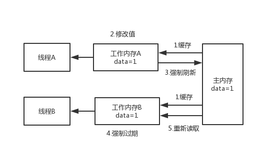

# 面试准备

# 1. core java

## 1. java中重载和重写的区别

重载： OverLoad, 发生在本类或者是子类， 具有相同的方法名， 方法的参数不同， 返回类型可以相同， 也可以不同

重写： Override: 发生在子类和父类直接的关系， 主要特征是： 方法名相同， 参数相同， 但是具体的实现不同。

## 2. 接口和抽象的区别？ 

接口： 接口是对行为的抽象， 是用interface关键字修饰的。接口中可以有变量和方法， 接口中的变量， 都隐式的指定为public static final,（接口中一般不定义变量） 方法隐式的指定为： public abstract, 接口中的方法必须是抽象方法，不能有具体的实现

抽象类： 抽象类是用abstract关键词修饰的， 

和普通的类一样， 拥有成员变量和方法， 抽象类中的所有的必须为public或者protected, 否则不能被子类继承。

抽象类和普通类的地方： 抽象类无法创建对象，  如果子类继承了抽象类， 必须实现所有的抽象方法， 如果有未实现的， 必须定义为abstract

## 3. Exceptioin和Error的区别

Exception是java程序运行中可预料的异常情况，咱们可以获取到这种异常，并且对这种异常进行业务外的处理。

Error是java程序运行中不可预料的异常情况，这种异常发生以后，会直接导致JVM不可处理或者不可恢复的情况。所以这种异常不可能抓取到，比如OutOfMemoryError、NoClassDefFoundError等。

## 4. Object类内的常用方法

1. getClass(), native方法， 不应许子类进行重写， 返回运行时对象的Class
2. hashCode(): 返回对象的哈希码
3. equals(Object obj): 返回两个对象的内存地址是否相同
4. clone(): 克隆对象， 克隆的对象和原来的对象不是一个对象
5. toString(): 返回字符串
6. notify(): native方法， 且不能被重写, 唤醒一个在此对象监视器上等待的线程（监视器相当于锁的概念）， 如果多个线程都在等待， 智能唤醒一个。
7. notifyAll(): native方法， 且不能被重写， 只不过可以唤醒在此对象监视器上等待的所有线程， 而不是一个。
8. wait(long timeout), 暂停线程的执行， 超时时间是timeout
9. Wait(long timeout, int nanos) 暂停线程的执行， 超时时间是timeout， nanos参数表示额外的时间
10. wait(): 会一直等待下去， 没有超时的概念
11. finalize(): 实例被垃圾回收器回收的时候触发的操作（gc）。

## 5. boolean占用几个字节

可以得出boolean类型占了单独使用是4个字节(int)，在数组中又是1个字节。

## 6. 进程和线程的区别

进程是具有一定独立功能的程序关于某个数据集合上的一次运行活动,进程是系统进行资源分配和调度的一个独立单位.

线程是进程的一个实体,是CPU调度和分派的基本单位,它是比进程更小的能独立运行的基本单位.线程自己基本上不拥有系统资源,只拥有一点在运行中必不可少的资源(如程序计数器,一组寄存器和栈),但是它可与同属一个进程的其他的线程共享进程所拥有的全部资源.
一个进程， 最少只有一个线程

线程执行的开销小， 多个进程共享资源， 一个线程崩溃， 会影响其他线程， 而进程正好相反， 每个进程相互独立， 相互不影响， 但是多进程调度的开销比较大， 适合小数据量的传送。


# 2.  GUC

## 1. volatile的用处和实现？

### 1. 用处： 

1. 状态标记量
2. 2. 单例模式中的double check

### 2. volatile保证可见性

如果有Volatile，汇编层面会对变量加上Lock前缀，当一个线程修改变量的值后，会马上经过store、write等原子操作修改主内存的值（如果不加Lock前缀不会马上同步），为什么监听到修改会马上同步呢？就是为了触发cpu的嗅探机制，及时失效其他线程变量副本。
        cpu总线嗅探机制监听到这个变量被修改，就会把其他线程的变量副本由共享S置为无效I，当其他线程在使用变量副本时，发现其已经无效，就回去主内存中拿一个最新的值。



### 3. volatile不保证原子性

比如对于i++这个操作， 如果两个线程同时读取的i值都为0， 那就

### 4. volatile部分保证有序性

**为了性能优化，JVM会在不改变`数据依赖性`的情况下，允许`编译器和处理器对指令序列进行重排序`，而有序性问题指的就是程序代码在多线程执行的顺序与程序员编写程序的顺序不一致，导致程序结果不正确的问题。而加了volatile修饰的共享变量，则通过`内存屏障`解决了多线程下有序性问题。**

为了实现volatile的内存语义，编译器在生成字节码时，会在指令序列中插入内存屏障来禁止特定类型的处理器重排序，下面是基于保守策略的JMM内存平展插入策略。

```
* 在每个volatile写操作的前面插入一个StoreStore屏障。`
* 在每个volatile写操作的后面插入一个StoreLoad屏障。`
* 在每个volatile读操作的后面插入一个LoadLoad屏障。`
* 在每个volatile读操作的后面插入一个LoadStore屏障
```


## 2. synchronized

